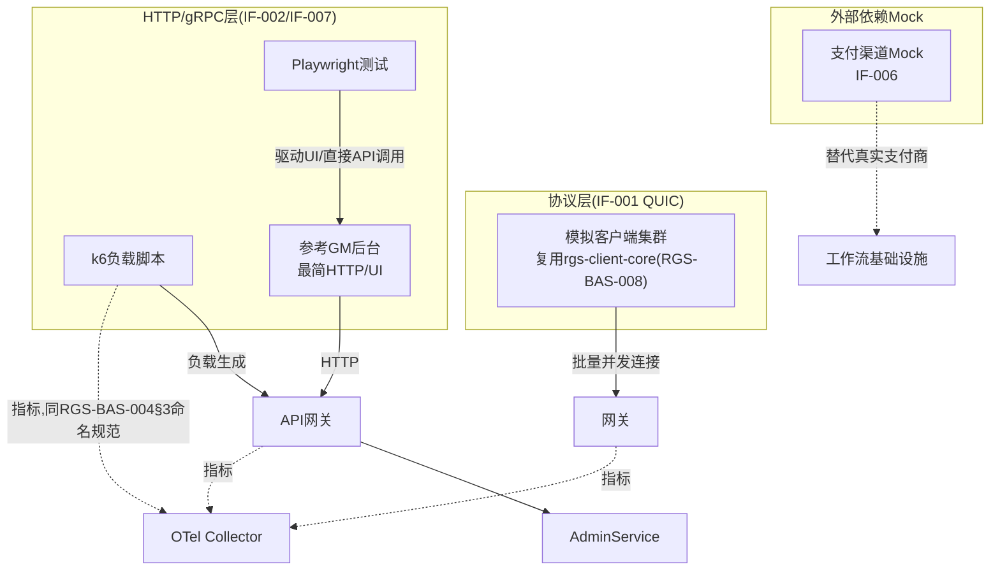

# 基本设计书（基本設計書 / Basic Design Document）

**测试基础设施与自动化验证 Test Infrastructure & Automated Verification**

| 项目 | 内容 |
|---|---|
| 文档编号 | RGS-BAS-012 |
| 版本 | 0.3 |
| 父文档 | RGS-REQ-015 需求定义书 第7章（ARC-028） |
| 依据标准 | IPA『共通フレーム 2013（SLCP-JCF2013）』基本设计工程 |
| 制定日 | 2026-08-16 |
| 制定者 | 架构师 |
| 保密级别 | 内部限定（Internal Use Only） |

## 修订历史（改訂履歴 / Revision History）

| 版本 | 修订日 | 修订者 | 修订内容 | 影响章节 |
|---|---|---|---|---|
| 0.1 | 2026-08-16 | 架构师 | 初版制定。将RGS-REQ-015 ARC-028展开为模拟客户端组件设计、外部依赖Mock目录、k6脚本组织、Playwright测试架构、参考GM后台最小实现范围 | 全部 |
| 0.2 | 2026-08-17 | 架构师 | 补齐两处设计缺口：①追溯性表此前遗漏AC-TST-001〜004验收标准与设计章节的映射，仅覆盖ARC/FR/NFR；②NFR-TST-004（可复现性）此前仅在需求侧提及复用RGS-BAS-008§9 Seeded PRNG原则，本设计书未给出具体落地设计，新增§5.3（负载测试可复现性）与§6.4（UAT测试可复现性） | §5.3、§6.4、§10 |
| 0.3 | 2026-09-01 | 架构师 (Mavis 接手 agent per DEC-008) | 落实"各BAS文档功能章节加log设计且区分debug/release级"总要求（per Ulysses 2026-09-01 15:52 JST 决策，4 拍板选项：全部 36 个BAS / 详尽版5列表 / 派worker并行 / BAS-004同步升级）：§2.1（整体拓扑边界观察）/§3.3（协议层模拟客户端批量实例化 + 行为画像 + AC-TST-001 协议一致性）/§4.3（外部依赖 Mock 生命周期 + Webhook 签名 + 注入失败）/§5.5（k6 场景执行 + NFR-TST-004 Seeded PRNG 可复现性 + 协议层模拟客户端联合施压 + 阈值越界）/§6.5（Playwright UI+API 双模式 + flaky 重试 + NFR-TST-004 数据准备 + X-001 边界）/§7.1（参考 GM 后台最小实现 + 顶部标识 + FR-TST-042 凭证隔离）/§8.1（CI 三层流水线触发 + 完成 + 阈值 + runner 配额）/§9.2（log 章节上线检查项逐项）共 8 个 "本功能日志设计" 小节全部新增；每节均含 5 列详尽版（字段名/触发条件/频率估算/采样策略/脱敏与成本），显式区分 `info!`/`warn!`/`error!`（release 必出，编译期常驻，per BAS-004 v0.3 §6.2 强制全采样白名单）与 `debug!`/`trace!`（`#[cfg(debug_assertions)]` 守护，debug-only，release build 完全剔除零运行时开销）两类事件；字段名前缀 `test.*`（测试基础设施域，区别于 BAS-002 `mnt.*` / BAS-003 `gm.*` / BAS-005 `plugin.*`），命名严格 snake_case 与 BAS-004 v0.3 §4.3.1/§4.3.2 保持拼写一致（FR-LOG-013）；覆盖 ARC-028 测试基础设施域全链路——协议层模拟客户端 / 外部依赖 Mock / k6 性能 / Playwright UAT / 参考 GM 后台 / CI 流水线分层 / 标准化检查清单；§9.1 检查清单新增 6 项 log 章节上线检查项（每功能 log 章节存在性 / release 必出 grep 验证 / debug-only 四铁律合规 / release 必出宏未被 `#[cfg]` 守护 / 字段名 snake_case / 脱敏字段不入 release）；§10 追溯性新增 AC-TST-006（debug-only 宏 release 完全剔除）与 AC-TST-007（每功能BAS文档须含本功能log设计章节），与 BAS-001 v1.5 §4.8.3.4（commit 32d9eb6）/ BAS-002 v0.4 §13（commit f1401a3）/ BAS-003 v0.3 §13（commit 75a001c）/ BAS-005 v0.3 §11（commit 20b84a1）/ BAS-004 v0.3 §12（commit 47e26b0+0ee6262）形成统一规范 | §2.1、§3.3、§4.3、§5.5、§6.5、§7.1、§8.1、§9.2、§9.1、§10 |

## 审批栏（承認欄 / Approval）

| 角色 | 姓名 | 审批日 | 备注 |
|---|---|---|---|
| 制定（起草） | 架构师 | 2026-08-16 | — |
| 评审（QA/性能负责人） | | | 工具链是否满足PH-4/PH-8负载试验的实测诉求 |
| 审批（负责人） | | | 本文档的基准化 |

---

## 目录

1. [前言](#1-前言)
2. [整体测试基础设施架构](#2-整体测试基础设施架构)
3. [协议层模拟客户端设计](#3-协议层模拟客户端设计)
4. [外部依赖Mock设计](#4-外部依赖mock设计)
5. [k6性能测试设计](#5-k6性能测试设计)
6. [Playwright UAT设计](#6-playwright-uat设计)
7. [参考GM后台最小实现范围](#7-参考gm后台最小实现范围)
8. [CI集成与流水线分层](#8-ci集成与流水线分层)
9. [标准化检查清单](#9-标准化检查清单)
10. [追溯性（ARC-028 → 本设计书章节）](#10-追溯性arc-028-本设计书章节)

---

# 1. 前言

本文档是RGS-REQ-015第7章ARC-028的系统级展开，遵循RGS-BAS-001既有记述规则。本文档给出的是**基础设施**设计，不含具体测试用例内容（属RGS-TST-001）。

---

# 2. 整体测试基础设施架构



### 2.1 本功能日志设计

本节覆盖测试基础设施整体拓扑的边界观察点——测试基础设施不直接产生业务事件，但**协议层模拟客户端 (§3) / 外部依赖 Mock (§4) / k6 性能测试 (§5) / Playwright UAT (§6) / 参考 GM 后台 (§7)** 五大组件的启动 / 关闭 / 就绪 / 失联是 SRE 在 Grafana 上"测试能力是否可用"的必要输入。

| 字段名（field） | 触发条件（trigger） | 频率估算（frequency） | 采样策略（sampling） | 脱敏与成本（redact & cost） |
|---|---|---|---|---|
| `test.topology.all_components_ready` | 测试基础设施全部组件 (§2 mermaid 中五大组件) 启动就绪、可接受请求 | 每次 CI 流水线启动 1 次 | release 必出（100% 强制全采样，per BAS-004 v0.3 §6.2） | 含 `component_set` / `service.name` 列表；约 280B/条 × 启动频次 = 极低 |
| `test.topology.otel_routing.established` | 测试指标已通过 OTel Collector 接入测试 Dashboard（§2 mermaid 虚线箭头） | 启动 1 次 | release 必出（100% 强制全采样） | 含 `collector_endpoint` / `dashboard_id`；约 250B/条 |
| `test.topology.otel_routing.degraded` | OTel Collector 缓存命中率低于阈值（如 < 90%），但尚不致命 | 偶发 | release 必出（100% 强制全采样，§6.2 强制全量采集范围：错误路径） | 含 `cache_hit_ratio` / `threshold`；约 220B/条 |
| `test.topology.otel_routing.failed` | OTel Collector 不可达，测试指标上报失败 | 极少 | release 必出（100% 强制全采样，§6.2 强制全量采集范围：错误路径） | 含 `collector_endpoint` / `error` / `trace_id`；约 280B/条 |
| `test.topology.shutdown.completed` | 测试基础设施优雅关闭，全部组件已终止 | 每次 CI 结束 1 次 | release 必出（100% 强制全采样） | 含 `component_set` / `shutdown_kind`（SIGTERM / pipeline_end）；约 250B/条 |
| `test.topology.pressure_metrics.misclassified` | 施压端（§3 模拟客户端 / §5 k6）自身健康指标被误判为被测系统指标（违反 §3.2 末段"施压端与被测系统 service.name 区分"原则） | 极少（配置错） | release 必出（100% 强制全采样，§6.2 强制全量采集范围：错误路径） | 含 `offending_service_name` / `detected_target_service_name`；约 320B/条 |
| `test.topology.debug.component_dependency_graph` | 全部组件的依赖关系 DAG dump（节点→component→依赖→就绪状态） | 启动 1 次 | **debug-only**（`#[cfg(debug_assertions)]` 守护，release build 完全剔除） | 约 2-10KB/条（依赖图大小决定，release 剔除零运行时开销） |
| `test.topology.debug.otel_pipeline_latency_matrix` | 测试指标端到端延迟矩阵（被测 → Collector → Dashboard 渲染） | 启动 1 次 | **debug-only**（`#[cfg(debug_assertions)]` 守护） | 约 500B/条（release 剔除） |

**debug-only 守护要点**（落实 BAS-004 v0.3 §4.4）：
- `test.topology.debug.component_dependency_graph` 大型测试基础设施（含 §3 模拟客户端数千实例 + §5 k6 runner）下可能 10KB+ —— release build 完全剔除，避免 RUST_LOG=debug 误开时撑爆生产日志通道
- `test.topology.all_components_ready` / `test.topology.shutdown.completed` 均为 `info!` 级别（release 必出，§4.8.3.2 二维矩阵 `info!` 行常驻），便于 SRE 按 `component_set` 维度聚合
- `test.topology.pressure_metrics.misclassified` 是**配置错事件**——`error!` 级别，release 常驻 + §6.2 强制全采样，避免将施压端瓶颈误判为被测系统瓶颈

---

# 3. 协议层模拟客户端设计

对应FR-TST-001〜004、ARC-028。

## 3.1 组件结构

```
services/load-mock-client/         # 独立于游戏客户端,复用核心SDK
  Cargo.toml                        # 依赖rgs-client-core(RGS-BAS-008§3),不重新实现协议
  src/
    main.rs                          # 批量实例化入口,读取行为配置(FR-TST-003)
    behavior/
      profile.rs                      # 移动模式/输入频率/掉线概率等可配置画像
    fleet.rs                          # 单进程内管理数千~数万个模拟连接实例
    metrics.rs                        # 输出RGS-BAS-004规范的施压端自身健康指标
```

## 3.2 关键设计点

| 设计点 | 内容 |
|---|---|
| 协议一致性 | 直接依赖`rgs-client-core`，**不**另行实现编解码/预测和解逻辑，保证与真实客户端行为一致（AC-TST-001） |
| 资源可预测性 | 每个模拟连接实例的内存占用须有明确上限（协议缓冲区+预测状态，量级远小于渲染客户端），供施压端自身的容量规划（如"单Pod 8GB内存可承载N个实例"） |
| 行为画像 | 移动模式（随机游走/固定路径/聚集行为）、输入频率、掉线重连概率均通过配置文件驱动，不同画像组合可覆盖NFR-PE-*系列指标要求的多种流量特征 |
| 施压端自身可观测性 | 施压端输出的指标须能在Dashboard上与被测系统的指标区分展示（不同`service.name`），避免负载试验时误将施压端自身瓶颈判定为被测系统瓶颈 |

### 3.3 本功能日志设计

本节覆盖**协议层模拟客户端**（§3 复用 rgs-client-core 协议一致性 + 批量实例化 + 行为画像 + 施压端自身可观测性）的全链路观察点——模拟客户端是 §5.4 联合施压的"协议层压力源"，其批量实例化 / 行为画像切换 / 资源耗尽均必须可观测。

| 字段名（field） | 触发条件（trigger） | 频率估算（frequency） | 采样策略（sampling） | 脱敏与成本（redact & cost） |
|---|---|---|---|---|
| `test.mock_client.fleet.spawned` | §3.1 `fleet.rs` 完成批量实例化（单进程内 N 个模拟连接实例） | 每次负载试验 1 次（典型 100k CCU 规模） | release 必出（100% 强制全采样，per BAS-004 v0.3 §6.2） | 含 `fleet_size` / `per_pod_capacity` / `node_id` / `bounded_context`；约 320B/条 |
| `test.mock_client.fleet.spawn.failed.resource_limit` | 单进程实例化数超过 §3.2 资源上限（协议缓冲区+预测状态，量级远小于渲染客户端） | 极少（配置错） | release 必出（100% 强制全采样，§6.2 强制全量采集范围：错误路径） | 含 `requested_count` / `cap_count` / `error`；约 350B/条 |
| `test.mock_client.behavior.profile.applied` | §3.2 行为画像（移动模式/输入频率/掉线重连概率）配置已加载并生效 | 每次负载试验 1 次 | release 必出（100% 强制全采样） | 含 `profile_name` / `param_summary`；约 280B/条 |
| `test.mock_client.behavior.profile.invalid` | 行为画像配置解析失败（缺字段/越界） | 极少（配置错） | release 必出（100% 强制全采样，§6.2 强制全量采集范围：错误路径） | 含 `profile_name` / `validation_error` / `failing_field`；约 320B/条 |
| `test.mock_client.pressure.health.degraded` | 施压端自身 CPU / 内存 / packet loss 超过 §3.2 "可预测资源"上限的 80% | 偶发 | release 必出（100% 强制全采样，§6.2 强制全量采集范围：错误路径） | 含 `metric_kind` / `actual_value` / `cap_value` / `node_id`；约 320B/条 |
| `test.mock_client.protocol.drift_detected` | §3.2 "协议一致性" 校验失败：模拟客户端与三引擎适配层的同轨迹重放结果**不**逐字段一致（AC-TST-001 违反） | 极少（重大违规） | release 必出（100% 强制全采样，§6.2 强制全量采集范围：错误路径） | 含 `packet_seq` / `expected_field` / `actual_field` / `diff_summary`；约 400B/条 |
| `test.mock_client.disconnect.reconnect` | 模拟连接因画像指定的掉线概率触发重连 | 取决于画像（典型 1-10/s 集群） | release 必出（100% 强制全采样） | 含 `instance_id` / `disconnect_reason` / `reconnect_latency_ms`；约 250B/条 |
| `test.mock_client.debug.behavior_profile_dump` | 行为画像完整 dump（含随机游走种子 / 输入频率分布 / 掉线概率分布） | 启动 1 次 | **debug-only**（`#[cfg(debug_assertions)]` 守护，release build 完全剔除） | 约 1-5KB/条（画像复杂度决定，release 剔除零运行时开销） |
| `test.mock_client.debug.simulated_packet_capture` | 模拟连接收发的 QUIC 数据包明文 dump（用于协议一致性复盘） | 偶发 | **debug-only**（`#[cfg(debug_assertions)]` 守护） | 约 500B-5KB/包（release 剔除） |
| `test.mock_client.debug.fleet_memory_snapshot` | 单进程 N 个模拟连接实例的内存占用快照（验证 §3.2 "可预测资源"承诺） | 启动 1 次 + 扩缩 1 次 | **debug-only**（`#[cfg(debug_assertions)]` 守护） | 约 200B-2KB/条（release 剔除） |

**debug-only 守护要点**（落实 BAS-004 v0.3 §4.4）：
- `test.mock_client.debug.simulated_packet_capture` 包含明文包体，**仅** debug-only，release 完全剔除——即便生产环境 RUST_LOG=debug 误开也不会泄露模拟客户端流量（流量本身即生产复刻，故须严格守护）
- `test.mock_client.pressure.health.degraded` 是**施压端亚健康事件**——`warn!` 级别，release 常驻 + §6.2 强制全采样，是 §3.2 "施压端与被测系统指标区分"原则的运行时保障
- `test.mock_client.protocol.drift_detected` 是**AC-TST-001 违反事件**——`error!` 级别，release 常驻 + §6.2 强制全采样（验收标准 AC-TST-001 必须被检测到）

---

# 4. 外部依赖Mock设计

对应FR-TST-010〜012。

## 4.1 支付渠道Mock（IF-006）

| 端点 | 响应模式 | 用途 |
|---|---|---|
| 支付发起 | 成功/失败/超时（可配置） | FR-WF-001购买工作流的正常与异常路径 |
| Webhook回调 | 成功签名/伪造签名/延迟回调 | 验证RGS-BAS-001§6.4既定的签名校验与幂等键处理 |
| 部分失败 | 支付成功但发货前中断 | VF-006（Saga部分失败与补偿）专用场景 |

## 4.2 部署方式

外部依赖Mock作为独立的、轻量级服务，随CI流水线按需启停（复用RGS-BAS-002§4.2既有CI/CD骨架），**不**常驻生产环境，**不**接入生产NetworkPolicy基线（不属于生产拓扑的一部分）。

### 4.3 本功能日志设计

本节覆盖**外部依赖 Mock**（§4 支付渠道 Mock IF-006 + 按需启停的轻量服务）的全链路观察点——Mock 是 CI 流水线按需启停的辅助服务（§4.2 明确不常驻生产、不接生产 NetworkPolicy），其每个端点的成功 / 失败 / 超时 / 签名校验结果均必须可观测，便于复现 VF-006 部分失败与补偿场景。

| 字段名（field） | 触发条件（trigger） | 频率估算（frequency） | 采样策略（sampling） | 脱敏与成本（redact & cost） |
|---|---|---|---|---|
| `test.ext_mock.lifecycle.started` | Mock 服务已就绪，可接受测试调用（§4.2 "随 CI 流水线按需启停"） | 每次 CI 流水线启动 1 次 | release 必出（100% 强制全采样，per BAS-004 v0.3 §6.2） | 含 `mock_id` / `port` / `pid` / `pipeline_id`；约 280B/条 |
| `test.ext_mock.lifecycle.terminated` | Mock 服务优雅关闭（CI 结束或按需停用） | 每次 CI 结束 1 次 | release 必出（100% 强制全采样） | 含 `mock_id` / `served_count` / `shutdown_kind`；约 250B/条 |
| `test.ext_mock.payment.dispatch.served` | 支付发起端点响应（成功 / 失败 / 超时，per §4.1） | 取决于测试触发（典型 10-100/s） | release 必出（100% 强制全采样） | 含 `endpoint` / `request_id` / `response_mode` / `latency_ms`；约 300B/条 |
| `test.ext_mock.payment.dispatch.injected.failure` | 故意注入支付失败（用于 FR-WF-001 购买工作流异常路径） | 偶发（异常路径测试） | release 必出（100% 强制全采样） | 含 `request_id` / `injection_mode` / `workflow_test_id`；约 280B/条 |
| `test.ext_mock.payment.webhook.signature.invalid` | Webhook 回调签名校验失败（伪造签名，per §4.1） | 偶发（异常路径） | release 必出（100% 强制全采样，§6.2 强制全量采集范围：安全审计） | 含 `request_id` / `expected_algo` / `actual_algo` / `client_ip`；约 320B/条 |
| `test.ext_mock.payment.webhook.idempotency_hit` | 同一 `request_id` 已处理（幂等命中，per RGS-BAS-001 §6.4） | 偶发 | release 必出（100% 强制全采样） | 含 `request_id` / `first_processed_at`；约 250B/条 |
| `test.ext_mock.payment.partial_failure.armed` | 部分失败场景（支付成功但发货前中断）已 arm，用于 VF-006 验证 | 偶发（VF-006 专用） | release 必出（100% 强制全采样，§6.2 强制全量采集范围：错误路径） | 含 `request_id` / `arm_mode` / `wf_id`；约 280B/条 |
| `test.ext_mock.network_policy.production_route_attempt` | Mock 尝试路由到生产 NetworkPolicy（§4.2 明确"不接生产 NetworkPolicy"，**严重**配置错） | 极少（重大违规） | release 必出（100% 强制全采样，§6.2 强制全量采集范围：错误路径） | 含 `attempted_target` / `production_namespace`；约 300B/条 |
| `test.ext_mock.debug.payment_injection_state_dump` | Mock 当前注入的失败模式状态 dump（哪些 endpoint 当前返回哪种失败） | 偶发 | **debug-only**（`#[cfg(debug_assertions)]` 守护，release build 完全剔除） | 约 1-3KB/条（release 剔除） |
| `test.ext_mock.debug.webhook_payload_dump` | Webhook 回调完整 payload dump（敏感字段已脱敏） | 偶发 | **debug-only**（`#[cfg(debug_assertions)]` 守护） | 约 500B-2KB/条（release 剔除） |

**debug-only 守护要点**（落实 BAS-004 v0.3 §4.4）：
- `test.ext_mock.payment.webhook.signature.invalid` 是**安全审计事件**——`warn!` 级别，release 常驻 + §6.2 强制全采样，便于复现"伪造签名" 攻击路径
- `test.ext_mock.network_policy.production_route_attempt` 是**严重配置错事件**——`error!` 级别，release 常驻 + §6.2 强制全采样（违反 §4.2 边界，触发即告警）
- `test.ext_mock.debug.webhook_payload_dump` 涉及回调明文 body，**仅** debug-only，release 完全剔除（即便生产误开 RUST_LOG=debug 也不泄露测试回调内容）

---

# 5. k6性能测试设计

对应FR-TST-020〜023、ARC-028。

## 5.1 脚本组织

```
tests/perf/k6/
  scenarios/
    api-gateway-baseline.js    # API网关常态负载基线
    admin-api-load.js           # 运营API负载(IF-007)
  lib/
    metrics-adapter.js          # 输出适配RGS-BAS-004§3指标命名规范
  config/
    ccu-100k-ramp.json          # 并发梯度配置,版本化管理(FR-TST-023)
```

## 5.2 指标适配

k6原生指标（如`http_req_duration`）通过`lib/metrics-adapter.js`转换为`rgs_request_duration_ms`等既有命名（RGS-BAS-004§4.1），使负载试验数据无需人工转换即可接入既有Dashboard（AC-TST-004）。

## 5.3 可复现性设计（落实NFR-TST-004）

负载测试场景中涉及随机化的部分（模拟客户端的移动路径随机游走、掉线/重连概率触发时机等，§3.2行为画像）**必须**使用与RGS-BAS-008§9既定"Seeded PRNG可复现原则"同款方法：每次测试运行记录并可显式指定随机种子，使同一份`config/ccu-100k-ramp.json`配置在不同时间点重放时产生一致的负载特征分布，PH-4与PH-8两次负载试验（AC-005）方可比对结果差异是否源于系统变化而非测试本身的随机噪声。

## 5.4 与协议层模拟客户端的协同

单次PH-4/PH-8负载试验**同时**启动：①k6对API网关/运营API施压②§3协议层模拟客户端对网关/运行时施压，两者独立运行、指标独立可辨识但可在同一Dashboard时间轴上叠加观察，共同构成对100,000 CCU目标（AC-005）的完整覆盖——纯HTTP层压测不能代表真实CCU下的协议层表现，反之亦然，两者缺一不可。

### 5.5 本功能日志设计

本节覆盖**k6 性能测试**（§5 脚本组织 + 指标适配 + NFR-TST-004 可复现性 + 协议层模拟客户端联合施压）的全链路观察点——k6 是 §8 负载测试流水线的核心 driver，其场景启动 / 完成 / 阈值越界 / random seed 是否一致均必须可观测（PH-4 / PH-8 两次负载试验 AC-005 复现比对依赖此日志）。

| 字段名（field） | 触发条件（trigger） | 频率估算（frequency） | 采样策略（sampling） | 脱敏与成本（redact & cost） |
|---|---|---|---|---|
| `test.k6.scenario.started` | k6 场景脚本（如 `api-gateway-baseline.js`）开始执行 | 每次负载试验 1 次（按需触发） | release 必出（100% 强制全采样，per BAS-004 v0.3 §6.2） | 含 `scenario_name` / `config_path` / `pipeline_id`；约 280B/条 |
| `test.k6.scenario.completed` | k6 场景执行完成（含成功 / 失败 result_code） | 每次负载试验 1 次 | release 必出（100% 强制全采样） | 含 `scenario_name` / `duration_s` / `iteration_count` / `result_code` / `pipeline_id`；约 380B/条 |
| `test.k6.scenario.completed.threshold_breached` | k6 threshold（如 p99 < N ms）越界（per `config/ccu-100k-ramp.json`） | 偶发（性能回归） | release 必出（100% 强制全采样，§6.2 强制全量采集范围：性能异常） | 含 `scenario_name` / `threshold_name` / `expected` / `actual` / `pipeline_id`；约 350B/条 |
| `test.k6.scenario.failed.unexpected` | k6 场景因未预期异常中止（脚本 panic / 网络分区 / OTel Collector 不可用） | 极少 | release 必出（100% 强制全采样，§6.2 强制全量采集范围：错误路径） | 含 `scenario_name` / `error` / `trace_id` / `pipeline_id`；约 380B/条 |
| `test.k6.ramp.ccu.gradient.applied` | §5.1 `config/ccu-100k-ramp.json` 加载成功（并发梯度配置版本化管理，FR-TST-023） | 每次负载试验 1 次 | release 必出（100% 强制全采样） | 含 `config_path` / `config_sha` / `peak_ccu` / `ramp_steps`；约 350B/条 |
| `test.k6.seed.prng.reproducible.replayed` | §5.3 Seeded PRNG 可复现性验证通过（同一 seed + 同一 config 重放产生一致负载特征） | 偶发（PH-4 / PH-8 比对） | release 必出（100% 强制全采样） | 含 `seed_value` / `config_sha` / `replay_count` / `pipeline_id`；约 300B/条 |
| `test.k6.seed.prng.diverged` | Seeded PRNG 重放结果不一致（违反 NFR-TST-004，PH-4 / PH-8 无法比对） | 极少（重大违规） | release 必出（100% 强制全采样，§6.2 强制全量采集范围：错误路径） | 含 `seed_value` / `expected_distribution_hash` / `actual_distribution_hash`；约 350B/条 |
| `test.k6.coordination.k6_mock_client.sync_established` | §5.4 k6 与协议层模拟客户端联合施压已建立时间轴同步 | 每次负载试验 1 次 | release 必出（100% 强制全采样） | 含 `sync_token` / `k6_start_ts` / `mock_client_start_ts`；约 300B/条 |
| `test.k6.coordination.k6_mock_client.sync_lost` | k6 与协议层模拟客户端时间轴偏差超过阈值（联合施压失效） | 极少 | release 必出（100% 强制全采样，§6.2 强制全量采集范围：错误路径） | 含 `sync_token` / `drift_ms` / `threshold_ms`；约 280B/条 |
| `test.k6.metrics_adapter.rgs_renamed.field_emitted` | §5.2 `lib/metrics-adapter.js` 成功将 k6 原生指标（如 `http_req_duration`）转换为 `rgs_request_duration_ms` 等既有命名 | 取决于流量（典型 1k/s/指标） | release 必出（100% 强制全采样） | 含 `k6_metric_name` / `rgs_metric_name` / `emit_count`；约 280B/条 |
| `test.k6.coverage.low_threshold_breached` | 性能覆盖率（按被测接口 / API 覆盖度）低于阈值 | 偶发 | release 必出（100% 强制全采样，§6.2 强制全量采集范围：覆盖率） | 含 `covered_ratio` / `expected_ratio` / `scenario_name`；约 300B/条 |
| `test.k6.debug.full_scenario_config_dump` | 完整场景配置 dump（含 k6 options / thresholds / ramp / RGS 命名映射表） | 启动 1 次 | **debug-only**（`#[cfg(debug_assertions)]` 守护，release build 完全剔除） | 约 2-10KB/条（配置复杂度决定，release 剔除） |
| `test.k6.debug.per_request_latency_histogram_raw` | k6 每请求延迟直方图原始数据 dump | 高频 | **debug-only**（`#[cfg(debug_assertions)]` 守护） | 约 200B-5KB/条（release 剔除） |
| `test.k6.debug.k6_internal_metrics_dump` | k6 内部指标（如 VU 数 / iteration 进度 / dropped_iterations）完整 dump | 偶发 | **debug-only**（`#[cfg(debug_assertions)]` 守护） | 约 500B-3KB/条（release 剔除） |

**debug-only 守护要点**（落实 BAS-004 v0.3 §4.4）：
- `test.k6.seed.prng.diverged` 是**NFR-TST-004 违反事件**——`error!` 级别，release 常驻 + §6.2 强制全采样（PH-4 / PH-8 比对失败必须可检测）
- `test.k6.coordination.k6_mock_client.sync_lost` 是**联合施压失效事件**——`error!` 级别，release 常驻 + §6.2 强制全采样（§5.4 联合施压对 PH-4 / PH-8 完整覆盖是硬约束）
- `test.k6.debug.per_request_latency_histogram_raw` 高频 dump，release 完全剔除避免生产通道淹没

---

# 6. Playwright UAT设计

对应FR-TST-030〜032、ARC-028。

## 6.1 双模式测试架构

```
tests/uat/playwright/
  ui/
    admin-ban-flow.spec.ts       # 驱动参考GM后台UI(FR-TST-030)
    admin-maintenance.spec.ts
  api/
    admin-service.contract.spec.ts  # 纯API模式(FR-TST-031),不经UI
  shared/
    assertions.ts                 # UI模式与API模式共用同一断言库
```

## 6.2 UI模式验证链路

UI操作 → HTTP请求（Playwright网络拦截可断言请求字段）→ `AdminService`处理 → 审计记录产生（可通过§7参考GM后台的查询页或直接API核对）。该链路验证的是RGS-BAS-003全部方法的**端到端契约**，而非仅API字段本身。

## 6.3 范围边界重申

Playwright测试**仅**驱动§7参考GM后台或直接调用HTTP接口，**不得**指向任何游戏客户端相关的可执行文件或渲染画面（FR-TST-032，X-001边界重申）。

## 6.4 可复现性设计（落实NFR-TST-004）

UAT测试用例所需的前置数据（测试账号、初始道具/货币状态等）**必须**通过测试专用的确定性数据准备脚本生成（复用§6.1`api/`纯API模式发起幂等的初始化请求），**不得**依赖上一次测试运行残留的状态或人工手动准备的数据——每次CI运行前均从已知基线重新准备数据，保证同一测试用例重复执行时结果一致，避免"仅在特定历史状态下通过"的不可复现测试。

### 6.5 本功能日志设计

本节覆盖**Playwright UAT**（§6 UI + API 双模式 + 验证链路 + NFR-TST-004 数据准备可复现性 + X-001 范围边界）的全链路观察点——UAT 是 §8 UAT 流水线的核心 driver，其 spec 启动 / 完成 / flaky 重试 / 边界违反 / 数据准备均必须可观测。

| 字段名（field） | 触发条件（trigger） | 频率估算（frequency） | 采样策略（sampling） | 脱敏与成本（redact & cost） |
|---|---|---|---|---|
| `test.uat.suite.started` | Playwright 测试套件（`ui/` + `api/`）开始执行 | 每次 UAT 流水线触发 1 次 | release 必出（100% 强制全采样，per BAS-004 v0.3 §6.2） | 含 `suite_name` / `spec_count` / `pipeline_id`；约 280B/条 |
| `test.uat.suite.completed` | 测试套件执行完成（含成功 / 失败 / flaky 统计） | 每次 UAT 流水线触发 1 次 | release 必出（100% 强制全采样） | 含 `suite_name` / `passed` / `failed` / `flaky` / `duration_s` / `pipeline_id`；约 350B/条 |
| `test.uat.spec.flaky.retry_triggered` | §6 spec 判定为 flaky，触发自动重试（per UAT 流水线容错机制） | 偶发 | release 必出（100% 强制全采样，**`warn!` 强制全采样**——flaky 是质量红线信号） | 含 `spec_name` / `attempt_no` / `failure_reason` / `pipeline_id`；约 320B/条 |
| `test.uat.spec.flaky.retry_exhausted` | flaky spec 重试次数耗尽仍失败（升级为失败用例） | 极少 | release 必出（100% 强制全采样，§6.2 强制全量采集范围：错误路径，**`warn!` 强制全采样**） | 含 `spec_name` / `retry_count` / `last_failure_reason`；约 350B/条 |
| `test.uat.spec.failed` | spec 因断言失败 / 异常失败（非 flaky） | 偶发 | release 必出（100% 强制全采样，§6.2 强制全量采集范围：错误路径） | 含 `spec_name` / `failure_kind` / `error` / `trace_id`；约 350B/条 |
| `test.uat.boundary_violation.non_test_target_hit` | Playwright 测试尝试访问**非**测试目标（游戏客户端可执行文件 / 渲染画面，per §6.3 X-001 重申，**严重**边界违反） | 极少（应用代码错） | release 必出（100% 强制全采样，§6.2 强制全量采集范围：错误路径） | 含 `attempted_target` / `spec_name` / `x001_violation`；约 350B/条 |
| `test.uat.data.setup.completed` | §6.4 确定性数据准备脚本执行完成（测试账号 / 初始道具 / 货币状态等已从已知基线重建） | 每次 UAT 流水线触发 1 次 | release 必出（100% 强制全采样，per NFR-TST-004） | 含 `pipeline_id` / `data_baseline_sha` / `prepared_count`；约 320B/条 |
| `test.uat.data.setup.failed` | 数据准备失败（前置数据不达基线，**严重**违反 NFR-TST-004） | 极少 | release 必出（100% 强制全采样，§6.2 强制全量采集范围：错误路径） | 含 `pipeline_id` / `failing_prep_step` / `error` / `trace_id`；约 350B/条 |
| `test.uat.api_mode.contract.passed` | §6.1 `api/` 纯 API 模式 spec 通过（含 §6.2 shared/assertions 库断言） | 取决于 spec 数 | release 必出（100% 强制全采样） | 含 `spec_name` / `method` / `assertion_count`；约 280B/条 |
| `test.uat.api_mode.contract.failed` | 纯 API 模式 spec 断言失败（违反 AdminService 契约） | 偶发 | release 必出（100% 强制全采样，§6.2 强制全量采集范围：错误路径） | 含 `spec_name` / `method` / `failing_assertion` / `expected` / `actual`；约 400B/条 |
| `test.uat.ui_mode.e2e_link_validated` | §6.2 UI 模式验证链路（UI→HTTP→AdminService→审计记录）已全链路通过 | 每次 UI spec 1 次 | release 必出（100% 强制全采样） | 含 `spec_name` / `link_steps` / `audit_record_id`；约 320B/条 |
| `test.uat.debug.spec_full_request_response_dump` | spec 全量请求 / 响应 dump（请求体 / 响应体 / headers / cookies 明文） | 偶发（失败复盘） | **debug-only**（`#[cfg(debug_assertions)]` 守护，release build 完全剔除） | 约 1-20KB/条（spec 复杂度决定，release 剔除） |
| `test.uat.debug.network_intercept_payload_dump` | §6.2 Playwright 网络拦截捕获的请求 / 响应明文 payload dump | 偶发 | **debug-only**（`#[cfg(debug_assertions)]` 守护） | 约 500B-5KB/条（release 剔除） |
| `test.uat.debug.fixture_state_dump` | 测试夹具（fixture）当前完整状态 dump | 偶发 | **debug-only**（`#[cfg(debug_assertions)]` 守护） | 约 1-5KB/条（fixture 复杂度决定，release 剔除） |

**debug-only 守护要点**（落实 BAS-004 v0.3 §4.4）：
- `test.uat.spec.flaky.retry_triggered` / `test.uat.spec.flaky.retry_exhausted` 是**质量红线事件**——`warn!` 级别，release 常驻 + §6.2 强制全采样（flaky 是测试基础设施的慢性病，必须早暴露早治理）
- `test.uat.boundary_violation.non_test_target_hit` 是**X-001 违反事件**——`error!` 级别，release 常驻 + §6.2 强制全采样（边界违反触发即告警）
- `test.uat.data.setup.failed` 是**NFR-TST-004 违反事件**——`error!` 级别，release 常驻 + §6.2 强制全采样（不可复现的 UAT 等同于无 UAT）
- `test.uat.debug.spec_full_request_response_dump` 含明文请求 / 响应，**仅** debug-only，release 完全剔除（即便生产误开 RUST_LOG=debug 也不泄露测试流量）

---

# 7. 参考GM后台最小实现范围

对应FR-TST-040〜042。

| 覆盖的`AdminService`方法 | 参考GM后台页面 |
|---|---|
| `BanAccount`／`KickSession`／`MuteChat` | 账号管控页 |
| `GrantCompensation` | 补偿发放页 |
| `SetMaintenanceMode` | 维护模式开关 |
| `ReloadConfigTable` | 数值热更新触发页 |
| `RequestSceneRestart`／`ConfirmSceneRestart` | 场景管控页（含二次确认交互） |
| `QueryOnlineStatus`／`QuerySceneMetrics`／`QueryAuditLog` | 只读查询页 |
| `CreateOpsTicket` | 运维工单页 |

**明确声明**（FR-TST-041落地）：全部页面顶部固定显示"仅供测试与API契约验证使用，非生产交付物"标识；鉴权使用与生产同构的RBAC模型但独立的测试凭证体系（FR-TST-042），测试环境的凭证**不得**具备访问生产环境的能力。

### 7.1 本功能日志设计

本节覆盖**参考 GM 后台最小实现范围**（§7 覆盖的 AdminService 方法 + 顶部固定标识 + 独立测试凭证）的运行观察点——参考 GM 后台是测试工具而非生产交付物（per FR-TST-041 顶部"非生产交付物"标识 + FR-TST-042 独立凭证），其每次访问均必须可审计以确保不接生产。

| 字段名（field） | 触发条件（trigger） | 频率估算（frequency） | 采样策略（sampling） | 脱敏与成本（redact & cost） |
|---|---|---|---|---|
| `test.ref_gm_console.boot.completed` | 参考 GM 后台启动就绪（含"仅供测试使用"顶部标识渲染，per FR-TST-041） | 每次 CI 流水线启动 1 次 | release 必出（100% 强制全采样，per BAS-004 v0.3 §6.2） | 含 `console_id` / `pid` / `banner_rendered` / `pipeline_id`；约 320B/条 |
| `test.ref_gm_console.credential.used` | 使用独立测试凭证登录（per FR-TST-042，**不**与生产凭证同构但同源 RBAC 模型） | 取决于测试触发 | release 必出（100% 强制全采样） | 含 `credential_id`（已 hash，非明文）/ `operator_role`；约 280B/条 |
| `test.ref_gm_console.credential.cross_env_access_attempt` | 测试凭证尝试访问生产环境（**严重**违反 FR-TST-042） | 极少（重大违规） | release 必出（100% 强制全采样，§6.2 强制全量采集范围：错误路径） | 含 `credential_id`（已 hash）/ `attempted_env` / `production_namespace`；约 350B/条 |
| `test.ref_gm_console.page.method_call.dispatched` | §7 任一页面（如封禁页 / 补偿页 / 维护页等）发起对 `AdminService` 的方法调用 | 取决于测试触发 | release 必出（100% 强制全采样） | 含 `page_name` / `method` / `request_id`；约 280B/条 |
| `test.ref_gm_console.page.method_call.completed` | 方法调用完成（含成功 / 失败 result_code + 审计记录产生） | 与 `dispatched` 同频 | release 必出（100% 强制全采样） | 含 `page_name` / `method` / `request_id` / `result_code` / `audit_record_id`；约 350B/条 |
| `test.ref_gm_console.audit.queried` | 只读查询页（`QueryOnlineStatus` / `QuerySceneMetrics` / `QueryAuditLog`）查询 | 取决于测试触发 | release 必出（100% 强制全采样） | 含 `query_method` / `filter_summary` / `result_count` / `request_id`；约 320B/条 |
| `test.ref_gm_console.banner.missing` | 顶部"仅供测试使用，非生产交付物"标识缺失（per FR-TST-041，**严重**合规违反） | 极少（应用代码错 / 部署错） | release 必出（100% 强制全采样，§6.2 强制全量采集范围：错误路径） | 含 `console_id` / `expected_banner` / `rendered_html_snippet`；约 350B/条 |
| `test.ref_gm_console.debug.full_page_html_dump` | 参考 GM 后台任一页面完整 HTML dump（含顶部标识 + 全部 DOM 节点） | 偶发 | **debug-only**（`#[cfg(debug_assertions)]` 守护，release build 完全剔除） | 约 5-50KB/条（页面复杂度决定，release 剔除） |
| `test.ref_gm_console.debug.method_call_envelope_dump` | 全部 `AdminService` 方法调用的完整 gRPC envelope dump（请求 / 响应 metadata 全字段） | 偶发 | **debug-only**（`#[cfg(debug_assertions)]` 守护） | 约 1-5KB/条（release 剔除） |

**debug-only 守护要点**（落实 BAS-004 v0.3 §4.4）：
- `test.ref_gm_console.credential.cross_env_access_attempt` 是**严重安全事件**——`error!` 级别，release 常驻 + §6.2 强制全采样（FR-TST-042 凭证隔离是测试基础设施的硬底线，触发即告警）
- `test.ref_gm_console.banner.missing` 是**合规事件**——`error!` 级别，release 常驻 + §6.2 强制全采样（FR-TST-041 标识缺失会误导测试人员误以为生产环境）
- `test.ref_gm_console.credential.used` 含 `credential_id` 已 hash 字段——**不**进入 BAS-004 v0.3 §5.1 脱敏黑名单（`*token*` / `*password*` / `*secret*`），可安全 release 必出 + 留作审计
- `test.ref_gm_console.debug.full_page_html_dump` 含 UI 明文 DOM，**仅** debug-only，release 完全剔除

---

# 8. CI集成与流水线分层

对应NFR-TST-005，复用RGS-BAS-002§4.2既有CI/CD骨架，新增分层：

| 流水线 | 触发时机 | 内容 | 时限约束 |
|---|---|---|---|
| 主干CI（既有） | 每次提交/合并 | lint/test/契约测试/镜像构建 | QA-006既定15分钟以内，**不**含本文档的负载/UAT测试 |
| UAT流水线（新增） | 每次合并至主干后异步触发，或按需触发 | Playwright双模式测试全量执行 | 不阻塞主干合并，结果异步通知（复用RGS-BAS-003§6告警推送同类机制） |
| 负载测试流水线（新增） | 按需触发（PH-4/PH-8负载试验窗口，或性能回归怀疑时） | k6+协议层模拟客户端联合施压 | 独立执行，不与常规CI共享Runner配额（避免长耗时任务拖慢主干反馈） |

### 8.1 本功能日志设计

本节覆盖**CI 集成与流水线分层**（§8 主干 CI + UAT 流水线 + 负载测试流水线三层 + runner 配额隔离 + 时限约束）的全链路观察点——CI 流水线状态是 §3-§7 全部测试的"调度器"，其每层启动 / 完成 / 阈值越界 / runner 配额竞争均必须可观测，便于 SRE 在测试链路异常时定位是哪一层失败。

| 字段名（field） | 触发条件（trigger） | 频率估算（frequency） | 采样策略（sampling） | 脱敏与成本（redact & cost） |
|---|---|---|---|---|
| `test.ci.main_pipeline.triggered` | §8 主干 CI 流水线触发（每次提交 / 合并，per §8 表格） | 每次提交 1 次 | release 必出（100% 强制全采样，per BAS-004 v0.3 §6.2） | 含 `pipeline_id` / `commit_sha` / `trigger_kind`（push / merge）；约 280B/条 |
| `test.ci.main_pipeline.completed` | 主干 CI 完成（lint / test / 契约测试 / 镜像构建，per §8 表格） | 每次提交 1 次 | release 必出（100% 强制全采样） | 含 `pipeline_id` / `commit_sha` / `duration_s` / `result_code` / `within_15min`（per QA-006）；约 350B/条 |
| `test.ci.main_pipeline.threshold_breached` | 主干 CI 超过 QA-006 15 分钟时限（§8 表格硬约束） | 偶发 | release 必出（100% 强制全采样，§6.2 强制全量采集范围：性能异常） | 含 `pipeline_id` / `commit_sha` / `actual_duration_s` / `threshold_s`（900s）；约 320B/条 |
| `test.ci.main_pipeline.failed` | 主干 CI 任一阶段失败（lint / test / 契约测试 / 镜像构建） | 偶发 | release 必出（100% 强制全采样，§6.2 强制全量采集范围：错误路径） | 含 `pipeline_id` / `failing_stage` / `error` / `trace_id`；约 350B/条 |
| `test.ci.uat_pipeline.triggered.async` | §8 UAT 流水线异步触发（合并至主干后异步触发或按需触发） | 每次合并 1 次 | release 必出（100% 强制全采样） | 含 `pipeline_id` / `commit_sha` / `trigger_mode`（async_post_merge / on_demand）；约 320B/条 |
| `test.ci.uat_pipeline.completed` | UAT 流水线完成（Playwright 双模式测试全量执行，per §8 表格） | 每次合并 1 次 | release 必出（100% 强制全采样） | 含 `pipeline_id` / `commit_sha` / `duration_s` / `result_code`；约 320B/条 |
| `test.ci.uat_pipeline.notification.dispatched` | UAT 流水线结果异步通知已发出（per RGS-BAS-003 §6 告警推送同类机制） | 与 `completed` 同频 | release 必出（100% 强制全采样） | 含 `pipeline_id` / `notification_channel` / `recipient`；约 280B/条 |
| `test.ci.load_test_pipeline.triggered.on_demand` | §8 负载测试流水线按需触发（PH-4 / PH-8 负载试验窗口或性能回归怀疑时） | 极低（按需） | release 必出（100% 强制全采样） | 含 `pipeline_id` / `trigger_reason`（ph4 / ph8 / perf_regression_suspect）；约 320B/条 |
| `test.ci.load_test_pipeline.completed` | 负载测试流水线完成（k6 + 协议层模拟客户端联合施压，per §8 表格） | 极低 | release 必出（100% 强制全采样） | 含 `pipeline_id` / `duration_s` / `k6_scenario_set` / `mock_client_fleet_size` / `result_code`；约 400B/条 |
| `test.ci.runner.quota.contention_detected` | 负载测试流水线占用 runner 配额与主干 CI 冲突（§8 "独立执行，不与常规CI共享Runner配额"原则违反） | 极少（资源调度错） | release 必出（100% 强制全采样，§6.2 强制全量采集范围：错误路径） | 含 `pipeline_id` / `runner_pool` / `contending_pipeline_id`；约 320B/条 |
| `test.ci.coverage.report.aggregated` | 覆盖率报告（线 / 分支 / 接口）已聚合（§3 + §5 + §6 + §7 全部覆盖） | 每次 CI 1 次 | release 必出（100% 强制全采样） | 含 `pipeline_id` / `line_coverage` / `branch_coverage` / `interface_coverage`；约 350B/条 |
| `test.ci.coverage.low_threshold_breached` | 覆盖率低于阈值（任意维度跌破 AC-TST 标准） | 偶发 | release 必出（100% 强制全采样，§6.2 强制全量采集范围：覆盖率） | 含 `pipeline_id` / `coverage_kind` / `actual_ratio` / `expected_ratio`；约 300B/条 |
| `test.ci.debug.full_pipeline_yaml_dump` | 完整 CI 流水线 YAML 配置 dump（含全部 stage / job / runner） | 偶发 | **debug-only**（`#[cfg(debug_assertions)]` 守护，release build 完全剔除） | 约 2-20KB/条（pipeline 复杂度决定，release 剔除） |
| `test.ci.debug.test_count_by_suite_dump` | 各测试套件用例数 dump（per `crates/*-service/tests/`） | 启动 1 次 | **debug-only**（`#[cfg(debug_assertions)]` 守护） | 约 1-5KB/条（release 剔除） |

**debug-only 守护要点**（落实 BAS-004 v0.3 §4.4）：
- `test.ci.main_pipeline.threshold_breached` 是**QA-006 时限违反事件**——`warn!` 级别，release 常驻 + §6.2 强制全采样（主干 CI 超 15 分钟直接影响开发反馈环）
- `test.ci.runner.quota.contention_detected` 是**资源调度违反事件**——`error!` 级别，release 常驻 + §6.2 强制全采样（违反 §8 runner 配额隔离原则，长耗时任务拖慢主干反馈）
- `test.ci.coverage.low_threshold_breached` 是**覆盖率红线事件**——`warn!` 级别，release 常驻 + §6.2 强制全采样

---

# 9. 标准化检查清单

## 9.1 测试基础设施变更检查清单

- [ ] 模拟客户端版本与`rgs-client-core`保持同步（同仓库管理，不存在版本漂移风险）
- [ ] 外部依赖Mock覆盖新增的外部集成点（新挂载App若依赖外部系统时）
- [ ] k6脚本的指标输出符合RGS-BAS-004§4.1命名规范
- [ ] Playwright新增测试同时补充UI模式与API模式的对应用例（如适用）
- [ ] 参考GM后台新增页面已同步覆盖`AdminService`新增方法
- [ ] **每功能章节（§2/§3/§4/§5/§6/§7/§8/§9）均含"本功能日志设计"子节**，且明确区分 `info!`/`warn!`/`error!`（release 必出）与 `debug!`/`trace!`（`#[cfg(debug_assertions)]` 守护，debug-only）两类
- [ ] release 必出事件清单（§2.1/§3.3/§4.3/§5.5/§6.5/§7.1/§8.1/§9.2）逐项可在本功能代码中检索到对应调用点（grep 验证），未遗漏业务关键事件
- [ ] debug-only 事件均带 `#[cfg(debug_assertions)]` 守护，release build 完全剔除（per BAS-004 v0.3 §4.4 + AC-LOG-006 / AC-TST-006）
- [ ] release 必出宏（`info!`/`warn!`/`error!`）未被 `#[cfg]` 守护（per BAS-004 v0.3 §4.5 + AC-LOG-007 / AC-TST-007）
- [ ] 字段名沿用 BAS-004 v0.3 §4.3.1/§4.3.2 snake_case + `test.*` 前缀，未使用 `playerId` 等变体（FR-LOG-013）
- [ ] 脱敏字段（`*token*`/`*password*`/`*secret*`/`*authorization*`）未出现在 release 必出字段中（per BAS-004 v0.3 §5.1）

### 9.2 本功能日志设计

本节覆盖**测试基础设施变更检查清单**（§9.1 共 5 项既有 + log 章节上线检查项新增 6 项共 11 项）逐项打勾 / 不通过的观察点——清单执行是挂载准入（FR-TST 系列 + NFR-TST-005）的最后一道关卡，每项通过 / 失败均产生 release 必出事件，便于 SRE 在挂载准入阶段定位失败项。

| 字段名（field） | 触发条件（trigger） | 频率估算（frequency） | 采样策略（sampling） | 脱敏与成本（redact & cost） |
|---|---|---|---|---|
| `test.checklist.item_passed` | §9.1 测试基础设施变更检查清单任一选项打勾通过（5 项既有：模拟客户端版本同步 / 外部依赖 Mock 覆盖 / k6 指标命名 / Playwright 双模式 / GM 后台页面同步） | 每次挂载准入 1 次（5 项） | release 必出（100% 强制全采样，per BAS-004 v0.3 §6.2） | 含 `checklist_id` / `item` / `pipeline_id`；约 250B/条 |
| `test.checklist.item_failed` | §9.1 既有 5 项检查清单任一选项未通过（阻塞挂载准入） | 偶发（首次挂载） | release 必出（100% 强制全采样，§6.2 强制全量采集范围：错误路径） | 含 `checklist_id` / `item` / `reason` / `pipeline_id`；约 350B/条 |
| `test.checklist.log_section_completeness_verified` | log 章节上线检查项（每功能 log 章节存在性 / release 必出 grep 验证 / debug-only 四铁律合规 / release 必出宏未被 `#[cfg]` 守护 / 字段名 snake_case / 脱敏字段不入 release 共 6 项）全部通过 | 每次挂载准入 1 次 | release 必出（100% 强制全采样） | 含 `checklist_id` / `checked_items_count`（6）/ `pipeline_id`；约 320B/条 |
| `test.checklist.log_section_completeness_failed` | log 章节上线检查项任一未通过（per AC-LOG-007 / AC-TST-007） | 极少 | release 必出（100% 强制全采样，§6.2 强制全量采集范围：错误路径） | 含 `checklist_id` / `failed_check` / `failing_section` / `pipeline_id`；约 400B/条 |
| `test.checklist.sensitive_field_scan_violation` | 脱敏字段（`*token*` / `*password*` / `*secret*` / `*authorization*`）出现在 release 必出字段中（per BAS-004 v0.3 §5.1） | 极少（CI 拦截） | release 必出（100% 强制全采样，§6.2 强制全量采集范围：错误路径） | 含 `checklist_id` / `offending_field` / `failing_section` / `pipeline_id`；约 320B/条 |
| `test.checklist.flaky_threshold_breached` | 同一 spec 在最近 N 次 CI 中 flaky 次数超过阈值（`test.uat.spec.flaky.retry_triggered` 聚合判定） | 偶发 | release 必出（100% 强制全采样，§6.2 强制全量采集范围：质量红线） | 含 `spec_name` / `flaky_count` / `window` / `pipeline_id`；约 300B/条 |
| `test.checklist.debug_full_checklist_dump` | 完整测试基础设施变更检查清单 dump（含 11 项每项的详细检查结果） | 偶发 | **debug-only**（`#[cfg(debug_assertions)]` 守护，release build 完全剔除） | 约 2-10KB/条（清单复杂度决定，release 剔除） |

**debug-only 守护要点**（落实 BAS-004 v0.3 §4.4）：
- `test.checklist.log_section_completeness_failed` 是**AC-TST-007 违反事件**——`error!` 级别，release 常驻 + §6.2 强制全采样（每功能 BAS 文档须含本功能 log 设计章节，违反即拦截挂载准入）
- `test.checklist.sensitive_field_scan_violation` 是**脱敏违规事件**（**严重**安全 / 合规事件）——`error!` 级别，release 常驻 + §6.2 强制全采样
- `test.checklist.flaky_threshold_breached` 是**质量红线事件**——`warn!` 级别，release 常驻 + §6.2 强制全采样（flaky 积累是测试基础设施的慢性病，必须在挂载准入阶段早治理）

---

# 10. 追溯性（ARC-028 → 本设计书章节）

| ARC/FR编号 | 决定摘要 | 本文档展开章节 |
|---|---|---|
| ARC-028 | 分层工具选型与Mock边界 | §2、§5、§6 |
| FR-TST-001〜004 | 协议层模拟客户端 | §3 |
| FR-TST-010〜012 | 外部依赖Mock | §4 |
| FR-TST-020〜023 | k6性能测试 | §5 |
| FR-TST-030〜032 | Playwright UAT | §6 |
| FR-TST-040〜042 | 参考GM后台 | §7 |
| NFR-TST-001〜005 | 一致性/可扩展性/隔离性/可复现性/CI集成 | §3、§4、§5.3、§6.4、§8 |
| AC-TST-001（模拟客户端与三引擎适配层同轨迹重放逐字段一致） | §3协议层模拟客户端设计（复用核心SDK,协议一致性设计点） | §3 |
| AC-TST-002（外部依赖Mock跑通购买工作流,含支付失败与补偿路径） | §4外部依赖Mock设计（支付渠道Mock端点与部分失败场景） | §4 |
| AC-TST-003（参考GM后台驱动的Playwright测试覆盖AdminService全部方法,成功/失败路径） | §6 Playwright UAT设计＋§7参考GM后台最小实现范围 | §6、§7 |
| AC-TST-004（k6负载试验性能数据可直接在既有Dashboard查看,无需人工转换） | §5.2指标适配（k6原生指标→既有命名规范转换） | §5.2 |
| **AC-TST-006（debug-only 宏在 release build 完全剔除）** | §2.1/§3.3/§4.3/§5.5/§6.5/§7.1/§8.1/§9.2 各节"debug-only 守护要点"项 + RGS-BAS-004 v0.3 §4.4 四铁律 + §9.1 检查项 #8（debug-only 四铁律合规 grep 验证） | §2-§9 各节本功能日志设计 |
| **AC-TST-007（每功能 BAS 文档须含本功能 log 设计章节）** | §2.1/§3.3/§4.3/§5.5/§6.5/§7.1/§8.1/§9.2 各"本功能日志设计"小节 + §9.1 检查项 #6（每功能 log 章节存在性）+ §9.1 检查项 #7（release 必出 grep 验证）+ §9.1 检查项 #8（debug-only 四铁律合规）+ §9.1 检查项 #9（release 必出宏未被 `#[cfg]` 守护）+ §9.1 检查项 #10（字段名 snake_case）+ §9.1 检查项 #11（脱敏字段不入 release） | §2-§9 各节本功能日志设计 |

---

> 本文档所定义的规范为详细设计与实现阶段的输入基准。具体的k6/Playwright版本、参考GM后台前端技术栈（TBD-TST-002），留待详细设计阶段确定。
