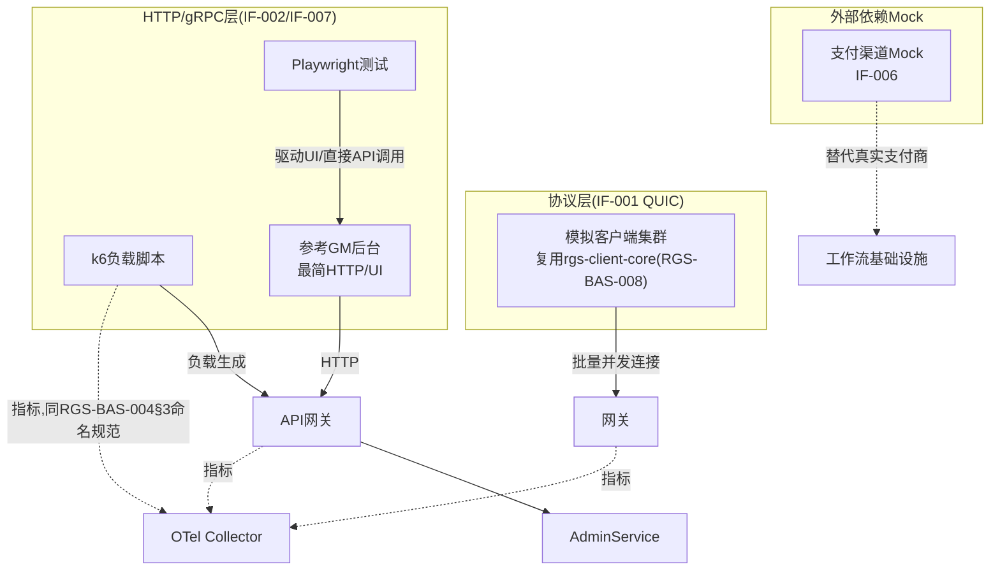

# 基本设计书（基本設計書 / Basic Design Document）

**测试基础设施与自动化验证 Test Infrastructure & Automated Verification**

| 项目 | 内容 |
|---|---|
| 文档编号 | RGS-BAS-012 |
| 版本 | 0.2 |
| 父文档 | RGS-REQ-015 需求定义书 第7章（ARC-028） |
| 依据标准 | IPA『共通フレーム 2013（SLCP-JCF2013）』基本设计工程 |
| 制定日 | 2026-08-16 |
| 制定者 | 架构师 |
| 保密级别 | 内部限定（Internal Use Only） |

## 修订历史（改訂履歴 / Revision History）

| 版本 | 修订日 | 修订者 | 修订内容 | 影响章节 |
|---|---|---|---|---|
| 0.1 | 2026-08-16 | 架构师 | 初版制定。将RGS-REQ-015 ARC-028展开为模拟客户端组件设计、外部依赖Mock目录、k6脚本组织、Playwright测试架构、参考GM后台最小实现范围 | 全部 |
| 0.2 | 2026-08-17 | 架构师 | 补齐两处设计缺口：①追溯性表此前遗漏AC-TST-001〜004验收标准与设计章节的映射，仅覆盖ARC/FR/NFR；②NFR-TST-004（可复现性）此前仅在需求侧提及复用RGS-BAS-008§9 Seeded PRNG原则，本设计书未给出具体落地设计，新增§5.3（负载测试可复现性）与§6.4（UAT测试可复现性） | §5.3、§6.4、§10 |

## 审批栏（承認欄 / Approval）

| 角色 | 姓名 | 审批日 | 备注 |
|---|---|---|---|
| 制定（起草） | 架构师 | 2026-08-16 | — |
| 评审（QA/性能负责人） | | | 工具链是否满足PH-4/PH-8负载试验的实测诉求 |
| 审批（负责人） | | | 本文档的基准化 |

---

## 目录

1. [前言](#1-前言)
2. [整体测试基础设施架构](#2-整体测试基础设施架构)
3. [协议层模拟客户端设计](#3-协议层模拟客户端设计)
4. [外部依赖Mock设计](#4-外部依赖mock设计)
5. [k6性能测试设计](#5-k6性能测试设计)
6. [Playwright UAT设计](#6-playwright-uat设计)
7. [参考GM后台最小实现范围](#7-参考gm后台最小实现范围)
8. [CI集成与流水线分层](#8-ci集成与流水线分层)
9. [标准化检查清单](#9-标准化检查清单)
10. [追溯性（ARC-028 → 本设计书章节）](#10-追溯性arc-028-本设计书章节)

---

# 1. 前言

本文档是RGS-REQ-015第7章ARC-028的系统级展开，遵循RGS-BAS-001既有记述规则。本文档给出的是**基础设施**设计，不含具体测试用例内容（属RGS-TST-001）。

---

# 2. 整体测试基础设施架构



---

# 3. 协议层模拟客户端设计

对应FR-TST-001〜004、ARC-028。

## 3.1 组件结构

```
services/load-mock-client/         # 独立于游戏客户端,复用核心SDK
  Cargo.toml                        # 依赖rgs-client-core(RGS-BAS-008§3),不重新实现协议
  src/
    main.rs                          # 批量实例化入口,读取行为配置(FR-TST-003)
    behavior/
      profile.rs                      # 移动模式/输入频率/掉线概率等可配置画像
    fleet.rs                          # 单进程内管理数千~数万个模拟连接实例
    metrics.rs                        # 输出RGS-BAS-004规范的施压端自身健康指标
```

## 3.2 关键设计点

| 设计点 | 内容 |
|---|---|
| 协议一致性 | 直接依赖`rgs-client-core`，**不**另行实现编解码/预测和解逻辑，保证与真实客户端行为一致（AC-TST-001） |
| 资源可预测性 | 每个模拟连接实例的内存占用须有明确上限（协议缓冲区+预测状态，量级远小于渲染客户端），供施压端自身的容量规划（如"单Pod 8GB内存可承载N个实例"） |
| 行为画像 | 移动模式（随机游走/固定路径/聚集行为）、输入频率、掉线重连概率均通过配置文件驱动，不同画像组合可覆盖NFR-PE-*系列指标要求的多种流量特征 |
| 施压端自身可观测性 | 施压端输出的指标须能在Dashboard上与被测系统的指标区分展示（不同`service.name`），避免负载试验时误将施压端自身瓶颈判定为被测系统瓶颈 |

---

# 4. 外部依赖Mock设计

对应FR-TST-010〜012。

## 4.1 支付渠道Mock（IF-006）

| 端点 | 响应模式 | 用途 |
|---|---|---|
| 支付发起 | 成功/失败/超时（可配置） | FR-WF-001购买工作流的正常与异常路径 |
| Webhook回调 | 成功签名/伪造签名/延迟回调 | 验证RGS-BAS-001§6.4既定的签名校验与幂等键处理 |
| 部分失败 | 支付成功但发货前中断 | VF-006（Saga部分失败与补偿）专用场景 |

## 4.2 部署方式

外部依赖Mock作为独立的、轻量级服务，随CI流水线按需启停（复用RGS-BAS-002§4.2既有CI/CD骨架），**不**常驻生产环境，**不**接入生产NetworkPolicy基线（不属于生产拓扑的一部分）。

---

# 5. k6性能测试设计

对应FR-TST-020〜023、ARC-028。

## 5.1 脚本组织

```
tests/perf/k6/
  scenarios/
    api-gateway-baseline.js    # API网关常态负载基线
    admin-api-load.js           # 运营API负载(IF-007)
  lib/
    metrics-adapter.js          # 输出适配RGS-BAS-004§3指标命名规范
  config/
    ccu-100k-ramp.json          # 并发梯度配置,版本化管理(FR-TST-023)
```

## 5.2 指标适配

k6原生指标（如`http_req_duration`）通过`lib/metrics-adapter.js`转换为`rgs_request_duration_ms`等既有命名（RGS-BAS-004§4.1），使负载试验数据无需人工转换即可接入既有Dashboard（AC-TST-004）。

## 5.3 可复现性设计（落实NFR-TST-004）

负载测试场景中涉及随机化的部分（模拟客户端的移动路径随机游走、掉线/重连概率触发时机等，§3.2行为画像）**必须**使用与RGS-BAS-008§9既定"Seeded PRNG可复现原则"同款方法：每次测试运行记录并可显式指定随机种子，使同一份`config/ccu-100k-ramp.json`配置在不同时间点重放时产生一致的负载特征分布，PH-4与PH-8两次负载试验（AC-005）方可比对结果差异是否源于系统变化而非测试本身的随机噪声。

## 5.4 与协议层模拟客户端的协同

单次PH-4/PH-8负载试验**同时**启动：①k6对API网关/运营API施压②§3协议层模拟客户端对网关/运行时施压，两者独立运行、指标独立可辨识但可在同一Dashboard时间轴上叠加观察，共同构成对100,000 CCU目标（AC-005）的完整覆盖——纯HTTP层压测不能代表真实CCU下的协议层表现，反之亦然，两者缺一不可。

---

# 6. Playwright UAT设计

对应FR-TST-030〜032、ARC-028。

## 6.1 双模式测试架构

```
tests/uat/playwright/
  ui/
    admin-ban-flow.spec.ts       # 驱动参考GM后台UI(FR-TST-030)
    admin-maintenance.spec.ts
  api/
    admin-service.contract.spec.ts  # 纯API模式(FR-TST-031),不经UI
  shared/
    assertions.ts                 # UI模式与API模式共用同一断言库
```

## 6.2 UI模式验证链路

UI操作 → HTTP请求（Playwright网络拦截可断言请求字段）→ `AdminService`处理 → 审计记录产生（可通过§7参考GM后台的查询页或直接API核对）。该链路验证的是RGS-BAS-003全部方法的**端到端契约**，而非仅API字段本身。

## 6.3 范围边界重申

Playwright测试**仅**驱动§7参考GM后台或直接调用HTTP接口，**不得**指向任何游戏客户端相关的可执行文件或渲染画面（FR-TST-032，X-001边界重申）。

## 6.4 可复现性设计（落实NFR-TST-004）

UAT测试用例所需的前置数据（测试账号、初始道具/货币状态等）**必须**通过测试专用的确定性数据准备脚本生成（复用§6.1`api/`纯API模式发起幂等的初始化请求），**不得**依赖上一次测试运行残留的状态或人工手动准备的数据——每次CI运行前均从已知基线重新准备数据，保证同一测试用例重复执行时结果一致，避免"仅在特定历史状态下通过"的不可复现测试。

---

# 7. 参考GM后台最小实现范围

对应FR-TST-040〜042。

| 覆盖的`AdminService`方法 | 参考GM后台页面 |
|---|---|
| `BanAccount`／`KickSession`／`MuteChat` | 账号管控页 |
| `GrantCompensation` | 补偿发放页 |
| `SetMaintenanceMode` | 维护模式开关 |
| `ReloadConfigTable` | 数值热更新触发页 |
| `RequestSceneRestart`／`ConfirmSceneRestart` | 场景管控页（含二次确认交互） |
| `QueryOnlineStatus`／`QuerySceneMetrics`／`QueryAuditLog` | 只读查询页 |
| `CreateOpsTicket` | 运维工单页 |

**明确声明**（FR-TST-041落地）：全部页面顶部固定显示"仅供测试与API契约验证使用，非生产交付物"标识；鉴权使用与生产同构的RBAC模型但独立的测试凭证体系（FR-TST-042），测试环境的凭证**不得**具备访问生产环境的能力。

---

# 8. CI集成与流水线分层

对应NFR-TST-005，复用RGS-BAS-002§4.2既有CI/CD骨架，新增分层：

| 流水线 | 触发时机 | 内容 | 时限约束 |
|---|---|---|---|
| 主干CI（既有） | 每次提交/合并 | lint/test/契约测试/镜像构建 | QA-006既定15分钟以内，**不**含本文档的负载/UAT测试 |
| UAT流水线（新增） | 每次合并至主干后异步触发，或按需触发 | Playwright双模式测试全量执行 | 不阻塞主干合并，结果异步通知（复用RGS-BAS-003§6告警推送同类机制） |
| 负载测试流水线（新增） | 按需触发（PH-4/PH-8负载试验窗口，或性能回归怀疑时） | k6+协议层模拟客户端联合施压 | 独立执行，不与常规CI共享Runner配额（避免长耗时任务拖慢主干反馈） |

---

# 9. 标准化检查清单

## 9.1 测试基础设施变更检查清单

- [ ] 模拟客户端版本与`rgs-client-core`保持同步（同仓库管理，不存在版本漂移风险）
- [ ] 外部依赖Mock覆盖新增的外部集成点（新挂载App若依赖外部系统时）
- [ ] k6脚本的指标输出符合RGS-BAS-004§4.1命名规范
- [ ] Playwright新增测试同时补充UI模式与API模式的对应用例（如适用）
- [ ] 参考GM后台新增页面已同步覆盖`AdminService`新增方法

---

# 10. 追溯性（ARC-028 → 本设计书章节）

| ARC/FR编号 | 决定摘要 | 本文档展开章节 |
|---|---|---|
| ARC-028 | 分层工具选型与Mock边界 | §2、§5、§6 |
| FR-TST-001〜004 | 协议层模拟客户端 | §3 |
| FR-TST-010〜012 | 外部依赖Mock | §4 |
| FR-TST-020〜023 | k6性能测试 | §5 |
| FR-TST-030〜032 | Playwright UAT | §6 |
| FR-TST-040〜042 | 参考GM后台 | §7 |
| NFR-TST-001〜005 | 一致性/可扩展性/隔离性/可复现性/CI集成 | §3、§4、§5.3、§6.4、§8 |
| AC-TST-001（模拟客户端与三引擎适配层同轨迹重放逐字段一致） | §3协议层模拟客户端设计（复用核心SDK,协议一致性设计点） | §3 |
| AC-TST-002（外部依赖Mock跑通购买工作流,含支付失败与补偿路径） | §4外部依赖Mock设计（支付渠道Mock端点与部分失败场景） | §4 |
| AC-TST-003（参考GM后台驱动的Playwright测试覆盖AdminService全部方法,成功/失败路径） | §6 Playwright UAT设计＋§7参考GM后台最小实现范围 | §6、§7 |
| AC-TST-004（k6负载试验性能数据可直接在既有Dashboard查看,无需人工转换） | §5.2指标适配（k6原生指标→既有命名规范转换） | §5.2 |

---

> 本文档所定义的规范为详细设计与实现阶段的输入基准。具体的k6/Playwright版本、参考GM后台前端技术栈（TBD-TST-002），留待详细设计阶段确定。
