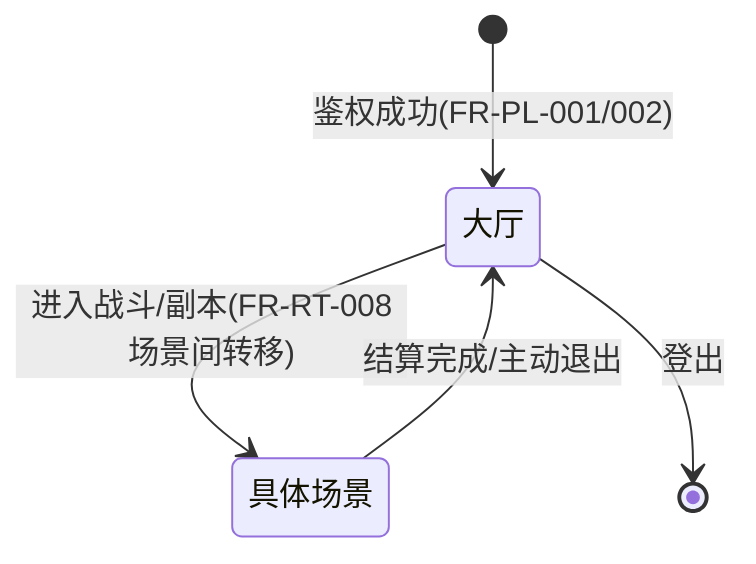
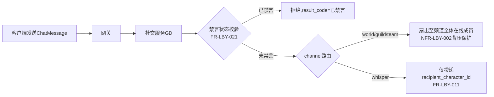
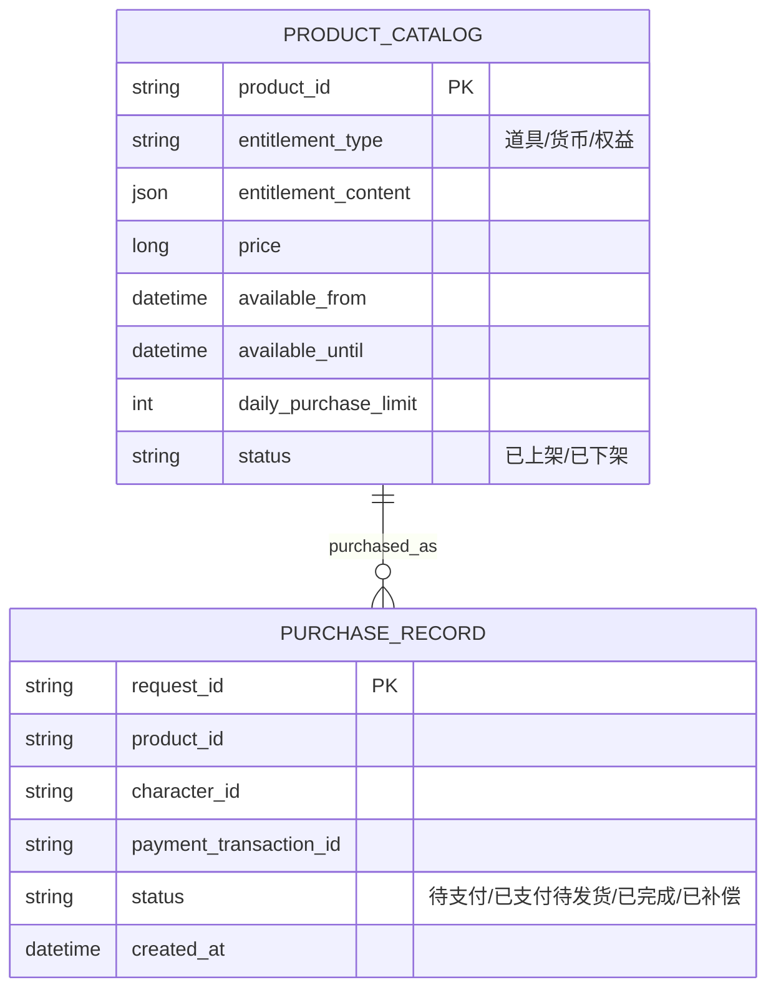
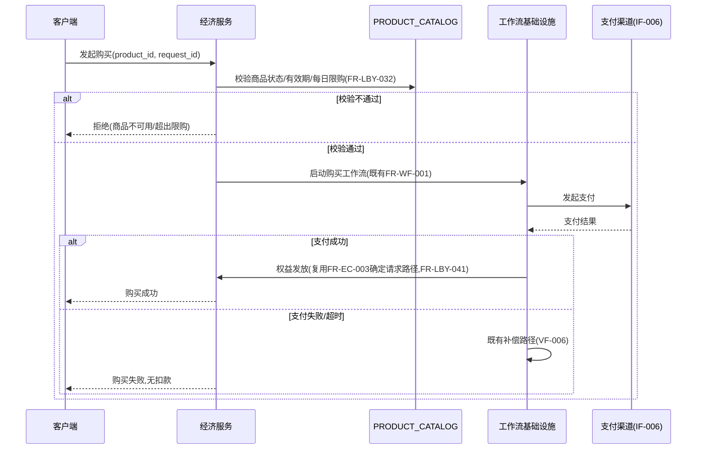
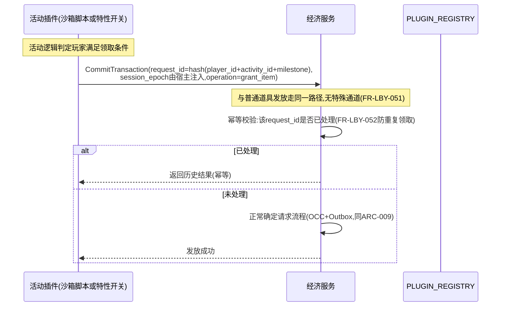

# 基本设计书（基本設計書 / Basic Design Document）

**大厅、社交通信与运营活动 Lobby, Social Communication & Live-Ops**

| 项目 | 内容 |
|---|---|
| 文档编号 | RGS-BAS-013 |
| 版本 | 0.2 |
| 父文档 | RGS-REQ-016 需求定义书 第10章（ARC-029） |
| 依据标准 | IPA『共通フレーム 2013（SLCP-JCF2013）』基本设计工程 |
| 制定日 | 2026-08-16 |
| 制定者 | 架构师 |
| 保密级别 | 内部限定（Internal Use Only） |

## 修订历史（改訂履歴 / Revision History）

| 版本 | 修订日 | 修订者 | 修订内容 | 影响章节 |
|---|---|---|---|---|
| 0.1 | 2026-08-16 | 架构师 | 初版制定。将RGS-REQ-016 ARC-029展开为大厅组件与状态图、频道路由字段级设计、商品目录逻辑数据模型、活动与经济系统交互时序图 | 全部 |
| 0.2 | 2026-08-16 | 架构师 | 补充遗漏：①新增§2.3在线状态字段级隐私过滤设计，落实NFR-LBY-005"不得暴露精确位置"（此前仅在§2.2表格单元中一笔带过，未展开至字段级）②追溯性表补齐NFR-LBY-001〜005与AC-LBY-001〜005此前完全缺失的映射（此前追溯性表仅覆盖ARC/FR） | §2.3、§7 |

## 审批栏（承認欄 / Approval）

| 角色 | 姓名 | 审批日 | 备注 |
|---|---|---|---|
| 制定（起草） | 架构师 | 2026-08-16 | — |
| 评审（技术） | | | 是否切实复用既有基础设施而未产生"影子架构"（ARC-029核心验证项） |
| 审批（负责人） | | | 本文档的基准化 |

---

## 目录

1. [前言](#1-前言)
2. [大厅设计](#2-大厅设计)
3. [频道与私聊字段级设计](#3-频道与私聊字段级设计)
4. [商品目录与购买设计](#4-商品目录与购买设计)
5. [运营活动与经济系统交互设计](#5-运营活动与经济系统交互设计)
6. [标准化检查清单](#6-标准化检查清单)
7. [追溯性（ARC-029 → 本设计书章节）](#7-追溯性arc-029--本设计书章节)

---

# 1. 前言

本文档是RGS-REQ-016第10章ARC-029的系统级展开，遵循RGS-BAS-001既有记述规则。依ARC-029核心原则，本文档**不引入**任何新组件/新一致性机制，全部设计均为既有RT/GD/EC/AD限界上下文与RGS-REQ-009插件体系的应用。

---

# 2. 大厅设计

## 2.1 大厅作为特殊场景

大厅在运行时（RT）内部实现为一种`scene_type=lobby`的场景Actor（复用ARC-001既定场景Actor模型），区别于战斗场景的`scene_type=combat`。两者共享同一套Actor生命周期管理（FR-RT-010监督/重启）、同一套AOI/同步机制（FR-SY-001〜009），仅tick内的模拟内容不同（大厅无战斗判定，仅处理社交状态变化）。

## 2.2 大厅内组件

| 组件 | 复用的既有机制 | 大厅特有内容 |
|---|---|---|
| 在线状态展示 | FR-PL-006既有在线状态管理（缓存基础设施） | 展示范围过滤（仅好友/公会成员，落实FR-LBY-002隐私要求） |
| 队伍编成 | ARC-002同步机制（队伍成员列表作为差分快照的一部分） | 队伍状态机（邀请中/已确认/已解散），持久化于`social_db`（GD既有数据库，新增`team`表） |
| 活动入口 | RGS-REQ-009 `PLUGIN_REGISTRY`查询（复用其`已启用`状态过滤） | 大厅UI数据契约（活动ID、图标引用、跳转参数），不含具体UI渲染（属客户端范围） |

## 2.3 在线状态字段级隐私过滤（落实FR-LBY-002、NFR-LBY-005）

大厅差分快照中，`PresenceEntry`（在线状态条目，随ARC-002快照下发）字段范围**必须**收窄如下，服务端在构建快照时即完成过滤，**不得**依赖客户端隐藏敏感字段：

| 字段 | 是否下发 | 说明 |
|---|---|---|
| `character_id` | 是 | — |
| `presence_state`（在线／离线／忙碌） | 是 | 复用FR-PL-006既有枚举 |
| `current_scene_type`（`lobby`／`combat`／`dungeon`等**类型**） | 是 | 落实FR-LBY-002"可展示场景类型" |
| `current_scene_id`（具体场景实例ID） | **否** | 精确位置信息，属FR-LBY-002"不得暴露精确游戏内位置"，NFR-LBY-005核心校验项 |
| `precise_coordinates` | **否** | 从不进入`PresenceEntry`定义，无该字段 |
| 可见范围判定 | 仅对`character_id`处于请求方好友列表或同公会成员集合内的条目下发，判定在GD/PL服务端完成（复用既有关系数据），**不**依赖客户端过滤全量在线列表后自行裁剪展示 |

---

# 3. 频道与私聊字段级设计

对应FR-LBY-010〜012、RGS-BAS-001§6.1既定API设计通用原则。

## 3.1 `ChatMessage`字段扩展（复用RGS-BAS-001§6.2.2既定消息，本节补齐私聊场景字段）

| 字段 | 说明 |
|---|---|
| `channel` | 枚举：`world`／`guild`／`team`／`whisper`（既有定义扩展，新增`team`与`whisper`区分公会与私聊） |
| `sender_character_id` | 既有字段 |
| `recipient_character_id` | **新增**，仅`whisper`频道必填，路由层据此定向投递（落实FR-LBY-011点对点强制） |
| `text` | 既有字段 |
| `sent_at` | 既有字段 |

## 3.2 路由设计

**设计要点**：`whisper`频道在GD服务内部**不经过**任何面向频道全体成员的广播路径（即便复用同一套QUIC Stream可靠通道基础设施），路由判定在服务端完成，客户端无法通过协议层观察到私聊消息的扇出行为——这是FR-LBY-011"不依赖客户端自觉过滤"的技术落地。

## 3.3 禁言校验（FR-LBY-020/021落地）

GD服务在处理任意`ChatMessage`前，查询该`character_id`的禁言状态（来源：`AdminService.MuteChat`写入的既有状态，同RGS-BAS-003§3.1字段设计），禁言中则拒绝，**不**转发。GD服务**不**持有独立的禁言判定逻辑副本，直接查询权威状态，避免状态不同步。

---

# 4. 商品目录与购买设计

对应FR-LBY-030〜042。

## 4.1 商品目录数据模型（`economy_db`新增表，逻辑级，物理DDL属RGS-DBS-001）

`PRODUCT_CATALOG`的上下架**复用**RGS-REQ-009插件机制（特性开关形态，`available_from`/`available_until`由既定的tick边界原子切换机制生效，落实FR-LBY-031）。

## 4.2 购买时序（复用既有FR-WF-001，本节补齐商品目录校验环节）

**设计要点**：本时序**没有**新增任何一致性机制——`WF`到`EC`的权益发放调用与既有FR-EC-003完全相同的幂等确定请求路径，`request_id`延续购买请求的同一标识贯穿全链路（同ARC-009既定的关联ID透传原则）。

---

# 5. 运营活动与经济系统交互设计

对应FR-LBY-050〜054，复用RGS-BAS-005插件设计与RGS-BAS-009§5.1插件经济边界设计。

## 5.1 活动奖励发放时序

## 5.2 经济类活动的单点判定

依FR-LBY-053，影响道具/货币数值的活动在`PLUGIN_REGISTRY.is_economic`（RGS-BAS-005§3.1既有字段）标记为`true`，其生效判定**必须**在`CommitTransaction`处理时由EC执行（复用RGS-BAS-009§5.4既定设计），大厅/场景节点本地**不**持有可用于判定发放与否的活动状态副本，仅持有用于UI展示的只读快照（复用FR-LBY-054查询接口）。

---

# 6. 标准化检查清单

## 6.1 大厅/社交/内购/活动功能上线检查清单

- [ ] 大厅确认实现为`scene_type=lobby`的场景Actor，未新建独立子系统（ARC-029核心验证项）
- [ ] 私聊路由确认仅投递至`recipient_character_id`，故障注入测试验证无法通过协议层观察到扇出
- [ ] 禁言校验确认查询`AdminService`既有权威状态，未维护独立副本
- [ ] 商品目录上下架确认复用RGS-REQ-009插件机制的tick边界原子切换
- [ ] 权益发放确认复用FR-EC-003既有确定请求路径，`request_id`未绕过幂等校验
- [ ] 经济类活动确认标记`is_economic=true`且判定收归EC单点

---

# 7. 追溯性（ARC-029 → 本设计书章节）

| ARC/FR编号 | 决定摘要 | 本文档展开章节 |
|---|---|---|
| ARC-029 | 大厅作为特殊场景，全部能力复用既有基础设施 | §2、§7（本表） |
| FR-LBY-001〜005 | 大厅 | §2 |
| FR-LBY-010〜022 | 社交通信 | §3 |
| FR-LBY-030〜042 | 内购与付费 | §4 |
| FR-LBY-050〜054 | 运营活动 | §5 |
| NFR-LBY-001（大厅同步延迟，复用ARC-002目标） | §2.1大厅作为场景Actor，共享ARC-002同步机制不新增独立目标 | §2.1 |
| NFR-LBY-002（世界频道扇出不阻塞背压） | §3.2路由设计（`FANOUT`节点标注NFR-LBY-002背压保护） | §3.2 |
| NFR-LBY-003（购买/活动奖励一致性，总量差分为0） | §4.2购买时序（复用FR-EC-003确定请求路径）＋§5.1活动奖励发放时序（同一路径） | §4.2、§5.1 |
| NFR-LBY-004（禁言/购买限制服务器权威校验） | §3.3禁言校验（查询权威状态）＋§4.2商品状态/限购校验 | §3.3、§4.2 |
| NFR-LBY-005（在线状态展示不泄露精确位置） | §2.3在线状态字段级隐私过滤 | §2.3 |
| AC-LBY-001（鉴权→大厅→编队→进入场景完整路径） | §2.1状态图＋§2.2大厅内组件 | §2.1、§2.2 |
| AC-LBY-002（私聊可见范围渗透测试） | §3.2路由设计（`whisper`不经广播路径） | §3.2 |
| AC-LBY-003（禁言服务器侧强制校验） | §3.3禁言校验 | §3.3 |
| AC-LBY-004（购买故障注入,Saga补偿无终态不一致） | §4.2购买时序（支付失败/超时分支既有补偿路径VF-006） | §4.2 |
| AC-LBY-005（活动奖励并发重复领取仅成功一次） | §5.1活动奖励发放时序（幂等校验分支） | §5.1 |

---

> 本文档所定义的规范为详细设计与实现阶段的输入基准。`team`/`PRODUCT_CATALOG`/`PURCHASE_RECORD`表的物理DDL留待RGS-DBS-001按RGS-REQ-011/BAS-007既定标准确定。
