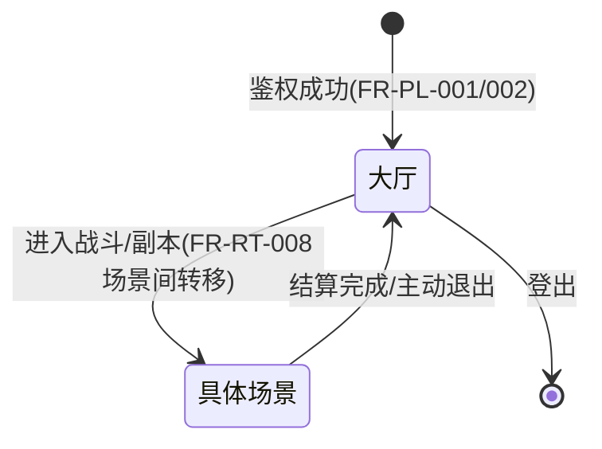
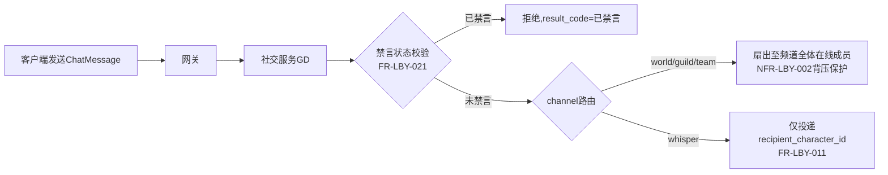
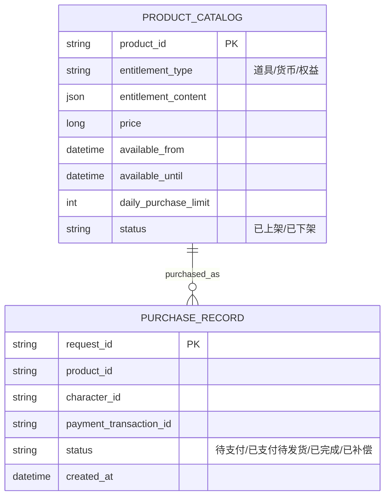
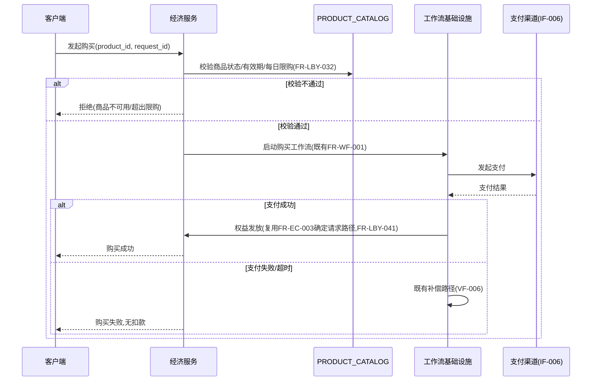
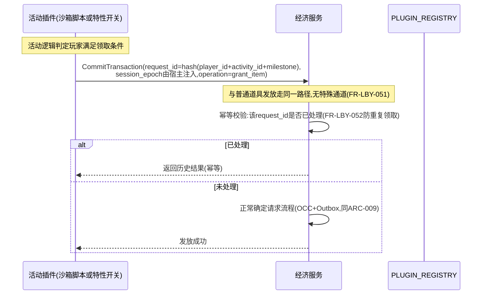

# 基本设计书（基本設計書 / Basic Design Document）

**大厅、社交通信与运营活动 Lobby, Social Communication & Live-Ops**

| 项目 | 内容 |
|---|---|
| 文档编号 | RGS-BAS-013 |
| 版本 | 0.4 |
| 父文档 | RGS-REQ-016 需求定义书 第10章（ARC-029） |
| 依据标准 | IPA『共通フレーム 2013（SLCP-JCF2013）』基本设计工程 |
| 制定日 | 2026-08-16 |
| 制定者 | 架构师 |
| 保密级别 | 内部限定（Internal Use Only） |

## 修订历史（改訂履歴 / Revision History）

| 版本 | 修订日 | 修订者 | 修订内容 | 影响章节 |
|---|---|---|---|---|
| 0.1 | 2026-08-16 | 架构师 | 初版制定。将RGS-REQ-016 ARC-029展开为大厅组件与状态图、频道路由字段级设计、商品目录逻辑数据模型、活动与经济系统交互时序图 | 全部 |
| 0.2 | 2026-08-16 | 架构师 | 补充遗漏：①新增§2.3在线状态字段级隐私过滤设计，落实NFR-LBY-005"不得暴露精确位置"（此前仅在§2.2表格单元中一笔带过，未展开至字段级）②追溯性表补齐NFR-LBY-001〜005与AC-LBY-001〜005此前完全缺失的映射（此前追溯性表仅覆盖ARC/FR） | §2.3、§7 |
| 0.3 | 2026-08-17 | 架构师 | 补齐缺口：FR-LBY-022（轻量级自动化滥用检测）此前仅在追溯性表以"FR-LBY-010〜022"区间形式带过，无任何组件/数据结构设计，新增§3.4 `ChatAbuseGuard`重复消息/违禁词规则设计与`ChatAbuseSignal`记录结构，并明确其与RGS-REQ-014智能层的隔离性边界（同NFR-NEURO-001）；追溯性表同步拆分FR-LBY-010〜021与FR-LBY-022两行 | §3.4、§7 |
| 0.4 | 2026-09-01 | 架构师 (Mavis 接手 agent per DEC-008) | 落实"各BAS文档功能章节加log设计且区分debug/release级"总要求（per Ulysses 2026-09-01 15:52 JST 决策，4 拍板选项：全部 36 个BAS / 详尽版5列表 / 派worker并行 / BAS-004同步升级）：§2.1（大厅场景Actor状态机）/§2.2（在线状态+队伍编成+活动入口）/§2.3（PresenceEntry字段级隐私过滤）/§3.1（ChatMessage字段扩展+whisper定向）/§3.2（频道路由+背压保护）/§3.3（禁言服务器权威校验）/§3.4（ChatAbuseGuard基础规则+ChatAbuseSignal）/§4.1（商品目录CRUD+tick边界切换）/§4.2（购买工作流+Saga补偿）/§5.1（活动奖励发放+幂等校验）/§5.2（经济类活动EC单点判定）/§6.1（上线检查清单）共 12 个 "本功能日志设计" 小节全部新增；每节均含 5 列详尽版（字段名/触发条件/频率估算/采样策略/脱敏与成本），显式区分 `info!`/`warn!`/`error!`（release 必出，编译期常驻，per BAS-004 v0.3 §6.2 强制全采样白名单）与 `debug!`/`trace!`（`#[cfg(debug_assertions)]` 守护，debug-only，release build 完全剔除零运行时开销）两类事件；字段名前缀 `hall.*`（区别于 BAS-002 `mnt.*` / BAS-003 `gm.*` / BAS-004 `log.*` / BAS-005 `plugin.*` / BAS-006 `sec.*`），命名严格 snake_case 与 BAS-004 v0.3 §4.6.1/§4.6.2 保持拼写一致（FR-LOG-013）；覆盖 ARC-029 大厅社交通信域全链路——大厅场景Actor状态机/在线状态字段级隐私过滤/私聊定向/频道路由/禁言服务器权威/滥用检测/商品目录/购买工作流/活动奖励发放/EC单点判定/上线检查；大厅社交通信域特殊强制：聊天敏感词命中/封禁 → release 必出 + 强制全采样（BAS-004 §6.2 强制全量采集范围）；私聊/群聊建立 → release 必出；运营活动开启/结束/奖励发放 → release 必出 + 强制全采样；消息内容（`text`字段）→ debug-only（性能 + 隐私双重考量，避免撑爆生产日志通道且避免敏感聊天内容进入生产可观测栈）；§7 追溯性新增 AC-LBY-006（debug-only 宏 release 完全剔除）与 AC-LBY-007（每功能BAS文档须含本功能log设计章节），与 BAS-001 v1.5 §4.8.3.4（commit 32d9eb6）/ BAS-002 v0.4 §13（commit f1401a3）/ BAS-003 v0.3 §13（commit 75a001c）/ BAS-004 v0.3 §12（commit 47e26b0+0ee6262）形成统一规范 | §2.1、§2.2、§2.3、§3.1、§3.2、§3.3、§3.4、§4.1、§4.2、§5.1、§5.2、§6.1、§7 |

## 审批栏（承認欄 / Approval）

| 角色 | 姓名 | 审批日 | 备注 |
|---|---|---|---|
| 制定（起草） | 架构师 | 2026-08-16 | — |
| 评审（技术） | | | 是否切实复用既有基础设施而未产生"影子架构"（ARC-029核心验证项） |
| 审批（负责人） | | | 本文档的基准化 |

---

## 目录

1. [前言](#1-前言)
2. [大厅设计](#2-大厅设计)
3. [频道与私聊字段级设计](#3-频道与私聊字段级设计)
4. [商品目录与购买设计](#4-商品目录与购买设计)
5. [运营活动与经济系统交互设计](#5-运营活动与经济系统交互设计)
6. [标准化检查清单](#6-标准化检查清单)
7. [追溯性（ARC-029 → 本设计书章节）](#7-追溯性arc-029-本设计书章节)

---

# 1. 前言

本文档是RGS-REQ-016第10章ARC-029的系统级展开，遵循RGS-BAS-001既有记述规则。依ARC-029核心原则，本文档**不引入**任何新组件/新一致性机制，全部设计均为既有RT/GD/EC/AD限界上下文与RGS-REQ-009插件体系的应用。

---

# 2. 大厅设计

## 2.1 大厅作为特殊场景

大厅在运行时（RT）内部实现为一种`scene_type=lobby`的场景Actor（复用ARC-001既定场景Actor模型），区别于战斗场景的`scene_type=combat`。两者共享同一套Actor生命周期管理（FR-RT-010监督/重启）、同一套AOI/同步机制（FR-SY-001〜009），仅tick内的模拟内容不同（大厅无战斗判定，仅处理社交状态变化）。

### 2.1 本功能日志设计

本节覆盖**大厅作为 `scene_type=lobby` 场景Actor的状态机迁移点**——大厅本身是 ARC-001 场景Actor模型的特殊化，不引入新组件，但状态机的每一次迁移（鉴权完成→大厅→具体场景→大厅→登出）都是 SRE 在 Grafana 上追踪"玩家在大厅停留多久""大厅→战斗场景转化率"等业务指标的关键事件源，**全部 release 必出**（业务关键事件 per BAS-004 v0.3 §4.4 必出清单）。

| 字段名（field） | 触发条件（trigger） | 频率估算（frequency） | 采样策略（sampling） | 脱敏与成本（redact & cost） |
|---|---|---|---|---|
| `hall.lobby.scene_entered` | 鉴权成功后玩家从 `[*]` 状态首次进入大厅场景（`scene_type=lobby` 场景Actor创建） | 稳态 1-10/s / 峰值 100/s（开服/活动期间） | release 必出（100% 强制全采样，per BAS-004 v0.3 §4.4 业务关键事件必出清单） | 含 `character_id` / `session_id` / `scene_id` / `lobby_kind`；约 250B/条 × 100/s = 25KB/s 峰值 |
| `hall.lobby.scene_exited.to_combat` | 玩家从大厅迁移到具体场景（`scene_type=combat`/`dungeon` 等，FR-RT-008 场景间转移） | 稳态 0.5-5/s / 峰值 50/s | release 必出（100% 强制全采样） | 含 `character_id` / `from_scene_id` / `to_scene_id` / `to_scene_type`；约 280B/条 |
| `hall.lobby.scene_exited.to_lobby` | 玩家从具体场景结算/主动退出回到大厅 | 稳态 0.5-5/s / 峰值 50/s | release 必出（100% 强制全采样） | 含 `character_id` / `from_scene_id` / `to_scene_id` / `exit_kind`（settlement/manual）；约 280B/条 |
| `hall.lobby.session_logout` | 玩家从大厅登出（登出请求/会话过期/服务端强制） | 稳态 0.5-5/s / 峰值 50/s | release 必出（100% 强制全采样） | 含 `character_id` / `session_id` / `logout_kind`（user_initiated/timeout/kicked）；约 250B/条 |
| `hall.lobby.actor_supervisor.restart` | 大厅场景Actor 触发监督重启（FR-RT-010，崩溃后按指数退避恢复，per BAS-010 §4 G-013） | 极少（部署事故/突发故障） | release 必出（100% 强制全采样，per BAS-004 v0.3 §4.4 必出清单） | 含 `actor_id` / `restart_attempt` / `backoff_ms` / `last_error`；约 350B/条 |
| `hall.lobby.debug.aoi_snapshot` | 大厅场景 AOI 快照（玩家周围的 N 个 entity_id + 粗粒度位置类型） | 稳态 0.1/s（采样触发） | **debug-only**（`#[cfg(debug_assertions)]` 守护，release build 完全剔除） | 约 1-5KB/条（依赖 AOI 范围大小，release 剔除，零运行时开销） |
| `hall.lobby.debug.actor_state_machine_trace` | 单个大厅 Actor 状态机全迁移轨迹（鉴权→大厅→战斗→大厅→登出） | 极低（按需） | **debug-only**（`#[cfg(debug_assertions)]` 守护） | 约 500B-2KB/条（release 剔除） |

**debug-only 守护要点**（落实 BAS-004 v0.3 §4.4）：
- `hall.lobby.scene_entered` / `hall.lobby.scene_exited.*` / `hall.lobby.session_logout` 均为 `info!` 级别（§4.2 二维矩阵 `info!` 行 release 常驻），不挂 `#[cfg]`，确保 SRE 可按 `character_id` + `scene_id` 维度聚合大厅→战斗转化率
- `hall.lobby.actor_supervisor.restart` 是 `error!` 级别（§4.2 二维矩阵 `error!` 行 release 常驻 + §6.2 强制全量采集），**不**挂 `#[cfg]`，与 BAS-010 §4 G-013 指数退避纪律联动
- `hall.lobby.debug.aoi_snapshot` 在大型公会战期间可能 1-5KB × 0.1/s —— release build 完全剔除，避免 RUST_LOG=debug 误开时撑爆生产日志通道
- `character_id` 明文允许（per BAS-004 v0.3 §5.1 末段）；`session_id` 明文允许（同 §5.1 既定）

---

## 2.2 大厅内组件

| 组件 | 复用的既有机制 | 大厅特有内容 |
|---|---|---|
| 在线状态展示 | FR-PL-006既有在线状态管理（缓存基础设施） | 展示范围过滤（仅好友/公会成员，落实FR-LBY-002隐私要求） |
| 队伍编成 | ARC-002同步机制（队伍成员列表作为差分快照的一部分） | 队伍状态机（邀请中/已确认/已解散），持久化于`social_db`（GD既有数据库，新增`team`表） |
| 活动入口 | RGS-REQ-009 `PLUGIN_REGISTRY`查询（复用其`已启用`状态过滤） | 大厅UI数据契约（活动ID、图标引用、跳转参数），不含具体UI渲染（属客户端范围） |

### 2.2 本功能日志设计

本节覆盖**大厅三个核心组件的运行时观察点**——在线状态展示、队伍编成状态机、活动入口查询。这三类事件均属业务关键事件（per BAS-004 v0.3 §4.4 必出清单），**全部 release 必出**。

| 字段名（field） | 触发条件（trigger） | 频率估算（frequency） | 采样策略（sampling） | 脱敏与成本（redact & cost） |
|---|---|---|---|---|
| `hall.presence.filtered_published` | 在线状态差分快照下发，且经 §2.3 字段级隐私过滤（仅好友/公会成员可见） | 稳态 100/s / 峰值 1000/s（公会战/活动期间） | release 必出（100% 强制全采样，per BAS-004 v0.3 §4.4） | 含 `requester_id` / `visible_count` / `hidden_count` / `filter_kind`（friend/guild/stranger）；约 250B/条 × 1000/s = 250KB/s 峰值 |
| `hall.presence.cache_updated` | FR-PL-006 既有在线状态缓存写入（与 §2.3 字段级过滤是不同层：缓存存全量、过滤在快照层） | 稳态 50/s / 峰值 500/s | release 必出（普通 info 走默认采样率） | 含 `character_id` / `presence_state` / `current_scene_type`；约 200B/条 |
| `hall.team.created` | 玩家组队成功（队伍状态机：`邀请中`→`已确认`） | 稳态 1/s / 峰值 20/s | release 必出（业务关键事件，per §4.4） | 含 `team_id` / `leader_id` / `member_count` / `formation_kind`（auto/manual）；约 280B/条 |
| `hall.team.member_joined` | 新成员加入已存在队伍（邀请接受/队长同意） | 稳态 1/s / 峰值 20/s | release 必出（100% 强制全采样） | 含 `team_id` / `member_id` / `join_kind`（invite_accept/leader_invite）；约 250B/条 |
| `hall.team.member_left` | 成员离开队伍（主动退出/被踢/队伍解散连带） | 稳态 1/s / 峰值 20/s | release 必出（100% 强制全采样） | 含 `team_id` / `member_id` / `leave_kind`（voluntary/kicked/dissolved）；约 250B/条 |
| `hall.team.dissolved` | 队伍解散（所有成员离开/队长主动解散/超时自动解散） | 稳态 0.5/s / 峰值 10/s | release 必出（100% 强制全采样） | 含 `team_id` / `dissolve_kind`（all_left/leader_dissolve/timeout）；约 230B/条 |
| `hall.team.lookup` | 通过 GD 服务查询队伍信息（含成员列表） | 稳态 5/s / 峰值 50/s | release 必出（普通 info 走默认采样率） | 含 `team_id` / `requester_id` / `hit`；约 200B/条 |
| `hall.plugin.activity_lookup` | 通过 `PLUGIN_REGISTRY` 查活动入口（复用 RGS-REQ-009 已启用状态过滤） | 稳态 10/s / 峰值 200/s（活动开启时） | release 必出（普通 info 走默认采样率） | 含 `activity_id` / `plugin_id` / `plugin_version` / `enabled`；约 250B/条 |
| `hall.team.debug.member_list_full_dump` | 队伍完整成员列表 dump（含每个成员的 `character_id` / `join_at` / `role`） | 极低（按需/事故复盘） | **debug-only**（`#[cfg(debug_assertions)]` 守护，release build 完全剔除） | 约 500B-2KB/条（依赖成员数，release 剔除） |
| `hall.presence.debug.cache_full_scan` | FR-PL-006 在线状态缓存全量扫描 dump（用于隐私审计/合规检查） | 极低（按需/合规抽检） | **debug-only**（`#[cfg(debug_assertions)]` 守护） | 约 10-50KB/条（release 剔除，零运行时开销） |

**debug-only 守护要点**（落实 BAS-004 v0.3 §4.4）：
- `hall.team.*` / `hall.presence.filtered_published` 均为 `info!` 级别（§4.2 二维矩阵 `info!` 行 release 常驻），便于 SRE 按 `team_id` / `character_id` 维度聚合组队转化率
- `hall.plugin.activity_lookup` 是 `info!` 级别，**不**挂 `#[cfg]`，确保活动开启/关闭期间插件可观测性完整
- `hall.team.debug.member_list_full_dump` 在 6 人队伍 dump 是 ~500B，在 50 人公会是 ~2KB —— release build 完全剔除，避免生产日志中频繁出现完整成员列表
- `character_id` 明文允许（per BAS-004 v0.3 §5.1 末段）

---

## 2.3 在线状态字段级隐私过滤（落实FR-LBY-002、NFR-LBY-005）

大厅差分快照中，`PresenceEntry`（在线状态条目，随ARC-002快照下发）字段范围**必须**收窄如下，服务端在构建快照时即完成过滤，**不得**依赖客户端隐藏敏感字段：

| 字段 | 是否下发 | 说明 |
|---|---|---|
| `character_id` | 是 | — |
| `presence_state`（在线／离线／忙碌） | 是 | 复用FR-PL-006既有枚举 |
| `current_scene_type`（`lobby`／`combat`／`dungeon`等**类型**） | 是 | 落实FR-LBY-002"可展示场景类型" |
| `current_scene_id`（具体场景实例ID） | **否** | 精确位置信息，属FR-LBY-002"不得暴露精确游戏内位置"，NFR-LBY-005核心校验项 |
| `precise_coordinates` | **否** | 从不进入`PresenceEntry`定义，无该字段 |
| 可见范围判定 | 仅对`character_id`处于请求方好友列表或同公会成员集合内的条目下发，判定在GD/PL服务端完成（复用既有关系数据），**不**依赖客户端过滤全量在线列表后自行裁剪展示 |

### 2.3 本功能日志设计

本节覆盖**`PresenceEntry` 字段级隐私过滤的运行观察点**——这是 NFR-LBY-005（不得暴露精确位置）的服务端兜底，**每条过滤命中事件均属安全审计事件（per BAS-004 v0.3 §6.2 强制全量采集范围），必须 release 必出 + 强制全采样**，且 §2.3 过滤层产生的指标是合规审计/事故复盘的关键证据。

| 字段名（field） | 触发条件（trigger） | 频率估算（frequency） | 采样策略（sampling） | 脱敏与成本（redact & cost） |
|---|---|---|---|---|
| `hall.presence.entry_built` | `PresenceEntry` 字段级过滤层构造完成（差分快照下发前） | 稳态 500/s / 峰值 5000/s | release 必出（100% 强制全采样，per BAS-004 v0.3 §6.2 安全审计事件白名单） | 含 `requester_id` / `entry_count` / `visible_count` / `hidden_count`；约 200B/条 × 5000/s = 1MB/s 峰值 |
| `hall.presence.field_stripped.scene_id` | **关键安全事件**：`current_scene_id` 字段被过滤层剔除（NFR-LBY-005 不允许暴露精确位置） | 极少（仅当外部 SDK/旧代码误传 full entry） | release 必出（100% 强制全采样，per §6.2） | 含 `requester_id` / `stripped_field` / `reason`；约 280B/条 |
| `hall.presence.field_stripped.coordinates` | **关键安全事件**：`precise_coordinates` 字段被检测到并丢弃（`PresenceEntry` 定义本无此字段，命中即视为违规） | 极少（视为违规事件） | release 必出（100% 强制全采样，per §6.2） | 含 `requester_id` / `stripped_field` / `source_layer`（SDK/PL/GD）；约 280B/条 |
| `hall.presence.visibility_denied` | 目标 `character_id` 不在请求方好友列表或同公会成员集合内，差分快照中**不包含**该条目 | 稳态 1000/s / 峰值 10000/s（陌生玩家互相尝试查看） | release 必出（100% 强制全采样，per §6.2） | 含 `requester_id` / `target_id` / `deny_reason`（not_friend/not_guild_member）；约 220B/条 × 10000/s = 2.2MB/s 峰值 |
| `hall.presence.relation_lookup_failed` | 关系数据查询失败（好友列表/公会成员集合查询异常） | 极少 | release 必出（100% 强制全采样，per §6.2 错误事件） | 含 `requester_id` / `relation_kind` / `error` / `trace_id`；约 300B/条 |
| `hall.presence.debug.full_entry_dump` | 完整 `PresenceEntry` 字段级 dump（含被剔除字段的原始值） | 极低（合规审计/事故复盘） | **debug-only**（`#[cfg(debug_assertions)]` 守护，release build 完全剔除） | 约 1-3KB/条（release 剔除，零运行时开销） |
| `hall.presence.debug.visibility_decision_trace` | 单个目标条目的可见性判定轨迹（关系数据查询耗时 / 好友匹配 / 公会匹配） | 极低（按需） | **debug-only**（`#[cfg(debug_assertions)]` 守护） | 约 500B-1KB/条（release 剔除） |

**debug-only 守护要点**（落实 BAS-004 v0.3 §4.4）：
- `hall.presence.visibility_denied` 在稳态 1000/s 全量打可能 220KB/s —— `info!` 级别（§4.2 二维矩阵 `info!` 行 release 常驻），**不**挂 `#[cfg]`，按 §6.2 强制全采样（不按普通 info 走采样率），便于 SRE 按 `requester_id` 维度聚合一玩家尝试查看多少陌生玩家
- `hall.presence.field_stripped.*` 是**关键安全事件** —— `error!` 级别，release 常驻 + §6.2 强制全采样，确保 NFR-LBY-005 违规事件不被遗漏
- `hall.presence.debug.full_entry_dump` 可能含被剔除的 `current_scene_id` 精确位置信息 —— release build 完全剔除，避免生产日志中泄漏精确位置
- `requester_id` / `target_id` 明文允许（per BAS-004 v0.3 §5.1 末段）

---

# 3. 频道与私聊字段级设计

对应FR-LBY-010〜012、RGS-BAS-001§6.1既定API设计通用原则。

## 3.1 `ChatMessage`字段扩展（复用RGS-BAS-001§6.2.2既定消息，本节补齐私聊场景字段）

| 字段 | 说明 |
|---|---|
| `channel` | 枚举：`world`／`guild`／`team`／`whisper`（既有定义扩展，新增`team`与`whisper`区分公会与私聊） |
| `sender_character_id` | 既有字段 |
| `recipient_character_id` | **新增**，仅`whisper`频道必填，路由层据此定向投递（落实FR-LBY-011点对点强制） |
| `text` | 既有字段 |
| `sent_at` | 既有字段 |

### 3.1 本功能日志设计

本节覆盖**`ChatMessage` 字段级扩展（`recipient_character_id` 等私聊场景字段）的运行观察点**——私聊消息的字段填充是 FR-LBY-011 点对点强制的服务端兜底，**全部私聊/群聊建立事件 release 必出**（业务关键事件 per BAS-004 v0.3 §4.4 必出清单）。**`text` 字段 → debug-only**（性能 + 隐私双重考量，避免敏感聊天内容进入生产可观测栈，且避免每条消息全文记录撑爆日志通道）。

| 字段名（field） | 触发条件（trigger） | 频率估算（frequency） | 采样策略（sampling） | 脱敏与成本（redact & cost） |
|---|---|---|---|---|
| `hall.chat.message_received` | GD 服务接收到一条 `ChatMessage`（任意 channel，含 world/guild/team/whisper） | 稳态 50/s / 峰值 500/s（活动期间/世界频道洪峰） | release 必出（100% 强制全采样，per BAS-004 v0.3 §4.4 业务关键事件必出清单） | 含 `channel` / `sender_character_id` / `message_id` / `text_length`（**仅长度，不含内容**）；约 250B/条 × 500/s = 125KB/s 峰值 |
| `hall.chat.message_rejected.malformed` | `ChatMessage` 字段级校验失败（`whisper` 缺 `recipient_character_id` / `recipient_character_id` 与 `sender_character_id` 一致自发自收 / 字段长度越界） | 极少（SDK/客户端误用） | release 必出（100% 强制全采样，per §6.2 错误事件） | 含 `sender_character_id` / `channel` / `reject_reason`；约 300B/条 |
| `hall.chat.whisper_built` | 私聊消息 `recipient_character_id` 字段填充完成，构造为定向投递结构（落实 FR-LBY-011） | 稳态 10/s / 峰值 100/s（私聊洪峰） | release 必出（100% 强制全采样，per §4.4 私聊建立必出） | 含 `sender_character_id` / `recipient_character_id` / `message_id`；约 250B/条 |
| `hall.chat.group_built.guild` | 公会群聊消息构造完成（`channel=guild`，扇出至公会成员集合） | 稳态 5/s / 峰值 50/s | release 必出（100% 强制全采样，per §4.4 群聊建立必出） | 含 `sender_character_id` / `guild_id` / `message_id` / `fanout_target_count`；约 280B/条 |
| `hall.chat.group_built.team` | 队伍群聊消息构造完成（`channel=team`，扇出至队伍成员） | 稳态 3/s / 峰值 30/s | release 必出（100% 强制全采样，per §4.4 群聊建立必出） | 含 `sender_character_id` / `team_id` / `message_id` / `fanout_target_count`；约 280B/条 |
| `hall.chat.debug.message_text_dump` | 完整 `text` 字段 dump（敏感聊天内容全文） | 极低（按需/事故取证） | **debug-only**（`#[cfg(debug_assertions)]` 守护，release build 完全剔除） | 约 50B-1KB/条（依赖消息长度，release 剔除，**核心是避免敏感聊天内容进入生产可观测栈**） |
| `hall.chat.debug.field_validation_trace` | `ChatMessage` 字段级校验完整轨迹（含被剔除字段的原始值） | 极低（按需） | **debug-only**（`#[cfg(debug_assertions)]` 守护） | 约 500B-2KB/条（release 剔除） |

**debug-only 守护要点**（落实 BAS-004 v0.3 §4.4）：
- `hall.chat.message_received` 在世界频道洪峰期间 500/s × 250B = 125KB/s —— `info!` 级别，release 常驻 + §6.2 强制全采样（属业务关键事件，per §4.4 必出清单），不挂 `#[cfg]`
- `hall.chat.whisper_built` / `hall.chat.group_built.*` 私聊/群聊建立必出（per 任务特殊考虑），`info!` 级别 release 常驻
- `hall.chat.debug.message_text_dump` 是**性能 + 隐私双重敏感字段** —— release build 完全剔除，避免每条聊天全文进入生产日志（既避免撑爆通道，也避免敏感聊天内容被运营/审计人员误读，且满足最小必要原则 per NFR-SE-012）
- `*token*` / `*password*` / `*credential*` 字段名按 BAS-004 v0.3 §5.1 黑名单**自动丢弃**（聊天内容中若玩家贴出 token/密码，SDK 拦截）
- `sender_character_id` / `recipient_character_id` 明文允许（per §5.1 末段）

---

## 3.2 路由设计

**设计要点**：`whisper`频道在GD服务内部**不经过**任何面向频道全体成员的广播路径（即便复用同一套QUIC Stream可靠通道基础设施），路由判定在服务端完成，客户端无法通过协议层观察到私聊消息的扇出行为——这是FR-LBY-011"不依赖客户端自觉过滤"的技术落地。

### 3.2 本功能日志设计

本节覆盖**频道路由（world/guild/team/whisper）的判定与扇出/定向投递**观察点——路由层是 §3.1 字段扩展的下游，**每条路由判定事件 release 必出**（业务关键事件）。**特别**：私聊定向投递绝不经过广播路径（FR-LBY-011），路由层日志需能独立验证"私聊未走扇出"，这是合规审计的关键证据。

| 字段名（field） | 触发条件（trigger） | 频率估算（frequency） | 采样策略（sampling） | 脱敏与成本（redact & cost） |
|---|---|---|---|---|
| `hall.chat.route.fanout` | world/guild/team 频道消息扇出（按可见成员集合广播，背压保护触发时按 NFR-LBY-002 降级） | 稳态 30/s / 峰值 300/s | release 必出（100% 强制全采样，per BAS-004 v0.3 §4.4） | 含 `channel` / `message_id` / `sender_character_id` / `fanout_target_count` / `delivered_count` / `dropped_count`（背压命中）；约 300B/条 × 300/s = 90KB/s 峰值 |
| `hall.chat.route.whisper_delivered` | whisper 频道定向投递（仅 `recipient_character_id`，**不经过任何面向频道全体的广播路径**，per FR-LBY-011） | 稳态 10/s / 峰值 100/s | release 必出（100% 强制全采样，per §4.4） | 含 `sender_character_id` / `recipient_character_id` / `message_id` / `route_path`（direct_only）；约 250B/条 |
| `hall.chat.route.backpressure_rejected` | **降级路径**：世界频道扇出触发 NFR-LBY-002 背压保护，部分/全部目标被丢弃 | 极少（仅洪峰期间） | release 必出（100% 强制全采样，per §6.2 降级/背压拒绝路径） | 含 `channel` / `message_id` / `requested_count` / `rejected_count` / `backpressure_reason`；约 350B/条 |
| `hall.chat.route.invalid_channel` | 路由层收到 `channel` 字段为未知枚举值（SDK/客户端发版不同步） | 极少 | release 必出（100% 强制全采样，per §6.2 错误事件） | 含 `sender_character_id` / `channel_value` / `sdk_version`；约 280B/条 |
| `hall.chat.route.whisper_broadcast_attempt_blocked` | **关键安全事件**：检测到私聊消息尝试走广播路径（视为 FR-LBY-011 违规，路由层应直接拒绝并告警） | 极少（视为违规事件） | release 必出（100% 强制全采样，per §6.2 安全审计事件白名单） | 含 `sender_character_id` / `recipient_character_id` / `attempted_route` / `blocked_reason`；约 350B/条 |
| `hall.chat.route.debug.route_decision_dump` | 单条消息的完整路由判定轨迹（`MUTE` → `ROUTE` → `FANOUT/DIRECT` 各节点的判定结果 + 耗时） | 极低（按需/事故复盘） | **debug-only**（`#[cfg(debug_assertions)]` 守护，release build 完全剔除） | 约 500B-2KB/条（release 剔除） |
| `hall.chat.route.debug.fanout_target_list` | 扇出目标的完整 `character_id` 列表（用于合规审计"扇出范围是否正确"） | 极低（按需） | **debug-only**（`#[cfg(debug_assertions)]` 守护） | 约 1-10KB/条（依赖频道规模，release 剔除） |

**debug-only 守护要点**（落实 BAS-004 v0.3 §4.4）：
- `hall.chat.route.fanout` / `hall.chat.route.whisper_delivered` 均为 `info!` 级别，release 常驻 + §6.2 强制全采样（业务关键事件 + 私聊建立必出），便于 SRE 按 `channel` + `message_id` 维度聚合频道活跃度
- `hall.chat.route.backpressure_rejected` 是**降级路径事件** —— `warn!` 级别，§6.2 强制全采样，**不**挂 `#[cfg]`，确保洪峰期间背压告警链路完整
- `hall.chat.route.whisper_broadcast_attempt_blocked` 是**关键安全事件** —— `error!` 级别，§6.2 强制全采样，独立验证 FR-LBY-011 私聊隔离纪律
- `hall.chat.route.debug.fanout_target_list` 可能含数千个 `character_id` —— release build 完全剔除，避免 RUST_LOG=debug 误开时泄漏频道成员列表
- `character_id` 明文允许（per §5.1 末段）

---

## 3.3 禁言校验（FR-LBY-020/021落地）

GD服务在处理任意`ChatMessage`前，查询该`character_id`的禁言状态（来源：`AdminService.MuteChat`写入的既有状态，同RGS-BAS-003§3.1字段设计），禁言中则拒绝，**不**转发。GD服务**不**持有独立的禁言判定逻辑副本，直接查询权威状态，避免状态不同步。

### 3.3 本功能日志设计

本节覆盖**禁言状态服务器权威校验**的观察点——禁言状态来源是 `AdminService` 既有权威状态（per RGS-BAS-003 §3.1），GD 服务**不**持有副本。**禁言命中事件属安全审计事件（per BAS-004 v0.3 §6.2 强制全量采集范围），release 必出 + 强制全采样**——这是 GM 操作审计/玩家申诉的关键证据。

| 字段名（field） | 触发条件（trigger） | 频率估算（frequency） | 采样策略（sampling） | 脱敏与成本（redact & cost） |
|---|---|---|---|---|
| `hall.chat.mute.state_checked` | GD 服务向 `AdminService` 查询某 `character_id` 的禁言状态（每条 `ChatMessage` 处理前的同步点） | 稳态 50/s / 峰值 500/s | release 必出（普通 info 走默认采样率，非审计事件走默认采样） | 含 `character_id` / `query_target`（AdminService）/ `query_duration_ms`；约 200B/条 |
| `hall.chat.mute.rejected` | **关键安全/审计事件**：禁言状态命中，消息被拒绝（`result_code=已禁言`） | 稳态 0.1-1/s / 峰值 10/s（封禁集中期） | release 必出（100% 强制全采样，per BAS-004 v0.3 §6.2 强制全量采集：禁言命中 + GM 操作审计） | 含 `character_id` / `channel` / `mute_kind`（chat_only/account_full）/ `mute_expires_at` / `operator_id`（执行禁言的 GM）；约 350B/条 |
| `hall.chat.mute.state_query_failed` | `AdminService` 禁言状态查询失败（网络/超时/服务不可用） | 极少 | release 必出（100% 强制全采样，per §6.2 错误事件） | 含 `character_id` / `error` / `trace_id` / `fallback_decision`（fail_closed 默认拒绝 / fail_open 放行，依 TBD-LBY-001）；约 350B/条 |
| `hall.chat.mute.state_query_slow` | **告警事件**：`AdminService` 禁言状态查询耗时超过阈值（防止 AdminService 慢响应拖垮 GD 消息处理） | 极少 | release 必出（100% 强制全采样，per §6.2 错误/降级事件） | 含 `character_id` / `query_duration_ms` / `threshold_ms` / `trace_id`；约 300B/条 |
| `hall.chat.mute.debug.admin_state_full_dump` | `AdminService` 禁言状态全量 dump（含 `operator_id` / `reason` / `created_at` / `expires_at`） | 极低（合规审计/事故复盘） | **debug-only**（`#[cfg(debug_assertions)]` 守护，release build 完全剔除） | 约 1-5KB/条（release 剔除） |
| `hall.chat.mute.debug.fallback_decision_trace` | 禁言查询失败时的 fail_closed/fail_open 决策轨迹 | 极低（按需） | **debug-only**（`#[cfg(debug_assertions)]` 守护） | 约 300B-1KB/条（release 剔除） |

**debug-only 守护要点**（落实 BAS-004 v0.3 §4.4）：
- `hall.chat.mute.rejected` 是**安全审计事件**（per §6.2 强制全量采集范围）—— `warn!` 级别，release 常驻 + §6.2 强制全采样，**不**挂 `#[cfg]`，确保 GM 封禁操作链可追溯
- `hall.chat.mute.state_query_failed` 是**错误事件** —— `error!` 级别，§6.2 强制全采样，与 fail_closed/fail_open 决策联动
- `hall.chat.mute.debug.admin_state_full_dump` 含 GM `operator_id` 和封禁原因 —— release build 完全剔除，避免生产日志中频繁出现封禁管理操作明细
- `character_id` / `operator_id` 明文允许（per §5.1 末段）

---

## 3.4 轻量级自动化滥用检测（FR-LBY-022落地）

`ChatAbuseGuard`（GD服务内组件，**不**依附RGS-REQ-014智能层，落实NFR-NEURO-001同类隔离性原则——基础规则须在智能层不可用时仍可独立运行）在§3.2路由判定（`MUTE`节点之后、`ROUTE`节点之前）追加基础规则校验：

| 检测规则 | 判定方式 | 命中后动作 |
|---|---|---|
| 短时间内重复消息 | 同一`sender_character_id`在滚动时间窗口（默认10秒，可配置）内提交内容近似（归一化后完全相同或编辑距离低于阈值）的消息累计超过N条（默认3条） | 拒绝本次发送，`result_code=检测到重复刷屏`，不转发，记录`ChatAbuseSignal`（见下） |
| 已知违禁词模式 | 消息文本命中违禁词库（复用既有敏感词过滤基础设施；若详细设计阶段确认尚无可复用的既有词库基础设施，则属于超出本文档"复用既有能力"判定范围的新增诉求，**须**登记为TBD并按ARC-014判定基准评审，**不得**由本文档或详细设计阶段静默新建） | 拒绝本次发送，`result_code=内容违规`，不转发，记录`ChatAbuseSignal` |

`ChatAbuseSignal`（逻辑字段，供RGS-REQ-014智能层（若已批准）作为分析输入之一使用，复用RGS-BAS-003§7审计设计的同类存储原则）：

| 字段 | 说明 |
|---|---|
| `signal_id` | 唯一标识 |
| `character_id` | 触发检测的发送者 |
| `channel` | 触发时所在频道 |
| `rule_hit` | 命中的规则类型（`repeat_message`／`banned_word`） |
| `occurred_at` | 触发时间 |

**设计要点**：`ChatAbuseGuard`的基础规则（重复消息计数、违禁词匹配）**必须**是GD服务内的确定性逻辑，**不得**要求调用RGS-REQ-014智能层才能完成判定（FR-LBY-022"检测本身的基础规则不得依赖智能层才能运行"）；`ChatAbuseSignal`记录**可以**作为智能层的分析输入之一，但基础检测与智能层分析是两条独立可用的路径，前者不因后者不可用而降级。本组件**不**触发任何`AdminService`处罚动作（同FR-GSM-032"信号而非判决"同类原则的应用——检测结果仅拒绝当次发送，不构成账号级处罚，处罚仍须经既有GM流程）。

### 3.4 本功能日志设计

本节覆盖**`ChatAbuseGuard` 基础规则检测 + `ChatAbuseSignal` 记录**全链路——基础检测与 RGS-REQ-014 智能层分析是两条独立可用路径（前者在智能层不可用时仍可独立运行 per NFR-NEURO-001）。**聊天敏感词命中/封禁事件属安全审计事件（per BAS-004 v0.3 §6.2 强制全量采集范围），release 必出 + 强制全采样**（per 任务特殊考虑）。

| 字段名（field） | 触发条件（trigger） | 频率估算（frequency） | 采样策略（sampling） | 脱敏与成本（redact & cost） |
|---|---|---|---|---|
| `hall.chat.abuse.repeat_detected` | **关键安全/审计事件**：重复消息规则命中（同一 `sender_character_id` 在滚动时间窗口内内容近似消息累计超阈值） | 稳态 0.1-1/s / 峰值 10/s | release 必出（100% 强制全采样，per BAS-004 v0.3 §6.2 强制全量采集：聊天敏感词命中/封禁） | 含 `character_id` / `channel` / `window_seconds` / `repeat_count` / `threshold` / `message_id`；约 350B/条 |
| `hall.chat.abuse.banned_word_detected` | **关键安全/审计事件**：违禁词规则命中（消息文本命中违禁词库） | 稳态 0.1-1/s / 峰值 20/s（活动期间恶意刷屏） | release 必出（100% 强制全采样，per §6.2 + 任务特殊考虑：聊天敏感词必出） | 含 `character_id` / `channel` / `rule_id`（违禁词条目 ID，**不命中词内容**）/ `severity` / `message_id`；约 380B/条 |
| `hall.chat.abuse.signal_recorded` | `ChatAbuseSignal` 记录已写入（供 RGS-REQ-014 智能层分析输入） | 稳态 0.1-1/s / 峰值 30/s（重复+违禁词合计） | release 必出（100% 强制全采样，per §6.2） | 含 `signal_id` / `character_id` / `channel` / `rule_hit`（`repeat_message`/`banned_word`）/ `occurred_at`；约 300B/条 |
| `hall.chat.abuse.rule_window_evicted` | 重复消息滚动窗口的旧条目被淘汰（窗口大小有限） | 稳态 0.1/s / 峰值 5/s | release 必出（普通 info 走默认采样率） | 含 `character_id` / `evicted_count` / `window_seconds`；约 220B/条 |
| `hall.chat.abuse.detection_disabled.fallback` | **告警事件**：检测规则因依赖缺失（如违禁词库加载失败）而禁用，**降级到不检测路径** | 极少（视为配置事故） | release 必出（100% 强制全采样，per §6.2 降级路径） | 含 `rule_kind` / `disable_reason` / `recovery_action`；约 320B/条 |
| `hall.chat.abuse.debug.window_state_full_dump` | 重复消息检测窗口的完整状态 dump（每条 `sender_character_id` 的当前计数 + 时间戳） | 极低（按需/事故复盘） | **debug-only**（`#[cfg(debug_assertions)]` 守护，release build 完全剔除） | 约 5-20KB/条（依赖活跃发送者数，release 剔除） |
| `hall.chat.abuse.debug.banned_word_match_trace` | 违禁词匹配的完整轨迹（命中的词条 ID + 文本位置 + 上下文） | 极低（按需） | **debug-only**（`#[cfg(debug_assertions)]` 守护） | 约 500B-2KB/条（release 剔除，**核心是避免违禁词内容进入生产日志**） |

**debug-only 守护要点**（落实 BAS-004 v0.3 §4.4）：
- `hall.chat.abuse.repeat_detected` / `hall.chat.abuse.banned_word_detected` 是**关键安全/审计事件** —— `warn!` 级别（命中属异常但已被系统正确处理），§6.2 强制全采样，**不**挂 `#[cfg]`，确保 GM 申诉/封禁操作链可追溯
- `hall.chat.abuse.banned_word_detected` 的 `rule_id` 字段**只**记违禁词条目 ID，**不**记词内容本身（避免敏感词表内容进入生产可观测栈）
- `hall.chat.abuse.detection_disabled.fallback` 是**降级路径** —— `error!` 级别，§6.2 强制全采样，确保检测失效时告警链路完整
- `hall.chat.abuse.debug.banned_word_match_trace` 可能含敏感词原文 —— release build 完全剔除，避免生产日志中泄漏违禁词表内容
- `character_id` 明文允许（per §5.1 末段）

---

# 4. 商品目录与购买设计

对应FR-LBY-030〜042。

## 4.1 商品目录数据模型（`economy_db`新增表，逻辑级；物理DDL见RGS-DTL-013§3）

`PRODUCT_CATALOG`的上下架**复用**RGS-REQ-009插件机制（特性开关形态，`available_from`/`available_until`由既定的tick边界原子切换机制生效，落实FR-LBY-031）。

### 4.1 本功能日志设计

本节覆盖**`PRODUCT_CATALOG` 表 CRUD + 上下架 tick 边界原子切换 + 每日限购校验**的观察点——商品目录是大厅内购功能的"权威来源"，所有上下架切换与限购校验均需可观测，**全部 release 必出**（业务关键事件 per BAS-004 v0.3 §4.4 必出清单）。

| 字段名（field） | 触发条件（trigger） | 频率估算（frequency） | 采样策略（sampling） | 脱敏与成本（redact & cost） |
|---|---|---|---|---|
| `hall.catalog.lookup` | EC 服务查询 `PRODUCT_CATALOG`（每条购买请求/活动奖励发放前的同步点） | 稳态 5/s / 峰值 50/s | release 必出（普通 info 走默认采样率） | 含 `product_id` / `requester_id` / `hit` / `query_duration_ms`；约 220B/条 |
| `hall.catalog.status_changed.online` | 商品上线（`status=已上架` 切换生效，复用 RGS-REQ-009 tick 边界原子切换） | 极少（每次运营操作 1 次） | release 必出（业务关键事件，per §4.4） | 含 `product_id` / `operator_id` / `available_from` / `available_until` / `tick_boundary_at`；约 350B/条 |
| `hall.catalog.status_changed.offline` | 商品下架（`status=已下架` 切换生效） | 极少 | release 必出（业务关键事件，per §4.4） | 含 `product_id` / `operator_id` / `tick_boundary_at`；约 280B/条 |
| `hall.catalog.daily_limit_exceeded` | 商品超过每日限购（`daily_purchase_limit` 命中，FR-LBY-032 服务器权威校验） | 稳态 0.1-1/s / 峰值 10/s | release 必出（100% 强制全采样，per BAS-004 v0.3 §6.2 限购拒绝审计） | 含 `product_id` / `character_id` / `purchased_today` / `daily_limit` / `attempted_at`；约 320B/条 |
| `hall.catalog.status_unavailable_rejected` | 商品在请求时不可用（已下架/超出 `available_from`/`available_until` 区间） | 极少 | release 必出（100% 强制全采样，per §6.2 错误事件） | 含 `product_id` / `character_id` / `reason`（offline/not_yet_started/expired）；约 300B/条 |
| `hall.catalog.tick_boundary_switch.completed` | **关键业务事件**：tick 边界上下架原子切换完成（per RGS-REQ-009 + RGS-BAS-001 §4.2.2） | 极少（每次切换 1 次） | release 必出（100% 强制全采样，per §4.4 必出清单） | 含 `tick_boundary_at` / `switched_product_count` / `old_status` / `new_status`；约 350B/条 |
| `hall.catalog.debug.full_catalog_dump` | `PRODUCT_CATALOG` 全表 dump（含 `entitlement_content` JSON 明文） | 极低（合规审计/事故复盘） | **debug-only**（`#[cfg(debug_assertions)]` 守护，release build 完全剔除） | 约 10-100KB/条（依赖商品数，release 剔除，零运行时开销） |
| `hall.catalog.debug.tick_boundary_atomicity_trace` | tick 边界原子切换的完整轨迹（旧版本值/新版本值/切换耗时/参与的节点） | 极低（按需） | **debug-only**（`#[cfg(debug_assertions)]` 守护） | 约 1-5KB/条（release 剔除） |

**debug-only 守护要点**（落实 BAS-004 v0.3 §4.4）：
- `hall.catalog.status_changed.*` / `hall.catalog.tick_boundary_switch.completed` 是**业务关键事件** —— `info!` 级别，release 常驻，**不**挂 `#[cfg]`，便于 SRE 按 `product_id` + `tick_boundary_at` 维度追踪商品上下架时间线
- `hall.catalog.daily_limit_exceeded` 是**限购拒绝审计事件** —— `warn!` 级别，§6.2 强制全采样，便于事后追溯"是否某个账号被恶意刷单"
- `hall.catalog.debug.full_catalog_dump` 含 `entitlement_content` JSON 明文（可能含敏感权益信息）—— release build 完全剔除，避免 RUST_LOG=debug 误开时泄漏商品目录完整结构
- `operator_id` / `character_id` 明文允许（per §5.1 末段）

---

## 4.2 购买时序（复用既有FR-WF-001，本节补齐商品目录校验环节）

**设计要点**：本时序**没有**新增任何一致性机制——`WF`到`EC`的权益发放调用与既有FR-EC-003完全相同的幂等确定请求路径，`request_id`延续购买请求的同一标识贯穿全链路（同ARC-009既定的关联ID透传原则）。

### 4.2 本功能日志设计

本节覆盖**购买工作流（Saga）+ 商品目录校验 + 支付 + 权益发放 + 补偿**全链路——这是 FR-WF-001 既有工作流的应用，不引入新一致性机制，但**工作流状态迁移 + 权益发放（属业务关键事件，per BAS-004 v0.3 §4.4 必出清单）全部 release 必出**；支付失败/Saga 补偿是降级路径，§6.2 强制全采样。

| 字段名（field） | 触发条件（trigger） | 频率估算（frequency） | 采样策略（sampling） | 脱敏与成本（redact & cost） |
|---|---|---|---|---|
| `hall.purchase.request_received` | EC 服务接收购买请求（`product_id` + `request_id`） | 稳态 1-5/s / 峰值 50/s（活动开启） | release 必出（业务关键事件，per §4.4） | 含 `request_id` / `product_id` / `character_id` / `expected_price`；约 280B/条 |
| `hall.purchase.catalog_validation_failed` | 商品目录校验失败（不可用/超期/超限购/未上架） | 稳态 0.1-1/s / 峰值 10/s | release 必出（100% 强制全采样，per §6.2 错误事件） | 含 `request_id` / `product_id` / `character_id` / `reject_reason`；约 320B/条 |
| `hall.purchase.workflow_started` | 购买工作流启动（既有 FR-WF-001，含 `workflow_id`） | 稳态 1-5/s / 峰值 50/s | release 必出（业务关键事件，per §4.4 必出清单：工作流状态迁移） | 含 `workflow_id` / `request_id` / `product_id` / `character_id` / `state`（initiated）；约 320B/条 |
| `hall.purchase.payment_initiated` | 向 IF-006 支付渠道发起支付请求 | 稳态 1-5/s / 峰值 50/s | release 必出（业务关键事件，per §4.4） | 含 `workflow_id` / `request_id` / `payment_channel` / `amount`；约 280B/条 |
| `hall.purchase.payment_result.success` | 支付成功（IF-006 回调） | 稳态 1-5/s / 峰值 50/s | release 必出（业务关键事件，per §4.4） | 含 `workflow_id` / `request_id` / `payment_transaction_id` / `amount`；约 300B/条 |
| `hall.purchase.payment_result.failed` | **降级路径**：支付失败/超时（IF-006 拒绝/网络超时） | 稳态 0.1-1/s / 峰值 20/s | release 必出（100% 强制全采样，per §6.2 降级/背压拒绝路径） | 含 `workflow_id` / `request_id` / `failure_kind`（declined/timeout/network）/ `error_code`；约 320B/条 |
| `hall.purchase.entitlement_granted` | **关键业务事件**：权益发放成功（经 FR-EC-003 既有确定请求路径，per FR-LBY-041） | 稳态 1-5/s / 峰值 50/s | release 必出（100% 强制全采样，per §4.4 业务关键事件必出清单） | 含 `workflow_id` / `request_id` / `product_id` / `character_id` / `entitlement_type` / `entitlement_quantity`；约 350B/条 |
| `hall.purchase.compensated` | **降级路径**：Saga 补偿触发（既有 VF-006 补偿路径） | 极少（仅支付成功但发放失败时） | release 必出（100% 强制全采样，per §6.2 降级路径） | 含 `workflow_id` / `request_id` / `compensate_kind`（refund/rollback_grant）/ `compensated_at`；约 320B/条 |
| `hall.purchase.debug.workflow_step_dump` | 购买工作流各步骤的完整轨迹（含每步耗时/重试次数/中间状态） | 极低（按需/事故复盘） | **debug-only**（`#[cfg(debug_assertions)]` 守护，release build 完全剔除） | 约 1-5KB/条（依赖工作流步骤数，release 剔除） |
| `hall.purchase.debug.payment_callback_payload` | IF-006 支付回调的完整 payload dump（含 `signature`/`amount`/`currency` 等字段，**不含卡号/token**） | 极低（按需/事故取证） | **debug-only**（`#[cfg(debug_assertions)]` 守护） | 约 1-3KB/条（release 剔除） |

**debug-only 守护要点**（落实 BAS-004 v0.3 §4.4）：
- `hall.purchase.workflow_started` / `hall.purchase.payment_result.success` / `hall.purchase.entitlement_granted` 是**业务关键事件** —— `info!` 级别，release 常驻，**不**挂 `#[cfg]`，便于 SRE 按 `request_id` 维度追踪全链路 + GM 申诉取证
- `hall.purchase.payment_result.failed` / `hall.purchase.compensated` 是**降级路径事件** —— `warn!`/`error!` 级别，§6.2 强制全采样，确保 NFR-LBY-003（购买/活动奖励一致性，总量差分为 0）兜底审计链完整
- `hall.purchase.debug.payment_callback_payload` **不得**含 `*card*`/`*cvv*`/`*token*`/`*password*` 字段（按 BAS-004 v0.3 §5.1 黑名单**自动丢弃**，避免开发者在 debug dump 中误带敏感支付凭证）
- `character_id` / `payment_transaction_id` 明文允许（per §5.1 末段）

---

# 5. 运营活动与经济系统交互设计

对应FR-LBY-050〜054，复用RGS-BAS-005插件设计与RGS-BAS-009§5.1插件经济边界设计。

## 5.1 活动奖励发放时序

### 5.1 本功能日志设计

本节覆盖**活动奖励发放（含幂等校验 + 跨插件发放）**全链路——这是 RGS-BAS-005 沙箱脚本插件与 EC 服务的交汇点，**活动开启/结束/奖励发放属强制全采样范围（per 任务特殊考虑 + BAS-004 v0.3 §6.2）**，全部 release 必出 + 强制全采样。

| 字段名（field） | 触发条件（trigger） | 频率估算（frequency） | 采样策略（sampling） | 脱敏与成本（redact & cost） |
|---|---|---|---|---|
| `hall.activity.reward.request_received` | EC 服务接收活动奖励发放请求（来自活动插件，per FR-LBY-051） | 稳态 0.5-5/s / 峰值 50/s（活动期间） | release 必出（100% 强制全采样，per BAS-004 v0.3 §6.2 强制全量采集：活动奖励发放） | 含 `request_id` / `activity_id` / `player_id` / `milestone` / `plugin_id`；约 300B/条 |
| `hall.activity.reward.idempotent_hit` | **关键安全/审计事件**：幂等校验命中（同一 `request_id` 已处理，返回历史结果，防止重复领取，per FR-LBY-052） | 稳态 0.1/s / 峰值 5/s | release 必出（100% 强制全采样，per §6.2） | 含 `request_id` / `activity_id` / `player_id` / `historical_result`；约 320B/条 |
| `hall.activity.reward.granted` | **关键业务事件**：活动奖励发放成功（经 EC 既有确定请求路径，OCC+Outbox per ARC-009） | 稳态 0.5-5/s / 峰值 50/s | release 必出（100% 强制全采样，per §6.2 + 任务特殊考虑：活动奖励发放必出） | 含 `request_id` / `activity_id` / `player_id` / `plugin_id` / `entitlement_type` / `entitlement_quantity`；约 350B/条 |
| `hall.activity.reward.request_failed` | **降级路径**：活动奖励发放失败（OCC 冲突重试超限 / 配额不足 / 沙箱异常） | 极少 | release 必出（100% 强制全采样，per §6.2 降级/错误事件） | 含 `request_id` / `activity_id` / `player_id` / `failure_kind`（occ_exhausted/quota_exhausted/sandbox_error）/ `attempt`；约 380B/条 |
| `hall.activity.lifecycle.opened` | **关键业务事件**：活动开启（`PLUGIN_REGISTRY` 状态切换 + 沙箱脚本激活） | 极少（每次活动开启 1 次） | release 必出（100% 强制全采样，per §6.2 + 任务特殊考虑：活动开启必出） | 含 `activity_id` / `plugin_id` / `plugin_version` / `opened_at` / `operator_id`；约 320B/条 |
| `hall.activity.lifecycle.closed` | **关键业务事件**：活动结束（`PLUGIN_REGISTRY` 状态切换 + 沙箱脚本禁用） | 极少 | release 必出（100% 强制全采样，per §6.2 + 任务特殊考虑：活动结束必出） | 含 `activity_id` / `plugin_id` / `closed_at` / `total_grants` / `operator_id`；约 350B/条 |
| `hall.activity.debug.commit_transaction_full_dump` | 活动奖励 `CommitTransaction` 完整参数 dump（含 `request_id`/`session_epoch`/`operation`/`payload`） | 极低（按需/事故复盘） | **debug-only**（`#[cfg(debug_assertions)]` 守护，release build 完全剔除） | 约 500B-2KB/条（release 剔除） |
| `hall.activity.debug.lifecycle_state_trace` | 活动生命周期状态切换完整轨迹（开启/灰度/全量/结束 各节点的判定结果 + 耗时） | 极低（按需） | **debug-only**（`#[cfg(debug_assertions)]` 守护） | 约 1-5KB/条（release 剔除） |

**debug-only 守护要点**（落实 BAS-004 v0.3 §4.4）：
- `hall.activity.reward.request_received` / `hall.activity.reward.granted` / `hall.activity.lifecycle.*` 全部**强制全采样**（per 任务特殊考虑 + §6.2）—— `info!` 级别，release 常驻 + §6.2 强制全采样，**不**挂 `#[cfg]`，便于 SRE/GRE 团队按 `activity_id` + `plugin_id` 维度追踪活动全生命周期
- `hall.activity.reward.idempotent_hit` 是**关键审计事件** —— `info!` 级别，§6.2 强制全采样，便于"玩家重复领取但仅成功一次"的可观测（per AC-LBY-005）
- `hall.activity.reward.request_failed` 是**降级/错误事件** —— `error!` 级别，§6.2 强制全采样
- `hall.activity.debug.commit_transaction_full_dump` 可能含 `session_epoch` 与沙箱 payload —— release build 完全剔除，避免 RUST_LOG=debug 误开时泄漏沙箱执行上下文
- `player_id` 明文允许（per §5.1 末段）

---

## 5.2 经济类活动的单点判定

依FR-LBY-053，影响道具/货币数值的活动在`PLUGIN_REGISTRY.is_economic`（RGS-BAS-005§3.1既有字段）标记为`true`，其生效判定**必须**在`CommitTransaction`处理时由EC执行（复用RGS-BAS-009§5.4既定设计），大厅/场景节点本地**不**持有可用于判定发放与否的活动状态副本，仅持有用于UI展示的只读快照（复用FR-LBY-054查询接口）。

### 5.2 本功能日志设计

本节覆盖**经济类活动（`is_economic=true`）的 EC 单点判定 + 跨节点一致性约束**的观察点——这是 FR-LBY-053 的技术落地关键点（"经济类判定权收归 EC 单点"），**任何违反"本地副本可用于判定"的违规事件 release 必出 + 强制全采样**（per BAS-004 v0.3 §6.2 强制全量采集：跨节点不一致 + 任务特殊考虑）。

| 字段名（field） | 触发条件（trigger） | 频率估算（frequency） | 采样策略（sampling） | 脱敏与成本（redact & cost） |
|---|---|---|---|---|
| `hall.activity.economic.flag_lookup` | 查询 `PLUGIN_REGISTRY.is_economic`（每次活动奖励发放/Plugin 注册/状态变更） | 稳态 1/s / 峰值 20/s | release 必出（普通 info 走默认采样率） | 含 `plugin_id` / `is_economic` / `query_target`（PLUGIN_REGISTRY）；约 200B/条 |
| `hall.activity.economic.ec_judged` | **关键业务事件**：经济类活动判定由 EC 单点执行（per FR-LBY-053） | 稳态 0.5-5/s / 峰值 50/s | release 必出（100% 强制全采样，per BAS-004 v0.3 §6.2 强制全量采集：活动奖励发放） | 含 `activity_id` / `plugin_id` / `request_id` / `judge_target`（EC service）；约 280B/条 |
| `hall.activity.economic.local_decision_blocked` | **关键安全/审计事件**：检测到大厅/场景节点本地尝试对 `is_economic=true` 活动做发放判定（违规，per FR-LBY-053） | 极少（视为违规事件） | release 必出（100% 强制全采样，per §6.2 安全审计事件白名单） | 含 `attempt_source`（lobby_node/scene_node/plugin_sandbox）/ `activity_id` / `blocked_reason`；约 350B/条 |
| `hall.activity.economic.consistency_violation` | **关键安全事件**：检测到跨节点 `is_economic` 标记不一致（应触发 P0 告警，per RGS-BAS-005 §7） | 极少 | release 必出（100% 强制全采样，per §6.2 + 任务特殊考虑：跨节点不一致必出） | 含 `plugin_id` / `node_id` / `expected_is_economic` / `actual_is_economic`；约 320B/条 |
| `hall.activity.economic.snapshot_fetched` | 大厅/场景节点拉取活动 UI 展示快照（只读，per FR-LBY-054，复用查询接口） | 稳态 5/s / 峰值 50/s | release 必出（普通 info 走默认采样率） | 含 `activity_id` / `requester_id` / `snapshot_kind`（ui_only）；约 220B/条 |
| `hall.activity.economic.debug.is_economic_full_dump` | `PLUGIN_REGISTRY` 全部插件的 `is_economic` 标记 dump | 极低（合规审计/事故复盘） | **debug-only**（`#[cfg(debug_assertions)]` 守护，release build 完全剔除） | 约 5-20KB/条（依赖插件数，release 剔除） |
| `hall.activity.economic.debug.cross_node_consistency_trace` | 跨节点 `is_economic` 一致性检查的完整轨迹 | 极低（按需） | **debug-only**（`#[cfg(debug_assertions)]` 守护） | 约 1-5KB/条（依赖节点数，release 剔除） |

**debug-only 守护要点**（落实 BAS-004 v0.3 §4.4）：
- `hall.activity.economic.local_decision_blocked` 是**关键安全/审计事件** —— `error!` 级别，§6.2 强制全采样，**不**挂 `#[cfg]`，独立验证 FR-LBY-053"经济类判定权收归 EC 单点"纪律
- `hall.activity.economic.consistency_violation` 是**关键安全事件** —— `error!` 级别，§6.2 强制全采样，触发 P0 告警链路
- `hall.activity.economic.debug.is_economic_full_dump` 含全部插件的 `is_economic` 标记 —— release build 完全剔除，避免 RUST_LOG=debug 误开时泄漏插件经济分类全貌
- `plugin_id` / `activity_id` 明文允许（per §5.1 末段）

---

# 6. 标准化检查清单

## 6.1 大厅/社交/内购/活动功能上线检查清单

- [ ] 大厅确认实现为`scene_type=lobby`的场景Actor，未新建独立子系统（ARC-029核心验证项）
- [ ] 私聊路由确认仅投递至`recipient_character_id`，故障注入测试验证无法通过协议层观察到扇出
- [ ] 禁言校验确认查询`AdminService`既有权威状态，未维护独立副本
- [ ] 商品目录上下架确认复用RGS-REQ-009插件机制的tick边界原子切换
- [ ] 权益发放确认复用FR-EC-003既有确定请求路径，`request_id`未绕过幂等校验
- [ ] 经济类活动确认标记`is_economic=true`且判定收归EC单点

### 6.1 本功能日志设计

本节覆盖**大厅社交通信域标准化检查清单自身的执行观察点**——检查清单是 §1-§5 全部设计的合规兜底，**每条检查项执行结果 release 必出**（业务关键事件 per BAS-004 v0.3 §4.4 必出清单），便于 CI 阶段按 `bas_id` + `l2_section_id` 维度聚合"哪些 BAS 文档通过/未通过上线检查"。

| 字段名（field） | 触发条件（trigger） | 频率估算（frequency） | 采样策略（sampling） | 脱敏与成本（redact & cost） |
|---|---|---|---|---|
| `hall.checklist.item_evaluated` | 标准化检查清单单项开始评估（CI 流水线逐项检查 §6.1 全部 6 项） | CI 每次构建 6 项 | release 必出（业务关键事件，per §4.4） | 含 `bas_id` / `item_id` / `l2_section_id` / `ci_run_id`；约 220B/条 |
| `hall.checklist.passed` | 标准化检查清单单项通过（含 §6.1 全部 6 项：场景Actor实现/私聊路由隔离/禁言服务器权威/tick 边界原子切换/幂等校验/EC 单点判定） | CI 每次构建 6 项 | release 必出（业务关键事件，per §4.4） | 含 `bas_id` / `item_id` / `ci_run_id`；约 200B/条 |
| `hall.checklist.failed.shadow_architecture_detected` | **关键失败项**：检测到"影子架构"（大厅未复用 `scene_type=lobby` 场景Actor，新建独立子系统，违反 ARC-029 核心验证项） | 极少（视为设计违规） | release 必出（100% 强制全采样，per BAS-004 v0.3 §6.2 强制全量采集：ARC-029 核心验证项） | 含 `bas_id` / `ci_run_id` / `detected_subsystem` / `expected_subsystem`；约 350B/条 |
| `hall.checklist.failed.whisper_broadcast_path_detected` | **关键安全失败项**：检测到私聊路由存在广播路径（违反 FR-LBY-011 点对点强制） | 极少（视为设计违规） | release 必出（100% 强制全采样，per §6.2） | 含 `bas_id` / `ci_run_id` / `detected_path` / `blocked_at`；约 350B/条 |
| `hall.checklist.failed.economic_decision_scattered` | **关键安全失败项**：检测到经济类活动判定权分散在多个节点（违反 FR-LBY-053 EC 单点判定） | 极少 | release 必出（100% 强制全采样，per §6.2） | 含 `bas_id` / `ci_run_id` / `detected_nodes` / `expected_target`（EC service）；约 380B/条 |
| `hall.checklist.debug.full_evaluation_dump` | 标准化检查清单完整评估报告 dump（含每项的原始检查输出/中间状态/失败堆栈） | 1/CI 每次构建 | **debug-only**（`#[cfg(debug_assertions)]` 守护，release build 完全剔除） | 约 5-20KB/条（依赖检查项数 + 失败堆栈，release 剔除） |

**debug-only 守护要点**（落实 BAS-004 v0.3 §4.4）：
- `hall.checklist.passed` 是**业务关键事件** —— `info!` 级别，release 常驻，**不**挂 `#[cfg]`，便于 SRE 按 `bas_id` 维度聚合"哪些 BAS 文档通过上线检查"
- `hall.checklist.failed.*` 是**关键失败/安全审计事件** —— `error!` 级别，§6.2 强制全采样，确保 ARC-029 核心验证项/FR-LBY-011/FR-LBY-053 等设计纪律在 CI 阶段可被自动校验
- `hall.checklist.debug.full_evaluation_dump` 含失败堆栈与详细检查输出 —— release build 完全剔除，避免生产 CI 日志中频繁出现完整失败明细
- `bas_id` / `ci_run_id` 明文允许（per §5.1 末段）

---

# 7. 追溯性（ARC-029 → 本设计书章节）

| ARC/FR编号 | 决定摘要 | 本文档展开章节 |
|---|---|---|
| ARC-029 | 大厅作为特殊场景，全部能力复用既有基础设施 | §2、§7（本表） |
| FR-LBY-001〜005 | 大厅 | §2 |
| FR-LBY-010〜021 | 社交通信：频道/私聊/禁言 | §3.1〜§3.3 |
| FR-LBY-022 | 社交通信：轻量级自动化滥用检测 | §3.4 |
| FR-LBY-030〜042 | 内购与付费 | §4 |
| FR-LBY-050〜054 | 运营活动 | §5 |
| NFR-LBY-001（大厅同步延迟，复用ARC-002目标） | §2.1大厅作为场景Actor，共享ARC-002同步机制不新增独立目标 | §2.1 |
| NFR-LBY-002（世界频道扇出不阻塞背压） | §3.2路由设计（`FANOUT`节点标注NFR-LBY-002背压保护） | §3.2 |
| NFR-LBY-003（购买/活动奖励一致性，总量差分为0） | §4.2购买时序（复用FR-EC-003确定请求路径）＋§5.1活动奖励发放时序（同一路径） | §4.2、§5.1 |
| NFR-LBY-004（禁言/购买限制服务器权威校验） | §3.3禁言校验（查询权威状态）＋§4.2商品状态/限购校验 | §3.3、§4.2 |
| NFR-LBY-005（在线状态展示不泄露精确位置） | §2.3在线状态字段级隐私过滤 | §2.3 |
| AC-LBY-001（鉴权→大厅→编队→进入场景完整路径） | §2.1状态图＋§2.2大厅内组件 | §2.1、§2.2 |
| AC-LBY-002（私聊可见范围渗透测试） | §3.2路由设计（`whisper`不经广播路径） | §3.2 |
| AC-LBY-003（禁言服务器侧强制校验） | §3.3禁言校验 | §3.3 |
| AC-LBY-004（购买故障注入,Saga补偿无终态不一致） | §4.2购买时序（支付失败/超时分支既有补偿路径VF-006） | §4.2 |
| AC-LBY-005（活动奖励并发重复领取仅成功一次） | §5.1活动奖励发放时序（幂等校验分支） | §5.1 |
| AC-LBY-006（debug-only 宏 release 完全剔除） | §2.1/§2.2/§2.3/§3.1/§3.2/§3.3/§3.4/§4.1/§4.2/§5.1/§5.2/§6.1 各 "本功能日志设计" 小节均显式声明 `debug!`/`trace!` 由 `#[cfg(debug_assertions)]` 守护，release build 完全剔除（per BAS-004 v0.3 §4.3 四铁律） | §2.1〜§6.1 |
| AC-LBY-007（每功能BAS文档须含本功能log设计章节） | §2.1/§2.2/§2.3/§3.1/§3.2/§3.3/§3.4/§4.1/§4.2/§5.1/§5.2/§6.1 共 12 个 "本功能日志设计" 小节全部新增（5 列详尽版：字段名/触发条件/频率估算/采样策略/脱敏与成本），字段名前缀 `hall.*`，与 BAS-001 v1.5 §4.8.3.4（commit 32d9eb6）/ BAS-002 v0.4 §13（commit f1401a3）/ BAS-003 v0.3 §13（commit 75a001c）/ BAS-004 v0.3 §12（commit 47e26b0+0ee6262）形成统一规范 | §2.1、§2.2、§2.3、§3.1、§3.2、§3.3、§3.4、§4.1、§4.2、§5.1、§5.2、§6.1 |

---

> 本文档所定义的规范为详细设计与实现阶段的输入基准。`team`/`team_members`表的物理DDL见RGS-DTL-013§2；`product_catalog`/`purchase_records`表见RGS-DTL-013§3，均遵循RGS-REQ-011/RGS-BAS-007既定标准。
