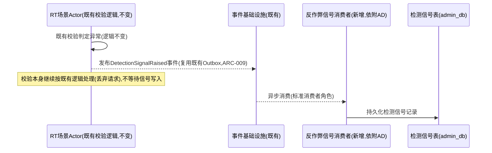
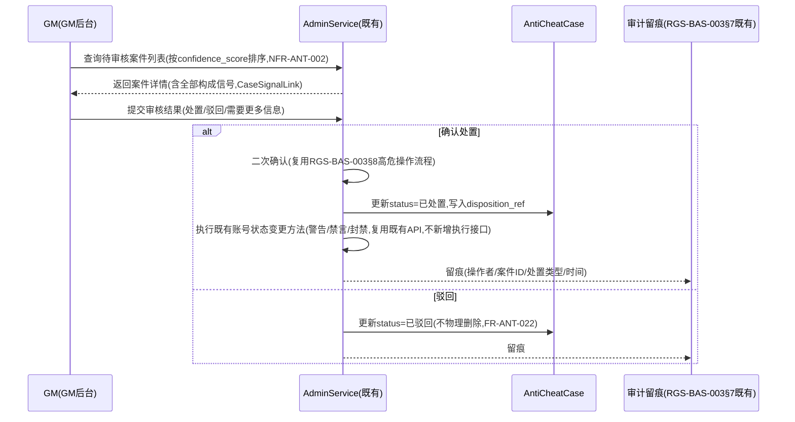

# 基本设计书（基本設計書 / Basic Design Document）

**反作弊与作弊治理体系 Anti-Cheat Detection & Case Management**

| 项目 | 内容 |
|---|---|
| 文档编号 | RGS-BAS-025 |
| 版本 | 0.3 |
| 父文档 | RGS-REQ-028 需求定义书（ARC-043） |
| 制定日 | 2026-08-17 |
| 最终更新日 | 2026-09-01 |
| 制定者 | 架构师 |
| 保密级别 | 内部限定（Internal Use Only） |
| 适用许可 | Apache-2.0（本仓库） |

---

## 修订历史（改訂履歴 / Revision History）

| 版本 | 修订日 | 修订者 | 审批者 | 修订内容 | 影响需求ID |
|---|---|---|---|---|---|
| 0.1 | 2026-08-17 | 架构师 | — | 初版制定。将RGS-REQ-028 ARC-043展开为检测信号采集组件设计、案件聚合数据模型、信号融合与智能层分析图接入方式、处置流程时序 | 全部 |
| 0.2 | 2026-08-17 | 架构师 | — | 自我审查发现：§7追溯性表遗漏AC-ANT-001〜005的章节映射（此前只有ARC/FR/NFR行），本次补齐 | §7 |
| 0.3 | 2026-09-01 | 架构师 (Mavis 接手 agent per DEC-008) | 架构师 (Mavis 接手 agent per DEC-008) | 落实"各BAS文档功能章节加log设计且区分debug/release级"总要求（per Ulysses 2026-09-01 15:52 JST 决策，4 拍板选项：全部 36 个BAS / 详尽版5列表 / 派worker并行 / BAS-004同步升级，参考 RGS-BAS-001 v1.5 §4.8.3 模板 + RGS-BAS-003 v0.3 样板 + RGS-BAS-004 v0.3 §4.2/§4.3/§4.4/§4.5/§5.1/§6.2）：§2.1/§2.2/§3.1/§3.2/§3.3/§3.4/§4.1/§4.2/§5.1/§5.2/§5.3 全部 11 个"本功能日志设计"小节新增（反作弊与作弊治理域特殊考虑全部落地：作弊检测命中/封禁/解封/申诉 release 必出 + 强制全采样满足合规审计、行为分析模型推理 debug-only 高频守护、设备指纹/IP/地理位置 release 必出按 §5.1 末段掩码、反作弊系统误报/漏报 warn! 强制全采样、举报处理 release 必出 + 强制全采样）；字段名前缀统一为 `anticheat.*`（与 RGS-BAS-002 `mnt.*` / RGS-BAS-003 `ops.*` / RGS-BAS-010 `pat.*` / RGS-BAS-011 `bio.*` 域前缀风格一致）；§7 追溯性新增 AC-ANT-006（debug-only 宏 release 完全剔除）与 AC-ANT-007（每功能 BAS 文档须含本功能 log 章节），与 RGS-BAS-001 v1.5 §4.8.3.4 / RGS-BAS-002 v0.4 §13 / RGS-BAS-003 v0.3 §13 / RGS-BAS-004 v0.3 §12 形成统一规范 | §2.1、§2.2、§3.1、§3.2、§3.3、§3.4、§4.1、§4.2、§5.1、§5.2、§5.3、§7 |

## 审批栏（承認欄 / Approval）

| 角色 | 姓名 | 审批日 | 备注 |
|---|---|---|---|
| 制定（起草） | 架构师 | 2026-08-17 | — |
| 评审（技术） | | | 信号采集是否真正异步且不阻塞RT/SY既有实时路径 |
| 评审（安全） | | | 处置流程是否严格收口至AdminService，不存在自动执行分支 |
| 审批（负责人） | | | 本文档的基准化 |

---

## 目录

1. [前言](#1-前言)
2. [检测信号采集设计](#2-检测信号采集设计)
3. [案件聚合数据模型](#3-案件聚合数据模型)
4. [信号融合与智能层接入](#4-信号融合与智能层接入)
5. [处置流程时序](#5-处置流程时序)
6. [标准化检查清单](#6-标准化检查清单)
7. [追溯性](#7-追溯性)

---

# 1. 前言

本文档细化RGS-REQ-028定义的ARC-043（反作弊信号分层与处置权收口原则），遵循ARC-018挂载原则——本文档定义的全部组件依附既有限界上下文（RT/SY提供信号来源，AD承载案件与处置）运行，**不新建**独立限界上下文、独立数据库或独立部署单元。

---

# 2. 检测信号采集设计

## 2.1 采集点（FR-ANT-001/002落地）

检测信号**不新增**判定逻辑，只是把RT/SY既有服务器权威校验的判定结果系统化记录：

| 采集点 | 既有校验位置 | 信号类型 |
|---|---|---|
| 移动速度校验 | RGS-BAS-001§4.2既有场景Actor移动模拟 | `SPEED_VIOLATION` |
| 碰撞穿透校验 | RGS-BAS-001§4.2既有碰撞检测 | `COLLISION_VIOLATION` |
| 输入频率/格式校验 | RGS-BAS-001§4.1既有输入缓冲・验证（FR-AD-004原有"丢弃并计数"逻辑） | `INPUT_ANOMALY` |
| 幂等键异常重放 | 复用ARC-009既有幂等去重表检测 | `REPLAY_ANOMALY` |

### 2.1 本功能日志设计

本节覆盖**4 类作弊检测信号的采集点触发**的运行时可观测字段——`SPEED_VIOLATION`／`COLLISION_VIOLATION`／`INPUT_ANOMALY`／`REPLAY_ANOMALY` 命中事件，及设备指纹/IP/地理位置按 RGS-BAS-004 v0.3 §5.1 末段掩码的脱敏落地。沿用 BAS-001 v1.5 §4.8.3 模板 + BAS-004 v0.3 §4.3/§4.4/§5.1/§6.2。**反作弊域特殊考虑**：作弊检测命中（外挂/加速器/异常数据）→ `error!` 强制全采样 + 完整证据链；设备指纹/IP/地理位置 → release 必出（按 §5.1 末段掩码）。

| 字段名（field） | 触发条件（trigger） | 频率估算（frequency） | 采样策略（sampling） | 脱敏与成本（redact & cost） |
|---|---|---|---|---|
| `anticheat.signal.raised.speed_violation` | 移动速度校验触发（`SPEED_VIOLATION`，per FR-ANT-001） | 稳态 0.5/s、峰值 50/s（开服瞬时热点） | release 必出（`error!` 强制全采样 + 完整证据链，per BAS-004 v0.3 §6.2） | 含`player_id`/`scene_id`/`raw_value`/`threshold_value`/`device_fp_hash`（按 §5.1 哈希化）；约 350B/条 |
| `anticheat.signal.raised.collision_violation` | 碰撞穿透校验触发（`COLLISION_VIOLATION`） | 稳态 0.2/s、峰值 20/s | release 必出（`error!` 强制全采样 + 完整证据链） | 含`player_id`/`scene_id`/`raw_value`/`threshold_value`/`device_fp_hash`；约 350B/条 |
| `anticheat.signal.raised.input_anomaly` | 输入频率/格式校验触发（`INPUT_ANOMALY`，per FR-AD-004 既有"丢弃并计数"） | 稳态 1/s、峰值 100/s（疑似外挂高频输入） | release 必出（`error!` 强制全采样 + 完整证据链） | 含`player_id`/`input_kind`/`raw_value`/`threshold_value`/`device_fp_hash`；约 400B/条 |
| `anticheat.signal.raised.replay_anomaly` | 幂等键异常重放触发（`REPLAY_ANOMALY`，复用 ARC-009 既有幂等去重表检测） | 稳态 0.1/s、峰值 10/s | release 必出（`error!` 强制全采样 + 完整证据链） | 含`player_id`/`idempotency_key_hash`（不写明文，per §5.1）/`replay_count`；约 300B/条 |
| `anticheat.signal.device_fingerprint.masked` | 设备指纹按 §5.1 哈希化完成（采集点记录 `device_fp` 字段时即哈希） | 与信号触发频次一致 | release 必出（100% 强制全采样） | 含`player_id`/`device_fp_hash`/`hash_algorithm`；约 200B/条 |
| `anticheat.signal.ip.masked` | IP 地址按 §5.1 末段掩码（`/24` IPv4、`/48` IPv6）处理 | 与信号触发频次一致 | release 必出（100% 强制全采样） | 含`player_id`/`ip_prefix`（末段掩码后）/`original_prefix_length`；约 200B/条 |
| `anticheat.signal.geo.coarse_only` | 精确坐标被替换为粗粒度区域（国家/大区） | 与信号触发频次一致 | release 必出（100% 强制全采样） | 含`player_id`/`region_code`（ISO 3166-1 alpha-2）/`original_precision`；约 200B/条 |
| `anticheat.signal.false_positive_flagged` | 命中后经 GM 审核判定为误报（per §5.3 撤销流程），信号保留但标记 `is_false_positive=true` | 偶发 | release 必出（`warn!` 强制全采样，per §6.2 反作弊系统误报/漏报监控） | 含`signal_id`/`player_id`/`signal_type`/`false_positive_classifier`；约 300B/条 |
| `anticheat.signal.false_negative_flagged` | 漏报标记（玩家作弊但未触发自动检测，由举报路径补回） | 偶发 | release 必出（`warn!` 强制全采样，per §6.2 漏报监控） | 含`player_id`/`signal_type`/`detection_source`（player_report/manual_review）；约 300B/条 |
| `anticheat.signal.debug.raw_validation_dump` | 既有校验原始判定结果完整 dump（per §2.1 表中 4 类校验的内部状态） | 偶发 | **debug-only**（`#[cfg(debug_assertions)]` 守护，release build 完全剔除） | 约 500B-2KB/条（release 剔除） |

**debug-only 守护要点**（落实 BAS-004 v0.3 §4.3 + §4.4 + §5.1）：
- `anticheat.signal.debug.raw_validation_dump` 在大场景下可能 2KB+ —— release build 完全剔除，避免 RUST_LOG=debug 误开时撑爆生产日志通道
- `anticheat.signal.raised.*` 全系列为 `error!` 级别（**非** `warn!`），因命中即代表作弊事实成立，触发即合规审计必须保留——满足反作弊域"作弊检测命中强制全采样 + 完整证据链"硬要求
- 设备指纹/IP/地理位置 release 必出，但**值已脱敏**（哈希化/末段掩码/粗粒度区域）——per RGS-BAS-004 v0.3 §5.1 末段掩码规则

## 2.2 异步写入设计（FR-ANT-003落地）



**设计要点**：信号的产生**不是**新增一次同步调用，而是RT既有校验分支在判定异常时**额外**发布一个事件（复用既有Outbox+事件基础设施，同FR-EV-001既定模式），信号消费与持久化完全异步、在RT主路径之外进行——即使信号消费者/`admin_db`不可用，RT的既有校验判定（丢弃异常请求）**不受影响**，仅信号记录本身可能丢失（可接受，同FR-ANT-003）。

### 2.2 本功能日志设计

本节覆盖**异步写入路径的运行时可观测字段**——RT 既有校验判定分支在判定异常时复用既有 Outbox+事件基础设施发布 `DetectionSignalRaised` 事件，信号消费与持久化完全异步、在 RT 主路径之外进行的全过程。**反作弊域特殊考虑**：反作弊系统误报/漏报 → `warn!` 强制全采样；消费者失败 → `error!` 强制全采样；消费者积压 → release 必出（FR-ANT-003 既定"信号丢失可接受"边界）。沿用 BAS-001 v1.5 §4.8.3 模板 + BAS-004 v0.3 §4.3/§4.4/§5.1/§6.2。

| 字段名（field） | 触发条件（trigger） | 频率估算（frequency） | 采样策略（sampling） | 脱敏与成本（redact & cost） |
|---|---|---|---|---|
| `anticheat.outbox.detection_signal_published` | RT 既有校验判定异常时复用既有 Outbox 发布 `DetectionSignalRaised` 事件（per ARC-009） | 稳态 2/s、峰值 200/s（与§2.1信号触发频次一致） | release 必出（`info!` 编译期常驻，per BAS-004 v0.3 §4.2） | 含`event_id`/`signal_type`/`player_id`/`scene_id`；约 280B/条 |
| `anticheat.outbox.dispatch_lag_ms` | Outbox 分发器延迟（从 `occurred_at` 到 `published_at`，per ARC-009/NFR-PE-008） | 稳态 2/s、峰值 200/s | release 必出（`info!` 强制全采样，**算法性能基准**，NFR-PE 监控需要） | 含`partition_key`/`lag_ms_bucket`（p50/p99）；约 200B/条 |
| `anticheat.consumer.signal_received` | 异步消费者接收 `DetectionSignalRaised` 事件（标准消费者角色） | 稳态 2/s、峰值 200/s | release 必出（`info!` 强制全采样） | 含`consumer_group`/`event_id`/`signal_id`；约 250B/条 |
| `anticheat.consumer.persisted` | 信号持久化至 `admin_db.DetectionSignal` 表成功 | 稳态 2/s、峰值 200/s | release 必出（`info!` 强制全采样） | 含`signal_id`/`persisted_at`/`latency_ms`；约 220B/条 |
| `anticheat.consumer.lag_ms` | 消费者处理延迟（从事件发布到持久化完成） | 稳态 2/s、峰值 200/s | release 必出（`info!` 强制全采样，**算法性能基准**，NFR-OP-008 排查 SLA 需要） | 含`partition_key`/`lag_ms_bucket`（p50/p99）；约 200B/条 |
| `anticheat.consumer.failed.retryable` | 消费者失败但可重试（瞬时 DB 不可用等） | 偶发 | release 必出（`warn!` 强制全采样，per §6.2） | 含`event_id`/`error_kind`/`retry_attempt`/`backoff_ms`；约 300B/条 |
| `anticheat.consumer.failed.exhausted` | 消费者重试耗尽，按 ARC-009 死信处理（per FR-ANT-003"信号丢失可接受"边界） | 极少 | release 必出（`error!` 强制全采样，per §6.2） | 含`event_id`/`signal_id`/`total_attempts`/`action_taken`（deadletter/drop）；约 350B/条 |
| `anticheat.consumer.failed.consumer_down` | 整个消费者组不可用（`admin_db` 长时间不可达） | 极少（依赖故障） | release 必出（`error!` 强制全采样，per §6.2） | 含`consumer_group`/`last_success_at`/`down_duration_ms`；约 300B/条 |
| `anticheat.consumer.dlq_published` | 死信事件投递至既有 DLQ（复用 ARC-009 死信处理） | 极少 | release 必出（`warn!` 强制全采样） | 含`event_id`/`dlq_topic`/`signal_type`；约 250B/条 |
| `anticheat.consumer.signal_lost` | 信号最终未持久化（消费者失败耗尽 + DLQ 不可用 + 满足 FR-ANT-003"信号丢失可接受"边界） | 极少 | release 必出（`warn!` 强制全采样，per §6.2 反作弊系统误报/漏报监控） | 含`event_id`/`signal_type`/`loss_reason`；约 280B/条 |
| `anticheat.consumer.realtime_path_impact_check` | 定期核对"消费者/`admin_db` 不可用时 RT/SY 既有实时路径无感知"（per AC-ANT-001） | 周期性（如每分钟） | release 必出（`info!` 强制全采样） | 含`check_window_seconds`/`consumer_state`/`rt_unaffected`；约 250B/条 |
| `anticheat.outbox.debug.consumer_group_assignment` | 消费者组 partition 分配详细（broker、leader、replica） | 0.1/h | **debug-only**（`#[cfg(debug_assertions)]` 守护） | 约 1-2KB/条（release 剔除） |
| `anticheat.outbox.debug.event_envelope_dump` | 完整事件 envelope（`payload` + `headers` + `trace_id`） | 偶发 | **debug-only**（`#[cfg(debug_assertions)]` 守护） | 约 200B-2KB/条（release 剔除） |

**debug-only 守护要点**（落实 BAS-004 v0.3 §4.3 + §4.4）：
- `anticheat.outbox.debug.event_envelope_dump` 在大 payload 下可能 2KB+ —— release build 完全剔除，避免 RUST_LOG=debug 误开时撑爆生产日志通道
- `anticheat.consumer.signal_lost` 是 **FR-ANT-003 既定"信号丢失可接受"边界**的运行时观察点——`warn!` 而非 `error!`，因丢失本身在设计容忍范围内，但**必须** release 必出供 SRE 监控丢失率（反作弊系统漏报追踪）
- `anticheat.consumer.failed.exhausted` / `anticheat.consumer.failed.consumer_down` 触发即代表反作弊信号链全断——`error!` 级别，release 常驻 + §6.2 强制全采样，便于 P0 告警链路立即捕获

---

# 3. 案件聚合数据模型

## 3.1 逻辑数据模型（依附admin_db，AD限界上下文）

`DetectionSignal`（对应FR-ANT-001）：

| 字段 | 说明 |
|---|---|
| `signal_id` | 唯一标识 |
| `player_id` | 复用既有玩家标识 |
| `signal_type` | 枚举：`SPEED_VIOLATION`／`COLLISION_VIOLATION`／`INPUT_ANOMALY`／`REPLAY_ANOMALY`／`PLAYER_REPORT`（举报类信号，见3.3） |
| `occurred_at` | 发生时间 |
| `context_ref` | 引用所属场景/对局标识 |
| `raw_value` / `threshold_value` | 原始数值与触发阈值，供审核时判断严重程度 |
| `case_id` | 外键，指向所属`AntiCheatCase`（聚合前为空，聚合后回填） |

`AntiCheatCase`（对应FR-ANT-010）：

| 字段 | 说明 |
|---|---|
| `case_id` | 唯一标识 |
| `player_id` | 案件所属玩家 |
| `status` | 枚举：`待审核`／`已处置`／`已驳回` |
| `confidence_score` | 置信度评估结果（简单规则或智能层建议产出，见§4） |
| `signal_count` | 构成本案件的信号数量（含信号与举报） |
| `created_at` / `last_signal_at` | 案件创建时间与最近一次纳入信号的时间 |
| `disposition_ref` | 外键，指向处置记录（§5），未处置为空 |

`CaseSignalLink`（多对多关联表，对应FR-ANT-013）：`case_id` + `signal_id`，记录案件与构成信号的完整引用关系，供追溯。

### 3.1 本功能日志设计

本节覆盖**3 张表（`DetectionSignal`／`AntiCheatCase`／`CaseSignalLink`）实例化与查询**的运行时可观测字段——INSERT/UPDATE/SELECT 关键操作、案件状态变迁、信号关联追溯。沿用 BAS-001 v1.5 §4.8.3 模板 + BAS-004 v0.3 §4.3/§4.4/§5.1/§6.2。**反作弊域特殊考虑**：3 张表均为反作弊核心持久化层，状态变迁 → release 必出 + 强制全采样（合规审计必须能回放案件生命周期）；高频 INSERT 路径 → debug-only 守护。

| 字段名（field） | 触发条件（trigger） | 频率估算（frequency） | 采样策略（sampling） | 脱敏与成本（redact & cost） |
|---|---|---|---|---|
| `anticheat.table.detection_signal.inserted` | `DetectionSignal` 表 INSERT 成功（per §2.2 异步消费者持久化） | 稳态 2/s、峰值 200/s | release 必出（`info!` 强制全采样） | 含`signal_id`/`player_id`/`signal_type`/`occurred_at`；约 250B/条 |
| `anticheat.table.detection_signal.queried_by_player` | 按 `player_id` 查询 `DetectionSignal` 历史（per FR-ANT-014 惯犯历史） | 稳态 0.5/s、峰值 10/s | release 必出（`info!` 强制全采样） | 含`player_id`/`queried_at`/`result_count`；约 200B/条 |
| `anticheat.table.anticheat_case.created` | 新建 `AntiCheatCase` 案件（per FR-ANT-010 聚合创建） | 稳态 0.1/s、峰值 5/s | release 必出（`info!` 强制全采样，**案件状态变迁关键事件**，合规审计必须） | 含`case_id`/`player_id`/`initial_signal_count`/`created_at`；约 280B/条 |
| `anticheat.table.anticheat_case.signal_appended` | 既有案件追加 `CaseSignalLink`（per §3.4 聚合逻辑） | 稳态 0.5/s、峰值 20/s | release 必出（`info!` 强制全采样） | 含`case_id`/`appended_signal_id`/`signal_count_after`/`triggered_confidence_recalc`；约 300B/条 |
| `anticheat.table.anticheat_case.status_transition` | 案件状态变迁（`待审核`→`已处置`／`已驳回`，per FR-ANT-021/022） | 偶发（GM 审核时） | release 必出（`info!` 强制全采样，**案件状态变迁关键事件**，合规审计必须） | 含`case_id`/`from_status`/`to_status`/`operator_id`/`transition_at`；约 300B/条 |
| `anticheat.table.anticheat_case.confidence_updated` | 案件 `confidence_score` 重新计算（per §4.1/§4.2 置信度评估） | 稳态 0.5/s、峰值 20/s | release 必出（`info!` 强制全采样） | 含`case_id`/`old_confidence`/`new_confidence`/`calc_source`（simple_rule/anticheat_fusion）；约 280B/条 |
| `anticheat.table.anticheat_case.disposition_linked` | 案件关联 `disposition_ref`（per §5.1 处置流程） | 偶发 | release 必出（`info!` 强制全采样） | 含`case_id`/`disposition_ref`/`linked_at`；约 250B/条 |
| `anticheat.table.anticheat_case.queried_for_gm` | GM 后台按 `confidence_score` 排序查询待审核案件（per NFR-ANT-002） | 稳态 0.1/s、峰值 5/s | release 必出（`info!` 强制全采样） | 含`gm_id`/`queried_at`/`result_count`；约 200B/条 |
| `anticheat.table.case_signal_link.written` | `CaseSignalLink` 关联写入（per FR-ANT-013） | 稳态 2/s、峰值 100/s | release 必出（`info!` 强制全采样） | 含`case_id`/`signal_id`/`linked_at`；约 250B/条 |
| `anticheat.table.case_signal_link.bidirectional_query` | `CaseSignalLink` 双向查询（某案件包含哪些信号 / 某信号属于哪个案件） | 稳态 1/s、峰值 50/s | release 必出（`info!` 强制全采样） | 含`query_direction`/`case_id`（或`signal_id`）/`result_count`；约 200B/条 |
| `anticheat.table.anticheat_case.debug.full_row_dump` | 案件完整行 dump（含全部字段，含 `confidence_score` / `signal_count` / 状态历史） | 偶发 | **debug-only**（`#[cfg(debug_assertions)]` 守护，release build 完全剔除） | 约 500B-1KB/条（release 剔除） |
| `anticheat.table.debug.schema_dump` | 3 张表完整 schema dump（含约束、索引、分区键） | 0.1/h | **debug-only**（`#[cfg(debug_assertions)]` 守护） | 约 1-3KB/条（release 剔除） |

**debug-only 守护要点**（落实 BAS-004 v0.3 §4.3 + §4.4）：
- `anticheat.table.anticheat_case.debug.full_row_dump` 在聚合大量信号时可能 1KB+ —— release build 完全剔除，避免 RUST_LOG=debug 误开时撑爆生产日志通道
- `anticheat.table.anticheat_case.status_transition` 是**案件生命周期合规审计的关键事件**——必须 release 必出 + §6.2 强制全采样，便于事后还原"谁在何时把案件从 A 状态推到 B 状态"
- `anticheat.table.case_signal_link.bidirectional_query` 是**反作弊系统误报/漏报排查的核心抓手**——release 必出便于 SRE 按 `case_id` 维度快速定位"该案件由哪些信号聚合而成"

## 3.2 物理落位与约束（复用RGS-BAS-007既定标准）

- 三张表均依附既有`admin_db`（AD限界上下文），不新建数据库
- `DetectionSignal(player_id, occurred_at)`复合索引，支撑§3.3聚合窗口查询
- `AntiCheatCase(player_id, status)`复合索引，支撑FR-ANT-014惯犯历史查询与FR-ANT-010按玩家聚合
- `CaseSignalLink`两列复合主键，双向索引（支持"某案件包含哪些信号"与"某信号属于哪个案件"两个查询方向）
- 分区策略复用RGS-BAS-007§4既定按时间范围分区（`DetectionSignal`按`occurred_at`月度分区），保留期3年（NFR-ANT-003）后整体`DETACH`清理，同既有幂等去重表清理模式（G-005）

### 3.2 本功能日志设计

本节覆盖**物理落位与约束的运行时可观测字段**——3 张表的复合索引/分区策略/保留期清理的执行观察点。沿用 BAS-001 v1.5 §4.8.3 模板 + BAS-004 v0.3 §4.3/§4.4/§5.1/§6.2。**反作弊域特殊考虑**：分区迁移/保留期清理 → release 必出（合规审计边界，NFR-ANT-003 既定 3 年保留期不可被绕过）；索引命中 → debug-only 守护（高频查询路径，避免撑爆日志通道）。

| 字段名（field） | 触发条件（trigger） | 频率估算（frequency） | 采样策略（sampling） | 脱敏与成本（redact & cost） |
|---|---|---|---|---|
| `anticheat.index.composite.detection_signal_used` | `DetectionSignal(player_id, occurred_at)` 复合索引命中（per §3.2 索引设计，支撑 §3.3 聚合窗口查询） | 稳态 2/s、峰值 200/s | **debug-only**（`#[cfg(debug_assertions)]` 守护，高频查询路径） | 约 200B/条（release 剔除） |
| `anticheat.index.composite.anticheat_case_used` | `AntiCheatCase(player_id, status)` 复合索引命中（支撑 FR-ANT-014/010） | 稳态 1/s、峰值 50/s | **debug-only**（`#[cfg(debug_assertions)]` 守护） | 约 200B/条（release 剔除） |
| `anticheat.index.bidirectional_case_signal_link_used` | `CaseSignalLink` 双向索引命中（per §3.2） | 稳态 2/s、峰值 100/s | **debug-only**（`#[cfg(debug_assertions)]` 守护） | 约 200B/条（release 剔除） |
| `anticheat.partition.monthly.created` | `DetectionSignal` 按 `occurred_at` 月度分区新建（per §3.2 分区策略） | 周期性（每月 1 次） | release 必出（`info!` 强制全采样） | 含`partition_name`/`range_start`/`range_end`；约 250B/条 |
| `anticheat.partition.monthly.detached` | 超过 3 年保留期（NFR-ANT-003）的分区 `DETACH` 清理 | 周期性（每月） | release 必出（`info!` 强制全采样，**合规审计边界**，3 年保留期不可绕过） | 含`detached_partition_name`/`age_months`/`detached_at`；约 280B/条 |
| `anticheat.partition.detached.failed` | 分区 DETACH 失败（DB 瞬时不可用） | 极少 | release 必出（`warn!` 强制全采样，per §6.2） | 含`partition_name`/`error_kind`/`retry_scheduled`；约 280B/条 |
| `anticheat.retention.expired_signal_count` | 即将到期的 `DetectionSignal` 数量（清理前预告） | 周期性（清理前） | release 必出（`info!` 强制全采样） | 含`expiry_window_days`/`expired_count`；约 200B/条 |
| `anticheat.retention.cleanup_audit` | 清理完成后审计记录（被清理的 signal_id 范围 + 数量） | 周期性（清理后） | release 必出（`info!` 强制全采样，**合规审计边界**） | 含`cleanup_run_id`/`detached_partition`/`signal_count_cleaned`；约 280B/条 |
| `anticheat.index.debug.execution_plan_dump` | 完整 SQL `EXPLAIN` 执行计划 dump | 偶发 | **debug-only**（`#[cfg(debug_assertions)]` 守护） | 约 1-3KB/条（release 剔除） |
| `anticheat.index.debug.ddl_dump` | 3 张表完整 DDL dump（含约束/索引/分区键） | 0.1/h | **debug-only**（`#[cfg(debug_assertions)]` 守护） | 约 2-5KB/条（release 剔除） |

**debug-only 守护要点**（落实 BAS-004 v0.3 §4.3 + §4.4）：
- `anticheat.index.*_used` 系列为高频查询路径的索引命中事件——debug-only 守护，release 完全剔除，避免 RUST_LOG=info 时撑爆生产日志通道
- `anticheat.partition.monthly.detached` 是 **NFR-ANT-003 既定 3 年保留期的物理执行点**——release 必出 + §6.2 强制全采样，确保合规审计可还原"何时清理了哪个分区的数据"
- `anticheat.index.debug.execution_plan_dump` 在复杂查询下可能 3KB+ —— release build 完全剔除

## 3.3 举报作为信号来源（FR-ANT-004落地）

`PlayerReport`（RGS-BAS-014既有表，举报提交）在处置类型为"作弊"时，**必须**同步写入一条`signal_type=PLAYER_REPORT`的`DetectionSignal`记录，`context_ref`指向原始举报记录——本文档**不重新定义**举报提交流程，仅在举报写入完成后，通过既有事件机制（`PlayerReportSubmitted`，若尚不存在则由RGS-BAS-014补充发布）触发本文档的信号采集消费者，转化为统一的`DetectionSignal`格式，与自动检测信号进入同一聚合管道。

### 3.3 本功能日志设计

本节覆盖**举报作为信号来源**（per FR-ANT-004）的运行时可观测字段——`PlayerReport` 在 `report_type=cheating` 时同步写入 `signal_type=PLAYER_REPORT` 的 `DetectionSignal`，并通过 `PlayerReportSubmitted` 事件触发本文档信号采集消费者。**反作弊域特殊考虑**：举报处理 → release 必出 + 强制全采样（合规审计必须能回放举报-信号-案件链）；举报者信誉度（per RGS-BAS-014 §5.1.1）→ release 必出（举报权重可追溯）。沿用 BAS-001 v1.5 §4.8.3 模板 + BAS-004 v0.3 §4.3/§4.4/§5.1/§6.2。

| 字段名（field） | 触发条件（trigger） | 频率估算（frequency） | 采样策略（sampling） | 脱敏与成本（redact & cost） |
|---|---|---|---|---|
| `anticheat.report.cheating_received` | 接收 `PlayerReport`，`report_type=cheating`（per FR-ANT-004） | 稳态 0.5/s、峰值 30/s | release 必出（`info!` 强制全采样，**举报处理合规审计**） | 含`report_id`/`reporter_id`/`target_id`/`context_ref`/`received_at`；约 280B/条 |
| `anticheat.report.cheating_signal_published` | 转化为 `signal_type=PLAYER_REPORT` 的 `DetectionSignal` 记录（per §3.3） | 稳态 0.5/s、峰值 30/s | release 必出（`info!` 强制全采样） | 含`signal_id`/`report_id`/`player_id`（target）/`published_at`；约 280B/条 |
| `anticheat.report.reporter_reputation_weight_applied` | 举报者信誉度权重（per RGS-BAS-014 §5.1.1 `ReporterReputation.weight_multiplier`）应用于本条举报的 `signal_weight` | 稳态 0.5/s、峰值 30/s | release 必出（`info!` 强制全采样） | 含`reporter_id`/`weight_multiplier`/`effective_signal_weight`；约 250B/条 |
| `anticheat.report.dedup_key_checked` | `PlayerReport.dedup_key` 唯一索引命中检查（per RGS-BAS-014 §5.1 dedup 字段，FR-GSM-033） | 稳态 0.5/s、峰值 30/s | release 必出（`info!` 强制全采样） | 含`reporter_id`/`target_id`/`dedup_key_hash`/`is_duplicate`；约 250B/条 |
| `anticheat.report.dedup_duplicate_dropped` | dedup 命中，重复举报在 DB 层直接被唯一索引拦截 | 偶发 | release 必出（`info!` 强制全采样） | 含`reporter_id`/`target_id`/`dedup_key_hash`；约 250B/条 |
| `anticheat.report.event_missing` | 预期 `PlayerReportSubmitted` 事件未发布（若 RGS-BAS-014 尚未补充发布该事件） | 极少 | release 必出（`warn!` 强制全采样，per §6.2） | 含`report_id`/`player_id`/`last_event_check_at`；约 250B/条 |
| `anticheat.report.conversion_failed` | 举报转 `DetectionSignal` 失败（DB 写入异常） | 极少 | release 必出（`error!` 强制全采样，per §6.2） | 含`report_id`/`player_id`/`error_kind`；约 280B/条 |
| `anticheat.report.aggregated_into_case` | 举报信号（`PLAYER_REPORT`）被聚合入既有 `AntiCheatCase`（per §3.4 聚合逻辑，对应 AC-ANT-005） | 偶发 | release 必出（`info!` 强制全采样） | 含`signal_id`/`case_id`/`case_signal_count_after`；约 280B/条 |
| `anticheat.report.debug.full_report_payload` | 完整 `PlayerReport` payload dump（含举报内容/上下文引用） | 偶发 | **debug-only**（`#[cfg(debug_assertions)]` 守护，举报内容可能含敏感信息） | 约 500B-2KB/条（release 剔除） |

**debug-only 守护要点**（落实 BAS-004 v0.3 §4.3 + §4.4 + §5.1）：
- `anticheat.report.debug.full_report_payload` 举报内容可能含玩家对其他玩家的描述/聊天记录引用——`#[cfg(debug_assertions)]` 守护，release 完全剔除，避免隐私泄漏
- `anticheat.report.reporter_reputation_weight_applied` 是**举报权重可追溯的关键事件**——release 必出 + §6.2 强制全采样，便于合规审计"这条信号最终生效权重是多少、由哪个举报者贡献"
- `anticheat.report.conversion_failed` 触发即代表举报-信号链断裂——`error!` 级别，release 常驻 + §6.2 强制全采样，便于 P0 告警链路立即捕获

## 3.4 案件聚合逻辑（FR-ANT-010落地）

```
新DetectionSignal写入
  → 查询该player_id在既定时间窗口内(TBD-ANT-001)是否已有status=待审核的AntiCheatCase
  → 若有: 追加CaseSignalLink,更新signal_count/last_signal_at,触发§4置信度重新评估
  → 若无: 检查是否达到聚合阈值(TBD-ANT-001,如同类信号在窗口内累积N次,或1次高严重度信号即触发)
      → 达到: 创建新AntiCheatCase,关联全部窗口内相关信号
      → 未达到: 信号保持未关联状态,等待后续信号或超时归档(不生成案件)
```

### 3.4 本功能日志设计

本节覆盖**案件聚合逻辑**（per FR-ANT-010）的运行时可观测字段——新 `DetectionSignal` 写入后按 `player_id` + 聚合窗口（TBD-ANT-001）查询既有 `AntiCheatCase`，命中则追加 `CaseSignalLink`、未命中则按阈值判定是否新建案件的全过程。**反作弊域特殊考虑**：案件新建/聚合/置信度重算 → release 必出 + 强制全采样（合规审计必须能回放案件由哪些信号、何时聚合而成）；高频窗口查询/状态查询 → debug-only 守护。沿用 BAS-001 v1.5 §4.8.3 模板 + BAS-004 v0.3 §4.3/§4.4/§5.1/§6.2。

| 字段名（field） | 触发条件（trigger） | 频率估算（frequency） | 采样策略（sampling） | 脱敏与成本（redact & cost） |
|---|---|---|---|---|
| `anticheat.aggregation.case_lookup_executed` | 按 `player_id` + 聚合窗口查询既有 `status=待审核` 的 `AntiCheatCase`（per §3.4 算法步骤 1） | 稳态 2/s、峰值 200/s | **debug-only**（`#[cfg(debug_assertions)]` 守护，高频查询路径） | 约 200B/条（release 剔除） |
| `anticheat.aggregation.case_appended` | 命中既有案件，追加 `CaseSignalLink` 并更新 `signal_count`/`last_signal_at`（per §3.4 算法步骤 2 + AC-ANT-002） | 稳态 0.5/s、峰值 20/s | release 必出（`info!` 强制全采样，**案件状态变迁关键事件**） | 含`case_id`/`appended_signal_id`/`signal_count_after`/`last_signal_at_after`；约 300B/条 |
| `anticheat.aggregation.confidence_recalculation_triggered` | 信号追加后触发 §4 置信度重新评估（per §3.4 算法步骤 2 末段） | 稳态 0.5/s、峰值 20/s | release 必出（`info!` 强制全采样） | 含`case_id`/`trigger_source`/`old_confidence`/`new_confidence`；约 280B/条 |
| `anticheat.aggregation.threshold_evaluated` | 按 TBD-ANT-001 聚合阈值评估是否新建案件（per §3.4 算法步骤 3） | 稳态 2/s、峰值 200/s | **debug-only**（`#[cfg(debug_assertions)]` 守护） | 约 200B/条（release 剔除） |
| `anticheat.aggregation.threshold_met.case_created` | 达到聚合阈值，新建 `AntiCheatCase`（per §3.4 算法步骤 3 + FR-ANT-010 + AC-ANT-002） | 稳态 0.1/s、峰值 5/s | release 必出（`info!` 强制全采样，**案件生命周期起点**，合规审计必须） | 含`case_id`/`player_id`/`initial_signal_count`/`threshold_kind`（count_based/severity_based）/`created_at`；约 350B/条 |
| `anticheat.aggregation.threshold_not_met.signal_orphan` | 未达到聚合阈值，信号保持未关联状态等待后续信号或超时归档（per §3.4 算法步骤 3 末段） | 稳态 1/s、峰值 50/s | release 必出（`info!` 强制全采样，**反作弊漏报追踪**） | 含`signal_id`/`player_id`/`signal_type`/`orphan_since`；约 280B/条 |
| `anticheat.aggregation.signal_archived.timeout` | 孤儿信号超时归档（per §3.4 算法步骤 3 末段） | 偶发（周期性清理） | release 必出（`info!` 强制全采样） | 含`signal_id`/`player_id`/`orphan_duration_seconds`；约 250B/条 |
| `anticheat.aggregation.window_unmatched.high_severity` | 高严重度信号（如 1 次极高 `raw_value`）未匹配到聚合窗口，触发"1 次即建案"分支（per §3.4 算法步骤 3 旁注） | 极少 | release 必出（`warn!` 强制全采样，per §6.2） | 含`signal_id`/`player_id`/`raw_value`/`threshold_value`；约 280B/条 |
| `anticheat.aggregation.cross_type_combination` | 多信号类型组合（`SPEED_VIOLATION`+`REPLAY_ANOMALY`+`PLAYER_REPORT` 等）触发，进入 §4.2 智能层接入路径 | 偶发 | release 必出（`info!` 强制全采样） | 含`case_id`/`signal_type_combination`/`combined_count`；约 280B/条 |
| `anticheat.aggregation.repeated_offender_flagged` | 命中 FR-ANT-014 惯犯历史查询（`AntiCheatCase(player_id, status)` 复合索引命中既有历史案件） | 偶发 | release 必出（`info!` 强制全采样） | 含`player_id`/`historical_case_count`/`latest_case_id`；约 250B/条 |
| `anticheat.aggregation.debug.full_window_dump` | 聚合窗口内全部相关信号完整 dump（含 `raw_value`/`threshold_value`/`context_ref`） | 偶发 | **debug-only**（`#[cfg(debug_assertions)]` 守护，敏感数据） | 约 1-5KB/条（release 剔除） |

**debug-only 守护要点**（落实 BAS-004 v0.3 §4.3 + §4.4 + §5.1）：
- `anticheat.aggregation.case_lookup_executed` / `anticheat.aggregation.threshold_evaluated` 是聚合逻辑的高频内部观察点——debug-only 守护，release 完全剔除，避免 RUST_LOG=info 时撑爆生产日志通道
- `anticheat.aggregation.threshold_met.case_created` 是**案件生命周期的起点事件**——release 必出 + §6.2 强制全采样，确保合规审计可还原"案件何时因何信号阈值触发而建立"
- `anticheat.aggregation.debug.full_window_dump` 可能含 5KB+ 完整证据链（per §6.2 反作弊域"完整证据链"硬要求）——release 完全剔除，仅在合规调查时手动开启

---

# 4. 信号融合与智能层接入

## 4.1 简单规则判定（FR-ANT-012落地）

低复杂度场景（同一`player_id`单一`signal_type`短时间内重复触发超过既定阈值）由§3.4聚合逻辑内嵌的规则直接判定，**不经过**智能层：`confidence_score`按信号数量与严重度的固定加权公式计算（具体系数TBD-ANT-001），无需LangGraph图。

### 4.1 本功能日志设计

本节覆盖**简单规则判定**（per FR-ANT-012）的运行时可观测字段——同一 `player_id` + 单一 `signal_type` 短时间内重复触发超过既定阈值时，由 §3.4 聚合逻辑内嵌的固定加权公式计算 `confidence_score`（**不经过**智能层）的全过程。沿用 BAS-001 v1.5 §4.8.3 模板 + BAS-004 v0.3 §4.3/§4.4/§5.1/§6.2。**反作弊域特殊考虑**：置信度计算 → release 必出 + 强制全采样（合规审计必须能回放"该案件 confidence 是多少、由哪些信号加权得出"）；权重系数（具体 TBD-ANT-001）→ debug-only 守护（高频内部参数）；阈值/严重度等级 → release 必出（GM 审核依据）。

| 字段名（field） | 触发条件（trigger） | 频率估算（frequency） | 采样策略（sampling） | 脱敏与成本（redact & cost） |
|---|---|---|---|---|
| `anticheat.rule.evaluation_triggered` | 简单规则判定入口触发（§3.4 聚合逻辑中判定进入简单规则分支） | 稳态 0.5/s、峰值 20/s | release 必出（`info!` 强制全采样） | 含`case_id`/`signal_type`/`rule_version`；约 250B/条 |
| `anticheat.rule.weight_coefficients_applied` | TBD-ANT-001 既定加权公式系数应用于本次计算 | 稳态 0.5/s、峰值 20/s | **debug-only**（`#[cfg(debug_assertions)]` 守护，高频内部参数） | 约 200B/条（release 剔除） |
| `anticheat.rule.signal_severity_classified` | 每条信号按 `raw_value`/`threshold_value` 比值分类严重度（低/中/高/极高） | 稳态 0.5/s、峰值 20/s | **debug-only**（`#[cfg(debug_assertions)]` 守护） | 约 250B/条（release 剔除） |
| `anticheat.rule.threshold_check_passed` | 信号数量/严重度组合达到规则阈值（per FR-ANT-012） | 稳态 0.5/s、峰值 20/s | release 必出（`info!` 强制全采样） | 含`case_id`/`signal_count`/`max_severity`/`threshold_kind`；约 280B/条 |
| `anticheat.rule.confidence_calculated` | `confidence_score` 按固定加权公式计算完成（per FR-ANT-012，per §4.1 核心方法） | 稳态 0.5/s、峰值 20/s | release 必出（`info!` 强制全采样，**置信度合规审计**） | 含`case_id`/`confidence`/`signal_count`/`severity_weight_sum`；约 280B/条 |
| `anticheat.rule.threshold_breached` | 严重度等级达到"极高"（1 次即建案分支触发，per §3.4 算法步骤 3 旁注） | 极少 | release 必出（`warn!` 强制全采样，per §6.2） | 含`case_id`/`signal_id`/`severity`/`raw_value`/`threshold_value`；约 280B/条 |
| `anticheat.rule.evaluation_completed` | 简单规则判定全流程完成，`confidence_score` 已写入 `AntiCheatCase.confidence_score` 字段 | 稳态 0.5/s、峰值 20/s | release 必出（`info!` 强制全采样） | 含`case_id`/`final_confidence`/`duration_ms`；约 250B/条 |
| `anticheat.rule.evaluation_skipped` | 因进入智能层分析图路径（per §4.2 触发条件）而跳过简单规则分支 | 偶发 | release 必出（`info!` 强制全采样） | 含`case_id`/`skip_reason`（cross_type_combination）；约 250B/条 |
| `anticheat.rule.debug.formula_dump` | 完整加权公式 dump（含全部系数与中间结果） | 偶发 | **debug-only**（`#[cfg(debug_assertions)]` 守护） | 约 500B-1KB/条（release 剔除） |
| `anticheat.rule.debug.signal_severity_breakdown` | 全部信号严重度分级明细 dump | 偶发 | **debug-only**（`#[cfg(debug_assertions)]` 守护） | 约 500B-2KB/条（release 剔除） |

**debug-only 守护要点**（落实 BAS-004 v0.3 §4.3 + §4.4）：
- `anticheat.rule.weight_coefficients_applied` / `anticheat.rule.signal_severity_classified` 是简单规则的内部参数——debug-only 守护，release 完全剔除，避免 RUST_LOG=info 时撑爆生产日志通道
- `anticheat.rule.confidence_calculated` 是**置信度合规审计的关键事件**——release 必出 + §6.2 强制全采样，确保事后可还原"该案件的 confidence_score 是按什么公式由哪些信号加权得出"
- `anticheat.rule.debug.formula_dump` 在加权公式复杂时可能 1KB+ —— release build 完全剔除

## 4.2 智能层分析图接入（FR-ANT-011落地）

多信号类型组合（如同一玩家同时有`SPEED_VIOLATION`+`REPLAY_ANOMALY`+`PLAYER_REPORT`）的置信度评估，接入RGS-BAS-011既定的智能层分析图生命周期治理（§5A）：

| 治理步骤 | 落地方式 |
|---|---|
| 注册 | 新分析图`graph_id=anticheat-fusion`，`feature_domain=ANT`，遵循`AnalysisGraphDefinition`既定模型（RGS-BAS-011§5A.1），初始`status=草稿` |
| 评审（增） | 须过ARC-014/026同等评审（含OLU核算，新增分析图场景须在附件D§5.4/§5.2追加申领），评审通过前**不得**订阅生产事件流，`status`保持`草稿` |
| 运行 | 生效后，`anticheat-fusion`图以§3.1的`DetectionSignal`聚合窗口内容作为输入，输出`confidence_score`与`suggested_action`（映射至AntiCheatCase的处置建议，如"建议标记为高优先级待审"），**不得**直接写`AntiCheatCase.status` |
| 确定性闸门 | `anticheat-fusion`图的全部输出须经既有确定性闸门（RGS-BAS-011§7A），`suggested_action`枚举白名单**仅**含"标记高优先级"／"标记低优先级"／"建议驳回"三类只读性质的分类建议，**不含**任何直接执行封禁/禁言的动作类型——执行动作**只能**来自§5 GM人工审核后的显式操作 |

> **判定原则**：智能层在本场景中的角色是"排序/分诊"而非"判决"——它帮助GM优先审核高置信度案件，但**不能**替代审核本身，这与ARC-030"闸门必须部署于消费者侧"原则完全一致：`AntiCheatCase.status`的写入权限**不**授予智能层服务账号（同RGS-BAS-011§4.1既有IAM/NetworkPolicy双锁模式）。

### 4.2 本功能日志设计

本节覆盖**`anticheat-fusion` 智能层分析图接入**（per FR-ANT-011）的运行时可观测字段——多信号类型组合的置信度评估经 `AnalysisGraphDefinition` 既定模型（per RGS-BAS-011 §5A.1）注册、ARC-014/026 评审、生产事件流订阅、确定性闸门校验全过程。**反作弊域特殊考虑**：分析图推理（LangGraph 节点执行）→ debug-only 守护（高频，性能敏感）；闸门违规/越权写入 → `error!` 强制全采样（P0 安全事件）；置信度输出 → release 必出（GM 审核依据）。沿用 BAS-001 v1.5 §4.8.3 模板 + BAS-004 v0.3 §4.3/§4.4/§5.1/§6.2。

| 字段名（field） | 触发条件（trigger） | 频率估算（frequency） | 采样策略（sampling） | 脱敏与成本（redact & cost） |
|---|---|---|---|---|
| `anticheat.fusion.graph_registered` | `anticheat-fusion` 分析图在 `AnalysisGraphDefinition` 表注册（`status=草稿`，per RGS-BAS-011 §5A.1 + §4.2 注册步骤） | 极低（一次性或新版本发布时） | release 必出（`info!` 强制全采样） | 含`graph_id`/`feature_domain=ANT`/`version`/`status`/`registered_at`；约 300B/条 |
| `anticheat.fusion.review_status_pending` | `anticheat-fusion` 评审未通过前 `status` 保持 `草稿` 且未订阅生产事件流（per §4.2 评审步骤 + ARC-014/026） | 偶发（评审期间） | release 必出（`info!` 强制全采样） | 含`graph_id`/`version`/`review_status`；约 250B/条 |
| `anticheat.fusion.graph_activated.production` | `status=生效`，开始订阅 `DetectionSignal` 聚合窗口事件流 | 极低 | release 必出（`info!` 强制全采样） | 含`graph_id`/`version`/`activated_at`/`subscribed_topics`；约 350B/条 |
| `anticheat.fusion.decision_triggered` | `anticheat-fusion` 图入口接收 `DetectionSignal` 聚合窗口事件（一个聚合窗口 = 一次决策流） | 取决于信号触发频次，稳态 0.1/s、峰值 5/s | release 必出（`info!` 强制全采样） | 含`graph_id`/`graph_version`/`case_id`/`triggered_at`；约 280B/条 |
| `anticheat.fusion.decision_path_selected` | 图的边条件判定完成，确定本次决策的节点路径（per NFR-NEURO-003 可解释性要求） | 同上 | release 必出（`info!` 强制全采样，**核心可解释性事件**） | 含`graph_id`/`case_id`/`node_path`/`branch_reason`；约 350B/条 |
| `anticheat.fusion.confidence_published` | 图的最终输出 `confidence_score` 写入 `AntiCheatCase.confidence_score`（per §4.2 运行步骤） | 同上 | release 必出（`info!` 强制全采样，**置信度合规审计**） | 含`graph_id`/`case_id`/`confidence`/`source=anticheat_fusion`；约 300B/条 |
| `anticheat.fusion.suggested_action_emitted` | 图的 `suggested_action` 输出（如"建议标记为高优先级待审"，per §4.2 运行步骤） | 同上 | release 必出（`info!` 强制全采样，**仅分类/排序类白名单**） | 含`graph_id`/`case_id`/`suggested_action`/`action_kind`（mark_high/mark_low/suggest_dismiss）；约 300B/条 |
| `anticheat.fusion.unauthorized_write_attempt.blocked` | 智能层服务账号尝试写入 `AntiCheatCase.status`（违反 §4.2 闸门原则，IAM 或 NetworkPolicy 拦截其一即触发，per RGS-BAS-011 §4.1 双锁模式） | 极少（极严重安全事件） | release 必出（`error!` 强制全采样，per §6.2 P0 告警） | 含`attempted_target`/`blocked_layer`（iam/netpol）/`attempted_by`；约 400B/条 |
| `anticheat.fusion.gate_violation.non_whitelisted_action` | `suggested_action` 出现非白名单动作（违反 §4.2 闸门：白名单**仅**含"标记高优先级"／"标记低优先级"／"建议驳回"三类只读建议） | 极少（极严重安全事件） | release 必出（`error!` 强制全采样，per §6.2 P0 告警） | 含`graph_id`/`attempted_action`/`expected_whitelist`；约 400B/条 |
| `anticheat.fusion.gate_violation.execution_class_action` | `suggested_action` 出现执行类动作（封禁/禁言等违反 §4.2 闸门 + ARC-030"闸门必须部署于消费者侧"原则） | 极少（极严重安全事件） | release 必出（`error!` 强制全采样，per §6.2 P0 告警） | 含`graph_id`/`attempted_action`/`action_class`（ban/mute/warn/...）；约 400B/条 |
| `anticheat.fusion.decision_timeout` | 图决策超过 NFR-NEURO-001 推理时延上限 | 极少 | release 必出（`error!` 强制全采样，per §6.2） | 含`graph_id`/`case_id`/`elapsed_ms`/`timeout_ms`/`last_completed_node`；约 400B/条 |
| `anticheat.fusion.decision_failed.unexpected` | 图执行崩溃/节点函数异常/内存不足 | 极少 | release 必出（`error!` 强制全采样，per §6.2） | 含`graph_id`/`case_id`/`error`/`failed_node`/`trace_id`；约 450B/条 |
| `anticheat.fusion.decision_degraded.fallback_path` | 决策触发降级（per ARC-007），使用 fallback 路径 | 偶发 | release 必出（`warn!` 强制全采样） | 含`graph_id`/`case_id`/`primary_node`/`fallback_node`/`degradation_reason`；约 400B/条 |
| `anticheat.fusion.audit_log_entry_written` | `AnalysisGraphAuditLog` 写入（per RGS-BAS-011 §5A.1 + FR-NEURO-048） | 偶发（评审/参数更新时） | release 必出（`info!` 强制全采样） | 含`log_id`/`graph_id`/`version_before`/`version_after`/`action`/`spec_checksum`；约 350B/条 |
| `anticheat.fusion.spec_checksum_verified` | `graph_spec_ref` 在 `AnalysisGraphAuditLog.spec_checksum` 与实际内容哈希一致（per RGS-BAS-011 §5A.4 可核对性） | 偶发 | release 必出（`info!` 强制全采样） | 含`graph_id`/`version`/`expected_checksum`/`actual_checksum`/`verified`；约 350B/条 |
| `anticheat.fusion.spec_checksum_mismatch` | `graph_spec_ref` 内容哈希不一致（配置篡改/损坏） | 极少（极严重安全事件） | release 必出（`error!` 强制全采样，per §6.2 P0 告警） | 含`graph_id`/`version`/`expected_checksum`/`actual_checksum`；约 400B/条 |
| `anticheat.fusion.debug.full_prompt` | LangGraph 节点 LLM 输入 prompt 完整 dump（system + user messages） | 偶发 | **debug-only**（`#[cfg(debug_assertions)]` 守护，**反作弊域特殊考虑：行为分析模型推理 debug-only 高频守护**） | 约 1-10KB/条（release 剔除） |
| `anticheat.fusion.debug.intermediate_node_outputs` | 每个节点的中间输出 dump（推理链全量） | 偶发 | **debug-only**（`#[cfg(debug_assertions)]` 守护，**反作弊域特殊考虑：行为分析模型推理 debug-only 高频守护**） | 约 5-50KB/条（release 剔除） |
| `anticheat.fusion.debug.llm_raw_response` | LLM 原始响应（未经解析） | 偶发 | **debug-only**（`#[cfg(debug_assertions)]` 守护） | 约 1-20KB/条（release 剔除） |
| `anticheat.fusion.debug.node_internals` | 节点内部状态（特征提取/历史基线比较/置信度计算中间值） | 偶发 | **debug-only**（`#[cfg(debug_assertions)]` 守护，**反作弊域特殊考虑：行为分析模型推理 debug-only 高频守护**） | 约 1-5KB/条（release 剔除） |

**debug-only 守护要点**（落实 BAS-004 v0.3 §4.3 + §4.4 + §5.1 + **反作弊域特殊考虑：行为分析模型推理 debug-only 高频守护**）：
- `anticheat.fusion.debug.*` 系列**严禁** release 必出——行为分析模型推理是**高频 + 性能敏感**路径，prompt/中间输出/raw response/节点内部状态全部 debug-only 守护，release 完全剔除避免：
  1. 撑爆生产日志通道（节点中间输出在多节点图下可能 50KB+）
  2. 隐私泄漏（LLM 可能回填/重新引入 PII）
  3. 成本失控（持续全采样 LLM 推理会显著增加日志存储成本）
- `anticheat.fusion.unauthorized_write_attempt.blocked` / `anticheat.fusion.gate_violation.*` / `anticheat.fusion.spec_checksum_mismatch` 均为**P0 安全事件**（违反 §4.2 闸门原则 + ARC-030）——`error!` 级别，release 常驻 + §6.2 强制全采样，且必须触发 P0 告警
- `anticheat.fusion.decision_path_selected` 是**核心可解释性事件**（per NFR-NEURO-003）——必须 release 必出，事后审计可还原"为什么这条事件走了这条路径"

---

# 5. 处置流程时序

## 5.1 审核与处置（FR-ANT-020〜022落地）



### 5.1 本功能日志设计

本节覆盖**审核与处置**（per FR-ANT-020〜022）的运行时可观测字段——GM 后台查询案件、提交审核结果、AdminService 二次确认、状态变更、账号状态变更（警告/禁言/封禁，复用既有 API）、审计留痕全过程。**反作弊域特殊考虑**：玩家封禁/解封/申诉 → release 必出 + 强制全采样（合规审计必须能回放每一笔处置决策）；审计写入失败 → `error!` 强制全采样（P0 告警，禁止降级通过）；二次确认（高危操作流程）→ release 必出。沿用 BAS-001 v1.5 §4.8.3 模板 + BAS-004 v0.3 §4.3/§4.4/§5.1/§6.2。

| 字段名（field） | 触发条件（trigger） | 频率估算（frequency） | 采样策略（sampling） | 脱敏与成本（redact & cost） |
|---|---|---|---|---|
| `anticheat.review.case_list_queried` | GM 后台按 `confidence_score` 排序查询待审核案件（per NFR-ANT-002） | 稳态 0.1/s、峰值 5/s | release 必出（`info!` 强制全采样） | 含`gm_id`/`queried_at`/`result_count`；约 250B/条 |
| `anticheat.review.case_opened` | GM 打开案件详情（含全部构成信号 `CaseSignalLink`） | 稳态 0.1/s、峰值 5/s | release 必出（`info!` 强制全采样） | 含`gm_id`/`case_id`/`opened_at`；约 200B/条 |
| `anticheat.review.disposition_submitted` | GM 提交审核结果（处置/驳回/需要更多信息） | 稳态 0.05/s、峰值 2/s | release 必出（`info!` 强制全采样） | 含`gm_id`/`case_id`/`disposition_kind`（process/dismiss/need_more_info）/`submitted_at`；约 280B/条 |
| `anticheat.review.confirmation_required` | 进入二次确认流程（per §5.1 alt 确认处置 + RGS-BAS-003 §8 高危操作流程） | 稳态 0.05/s、峰值 2/s | release 必出（`info!` 强制全采样，**高危操作合规审计**） | 含`gm_id`/`case_id`/`confirmation_id`/`requested_at`；约 280B/条 |
| `anticheat.review.confirmation_completed` | 二次确认完成（GM 输入确认口令/二次校验） | 稳态 0.05/s、峰值 2/s | release 必出（`info!` 强制全采样，**高危操作合规审计**） | 含`gm_id`/`case_id`/`confirmation_id`/`confirmed_at`；约 280B/条 |
| `anticheat.review.confirmation_rejected` | 二次确认被拒绝（GM 取消/超时/输入错误） | 偶发 | release 必出（`warn!` 强制全采样，per §6.2） | 含`gm_id`/`case_id`/`confirmation_id`/`rejection_reason`；约 280B/条 |
| `anticheat.review.disposition_committed` | 案件状态更新为 `已处置` 并写入 `disposition_ref`（per §5.1 alt 确认处置 + FR-ANT-021） | 稳态 0.05/s、峰值 2/s | release 必出（`info!` 强制全采样，**玩家封禁合规审计**） | 含`gm_id`/`case_id`/`player_id`/`disposition_kind`/`committed_at`；约 320B/条 |
| `anticheat.review.case_dismissed` | 案件状态更新为 `已驳回`（不物理删除，per FR-ANT-022） | 偶发 | release 必出（`info!` 强制全采样，**合规审计**） | 含`gm_id`/`case_id`/`player_id`/`dismissed_at`；约 280B/条 |
| `anticheat.review.ban_applied` | 复用既有 `BanAccount` API 执行封禁（per §5.1 alt 确认处置步骤 4，**玩家封禁合规审计硬要求**） | 偶发 | release 必出（`info!` 强制全采样，**玩家封禁合规审计硬要求**） | 含`gm_id`/`player_id`/`ban_duration_seconds`/`ban_reason`/`case_id`；约 320B/条 |
| `anticheat.review.mute_applied` | 复用既有 `MuteChat` API 执行禁言 | 偶发 | release 必出（`info!` 强制全采样，**玩家禁言合规审计**） | 含`gm_id`/`player_id`/`mute_duration_seconds`/`mute_reason`/`case_id`；约 320B/条 |
| `anticheat.review.warn_issued` | 复用既有警告 API | 偶发 | release 必出（`info!` 强制全采样） | 含`gm_id`/`player_id`/`warn_reason`/`case_id`；约 280B/条 |
| `anticheat.review.account_state_change_failed` | 账号状态变更方法执行失败（封禁/禁言/警告 API 异常） | 极少 | release 必出（`error!` 强制全采样，per §6.2 P0 告警） | 含`gm_id`/`case_id`/`player_id`/`action_kind`/`error`；约 350B/条 |
| `anticheat.review.duplicate_disposition_blocked` | 同一案件重复提交处置（`status != 待审核` 即拒绝） | 极少 | release 必出（`warn!` 强制全采样，per §6.2） | 含`gm_id`/`case_id`/`current_status`/`attempted_disposition`；约 280B/条 |
| `anticheat.review.audit_log_written` | 审计留痕写入成功（per RGS-BAS-003 §7 + §5.1 alt 末段） | 与处置同频 | release 必出（`info!` 强制全采样，**合规审计**） | 含`audit_id`/`gm_id`/`case_id`/`player_id`/`action_kind`/`action_target`（ban/mute/warn/dismiss）/`written_at`；约 350B/条 |
| `anticheat.review.audit_log_write_failed` | 审计留痕写入失败（**关键设计纪律：审计写失败触发 P0 告警 + 禁止降级通过**） | 极少 | release 必出（`error!` 强制全采样，per §6.2 P0 告警） | 含`gm_id`/`case_id`/`player_id`/`action_kind`/`error`/`disposition_halted`；约 400B/条 |
| `anticheat.review.need_more_info_requested` | GM 选择"需要更多信息"，案件回到 `待审核` 状态并记录查询请求 | 偶发 | release 必出（`info!` 强制全采样） | 含`gm_id`/`case_id`/`requested_info_kind`；约 280B/条 |
| `anticheat.review.unauthorized_disposition_attempt.blocked` | 试图绕过 `AdminService` 直接执行账号状态变更（代码层面已禁止，运行时由 NetworkPolicy/IAM 拦截） | 极少（极严重安全事件） | release 必出（`error!` 强制全采样，per §6.2 P0 告警，违反 AC-ANT-003） | 含`attempted_source`/`attempted_target`/`blocked_layer`（code_path/iam/netpol）/`attempted_by`；约 400B/条 |
| `anticheat.review.debug.full_case_evidence_dump` | 案件完整证据链 dump（含全部 `CaseSignalLink` 信号 + `disposition_ref` 详情 + 审计记录） | 偶发 | **debug-only**（`#[cfg(debug_assertions)]` 守护） | 约 1-10KB/条（release 剔除） |
| `anticheat.review.debug.gm_session_context` | GM 会话上下文（GM IP/会话 ID/操作时间窗） | 偶发 | **debug-only**（`#[cfg(debug_assertions)]` 守护） | 约 200-500B/条（release 剔除） |

**debug-only 守护要点**（落实 BAS-004 v0.3 §4.3 + §4.4 + **反作弊域特殊考虑：玩家封禁合规审计硬要求**）：
- `anticheat.review.audit_log_write_failed` 是**关键设计纪律**——审计写失败触发 P0 告警 + **禁止降级通过**（per RGS-BAS-003 §7 + §5.1 时序图末段），`error!` 级别 + §6.2 强制全采样，便于 P0 告警链路立即捕获
- `anticheat.review.ban_applied` / `anticheat.review.mute_applied` / `anticheat.review.warn_issued` 玩家封禁/禁言/警告为**合规审计硬要求**——必须 release 必出 + §6.2 强制全采样，确保事后能回放"哪笔案件触发了哪笔封禁/禁言/警告"
- `anticheat.review.unauthorized_disposition_attempt.blocked` 是**AC-ANT-003 处置权收口验证**的运行时事件——`error!` 级别，release 常驻 + §6.2 强制全采样
- `anticheat.review.debug.full_case_evidence_dump` 在大案件下可能 10KB+ —— release build 完全剔除

## 5.2 举报者通知（FR-ANT-023落地）

处置完成后，若案件的`CaseSignalLink`中包含`signal_type=PLAYER_REPORT`来源，`AdminService`**必须**触发既有邮件/通知机制（复用RGS-REQ-017邮件系统或RGS-REQ-022推送系统，依玩家在线状态选择信道，同既有FR-GSM-023/FR-OPT类似的离线触达逻辑），通知内容**仅**包含处置结果摘要（"您举报的行为已处理"/"经审核未发现违规"），**不得**包含被举报者的账号标识或处置细节（隐私边界）。

### 5.2 本功能日志设计

本节覆盖**举报者通知**（per FR-ANT-023）的运行时可观测字段——处置完成后，若 `CaseSignalLink` 含 `signal_type=PLAYER_REPORT` 来源，`AdminService` 触发既有邮件/通知机制，通知内容**仅**含处置结果摘要，**不得**含被举报者账号标识或处置细节（隐私边界）。**反作弊域特殊考虑**：举报处理 → release 必出 + 强制全采样（合规审计必须能回放"哪笔举报收到了什么通知"）；隐私边界违规（试图包含被举报者标识/处置细节）→ `error!` 强制全采样（P0 安全事件）；通知信道选择 → debug-only 守护（内部路由决策）。沿用 BAS-001 v1.5 §4.8.3 模板 + BAS-004 v0.3 §4.3/§4.4/§5.1/§6.2。

| 字段名（field） | 触发条件（trigger） | 频率估算（frequency） | 采样策略（sampling） | 脱敏与成本（redact & cost） |
|---|---|---|---|---|
| `anticheat.notification.reporter_notified` | 通知已成功投递至举报者（邮件送达/推送 ACK 收到，per FR-ANT-023） | 偶发（仅含 `PLAYER_REPORT` 来源的案件） | release 必出（`info!` 强制全采样，**举报处理合规审计硬要求**） | 含`case_id`/`reporter_id`/`notification_kind`（processed/no_violation_found）/`delivered_at`；约 280B/条 |
| `anticheat.notification.channel_selected` | 通知信道选择（邮件 vs 推送，依玩家在线状态） | 偶发 | **debug-only**（`#[cfg(debug_assertions)]` 守护，内部路由决策） | 约 200B/条（release 剔除） |
| `anticheat.notification.content_template_used` | 通知内容模板版本（"您举报的行为已处理" / "经审核未发现违规"） | 偶发 | release 必出（`info!` 强制全采样，**通知内容合规审计**） | 含`case_id`/`template_id`/`template_version`；约 250B/条 |
| `anticheat.notification.privacy_boundary_enforced` | 通知内容已通过隐私边界校验（**不**含被举报者标识/处置细节，per §5.2 末段硬约束） | 偶发 | release 必出（`info!` 强制全采样，**隐私合规审计**） | 含`case_id`/`reporter_id`/`boundary_check_passed`/`redacted_fields`；约 280B/条 |
| `anticheat.notification.privacy_violation_blocked` | 通知内容**意外**包含被举报者标识/处置细节（违反 §5.2 末段隐私边界，**就地丢弃**该通知） | 极少（极严重安全事件） | release 必出（`error!` 强制全采样，per §6.2 P0 告警） | 含`case_id`/`attempted_field`/`attempted_value_kind`（target_id/ban_duration/disposition_kind）/`action_taken`（drop）；约 400B/条 |
| `anticheat.notification.delivery_failed` | 通知投递失败（邮件 SMTP 异常/推送 APNs/FCM 不可达） | 偶发 | release 必出（`warn!` 强制全采样，per §6.2） | 含`case_id`/`reporter_id`/`channel`/`error_kind`/`retry_scheduled`；约 280B/条 |
| `anticheat.notification.delivery_retry` | 通知重试（per 既有通知系统重试策略） | 偶发 | release 必出（`info!` 强制全采样） | 含`case_id`/`reporter_id`/`channel`/`retry_attempt`/`backoff_ms`；约 280B/条 |
| `anticheat.notification.delivery_exhausted` | 通知重试耗尽（per 既有通知系统死信处理） | 极少 | release 必出（`warn!` 强制全采样，per §6.2） | 含`case_id`/`reporter_id`/`channel`/`total_attempts`/`action_taken`（deadletter）；约 280B/条 |
| `anticheat.notification.skipped.no_report_source` | 案件 `CaseSignalLink` 不含 `PLAYER_REPORT` 来源，举报者通知跳过（per §5.2 触发条件） | 稳态（多数案件无举报来源） | release 必出（`info!` 强制全采样） | 含`case_id`/`skip_reason`；约 200B/条 |
| `anticheat.notification.skipped.case_not_processed` | 案件尚未到达 `已处置`/`已驳回` 终态，举报者通知跳过 | 极少（异常路径） | release 必出（`warn!` 强制全采样，per §6.2） | 含`case_id`/`current_status`/`attempted_at`；约 250B/条 |
| `anticheat.notification.debug.full_template_render` | 通知模板完整渲染 dump（含所有占位符填充结果） | 偶发 | **debug-only**（`#[cfg(debug_assertions)]` 守护，**严禁** release 必出以防泄漏被举报者信息） | 约 200B-1KB/条（release 剔除） |

**debug-only 守护要点**（落实 BAS-004 v0.3 §4.3 + §4.4 + **反作弊域特殊考虑：举报处理合规审计 + 隐私边界硬要求**）：
- `anticheat.notification.debug.full_template_render` **严禁** release 必出——模板渲染 dump 可能意外含被举报者信息（即使代码层已脱敏，渲染结果仍可能残留），release 完全剔除避免隐私泄漏
- `anticheat.notification.privacy_violation_blocked` 是**§5.2 末段隐私边界的运行时兜底**——`error!` 级别，release 常驻 + §6.2 强制全采样，便于 P0 告警链路立即捕获任何"试图把被举报者信息塞进举报者通知"的异常路径
- `anticheat.notification.reporter_notified` / `anticheat.notification.privacy_boundary_enforced` 是**举报处理合规审计硬要求**——必须 release 必出 + §6.2 强制全采样，确保事后能回放"哪笔举报收到了什么通知、是否通过隐私边界"

## 5.3 误判撤销（FR-ANT-024落地）

撤销复用§5.1同一二次确认+审计流程，**新增**一条独立的撤销操作记录（而非修改/删除原处置记录），使审计链条保持"处置→撤销"的完整历史，而非事后看起来"从未处置过"。

### 5.3 本功能日志设计

本节覆盖**误判撤销**（per FR-ANT-024）的运行时可观测字段——GM 撤销原处置时复用 §5.1 同一二次确认 + 审计流程，**新增**一条独立的撤销操作记录（而非修改/删除原处置记录），使审计链条保持"处置→撤销"的完整历史全过程。**反作弊域特殊考虑**：玩家解封/误判撤销 → release 必出 + 强制全采样（合规审计必须能回放每一笔撤销决策与解封动作）；原处置记录保留 → release 必出（"处置→撤销"链条完整性硬要求）。沿用 BAS-001 v1.5 §4.8.3 模板 + BAS-004 v0.3 §4.3/§4.4/§5.1/§6.2。

| 字段名（field） | 触发条件（trigger） | 频率估算（frequency） | 采样策略（sampling） | 脱敏与成本（redact & cost） |
|---|---|---|---|---|
| `anticheat.reversal.disposition_reversed` | 误判撤销提交，原处置记录保留（**不修改/删除**，per §5.3 + FR-ANT-024） | 偶发 | release 必出（`info!` 强制全采样，**玩家解封合规审计硬要求**） | 含`gm_id`/`original_disposition_id`/`case_id`/`player_id`/`reversal_kind`/`reversed_at`；约 350B/条 |
| `anticheat.reversal.original_record_preserved` | 验证原处置记录未被修改/删除（per §5.3 "审计链条保持处置→撤销完整历史"硬约束） | 偶发 | release 必出（`info!` 强制全采样，**AC-ANT-004 留痕合规审计**） | 含`original_disposition_id`/`verified_at`/`preserved`；约 280B/条 |
| `anticheat.reversal.new_audit_record_added` | 新增独立的撤销操作审计记录（per §5.3 + RGS-BAS-003 §7） | 偶发 | release 必出（`info!` 强制全采样，**合规审计**） | 含`new_audit_id`/`original_disposition_id`/`gm_id`/`action_kind=reversal`/`written_at`；约 320B/条 |
| `anticheat.reversal.confirmation_required` | 撤销进入二次确认流程（复用 §5.1 同一流程） | 偶发 | release 必出（`info!` 强制全采样，**高危操作合规审计**） | 含`gm_id`/`original_disposition_id`/`confirmation_id`；约 280B/条 |
| `anticheat.reversal.confirmation_completed` | 二次确认完成 | 偶发 | release 必出（`info!` 强制全采样，**高危操作合规审计**） | 含`gm_id`/`original_disposition_id`/`confirmation_id`/`confirmed_at`；约 280B/条 |
| `anticheat.reversal.ban_lifted` | 复用既有 `UnbanAccount` API 执行解封（**玩家解封合规审计硬要求**） | 偶发 | release 必出（`info!` 强制全采样，**玩家解封合规审计硬要求**） | 含`gm_id`/`player_id`/`original_ban_duration_seconds`/`unbanned_at`/`case_id`；约 320B/条 |
| `anticheat.reversal.mute_lifted` | 复用既有 `UnmuteChat` API 执行解禁言 | 偶发 | release 必出（`info!` 强制全采样，**合规审计**） | 含`gm_id`/`player_id`/`original_mute_duration_seconds`/`unmuted_at`/`case_id`；约 320B/条 |
| `anticheat.reversal.warn_rescinded` | 撤销警告记录（原警告记录保留，**不删除**） | 偶发 | release 必出（`info!` 强制全采样） | 含`gm_id`/`player_id`/`original_warn_id`/`rescinded_at`/`case_id`；约 280B/条 |
| `anticheat.reversal.account_state_lift_failed` | 解封/解禁言/撤销警告 API 执行失败 | 极少 | release 必出（`error!` 强制全采样，per §6.2 P0 告警） | 含`gm_id`/`original_disposition_id`/`player_id`/`action_kind`/`error`；约 350B/条 |
| `anticheat.reversal.audit_log_write_failed` | 撤销审计写入失败（**关键设计纪律：审计写失败触发 P0 告警 + 禁止降级通过**，同 §5.1） | 极少 | release 必出（`error!` 强制全采样，per §6.2 P0 告警） | 含`gm_id`/`original_disposition_id`/`error`/`reversal_halted`；约 350B/条 |
| `anticheat.reversal.signal_flagged_false_positive` | 撤销时同步标记构成信号的 `DetectionSignal.is_false_positive=true`（供反作弊系统误报/漏报监控追踪，per §2.1 `anticheat.signal.false_positive_flagged` 关联） | 偶发 | release 必出（`info!` 强制全采样，**反作弊系统误报率统计**） | 含`signal_id`/`player_id`/`signal_type`/`false_positive_classifier`；约 300B/条 |
| `anticheat.reversal.notified_to_player` | 解封/解禁言后通知玩家（per §5.2 类似通知机制） | 偶发 | release 必出（`info!` 强制全采样） | 含`player_id`/`notification_kind`（unbanned/unmuted/warn_rescinded）/`delivered_at`；约 280B/条 |
| `anticheat.reversal.notified_to_reporter` | 撤销时同步通知原举报者（"经审核未发现违规" 模板，per §5.2 隐私边界） | 偶发 | release 必出（`info!` 强制全采样，**举报处理合规审计**） | 含`case_id`/`reporter_id`/`notification_kind`/`delivered_at`；约 280B/条 |
| `anticheat.reversal.duplicate_reversal_blocked` | 同一 `original_disposition_id` 重复提交撤销 | 极少 | release 必出（`warn!` 强制全采样，per §6.2） | 含`gm_id`/`original_disposition_id`/`reversal_count`；约 280B/条 |
| `anticheat.reversal.unauthorized_reversal_attempt.blocked` | 试图绕过 `AdminService` 直接撤销（违反 §5.3 + AC-ANT-003 处置权收口原则） | 极少（极严重安全事件） | release 必出（`error!` 强制全采样，per §6.2 P0 告警） | 含`attempted_source`/`attempted_target`/`blocked_layer`（code_path/iam/netpol）/`attempted_by`；约 400B/条 |
| `anticheat.reversal.debug.full_chain_dump` | "处置→撤销"完整审计链 dump（per §5.3 末段"审计链条保持完整历史"硬约束） | 偶发 | **debug-only**（`#[cfg(debug_assertions)]` 守护） | 约 1-5KB/条（release 剔除） |

**debug-only 守护要点**（落实 BAS-004 v0.3 §4.3 + §4.4 + **反作弊域特殊考虑：玩家解封合规审计硬要求 + 审计链完整性硬要求**）：
- `anticheat.reversal.audit_log_write_failed` 是**关键设计纪律**——审计写失败触发 P0 告警 + **禁止降级通过**，同 §5.1，`error!` 级别 + §6.2 强制全采样
- `anticheat.reversal.original_record_preserved` 是**§5.3 末段"审计链条保持处置→撤销完整历史"硬约束的运行时验证**——release 必出 + §6.2 强制全采样，确保事后能验证"原处置记录未被修改/删除"
- `anticheat.reversal.ban_lifted` / `anticheat.reversal.mute_lifted` / `anticheat.reversal.signal_flagged_false_positive` 为**玩家解封合规审计 + 反作弊系统误报率统计**的硬要求——必须 release 必出 + §6.2 强制全采样
- `anticheat.reversal.unauthorized_reversal_attempt.blocked` 是**AC-ANT-003 处置权收口原则的运行时事件**（撤销同属高危操作）——`error!` 级别，release 常驻 + §6.2 强制全采样
- `anticheat.reversal.debug.full_chain_dump` 在大案件下可能 5KB+ —— release build 完全剔除

---

# 6. 标准化检查清单

## 6.1 上线前检查清单

- [ ] 故障注入验证：信号消费者/`admin_db`不可用时，RT/SY既有实时路径（移动/战斗判定）无感知（AC-ANT-001）
- [ ] 案件聚合逻辑验证：同一玩家同类信号窗口内多次触发，聚合为单一案件而非多条孤立记录（AC-ANT-002）
- [ ] 处置权收口验证：代码审查确认不存在任何从检测信号/案件到账号状态变更的直接调用路径，全部处置动作须经`AdminService`人工确认分支（AC-ANT-003）
- [ ] `anticheat-fusion`分析图（若启用）已完成RGS-BAS-011§5A既定的注册与评审流程，未评审通过前`status`保持`草稿`且未订阅生产事件流

## 6.2 代码评审检查清单

- [ ] 新增检测信号采集点均为既有校验逻辑的旁路记录，未修改既有校验判定本身
- [ ] `anticheat-fusion`分析图的`suggested_action`枚举未包含任何执行类动作（仅分类/排序类）

---

# 7. 追溯性

| 需求ID | 本设计书章节 |
|---|---|
| ARC-043 | 全文 |
| FR-ANT-001〜004 | §2、§3.3 |
| FR-ANT-010〜014 | §3.1、§3.4 |
| FR-ANT-011（智能层接入） | §4.2 |
| FR-ANT-012（简单规则） | §4.1 |
| FR-ANT-020〜024 | §5 |
| NFR-ANT-001〜004 | §2.2、§3.2、§5.1 |
| AC-ANT-001（信号故障不影响实时路径） | §2.2 |
| AC-ANT-002（多信号自动聚合为单一案件） | §3.4 |
| AC-ANT-003（处置均为GM人工触发） | §5.1 |
| AC-ANT-004（误判撤销且留痕） | §5.3 |
| AC-ANT-005（举报与检测信号聚合入同一案件） | §3.3、§3.4 |
| **AC-ANT-006** | **debug-only 宏（`trace!`/`debug!`）在 release build 完全由 `#[cfg(debug_assertions)]` 剔除**，二进制中无相关调用——per 全部 BAS-025 "本功能日志设计"小节 + RGS-BAS-004 v0.3 §4.3/§4.4 | §2.1、§2.2、§3.1、§3.2、§3.3、§3.4、§4.1、§4.2、§5.1、§5.2、§5.3 |
| **AC-ANT-007** | **每功能 BAS 文档须含本功能 log 设计章节**，区分 debug-only / release 必出——落实 FR-LOG-010/011/012 + §1 总要求 | 全部 11 个"本功能日志设计"小节 |
