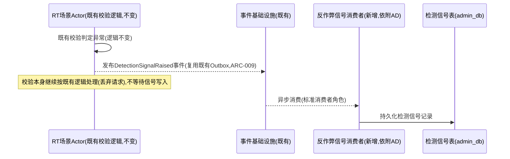
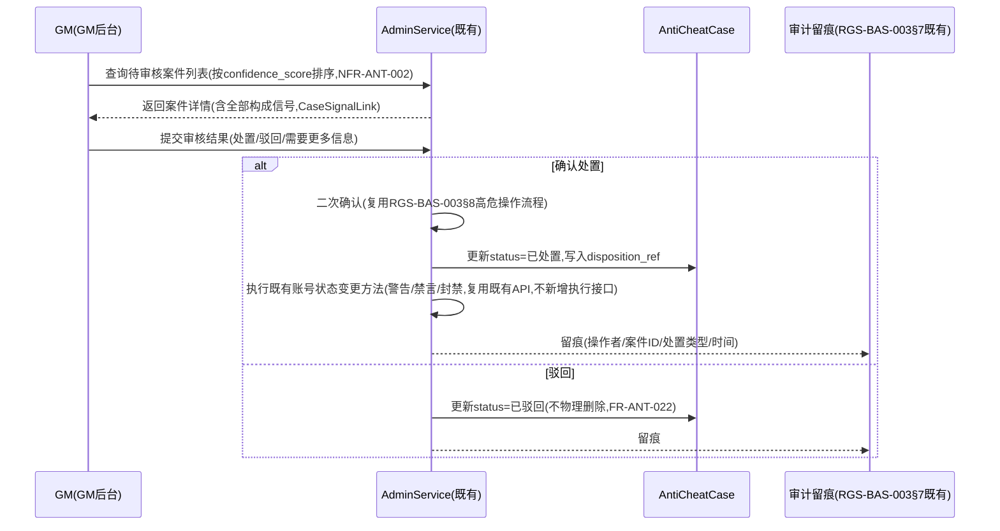

# 基本设计书（基本設計書 / Basic Design Document）

**反作弊与作弊治理体系 Anti-Cheat Detection & Case Management**

| 项目 | 内容 |
|---|---|
| 文档编号 | RGS-BAS-025 |
| 版本 | 0.1 |
| 父文档 | RGS-REQ-028 需求定义书（ARC-043） |
| 制定日 | 2026-08-17 |
| 最终更新日 | 2026-08-17 |
| 制定者 | 架构师 |
| 保密级别 | 内部限定（Internal Use Only） |
| 适用许可 | Apache-2.0（本仓库） |

---

## 修订历史（改訂履歴 / Revision History）

| 版本 | 修订日 | 修订者 | 审批者 | 修订内容 | 影响需求ID |
|---|---|---|---|---|---|
| 0.1 | 2026-08-17 | 架构师 | — | 初版制定。将RGS-REQ-028 ARC-043展开为检测信号采集组件设计、案件聚合数据模型、信号融合与智能层分析图接入方式、处置流程时序 | 全部 |

## 审批栏（承認欄 / Approval）

| 角色 | 姓名 | 审批日 | 备注 |
|---|---|---|---|
| 制定（起草） | 架构师 | 2026-08-17 | — |
| 评审（技术） | | | 信号采集是否真正异步且不阻塞RT/SY既有实时路径 |
| 评审（安全） | | | 处置流程是否严格收口至AdminService，不存在自动执行分支 |
| 审批（负责人） | | | 本文档的基准化 |

---

## 目录

1. [前言](#1-前言)
2. [检测信号采集设计](#2-检测信号采集设计)
3. [案件聚合数据模型](#3-案件聚合数据模型)
4. [信号融合与智能层接入](#4-信号融合与智能层接入)
5. [处置流程时序](#5-处置流程时序)
6. [标准化检查清单](#6-标准化检查清单)
7. [追溯性](#7-追溯性)

---

# 1. 前言

本文档细化RGS-REQ-028定义的ARC-043（反作弊信号分层与处置权收口原则），遵循ARC-018挂载原则——本文档定义的全部组件依附既有限界上下文（RT/SY提供信号来源，AD承载案件与处置）运行，**不新建**独立限界上下文、独立数据库或独立部署单元。

---

# 2. 检测信号采集设计

## 2.1 采集点（FR-ANT-001/002落地）

检测信号**不新增**判定逻辑，只是把RT/SY既有服务器权威校验的判定结果系统化记录：

| 采集点 | 既有校验位置 | 信号类型 |
|---|---|---|
| 移动速度校验 | RGS-BAS-001§4.2既有场景Actor移动模拟 | `SPEED_VIOLATION` |
| 碰撞穿透校验 | RGS-BAS-001§4.2既有碰撞检测 | `COLLISION_VIOLATION` |
| 输入频率/格式校验 | RGS-BAS-001§4.1既有输入缓冲・验证（FR-AD-004原有"丢弃并计数"逻辑） | `INPUT_ANOMALY` |
| 幂等键异常重放 | 复用ARC-009既有幂等去重表检测 | `REPLAY_ANOMALY` |

## 2.2 异步写入设计（FR-ANT-003落地）



**设计要点**：信号的产生**不是**新增一次同步调用，而是RT既有校验分支在判定异常时**额外**发布一个事件（复用既有Outbox+事件基础设施，同FR-EV-001既定模式），信号消费与持久化完全异步、在RT主路径之外进行——即使信号消费者/`admin_db`不可用，RT的既有校验判定（丢弃异常请求）**不受影响**，仅信号记录本身可能丢失（可接受，同FR-ANT-003）。

---

# 3. 案件聚合数据模型

## 3.1 逻辑数据模型（依附admin_db，AD限界上下文）

`DetectionSignal`（对应FR-ANT-001）：

| 字段 | 说明 |
|---|---|
| `signal_id` | 唯一标识 |
| `player_id` | 复用既有玩家标识 |
| `signal_type` | 枚举：`SPEED_VIOLATION`／`COLLISION_VIOLATION`／`INPUT_ANOMALY`／`REPLAY_ANOMALY`／`PLAYER_REPORT`（举报类信号，见3.3） |
| `occurred_at` | 发生时间 |
| `context_ref` | 引用所属场景/对局标识 |
| `raw_value` / `threshold_value` | 原始数值与触发阈值，供审核时判断严重程度 |
| `case_id` | 外键，指向所属`AntiCheatCase`（聚合前为空，聚合后回填） |

`AntiCheatCase`（对应FR-ANT-010）：

| 字段 | 说明 |
|---|---|
| `case_id` | 唯一标识 |
| `player_id` | 案件所属玩家 |
| `status` | 枚举：`待审核`／`已处置`／`已驳回` |
| `confidence_score` | 置信度评估结果（简单规则或智能层建议产出，见§4） |
| `signal_count` | 构成本案件的信号数量（含信号与举报） |
| `created_at` / `last_signal_at` | 案件创建时间与最近一次纳入信号的时间 |
| `disposition_ref` | 外键，指向处置记录（§5），未处置为空 |

`CaseSignalLink`（多对多关联表，对应FR-ANT-013）：`case_id` + `signal_id`，记录案件与构成信号的完整引用关系，供追溯。

## 3.2 物理落位与约束（复用RGS-BAS-007既定标准）

- 三张表均依附既有`admin_db`（AD限界上下文），不新建数据库
- `DetectionSignal(player_id, occurred_at)`复合索引，支撑§3.3聚合窗口查询
- `AntiCheatCase(player_id, status)`复合索引，支撑FR-ANT-014惯犯历史查询与FR-ANT-010按玩家聚合
- `CaseSignalLink`两列复合主键，双向索引（支持"某案件包含哪些信号"与"某信号属于哪个案件"两个查询方向）
- 分区策略复用RGS-BAS-007§4既定按时间范围分区（`DetectionSignal`按`occurred_at`月度分区），保留期3年（NFR-ANT-003）后整体`DETACH`清理，同既有幂等去重表清理模式（G-005）

## 3.3 举报作为信号来源（FR-ANT-004落地）

`PlayerReport`（RGS-BAS-014既有表，举报提交）在处置类型为"作弊"时，**必须**同步写入一条`signal_type=PLAYER_REPORT`的`DetectionSignal`记录，`context_ref`指向原始举报记录——本文档**不重新定义**举报提交流程，仅在举报写入完成后，通过既有事件机制（`PlayerReportSubmitted`，若尚不存在则由RGS-BAS-014补充发布）触发本文档的信号采集消费者，转化为统一的`DetectionSignal`格式，与自动检测信号进入同一聚合管道。

## 3.4 案件聚合逻辑（FR-ANT-010落地）

```
新DetectionSignal写入
  → 查询该player_id在既定时间窗口内(TBD-ANT-001)是否已有status=待审核的AntiCheatCase
  → 若有: 追加CaseSignalLink,更新signal_count/last_signal_at,触发§4置信度重新评估
  → 若无: 检查是否达到聚合阈值(TBD-ANT-001,如同类信号在窗口内累积N次,或1次高严重度信号即触发)
      → 达到: 创建新AntiCheatCase,关联全部窗口内相关信号
      → 未达到: 信号保持未关联状态,等待后续信号或超时归档(不生成案件)
```

---

# 4. 信号融合与智能层接入

## 4.1 简单规则判定（FR-ANT-012落地）

低复杂度场景（同一`player_id`单一`signal_type`短时间内重复触发超过既定阈值）由§3.4聚合逻辑内嵌的规则直接判定，**不经过**智能层：`confidence_score`按信号数量与严重度的固定加权公式计算（具体系数TBD-ANT-001），无需LangGraph图。

## 4.2 智能层分析图接入（FR-ANT-011落地）

多信号类型组合（如同一玩家同时有`SPEED_VIOLATION`+`REPLAY_ANOMALY`+`PLAYER_REPORT`）的置信度评估，接入RGS-BAS-011既定的智能层分析图生命周期治理（§5A）：

| 治理步骤 | 落地方式 |
|---|---|
| 注册 | 新分析图`graph_id=anticheat-fusion`，`feature_domain=ANT`，遵循`AnalysisGraphDefinition`既定模型（RGS-BAS-011§5A.1），初始`status=草稿` |
| 评审（增） | 须过ARC-014/026同等评审（含OLU核算，新增分析图场景须在附件D§5.4/§5.2追加申领），评审通过前**不得**订阅生产事件流，`status`保持`草稿` |
| 运行 | 生效后，`anticheat-fusion`图以§3.1的`DetectionSignal`聚合窗口内容作为输入，输出`confidence_score`与`suggested_action`（映射至AntiCheatCase的处置建议，如"建议标记为高优先级待审"），**不得**直接写`AntiCheatCase.status` |
| 确定性闸门 | `anticheat-fusion`图的全部输出须经既有确定性闸门（RGS-BAS-011§7A），`suggested_action`枚举白名单**仅**含"标记高优先级"／"标记低优先级"／"建议驳回"三类只读性质的分类建议，**不含**任何直接执行封禁/禁言的动作类型——执行动作**只能**来自§5 GM人工审核后的显式操作 |

> **判定原则**：智能层在本场景中的角色是"排序/分诊"而非"判决"——它帮助GM优先审核高置信度案件，但**不能**替代审核本身，这与ARC-030"闸门必须部署于消费者侧"原则完全一致：`AntiCheatCase.status`的写入权限**不**授予智能层服务账号（同RGS-BAS-011§4.1既有IAM/NetworkPolicy双锁模式）。

---

# 5. 处置流程时序

## 5.1 审核与处置（FR-ANT-020〜022落地）



## 5.2 举报者通知（FR-ANT-023落地）

处置完成后，若案件的`CaseSignalLink`中包含`signal_type=PLAYER_REPORT`来源，`AdminService`**必须**触发既有邮件/通知机制（复用RGS-REQ-017邮件系统或RGS-REQ-022推送系统，依玩家在线状态选择信道，同既有FR-GSM-023/FR-OPT类似的离线触达逻辑），通知内容**仅**包含处置结果摘要（"您举报的行为已处理"/"经审核未发现违规"），**不得**包含被举报者的账号标识或处置细节（隐私边界）。

## 5.3 误判撤销（FR-ANT-024落地）

撤销复用§5.1同一二次确认+审计流程，**新增**一条独立的撤销操作记录（而非修改/删除原处置记录），使审计链条保持"处置→撤销"的完整历史，而非事后看起来"从未处置过"。

---

# 6. 标准化检查清单

## 6.1 上线前检查清单

- [ ] 故障注入验证：信号消费者/`admin_db`不可用时，RT/SY既有实时路径（移动/战斗判定）无感知（AC-ANT-001）
- [ ] 案件聚合逻辑验证：同一玩家同类信号窗口内多次触发，聚合为单一案件而非多条孤立记录（AC-ANT-002）
- [ ] 处置权收口验证：代码审查确认不存在任何从检测信号/案件到账号状态变更的直接调用路径，全部处置动作须经`AdminService`人工确认分支（AC-ANT-003）
- [ ] `anticheat-fusion`分析图（若启用）已完成RGS-BAS-011§5A既定的注册与评审流程，未评审通过前`status`保持`草稿`且未订阅生产事件流

## 6.2 代码评审检查清单

- [ ] 新增检测信号采集点均为既有校验逻辑的旁路记录，未修改既有校验判定本身
- [ ] `anticheat-fusion`分析图的`suggested_action`枚举未包含任何执行类动作（仅分类/排序类）

---

# 7. 追溯性

| 需求ID | 本设计书章节 |
|---|---|
| ARC-043 | 全文 |
| FR-ANT-001〜004 | §2、§3.3 |
| FR-ANT-010〜014 | §3.1、§3.4 |
| FR-ANT-011（智能层接入） | §4.2 |
| FR-ANT-012（简单规则） | §4.1 |
| FR-ANT-020〜024 | §5 |
| NFR-ANT-001〜004 | §2.2、§3.2、§5.1 |
