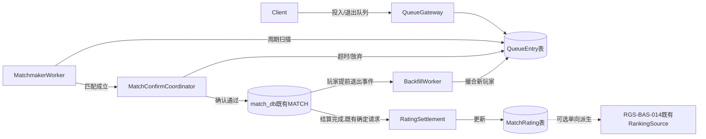
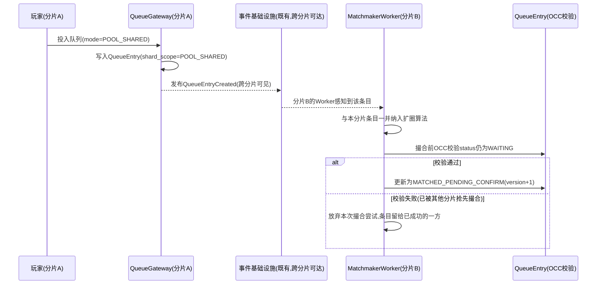
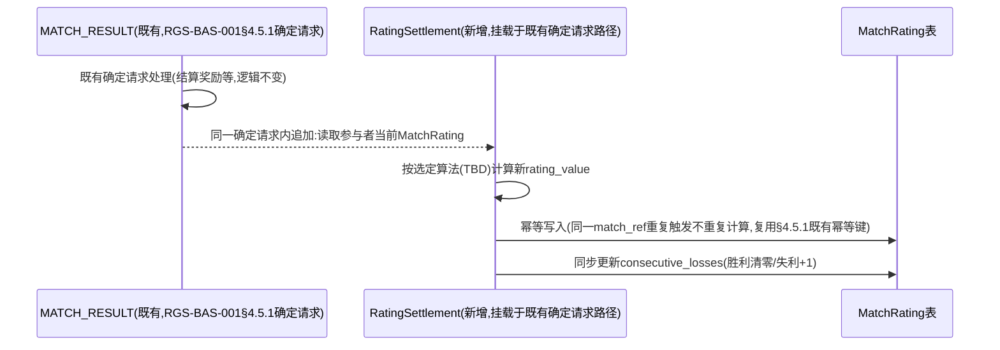
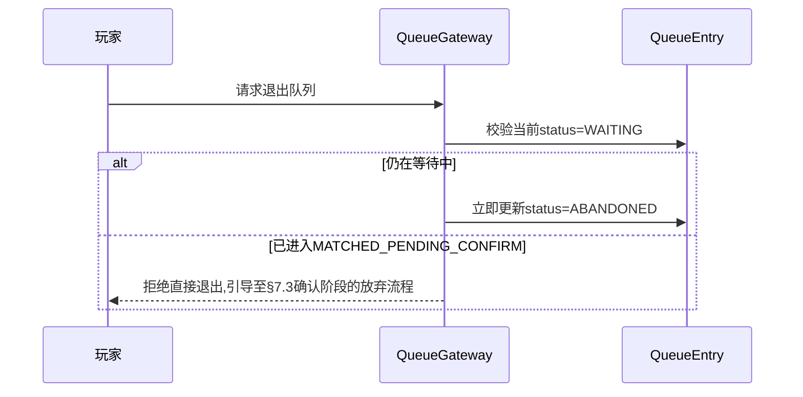
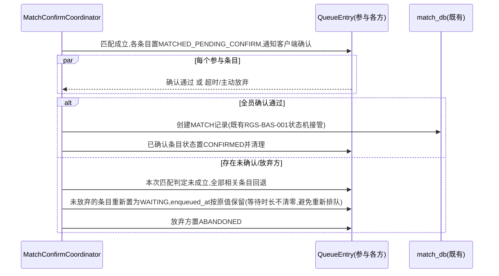
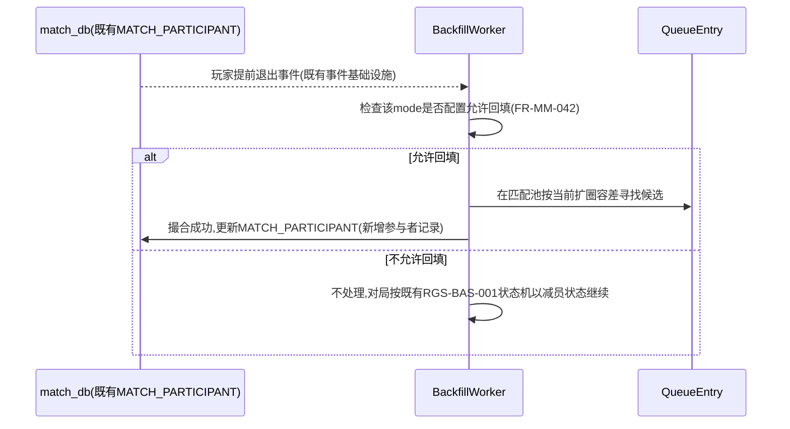

# 基本设计书（基本設計書 / Basic Design Document）

**匹配系统 Matchmaking System**

| 项目 | 内容 |
|---|---|
| 文档编号 | RGS-BAS-026 |
| 版本 | 0.2 |
| 父文档 | RGS-REQ-029 需求定义书（ARC-044） |
| 制定日 | 2026-08-17 |
| 最终更新日 | 2026-08-17 |
| 制定者 | 架构师 |
| 保密级别 | 内部限定（Internal Use Only） |
| 适用许可 | Apache-2.0（本仓库） |

---

## 修订历史（改訂履歴 / Revision History）

| 版本 | 修订日 | 修订者 | 审批者 | 修订内容 | 影响需求ID |
|---|---|---|---|---|---|
| 0.1 | 2026-08-17 | 架构师 | — | 初版制定。将RGS-REQ-029 ARC-044展开为：队列组件与数据模型设计、匹配算法（扩圈模式）设计、跨分片匹配池同步机制、匹配评分结算路径、连败保护与回填时序 | 全部 |
| 0.2 | 2026-08-17 | 架构师 | — | 自我审查发现：§9追溯性表遗漏AC-MM-001〜007的章节映射，本次补齐 | §9 |

## 审批栏（承認欄 / Approval）

| 角色 | 姓名 | 审批日 | 备注 |
|---|---|---|---|
| 制定（起草） | 架构师 | 2026-08-17 | — |
| 评审（技术） | | | 跨分片队列同步是否真正复用既有事件基础设施而非新建专属通信机制 |
| 评审（玩法） | | | 扩圈曲线与连败保护的默认参数是否有明确的运营可调路径 |
| 审批（负责人） | | | 本文档的基准化 |

---

## 目录

1. [前言](#1-前言)
2. [组件设计](#2-组件设计)
3. [队列数据模型](#3-队列数据模型)
4. [匹配算法设计](#4-匹配算法设计)
5. [跨分片匹配池设计](#5-跨分片匹配池设计)
6. [匹配评分结算](#6-匹配评分结算)
7. [连败保护与放弃回填时序](#7-连败保护与放弃回填时序)
8. [标准化检查清单](#8-标准化检查清单)
9. [追溯性](#9-追溯性)

---

# 1. 前言

本文档细化RGS-REQ-029定义的ARC-044（匹配池跨分片边界与技能评分归属原则），遵循ARC-018挂载原则——本文档定义的全部新增组件依附既有限界上下文（MT承载队列与匹配评分，复用既有事件基础设施承载跨分片同步）运行，**不新建**独立限界上下文、独立部署单元。本文档**不**重复设计`RGS-BAS-001`§5.5已覆盖的对局生命周期与结果持久化，仅设计"匹配成立、`MATCH`记录创建"这一交接点之前的全部过程。

---

# 2. 组件设计

## 2.1 组件划分

| 组件 | 依附上下文 | 职责 |
|---|---|---|
| `QueueGateway` | MT（对局・匹配） | 接受玩家/队伍的投入排队请求、退出请求，写入`QueueEntry`（§3.1） |
| `MatchmakerWorker` | MT | 周期性（tick驱动，复用ARC-016既定tick边界思想）扫描各匹配池的`QueueEntry`，执行§4扩圈算法，产出匹配结果 |
| `MatchConfirmCoordinator` | MT | 匹配成立后协调玩家确认/加载阶段，超时未确认时触发FR-MM-041既定的"未成立"回退 |
| `BackfillWorker` | MT | 对局进行中监听`MATCH_PARTICIPANT`退出事件，触发FR-MM-042回填 |
| `RatingSettlement` | MT，挂载于既有§4.5.1确定请求路径 | 对局结算后更新参与者匹配评分（FR-MM-002） |

组件间关系：



**未新建的部分（复用清单）**：事件发布/订阅复用ARC-010既有事件基础设施；tick边界协调复用ARC-016；确定请求幂等语义复用§4.5.1既有模式；选服路由复用RGS-REQ-023既有FR-PLT-010〜013；组队合谋检测信号消费方为既有ANT域（RGS-BAS-025），本文档只产出数据不新建检测组件。

---

# 3. 队列数据模型

## 3.1 逻辑数据模型（依附MT自有数据存储，与`match_db`同一限界上下文）

`QueueEntry`（对应FR-MM-010/013）：

| 字段 | 说明 |
|---|---|
| `entry_id` | 唯一标识 |
| `party_ref` | 队伍引用（单排时为仅含自身的单成员队伍，复用RGS-REQ-017既有队伍模型，不区分"单排"与"1人队伍"两套模型） |
| `mode` | 目标对局模式 |
| `shard_scope` | 枚举：`SHARD_LOCAL`（本文档ARC-044决定二未启用跨分片的模式）／`POOL_SHARED`（启用跨分片匹配池的模式），取值由`mode`的运营配置决定（FR-MM-022） |
| `composite_rating` | 该队列条目的合成匹配评分（FR-MM-011，单排即为个人评分） |
| `status` | 枚举：`WAITING`／`MATCHED_PENDING_CONFIRM`／`CONFIRMED`／`ABANDONED` |
| `enqueued_at` | 投入队列时间，用于计算等待时长与驱动扩圈（§4.1） |
| `match_ref` | 外键，指向撮合成立后的`MATCH`记录（撮合前为空） |

`MatchRating`（对应FR-MM-001）：

| 字段 | 说明 |
|---|---|
| `character_id` | 复用既有角色标识，主键 |
| `mode` | 匹配评分按对局模式独立维护（不同模式的评分不互相影响，避免"某模式高手在另一模式被误判"） |
| `rating_value` | 评分数值，具体算法（ELO/Glicko-2/TrueSkill择一）留待TBD（见RGS-REQ-029§11），本表结构对算法选型保持中立（`rating_value`+可选`rating_deviation`字段兼容Glicko-2类需要不确定度的算法，算法未选定不影响本表落地） |
| `rating_deviation` | 评分不确定度（若算法需要，如Glicko-2的RD；若最终选用不需要该概念的算法则此字段恒为空，不强制使用） |
| `updated_at` | 最近一次结算更新时间 |
| `consecutive_losses` | 当前连败计数，供§7.1连败保护读取（FR-MM-031） |

## 3.2 物理落位与约束（复用RGS-BAS-007既定标准）

- `QueueEntry`/`MatchRating`均依附MT限界上下文既有数据存储（与`match_db`同一物理数据库，复用ARC-008"同一限界上下文同一事务边界"原则，不新建独立数据库）
- `QueueEntry(mode, shard_scope, status)`复合索引，支撑`MatchmakerWorker`按模式+范围扫描待撮合条目
- `MatchRating(character_id, mode)`复合主键
- `QueueEntry`是短生命周期表（`MATCHED`/`ABANDONED`后的条目按既有清理策略定期归档，同幂等去重表G-005清理模式），不长期保留排队历史明细；长期需要的匹配质量度量（FR-MM-030）在撮合成立时刻**摘要写入**`MatchQualityMetric`（见§4.3），而非依赖`QueueEntry`本身长期保留

---

# 4. 匹配算法设计

## 4.1 扩圈算法（Search Radius Expansion，FR-MM-020落地）

采用业界既有的**扩圈（Search Radius Expansion）**模式：匹配算法不要求一次性找到评分完全相等的对手，而是以一个随等待时间增长而线性/分段放宽的评分容差窗口持续尝试撮合，直至容差达到上限仍未撮合成功则维持等待。该模式与RGS-REQ-014智能层无关，是确定性的规则算法，**不引入**任何机器学习或推理组件（同ARC-014"未证明不引入复杂性"精神，扩圈是被行业广泛验证的确定性方案，无需额外复杂度）。

```mermaid
flowchart TD
    A[MatchmakerWorker本轮tick触发] --> B[按mode+shard_scope分组扫描WAITING态QueueEntry]
    B --> C[对每个条目计算当前允许容差:\nf(now - enqueued_at),分段线性,参数TBD]
    C --> D{同组内是否存在\n评分差<=当前容差的\n互相兼容条目组合?}
    D -- 是 --> E[按§4.2编制规则组成对局]
    E --> F[条目状态置为MATCHED_PENDING_CONFIRM]
    F --> G[触发MatchConfirmCoordinator]
    D -- 否 --> H[条目维持WAITING,等待下一轮tick或容差继续放宽]
```

容差函数`f(waiting_seconds)`的具体分段参数（初始容差、放宽速率、容差上限）为RGS-REQ-029§11标注的本文档待定项，需PH-5实测数据支撑，本设计仅约束其**必须单调不减**（等待越久容差只能越宽不能收窄，避免玩家因等待反而更难匹配的悖论）。

## 4.2 组队编制规则（FR-MM-011/012落地）

- 合成匹配评分`composite_rating`默认取队伍成员`rating_value`的**算术平均**（简单、可解释，避免"最强/最弱代表全队"引入的极端案例，具体是否改用加权公式留待运营侧结合PH-5数据评估调整，属实现细节调优范畴不影响本文档架构）
- 队伍规模超过对局编制既定比例上限（如5v5编制下队伍规模不得超过5）时，`QueueGateway`在投入队列阶段即拒绝，返回明确错误，**不进入**队列（避免无法被撮合的条目占用扫描资源）
- 队伍规模小于对局编制时，`MatchmakerWorker`在§4.1找到兼容组合后，**必须**用单排或更小队伍条目补齐剩余位置，补齐同样受当前容差约束（不得为了凑人数而忽略评分差）

## 4.3 匹配质量度量（FR-MM-030落地）

匹配成立瞬间，`MatchmakerWorker`写入一条`MatchQualityMetric`摘要记录（复用既有运营分析数据管道，不新建独立分析基础设施）：

| 字段 | 说明 |
|---|---|
| `match_ref` | 对应`MATCH`记录 |
| `rating_gap` | 双方/双队最终评分差 |
| `total_wait_seconds` | 各参与条目等待时长（取最大值或分布，供运营判断扩圈曲线是否需要调优） |
| `used_backfill` | 是否经历过回填（供区分"原生匹配质量"与"回填补充后的质量"） |

---

# 5. 跨分片匹配池设计

## 5.1 边界判定落地（ARC-044决定一）

| `shard_scope` | 匹配池范围 | 对局归属分片 |
|---|---|---|
| `SHARD_LOCAL` | 仅本分片内`QueueEntry`互相可见 | 固定为玩家当前所在分片，无需额外路由决策 |
| `POOL_SHARED` | 复用既有事件基础设施（ARC-010）将`QueueEntry`的创建/状态变更事件跨分片广播，各分片的`MatchmakerWorker`共享同一逻辑匹配池视图 | 匹配成立时，`MatchConfirmCoordinator`复用RGS-REQ-023既有选服路由能力，为本次匹配动态指定一个承载对局的目标分片（优先选择参与玩家中多数所在分片，减少玩家迁移；若参与玩家分布分散，选择既有路由既定的负载最低分片） |

**关键约束（NFR-MM-002落地）**：`POOL_SHARED`模式下，`QueueEntry`状态变更事件的跨分片同步延迟**必须**有明确上限；`MatchmakerWorker`在产出撮合结果前，**必须**对涉及的`QueueEntry`执行一次乐观并发校验（复用ARC-005既有OCC模式，校验`status`仍为`WAITING`），避免同步延迟窗口内该条目已被另一分片的`MatchmakerWorker`并发撮合走，从而杜绝"同一玩家被重复撮合进多个对局"。



## 5.2 模式启用配置（FR-MM-022落地）

`shard_scope`取值由对局`mode`的运营配置决定，复用既有配置/特性开关基础设施（同RGS-REQ-029 FR-MM-032连败保护开关同一套机制），**不新建**专属配置系统。默认新增对局模式的`shard_scope`**必须**显式声明，**不提供**隐式默认值（避免遗漏评审直接放开跨分片，呼应RGS-REQ-025 FR-CAP-011"不得默认批准"纪律）。

---

# 6. 匹配评分结算

## 6.1 结算路径（FR-MM-002落地）



评分更新**不是**独立事务，而是`RGS-BAS-001`§4.5.1既有确定请求（对局结算）内新增的一个更新字段，复用该路径已有的幂等保证（同一`match_ref`的结算重复触发不产生重复评分变更）。

## 6.2 与GSM展示排行的单向联动（FR-MM-003落地）

`RatingSettlement`写入`MatchRating`后，**可选**发布一个`MatchRatingChanged`事件（复用ARC-010事件基础设施），RGS-BAS-014既有`RankingSource`**可以**（若运营侧希望展示"匹配段位排行榜"）订阅该事件派生一个新的`ranking_dimension`（如`match_rating_display`），遵循GSM域既有滞后声明（RGS-BAS-014§2.5）。该联动是**单向**的——展示视图的任何行为（包括赛季重置）**不得**回写或影响`MatchRating`本身，避免§9 ARC-044决定二试图分离的两种语义重新耦合。

---

# 7. 连败保护与放弃回填时序

## 7.1 连败保护调整（FR-MM-031/032落地）

`MatchmakerWorker`在§4.1扩圈算法产出候选对局前，读取参与者`MatchRating.consecutive_losses`：连败计数超过既定阈值（TBD）的玩家，在寻找对手时，算法对候选对手的**有效评分**施加一个有上限的负向偏移（使其更容易被撮合到实力略低的对手），偏移幅度随连败计数增长但**必须**收敛于既定上限（不随连败无限累积），且偏移仅作用于"对手选择"，不写回`MatchRating.rating_value`本身（保护是撮合阶段的**临时**调整，不污染玩家的真实评分记录）。该开关复用§5.2既有配置基础设施，运营侧可按模式独立启停。

## 7.2 排队放弃时序（FR-MM-040落地）



## 7.3 匹配成立后未确认时序（FR-MM-041落地）



## 7.4 回填时序（FR-MM-042/043落地）



## 7.5 组队结构信号产出（FR-MM-044落地）

`MatchmakerWorker`在每次组队撮合成立时，向既有事件基础设施发布匹配成立事件（已复用于§6.1触发结算路径的同一事件家族），事件载荷**必须**包含参与队伍的成员构成（`party_ref`展开的成员列表）。RGS-BAS-025既有反作弊信号消费者**可以**（后续由ANT域自行决定是否启用）订阅该事件，统计固定搭档的重复组队频率作为一类新的`DetectionSignal.signal_type`候选（具体是否新增该信号类型、阈值如何设定，属于ANT域RGS-BAS-025的后续扩展范围，本文档仅确保数据可消费，不设计消费逻辑本身）。

---

# 8. 标准化检查清单

## 8.1 上线前检查清单

- [ ] 扩圈算法验证：模拟评分分布不同的玩家排队，容差随等待时长单调不减放宽（AC-MM-001）
- [ ] 组队编制验证：队伍规模超限时投入队列被拒绝，规模不足时按规则补齐（AC-MM-002）
- [ ] 跨分片队列OCC校验验证：并发场景下不产生同一玩家被重复撮合（AC-MM-003）
- [ ] 连败保护调整幅度验证：偏移不超过既定上限，且不写回`rating_value`（AC-MM-004）
- [ ] 匹配未确认回退验证：超时/放弃场景不产生人数不足开局（AC-MM-005）
- [ ] 回填验证：`MATCH_PARTICIPANT`记录在回填后保持完整（AC-MM-006）
- [ ] 匹配算法幂等性故障注入验证（AC-MM-007）

## 8.2 代码评审检查清单

- [ ] `RatingSettlement`确认挂载于既有§4.5.1确定请求路径，未新建独立结算事务
- [ ] `shard_scope=POOL_SHARED`的模式均有显式配置声明，未使用隐式默认值
- [ ] 连败保护相关代码未出现直接修改`MatchRating.rating_value`的路径（仅作用于撮合阶段候选筛选）

---

# 9. 追溯性

| 需求ID | 本设计书章节 |
|---|---|
| ARC-044 | 全文，§5、§6.2 |
| FR-MM-001〜003 | §6 |
| FR-MM-010〜013 | §3.1、§4.2 |
| FR-MM-020〜023 | §4.1、§5 |
| FR-MM-030 | §4.3 |
| FR-MM-031〜032 | §7.1 |
| FR-MM-040〜044 | §7.2〜§7.5 |
| NFR-MM-001〜004 | §4.1、§5.1、§4.3、§7.3 |
| AC-MM-001（扩圈曲线生效） | §4.1 |
| AC-MM-002（组队合成评分/位置补齐） | §4.2 |
| AC-MM-003（跨分片不重复撮合） | §5.1 |
| AC-MM-004（连败保护调整幅度） | §7.1 |
| AC-MM-005（未确认回退重新排队） | §7.3 |
| AC-MM-006（提前退出回填） | §7.4 |
| AC-MM-007（故障注入幂等性） | §5.1（`MatchmakerWorker`OCC校验） |
