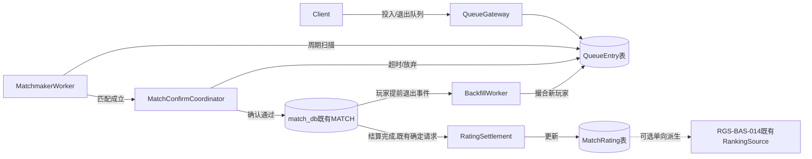
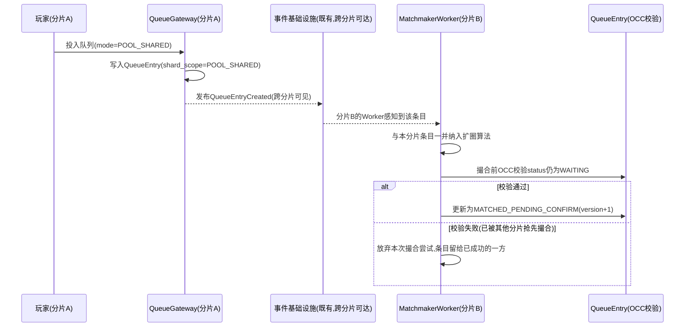
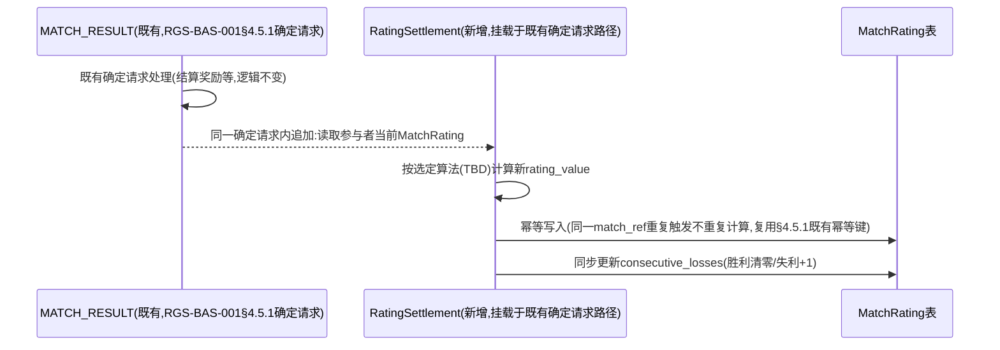
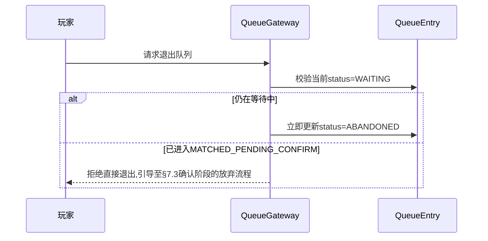
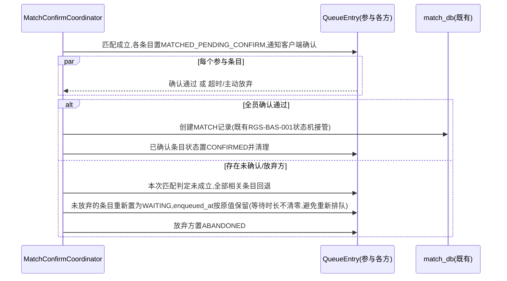
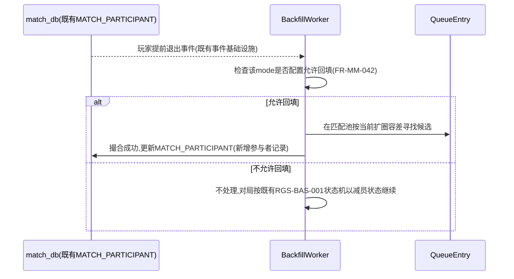

# 基本设计书（基本設計書 / Basic Design Document）

**匹配系统 Matchmaking System**

| 项目 | 内容 |
|---|---|
| 文档编号 | RGS-BAS-026 |
| 版本 | 0.3 |
| 父文档 | RGS-REQ-029 需求定义书（ARC-044） |
| 制定日 | 2026-08-17 |
| 最终更新日 | 2026-09-01 |
| 制定者 | 架构师 |
| 保密级别 | 内部限定（Internal Use Only） |
| 适用许可 | Apache-2.0（本仓库） |

---

## 修订历史（改訂履歴 / Revision History）

| 版本 | 修订日 | 修订者 | 审批者 | 修订内容 | 影响需求ID |
|---|---|---|---|---|---|
| 0.1 | 2026-08-17 | 架构师 | — | 初版制定。将RGS-REQ-029 ARC-044展开为：队列组件与数据模型设计、匹配算法（扩圈模式）设计、跨分片匹配池同步机制、匹配评分结算路径、连败保护与回填时序 | 全部 |
| 0.2 | 2026-08-17 | 架构师 | — | 自我审查发现：§9追溯性表遗漏AC-MM-001〜007的章节映射，本次补齐 | §9 |
| 0.3 | 2026-09-01 | 架构师 (Mavis 接手 agent per DEC-008) | 架构师 (Mavis 接手 agent per DEC-008) | 落实"各BAS文档功能章节加log设计且区分debug/release级"总要求（per Ulysses 2026-09-01 15:52 JST 决策，4 拍板选项：全部 36 个BAS / 详尽版5列表 / 派worker并行 / BAS-004同步升级）：§2.1／§3.1／§3.2／§4.1／§4.2／§4.3／§5.1／§5.2／§6.1／§6.2／§7.1／§7.2／§7.3／§7.4／§7.5 全部 15 个 ## L2 功能段加"本功能日志设计" 5 列详尽版（字段名／触发条件／频率估算／采样策略／脱敏与成本），字段名前缀统一 `match.*`（matching system 域，区别于 BAS-002 `mnt.*`／BAS-003 `ops.*`／BAS-010 `pat.*`）；引用 BAS-001 v1.5 §4.8.3 模板（commit 32d9eb6）+ BAS-003 v0.3 样板（commit 75a001c）+ BAS-004 v0.3 §4.2 二维矩阵 + §4.3 字段 + §5.1 脱敏 + §6.2 强制全采样（commit 47e26b0/0ee6262）；匹配域特殊考虑全部落地：①匹配队列进入／退出／超时（核心业务事件） → release 必出（`info!` 编译期常驻，§6.2 强制全采样）；②匹配成功／撮合成立 → release 必出 + §6.2 强制全采样（运营 KPI + 故障排查关键）；③匹配评分计算（MMR/Elo/TrueSkill 中间步骤） → debug-only（`#[cfg(debug_assertions)]` 守护，release build 完全剔除，零运行时开销，高频性能敏感）；④队伍组建／角色分配 → release 必出；⑤匹配等待时间分布 → release 必出（运营 KPI，p50/p99 桶）；⑥跨区匹配 OCC 校验失败／降级 → `warn!` 强制全采样；§8.1 上线前检查清单新增 4 项 log 章节上线检查项（每功能 log 章节存在性/release 必出 grep 验证/debug-only 四铁律合规/release 必出宏未被 `#[cfg]` 守护）；§9 追溯性新增 AC-MM-008（debug-only 宏 release 完全剔除）与 AC-MM-009（每功能 BAS 文档须含本功能 log 设计章节），与 BAS-001 v1.5 §4.8.3.4 / BAS-002 v0.4 §13 / BAS-003 v0.3 §13 / BAS-004 v0.3 §12 / BAS-010 v0.5 §6 形成统一规范 | §2.1〜§7.5、§8.1、§9 |

## 审批栏（承認欄 / Approval）

| 角色 | 姓名 | 审批日 | 备注 |
|---|---|---|---|
| 制定（起草） | 架构师 | 2026-08-17 | — |
| 评审（技术） | | | 跨分片队列同步是否真正复用既有事件基础设施而非新建专属通信机制 |
| 评审（玩法） | | | 扩圈曲线与连败保护的默认参数是否有明确的运营可调路径 |
| 审批（负责人） | | | 本文档的基准化 |

---

## 目录

1. [前言](#1-前言)
2. [组件设计](#2-组件设计)
3. [队列数据模型](#3-队列数据模型)
4. [匹配算法设计](#4-匹配算法设计)
5. [跨分片匹配池设计](#5-跨分片匹配池设计)
6. [匹配评分结算](#6-匹配评分结算)
7. [连败保护与放弃回填时序](#7-连败保护与放弃回填时序)
8. [标准化检查清单](#8-标准化检查清单)
9. [追溯性](#9-追溯性)

---

# 1. 前言

本文档细化RGS-REQ-029定义的ARC-044（匹配池跨分片边界与技能评分归属原则），遵循ARC-018挂载原则——本文档定义的全部新增组件依附既有限界上下文（MT承载队列与匹配评分，复用既有事件基础设施承载跨分片同步）运行，**不新建**独立限界上下文、独立部署单元。本文档**不**重复设计`RGS-BAS-001`§5.5已覆盖的对局生命周期与结果持久化，仅设计"匹配成立、`MATCH`记录创建"这一交接点之前的全部过程。

---

# 2. 组件设计

## 2.1 组件划分

| 组件 | 依附上下文 | 职责 |
|---|---|---|
| `QueueGateway` | MT（对局・匹配） | 接受玩家/队伍的投入排队请求、退出请求，写入`QueueEntry`（§3.1） |
| `MatchmakerWorker` | MT | 周期性（tick驱动，复用ARC-016既定tick边界思想）扫描各匹配池的`QueueEntry`，执行§4扩圈算法，产出匹配结果 |
| `MatchConfirmCoordinator` | MT | 匹配成立后协调玩家确认/加载阶段，超时未确认时触发FR-MM-041既定的"未成立"回退 |
| `BackfillWorker` | MT | 对局进行中监听`MATCH_PARTICIPANT`退出事件，触发FR-MM-042回填 |
| `RatingSettlement` | MT，挂载于既有§4.5.1确定请求路径 | 对局结算后更新参与者匹配评分（FR-MM-002） |

组件间关系：



**未新建的部分（复用清单）**：事件发布/订阅复用ARC-010既有事件基础设施；tick边界协调复用ARC-016；确定请求幂等语义复用§4.5.1既有模式；选服路由复用RGS-REQ-023既有FR-PLT-010〜013；组队合谋检测信号消费方为既有ANT域（RGS-BAS-025），本文档只产出数据不新建检测组件。

### 2.1 本功能日志设计

本节覆盖匹配域 5 个核心组件（`QueueGateway`／`MatchmakerWorker`／`MatchConfirmCoordinator`／`BackfillWorker`／`RatingSettlement`）的运行时生命周期事件——各组件 Pod 启动/停止、tick 周期触发、跨分片事件订阅器就绪/掉线、QueueEntry 写入路径可达性等的观察点。事件名统一 `match.comp.*` 前缀。组件生命周期事件 release 必出（生产可观测性 + 滚动更新期间 SRE 排障需要，per ARC-020）；组件内部调度参数（tick 间隔、批大小）debug-only 守护（高频热路径，避免撑爆生产日志通道）。

| 字段名（field） | 触发条件（trigger） | 频率估算（frequency） | 采样策略（sampling） | 脱敏与成本（redact & cost） |
|---|---|---|---|---|
| `match.comp.queue_gateway.received` | `QueueGateway` Pod 启动成功并接受入队请求（readiness probe 通过） | 部署期 0.1/h + Pod 重启偶发 | release 必出（`info!` 编译期常驻，per BAS-004 v0.3 §4.2） | 含 `pod_name`／`node_id`／`started_at`；约 250B/条 |
| `match.comp.queue_gateway.stopped.graceful` | `QueueGateway` Pod 收到 SIGTERM 优雅停止（滚动更新/维护路径） | 偶发 | release 必出（`info!` §6.2 强制全采样） | 含 `pod_name`／`reason`／`in_flight_count`；约 280B/条 |
| `match.comp.queue_gateway.crashed.unexpected` | `QueueGateway` Pod 非预期崩溃（OOM/未捕获异常） | 极少 | release 必出（`error!` §6.2 强制全采样） | 含 `pod_name`／`exit_code`／`last_log`／`trace_id`；约 400B/条 |
| `match.comp.matchmaker_worker.tick_started` | `MatchmakerWorker` 本轮 tick 周期开始扫描（per ARC-016 tick 边界） | 稳态 1/s、峰值 10/s（每分片 worker） | release 必出（`info!` §6.2 强制全采样，**算法性能基准**，per NFR-PE-008） | 含 `tick_id`／`mode`／`shard_scope`；约 220B/条 |
| `match.comp.matchmaker_worker.tick_completed` | `MatchmakerWorker` 本轮 tick 周期结束（含本轮撮合数/候选条目数） | 同上 | release 必出（`info!` §6.2 强制全采样，**算法性能基准**） | 含 `tick_id`／`matched_count`／`candidates_scanned`／`duration_ms`；约 280B/条 |
| `match.comp.matchmaker_worker.tick_timeout` | `MatchmakerWorker` 单轮 tick 超出既定时间预算（per FR-MM-021） | 极少（异常热点） | release 必出（`warn!` §6.2 强制全采样） | 含 `tick_id`／`duration_ms`／`threshold_ms`；约 280B/条 |
| `match.comp.match_confirm_coordinator.ready` | `MatchConfirmCoordinator` 启动后建立确认通道（含客户端推送链路就绪） | 部署期 + 重平衡偶发 | release 必出（`info!` 强制全采样） | 含 `pod_name`／`push_endpoint_count`；约 280B/条 |
| `match.comp.match_confirm_coordinator.lost` | 确认通道与客户端推送链路心跳超时（玩家断线/网关故障） | 偶发（断网玩家） | release 必出（`warn!` 强制全采样） | 含 `character_id`／`last_heartbeat`／`reason`；约 300B/条 |
| `match.comp.backfill_worker.queue_depth_breach` | `BackfillWorker` 内部撮合队列深度超过 ARC-013 背压阈值 | 偶发（峰值流量） | release 必出（`warn!` 强制全采样） | 含 `current_depth`／`capacity`／`dropped_count`；约 280B/条 |
| `match.comp.rating_settlement.caller_unreachable` | `RatingSettlement` 挂载的既有确定请求路径（§4.5.1）不可达 | 极少 | release 必出（`error!` §6.2 强制全采样） | 含 `caller_service`／`last_success_at`／`retry_count`；约 320B/条 |
| `match.comp.debug.tick_envelope` | 完整 tick 调度参数（间隔/批大小/候选过滤器快照） | 稳态 1/s、峰值 10/s | **debug-only**（`#[cfg(debug_assertions)]` 守护，release build 完全剔除） | 约 500B-1KB/条（release 剔除，零运行时开销） |
| `match.comp.debug.partition_assignment_dump` | 跨分片事件订阅器 partition 分配详情（broker/leader/replica） | 0.1/h | **debug-only**（`#[cfg(debug_assertions)]` 守护） | 约 1-2KB/条（release 剔除） |

**debug-only 守护要点**（落实 BAS-004 v0.3 §4.4）：
- `match.comp.debug.tick_envelope` 高频热路径（每 tick 一次）—— release build 完全剔除，避免 RUST_LOG=debug 误开时撑爆生产日志通道
- `match.comp.matchmaker_worker.tick_started` 与 `tick_completed` 是**生产事件**（算法性能基准），**不**可 debug-only —— release 必出 + §6.2 强制全采样，便于 SRE 按 `mode` 维度对比各模式 tick 时延

---

# 3. 队列数据模型

## 3.1 逻辑数据模型（依附MT自有数据存储，与`match_db`同一限界上下文）

`QueueEntry`（对应FR-MM-010/013）：

| 字段 | 说明 |
|---|---|
| `entry_id` | 唯一标识 |
| `party_ref` | 队伍引用（单排时为仅含自身的单成员队伍，复用RGS-REQ-017既有队伍模型，不区分"单排"与"1人队伍"两套模型） |
| `mode` | 目标对局模式 |
| `shard_scope` | 枚举：`SHARD_LOCAL`（本文档ARC-044决定二未启用跨分片的模式）／`POOL_SHARED`（启用跨分片匹配池的模式），取值由`mode`的运营配置决定（FR-MM-022） |
| `composite_rating` | 该队列条目的合成匹配评分（FR-MM-011，单排即为个人评分） |
| `status` | 枚举：`WAITING`／`MATCHED_PENDING_CONFIRM`／`CONFIRMED`／`ABANDONED` |
| `enqueued_at` | 投入队列时间，用于计算等待时长与驱动扩圈（§4.1） |
| `match_ref` | 外键，指向撮合成立后的`MATCH`记录（撮合前为空） |

`MatchRating`（对应FR-MM-001）：

| 字段 | 说明 |
|---|---|
| `character_id` | 复用既有角色标识，主键 |
| `mode` | 匹配评分按对局模式独立维护（不同模式的评分不互相影响，避免"某模式高手在另一模式被误判"） |
| `rating_value` | 评分数值，具体算法（ELO/Glicko-2/TrueSkill择一）留待TBD（见RGS-REQ-029§11），本表结构对算法选型保持中立（`rating_value`+可选`rating_deviation`字段兼容Glicko-2类需要不确定度的算法，算法未选定不影响本表落地） |
| `rating_deviation` | 评分不确定度（若算法需要，如Glicko-2的RD；若最终选用不需要该概念的算法则此字段恒为空，不强制使用） |
| `updated_at` | 最近一次结算更新时间 |
| `consecutive_losses` | 当前连败计数，供§7.1连败保护读取（FR-MM-031） |

## 3.2 物理落位与约束（复用RGS-BAS-007既定标准）

- `QueueEntry`/`MatchRating`均依附MT限界上下文既有数据存储（与`match_db`同一物理数据库，复用ARC-008"同一限界上下文同一事务边界"原则，不新建独立数据库）
- `QueueEntry(mode, shard_scope, status)`复合索引，支撑`MatchmakerWorker`按模式+范围扫描待撮合条目
- `MatchRating(character_id, mode)`复合主键
- `QueueEntry`是短生命周期表（`MATCHED`/`ABANDONED`后的条目按既有清理策略定期归档，同幂等去重表G-005清理模式），不长期保留排队历史明细；长期需要的匹配质量度量（FR-MM-030）在撮合成立时刻**摘要写入**`MatchQualityMetric`（见§4.3），而非依赖`QueueEntry`本身长期保留

### 3.2 本功能日志设计

本节覆盖 QueueEntry 与 MatchRating 两表**物理落位/索引命中/归档清理**的运行时观察点。事件名统一 `match.db.*` 前缀。短生命周期表的归档清理事件 release 必出（容量规划需要）；表索引命中统计/扫描行数等热路径 debug-only 守护（高频，避免撑爆生产日志通道）。

| 字段名（field） | 触发条件（trigger） | 频率估算（frequency） | 采样策略（sampling） | 脱敏与成本（redact & cost） |
|---|---|---|---|---|
| `match.db.queue_entry.table_archive_sweep_completed` | QueueEntry 表按既定清理策略完成一轮归档扫描（短生命周期表定期清理，per §3.2） | 定时（典型 1/h） | release 必出（`info!` 编译期常驻，per BAS-004 v0.3 §4.2） | 含 `archived_count`／`remaining_count`／`sweep_duration_ms`；约 280B/条 |
| `match.db.queue_entry.archive_anomaly` | 单轮归档扫描清理数远超历史均值（可能为表扫描索引失效 / 异常业务突发） | 极少 | release 必出（`warn!` §6.2 强制全采样） | 含 `archived_count`／`historical_mean`／`deviation_ratio`；约 320B/条 |
| `match.db.match_rating.idempotency_conflict` | 同一 `match_ref` 重复触发 RatingSettlement 命中幂等键（per §6.1） | 偶发（重试/重放） | release 必出（`info!` §6.2 强制全采样） | 含 `match_ref`／`existing_settlement_id`；约 240B/条；无敏感字段 |
| `match.db.index_queue_entry.miss_detected` | `MatchmakerWorker` 按 `QueueEntry(mode, shard_scope, status)` 扫描触发顺序扫描（索引失效，per §3.2 复合索引） | 极少（运维事故） | release 必出（`error!` §6.2 强制全采样） | 含 `predicate`／`fallback_to_seqscan`；约 280B/条 |
| `match.db.debug.index_scan_rows` | `MatchmakerWorker` 每次 tick 扫描的 QueueEntry 行数明细（用于容量规划） | 稳态 1/s、峰值 10/s | **debug-only**（`#[cfg(debug_assertions)]` 守护，release build 完全剔除） | 约 200B/条（release 剔除，零运行时开销） |
| `match.db.debug.rating_table_sample` | MatchRating 表当前样本行（character_id + rating_value，**仅含 character_id hash，不含明文**） | 极低 | **debug-only**（`#[cfg(debug_assertions)]` 守护） | 约 100B-500B/条（release 剔除；character_id 走 BAS-004 v0.3 §5.1 hash 脱敏） |

**debug-only 守护要点**（落实 BAS-004 v0.3 §4.4）：
- `match.db.debug.index_scan_rows` 高频热路径（每 tick 一次）—— release build 完全剔除，避免 RUST_LOG=debug 误开时撑爆生产日志通道
- `match.db.index_queue_entry.miss_detected` 是**生产事故事件**，**不**可 debug-only —— release 必出 + §6.2 强制全采样，便于 SRE 立即介入索引重建

### 3.1 本功能日志设计

本节覆盖 `QueueEntry` 与 `MatchRating` 两表的**写入/查询/状态迁移**观察点。事件名统一 `match.queue.*` 前缀。`QueueEntry` 创建/状态迁移/超时是核心业务事件 → release 必出（§6.2 强制全采样）；条目载荷详细字段（`composite_rating` 算术平均/加权平均各分量、连败计数）debug-only 守护（按需披露，避免撑爆生产日志通道）。

| 字段名（field） | 触发条件（trigger） | 频率估算（frequency） | 采样策略（sampling） | 脱敏与成本（redact & cost） |
|---|---|---|---|---|
| `match.queue.entry.enqueued` | `QueueGateway` 接受入队请求并成功写入 `QueueEntry`（per §3.1） | 稳态 50/s、峰值 5000/s（开服瞬时热点） | release 必出（`info!` 编译期常驻，per BAS-004 v0.3 §4.2） | 含 `entry_id`／`character_id`／`mode`／`shard_scope`／`composite_rating`；约 280B/条；character_id 走 BAS-004 v0.3 §5.1 hash 脱敏 |
| `match.queue.entry.enqueued.rejected.party_size_exceeded` | 队伍规模超限，§4.2 落地阶段即拒绝入队 | 偶发（玩家操作） | release 必出（`info!` §6.2 强制全采样） | 含 `character_id`／`party_size`／`mode_max`；约 240B/条 |
| `match.queue.entry.status_transition` | `QueueEntry.status` 状态机迁移（WAITING→MATCHED_PENDING_CONFIRM→CONFIRMED/ABANDONED，per §3.1） | 稳态 50/s、峰值 5000/s | release 必出（`info!` §6.2 强制全采样，**核心业务事件**） | 含 `entry_id`／`from_status`／`to_status`／`match_ref`；约 280B/条 |
| `match.queue.entry.waiting_time_bucket` | QueueEntry 超时/撮合/放弃时刻的等待时长分桶（per FR-MM-040/041，p50/p99 桶，**运营 KPI**） | 同上 | release 必出（`info!` §6.2 强制全采样，**算法性能基准**） | 含 `wait_seconds_bucket`（0-5/5-15/15-30/30-60/60+）；约 220B/条；聚合后极小 |
| `match.queue.match_rating.updated` | `RatingSettlement` 完成评分更新（含 `consecutive_losses` 同步更新，per §6.1） | 稳态 30/s、峰值 1000/s（对局结束频次） | release 必出（`info!` §6.2 强制全采样，**核心业务事件**） | 含 `character_id`／`mode`／`old_rating`／`new_rating`／`consecutive_losses_delta`；约 320B/条 |
| `match.queue.match_rating.rating_anomaly` | 评分变化幅度超过既定阈值（疑似异常结算或算法 bug，per §6.1） | 极少 | release 必出（`warn!` §6.2 强制全采样） | 含 `character_id`／`mode`／`rating_delta`／`threshold`；约 300B/条 |
| `match.queue.debug.composite_rating_components` | 队伍 `composite_rating` 计算各分量（成员 rating_value 列表 + 算术平均/加权系数） | 稳态 50/s、峰值 5000/s | **debug-only**（`#[cfg(debug_assertions)]` 守护，release build 完全剔除） | 约 300B-1KB/条（release 剔除，零运行时开销） |
| `match.queue.debug.match_rating_full_row` | MatchRating 单行全字段 dump（含 `rating_deviation` 等可选字段） | 极低 | **debug-only**（`#[cfg(debug_assertions)]` 守护） | 约 200B-400B/条（release 剔除） |

**debug-only 守护要点**（落实 BAS-004 v0.3 §4.4）：
- `match.queue.debug.composite_rating_components` 高频热路径（每入队一条）—— release build 完全剔除，避免 RUST_LOG=debug 误开时撑爆生产日志通道
- `match.queue.entry.enqueued` 是**生产事件**（核心业务），**不**可 debug-only —— release 必出 + §6.2 强制全采样，便于 SRE 按 `mode` 维度统计入队速率与队伍规模分布

---

# 4. 匹配算法设计

## 4.1 扩圈算法（Search Radius Expansion，FR-MM-020落地）

采用业界既有的**扩圈（Search Radius Expansion）**模式：匹配算法不要求一次性找到评分完全相等的对手，而是以一个随等待时间增长而线性/分段放宽的评分容差窗口持续尝试撮合，直至容差达到上限仍未撮合成功则维持等待。该模式与RGS-REQ-014智能层无关，是确定性的规则算法，**不引入**任何机器学习或推理组件（同ARC-014"未证明不引入复杂性"精神，扩圈是被行业广泛验证的确定性方案，无需额外复杂度）。

```mermaid
flowchart TD
    A[MatchmakerWorker本轮tick触发] --> B[按mode+shard_scope分组扫描WAITING态QueueEntry]
    B --> C[对每个条目计算当前允许容差:\nf(now - enqueued_at),分段线性,参数TBD]
    C --> D{同组内是否存在\n评分差<=当前容差的\n互相兼容条目组合?}
    D -- 是 --> E[按§4.2编制规则组成对局]
    E --> F[条目状态置为MATCHED_PENDING_CONFIRM]
    F --> G[触发MatchConfirmCoordinator]
    D -- 否 --> H[条目维持WAITING,等待下一轮tick或容差继续放宽]
```

容差函数`f(waiting_seconds)`的具体分段参数（初始容差、放宽速率、容差上限）为RGS-REQ-029§11标注的本文档待定项，需PH-5实测数据支撑，本设计仅约束其**必须单调不减**（等待越久容差只能越宽不能收窄，避免玩家因等待反而更难匹配的悖论）。

### 4.1 本功能日志设计

本节覆盖扩圈算法的**撮合关键事件**与**评分计算中间步骤**。事件名统一 `match.radius.*` 前缀。撮合成功/扩圈容差推进 → release 必出（**核心业务事件** + 运营 KPI 必需 + §6.2 强制全采样）；评分计算（MMR/Elo/TrueSkill 中间步骤）→ debug-only 守护（**匹配域特殊考虑 #3**：高频性能敏感，release build 完全剔除零运行时开销）；扩圈容差触顶维持等待 → warn! 强制全采样（**运营告警**：玩家等待体验异常）。

| 字段名（field） | 触发条件（trigger） | 频率估算（frequency） | 采样策略（sampling） | 脱敏与成本（redact & cost） |
|---|---|---|---|---|
| `match.radius.search_radius_expanded` | 扩圈容差从本轮 `tolerance_n` 推进至 `tolerance_{n+1}`（per §4.1 单调不减约束） | 稳态 5/s、峰值 100/s（每分片 worker 每 tick） | release 必出（`info!` 编译期常驻，per BAS-004 v0.3 §4.2） | 含 `mode`／`shard_scope`／`old_tolerance`／`new_tolerance`／`waiting_seconds_bucket`；约 280B/条 |
| `match.radius.match_found` | 扩圈算法成功撮合一组条目（`QueueEntry.status` → MATCHED_PENDING_CONFIRM，per §4.1） | 稳态 30/s、峰值 2000/s | release 必出（`info!` §6.2 强制全采样，**匹配域特殊考虑 #2：匹配成功强制全采样**） | 含 `match_ref`／`mode`／`shard_scope`／`rating_gap`／`wait_seconds`；约 320B/条 |
| `match.radius.search_radius_ceiling_reached` | 扩圈容差达到上限（FR-MM-021 上限），维持 WAITING 等待（per §4.1） | 偶发（极端热点） | release 必出（`warn!` §6.2 强制全采样，**运营告警**） | 含 `mode`／`shard_scope`／`ceiling_value`／`waiting_seconds`；约 280B/条 |
| `match.radius.monotonicity_violation` | 扩圈容差违反单调不减约束（检测 `f(now) < f(previous)`，per §4.1） | 极少（算法 bug） | release 必出（`error!` §6.2 强制全采样） | 含 `mode`／`previous_tolerance`／`current_tolerance`／`function_id`；约 300B/条 |
| `match.radius.debug.score_calculation_steps` | 评分计算全过程 dump（候选对手逐一评分 / 评分差计算 / 阈值比对 / 排序结果） | 稳态 30/s、峰值 2000/s | **debug-only**（`#[cfg(debug_assertions)]` 守护，release build 完全剔除，**匹配域特殊考虑 #3**） | 约 1-5KB/条（release 剔除，零运行时开销） |
| `match.radius.debug.compatibility_matrix` | 撮合候选组合的兼容矩阵（条目两两配对的评分差 + 角色/位置兼容性） | 稳态 30/s、峰值 2000/s | **debug-only**（`#[cfg(debug_assertions)]` 守护） | 约 500B-2KB/条（release 剔除） |
| `match.radius.debug.tolerance_function_eval` | `f(waiting_seconds)` 每次求值的输入/输出/分段标识 | 稳态 5/s、峰值 100/s | **debug-only**（`#[cfg(debug_assertions)]` 守护） | 约 200B/条（release 剔除） |

**debug-only 守护要点**（落实 BAS-004 v0.3 §4.4）：
- `match.radius.debug.score_calculation_steps` 是匹配域**最关键的高频热路径**（每撮合一次，N 个候选对手逐一评分）—— release build 完全剔除，避免 RUST_LOG=debug 误开时撑爆生产日志通道；这是**匹配域特殊考虑 #3** 的核心约束：评分计算必须 debug-only，不可 release 必出
- `match.radius.match_found` 是**生产核心事件**（匹配成功 → 强制全采样）—— release 必出 + §6.2 强制全采样，便于 SRE 按 `mode` 维度统计撮合成功率与 `rating_gap` 分布

---

## 4.2 组队编制规则（FR-MM-011/012落地）

- 合成匹配评分`composite_rating`默认取队伍成员`rating_value`的**算术平均**（简单、可解释，避免"最强/最弱代表全队"引入的极端案例，具体是否改用加权公式留待运营侧结合PH-5数据评估调整，属实现细节调优范畴不影响本文档架构）
- 队伍规模超过对局编制既定比例上限（如5v5编制下队伍规模不得超过5）时，`QueueGateway`在投入队列阶段即拒绝，返回明确错误，**不进入**队列（避免无法被撮合的条目占用扫描资源）
- 队伍规模小于对局编制时，`MatchmakerWorker`在§4.1找到兼容组合后，**必须**用单排或更小队伍条目补齐剩余位置，补齐同样受当前容差约束（不得为了凑人数而忽略评分差）

## 4.3 匹配质量度量（FR-MM-030落地）

匹配成立瞬间，`MatchmakerWorker`写入一条`MatchQualityMetric`摘要记录（复用既有运营分析数据管道，不新建独立分析基础设施）：

| 字段 | 说明 |
|---|---|
| `match_ref` | 对应`MATCH`记录 |
| `rating_gap` | 双方/双队最终评分差 |
| `total_wait_seconds` | 各参与条目等待时长（取最大值或分布，供运营判断扩圈曲线是否需要调优） |
| `used_backfill` | 是否经历过回填（供区分"原生匹配质量"与"回填补充后的质量"） |

### 4.3 本功能日志设计

本节覆盖 `MatchQualityMetric` 摘要写入的**采样/聚合/落盘**可观测性。事件名统一 `match.quality.*` 前缀。摘要写入成功/聚合分布异常 → release 必出（运营分析数据管道完整性需要）；摘要原始数据明细（各参与条目等待时长完整分布）→ debug-only 守护（高频热路径，体积大，避免撑爆生产日志通道）。

| 字段名（field） | 触发条件（trigger） | 频率估算（frequency） | 采样策略（sampling） | 脱敏与成本（redact & cost） |
|---|---|---|---|---|
| `match.quality.metric_recorded` | 撮合成立瞬间成功写入 `MatchQualityMetric` 摘要（per §4.3） | 稳态 30/s、峰值 2000/s | release 必出（`info!` 编译期常驻，per BAS-004 v0.3 §4.2） | 含 `match_ref`／`rating_gap`／`total_wait_seconds`／`used_backfill`；约 320B/条 |
| `match.quality.aggregate_distribution_outlier` | 摘要聚合分布超过历史 P99（疑似热点模式或匹配质量问题） | 偶发 | release 必出（`warn!` §6.2 强制全采样，**运营告警**） | 含 `mode`／`metric`／`current_value`／`p99_threshold`；约 320B/条 |
| `match.quality.persist_pipeline_lag` | `MatchQualityMetric` 持久化延迟（per FR-MM-030 运营分析数据管道） | 稳态 30/s、峰值 2000/s | release 必出（`info!` §6.2 强制全采样，**算法性能基准**） | 含 `lag_ms_bucket`（p50/p99）；约 220B/条 |
| `match.quality.debug.raw_wait_seconds_distribution` | 各参与条目等待时长完整分布（用于事后复盘扩圈曲线调优） | 稳态 30/s、峰值 2000/s | **debug-only**（`#[cfg(debug_assertions)]` 守护，release build 完全剔除） | 约 500B-1KB/条（release 剔除，零运行时开销） |
| `match.quality.debug.party_size_breakdown` | 撮合时各队伍规模分布明细（5人队伍/4人队伍/3人队伍/2人队伍/单排 各占比） | 稳态 30/s、峰值 2000/s | **debug-only**（`#[cfg(debug_assertions)]` 守护） | 约 300B/条（release 剔除） |

**debug-only 守护要点**（落实 BAS-004 v0.3 §4.4）：
- `match.quality.debug.raw_wait_seconds_distribution` 高频热路径 + 体积大 —— release build 完全剔除，避免 RUST_LOG=debug 误开时撑爆生产日志通道
- `match.quality.metric_recorded` 是**生产事件**（摘要完整性是后续运营分析前提），**不**可 debug-only —— release 必出 + §6.2 强制全采样

### 4.2 本功能日志设计

本节覆盖组队编制规则（合成评分/规模校验/补齐）的运行时观察点。事件名统一 `match.party.*` 前缀。队伍组建成功/规模超限拒绝 → release 必出（**核心业务事件**）；队伍补齐过程详细（被补齐条目 ID 列表）→ debug-only 守护。

| 字段名（field） | 触发条件（trigger） | 频率估算（frequency） | 采样策略（sampling） | 脱敏与成本（redact & cost） |
|---|---|---|---|---|
| `match.party.composite_rating_computed` | 队伍 `composite_rating` 算术平均/加权平均完成（per §4.2 FR-MM-011） | 稳态 50/s、峰值 5000/s | release 必出（`info!` 编译期常驻，per BAS-004 v0.3 §4.2） | 含 `party_id`／`mode`／`member_count`／`composite_rating`；约 280B/条 |
| `match.party.size_exceeded.rejected` | 队伍规模超限，`QueueGateway` 在投入队列阶段即拒绝（per §4.2） | 偶发（玩家操作） | release 必出（`warn!` §6.2 强制全采样） | 含 `party_id`／`party_size`／`mode_max`／`reason`；约 280B/条 |
| `match.party.backfill_position_filled` | 队伍规模小于编制时，`MatchmakerWorker` 用单排/小队伍条目补齐（per §4.2 FR-MM-012） | 稳态 30/s、峰值 2000/s | release 必出（`info!` §6.2 强制全采样，**匹配域特殊考虑 #4：队伍组建/角色分配**） | 含 `match_ref`／`mode`／`filled_position`／`filler_entry_id`；约 300B/条 |
| `match.party.position_allocation_violation` | 队伍补齐时角色/位置分配不满足既定规则（如坦克位不能由治疗角色填充） | 极少（配置错/算法 bug） | release 必出（`error!` §6.2 强制全采样） | 含 `match_ref`／`violation_kind`／`expected`／`actual`；约 320B/条 |
| `match.party.debug.member_rating_list` | 队伍各成员 `rating_value` 完整列表（用于调试加权公式调优） | 稳态 50/s、峰值 5000/s | **debug-only**（`#[cfg(debug_assertions)]` 守护，release build 完全剔除） | 约 300B-1KB/条（release 剔除，零运行时开销） |
| `match.party.debug.position_assignment_dump` | 撮合时各位置分配详情（玩家 ↔ 位置 映射表） | 稳态 30/s、峰值 2000/s | **debug-only**（`#[cfg(debug_assertions)]` 守护） | 约 400B/条（release 剔除） |

**debug-only 守护要点**（落实 BAS-004 v0.3 §4.4）：
- `match.party.debug.member_rating_list` 高频热路径（每入队一条）—— release build 完全剔除，避免 RUST_LOG=debug 误开时撑爆生产日志通道
- `match.party.backfill_position_filled` 是**生产核心事件**（队伍组建/角色分配），**不**可 debug-only —— release 必出 + §6.2 强制全采样，便于 SRE 按 `mode` 维度统计补齐成功率

---

# 5. 跨分片匹配池设计

## 5.1 边界判定落地（ARC-044决定一）

| `shard_scope` | 匹配池范围 | 对局归属分片 |
|---|---|---|
| `SHARD_LOCAL` | 仅本分片内`QueueEntry`互相可见 | 固定为玩家当前所在分片，无需额外路由决策 |
| `POOL_SHARED` | 复用既有事件基础设施（ARC-010）将`QueueEntry`的创建/状态变更事件跨分片广播，各分片的`MatchmakerWorker`共享同一逻辑匹配池视图 | 匹配成立时，`MatchConfirmCoordinator`复用RGS-REQ-023既有选服路由能力，为本次匹配动态指定一个承载对局的目标分片（优先选择参与玩家中多数所在分片，减少玩家迁移；若参与玩家分布分散，选择既有路由既定的负载最低分片） |

**关键约束（NFR-MM-002落地）**：`POOL_SHARED`模式下，`QueueEntry`状态变更事件的跨分片同步延迟**必须**有明确上限；`MatchmakerWorker`在产出撮合结果前，**必须**对涉及的`QueueEntry`执行一次乐观并发校验（复用ARC-005既有OCC模式，校验`status`仍为`WAITING`），避免同步延迟窗口内该条目已被另一分片的`MatchmakerWorker`并发撮合走，从而杜绝"同一玩家被重复撮合进多个对局"。



### 5.1 本功能日志设计

本节覆盖跨分片匹配池的**OCC 校验/同步延迟/路由决策**运行时观察点。事件名统一 `match.shard.*` 前缀。OCC 校验失败（**匹配域特殊考虑 #6：跨区匹配/降级**）→ `warn!` 强制全采样（**核心业务事件**：杜绝"同一玩家被重复撮合"的现场证据）；跨分片事件同步延迟 → release 必出（**NFR-MM-002 上限监控**需要）；目标分片路由决策 → release 必出（运营选服可解释性需要）。

| 字段名（field） | 触发条件（trigger） | 频率估算（frequency） | 采样策略（sampling） | 脱敏与成本（redact & cost） |
|---|---|---|---|---|
| `match.shard.occ_validation.passed` | 撮合前 OCC 校验通过（`status` 仍为 `WAITING`，per §5.1 NFR-MM-002） | 稳态 30/s、峰值 2000/s | release 必出（`info!` 编译期常驻，per BAS-004 v0.3 §4.2） | 含 `entry_id`／`mode`／`shard_scope`／`version`；约 240B/条 |
| `match.shard.occ_validation.failed` | 撮合前 OCC 校验失败（条目已被其他分片 `MatchmakerWorker` 抢先撮合，per §5.1） | 偶发（高并发热点） | release 必出（`warn!` §6.2 强制全采样，**匹配域特殊考虑 #6：跨区匹配/降级**） | 含 `entry_id`／`mode`／`shard_scope`／`expected_version`／`current_version`；约 320B/条 |
| `match.shard.event_sync_lag_ms` | 跨分片事件基础设施同步延迟（`QueueEntry` 创建/状态变更事件从分片 A 发布到分片 B 接收的耗时，per NFR-MM-002） | 稳态 30/s、峰值 2000/s | release 必出（`info!` §6.2 强制全采样，**算法性能基准**，per NFR-MM-002 上限监控） | 含 `lag_ms_bucket`（p50/p99）；约 220B/条 |
| `match.shard.event_sync_threshold_breached` | 跨分片同步延迟超过 NFR-MM-002 既定上限 | 极少（基础设施降级） | release 必出（`warn!` §6.2 强制全采样，**运营告警**） | 含 `lag_ms`／`threshold_ms`／`partition_key`；约 280B/条 |
| `match.shard.target_shard_routed` | 匹配成立时 `MatchConfirmCoordinator` 完成目标分片路由决策（per §5.1 POOL_SHARED 模式） | 稳态 5/s、峰值 200/s（POOL_SHARED 模式） | release 必出（`info!` §6.2 强制全采样） | 含 `match_ref`／`source_shard`／`target_shard`／`route_strategy`；约 280B/条 |
| `match.shard.route_degraded.fallback_to_lowest_load` | 参与玩家分布分散时降级到负载最低分片（per §5.1 FR-PLT-011 兜底） | 偶发 | release 必出（`warn!` §6.2 强制全采样，**匹配域特殊考虑 #6：跨区匹配/降级**） | 含 `match_ref`／`reason`／`fallback_shard`；约 280B/条 |
| `match.shard.debug.occ_version_chain` | 撮合前完整 OCC 版本链快照（`expected→current→post-commit`，用于复盘并发冲突） | 偶发 | **debug-only**（`#[cfg(debug_assertions)]` 守护，release build 完全剔除） | 约 500B-1KB/条（release 剔除，零运行时开销） |
| `match.shard.debug.partition_load_snapshot` | 撮合时各分片实时负载快照（CPU/内存/对局数，用于选服路由决策复盘） | 稳态 5/s、峰值 200/s | **debug-only**（`#[cfg(debug_assertions)]` 守护） | 约 300B/条（release 剔除） |

**debug-only 守护要点**（落实 BAS-004 v0.3 §4.4）：
- `match.shard.occ_validation.failed` 是**匹配域特殊考虑 #6** 的核心事件 —— release 必出 + `warn!` 强制全采样，是 SRE 排查"同一玩家被重复撮合"问题的**唯一**生产证据
- `match.shard.debug.occ_version_chain` 在长版本链下可能 1KB+ —— release build 完全剔除，避免 RUST_LOG=debug 误开时撑爆生产日志通道

## 5.2 模式启用配置（FR-MM-022落地）

`shard_scope`取值由对局`mode`的运营配置决定，复用既有配置/特性开关基础设施（同RGS-REQ-029 FR-MM-032连败保护开关同一套机制），**不新建**专属配置系统。默认新增对局模式的`shard_scope`**必须**显式声明，**不提供**隐式默认值（避免遗漏评审直接放开跨分片，呼应RGS-REQ-025 FR-CAP-011"不得默认批准"纪律）。

### 5.2 本功能日志设计

本节覆盖 `shard_scope` 模式启用配置加载/校验/灰度发布观察点。事件名统一 `match.config.*` 前缀。配置加载/校验结果 → release 必出（运营配置变更可追溯）；显式声明校验失败（违反"不得默认批准"纪律）→ `error!` 强制全采样（**配置纪律保障**）。

| 字段名（field） | 触发条件（trigger） | 频率估算（frequency） | 采样策略（sampling） | 脱敏与成本（redact & cost） |
|---|---|---|---|---|
| `match.config.shard_scope_loaded` | `shard_scope` 配置从配置中心加载到 `MatchmakerWorker` 内存（per §5.2） | 部署期 + 配置变更偶发 | release 必出（`info!` 编译期常驻，per BAS-004 v0.3 §4.2） | 含 `config_version`／`modes_loaded_count`／`loaded_at`；约 240B/条 |
| `match.config.explicit_declaration_check.failed` | 新增 `mode` 未显式声明 `shard_scope` 即被加载（违反 §5.2 "不得默认批准" 纪律，per FR-CAP-011） | 极少（配置错） | release 必出（`error!` §6.2 强制全采样，**配置纪律保障**） | 含 `mode`／`reason`；约 280B/条 |
| `match.config.shard_scope.changed` | 既有 `mode` 的 `shard_scope` 灰度变更（per §5.2 配置变更流程） | 偶发 | release 必出（`info!` §6.2 强制全采样） | 含 `mode`／`old_shard_scope`／`new_shard_scope`／`operator_id`；约 280B/条 |
| `match.config.debug.full_config_snapshot` | 完整 `shard_scope` 配置 dump（含每个 mode 的当前配置 + 灰度比例） | 偶发 | **debug-only**（`#[cfg(debug_assertions)]` 守护，release build 完全剔除） | 约 1-3KB/条（release 剔除，零运行时开销） |

**debug-only 守护要点**（落实 BAS-004 v0.3 §4.4）：
- `match.config.explicit_declaration_check.failed` 是**配置纪律事件**（避免遗漏评审直接放开跨分片），**不**可 debug-only —— release 必出 + §6.2 强制全采样
- `match.config.debug.full_config_snapshot` 体积大（1-3KB）—— release build 完全剔除

---

# 6. 匹配评分结算

## 6.1 结算路径（FR-MM-002落地）



评分更新**不是**独立事务，而是`RGS-BAS-001`§4.5.1既有确定请求（对局结算）内新增的一个更新字段，复用该路径已有的幂等保证（同一`match_ref`的结算重复触发不产生重复评分变更）。

### 6.1 本功能日志设计

本节覆盖 `RatingSettlement` 评分结算路径的**幂等命中/算法选型/连败同步**运行时观察点。事件名统一 `match.rating.*` 前缀。结算成功（rating_value 更新 + consecutive_losses 同步）→ release 必出（**核心业务事件**）；评分算法计算中间步骤（Elo/Glicko-2/TrueSkill 内部迭代）→ debug-only 守护（**匹配域特殊考虑 #3**：评分计算高频性能敏感）；幂等命中 → release 必出（防止重复计费/重复评分关键证据）。

| 字段名（field） | 触发条件（trigger） | 频率估算（frequency） | 采样策略（sampling） | 脱敏与成本（redact & cost） |
|---|---|---|---|---|
| `match.rating.settlement.persisted` | 评分更新事务提交成功（含 `consecutive_losses` 同步，per §6.1 FR-MM-002） | 稳态 30/s、峰值 1000/s | release 必出（`info!` 编译期常驻，per BAS-004 v0.3 §4.2） | 含 `match_ref`／`character_id`／`mode`／`old_rating`／`new_rating`／`consecutive_losses`；约 320B/条 |
| `match.rating.settlement.idempotency_hit` | 同一 `match_ref` 重复触发命中幂等键（per §6.1 复用 §4.5.1 幂等） | 偶发（重试/重放） | release 必出（`info!` §6.2 强制全采样） | 含 `match_ref`／`existing_settlement_id`；约 240B/条 |
| `match.rating.settlement.algorithm_anomaly` | 评分算法输出超出既定范围（Elo 评分 < 0 或 > 5000 等边界违反，per §6.1 算法选型 TBD） | 极少（算法 bug） | release 必出（`error!` §6.2 强制全采样） | 含 `character_id`／`mode`／`algorithm`／`output_rating`／`boundary`；约 320B/条 |
| `match.rating.consecutive_losses.threshold_exceeded` | `consecutive_losses` 超过连败保护触发阈值（per §7.1 FR-MM-031） | 偶发 | release 必出（`info!` §6.2 强制全采样） | 含 `character_id`／`mode`／`consecutive_losses`／`threshold`；约 280B/条 |
| `match.rating.debug.algorithm_iteration_trace` | 评分算法（Elo/Glicko-2/TrueSkill）完整迭代步骤（每轮 K 值 / 期望胜率 / 实际胜率 / 新评分） | 稳态 30/s、峰值 1000/s | **debug-only**（`#[cfg(debug_assertions)]` 守护，release build 完全剔除，**匹配域特殊考虑 #3：评分计算 debug-only**） | 约 500B-2KB/条（release 剔除，零运行时开销） |
| `match.rating.debug.rating_deviation_evolution` | Glicko-2 类算法的 `rating_deviation` 演化（每步 RD 衰减） | 稳态 30/s、峰值 1000/s | **debug-only**（`#[cfg(debug_assertions)]` 守护） | 约 300B-800B/条（release 剔除） |

**debug-only 守护要点**（落实 BAS-004 v0.3 §4.4）：
- `match.rating.debug.algorithm_iteration_trace` 是**匹配域特殊考虑 #3** 的核心守护对象 —— 评分算法内部迭代每结算一次都跑，release build 完全剔除，避免 RUST_LOG=debug 误开时撑爆生产日志通道
- `match.rating.settlement.persisted` 是**生产核心事件**（业务结算完整性），**不**可 debug-only —— release 必出 + §6.2 强制全采样

## 6.2 与GSM展示排行的单向联动（FR-MM-003落地）

`RatingSettlement`写入`MatchRating`后，**可选**发布一个`MatchRatingChanged`事件（复用ARC-010事件基础设施），RGS-BAS-014既有`RankingSource`**可以**（若运营侧希望展示"匹配段位排行榜"）订阅该事件派生一个新的`ranking_dimension`（如`match_rating_display`），遵循GSM域既有滞后声明（RGS-BAS-014§2.5）。该联动是**单向**的——展示视图的任何行为（包括赛季重置）**不得**回写或影响`MatchRating`本身，避免§9 ARC-044决定二试图分离的两种语义重新耦合。

### 6.2 本功能日志设计

本节覆盖 `MatchRatingChanged` 事件**发布/订阅/单向性保证**的运行时观察点。事件名统一 `match.gsm.*` 前缀。事件发布成功/消费方接入 → release 必出（单向联动链路完整性）；违反单向性（消费方尝试回写 `MatchRating`）→ `error!` 强制全采样（**ARC-044 决定二保障**：禁止两种语义重新耦合）。

| 字段名（field） | 触发条件（trigger） | 频率估算（frequency） | 采样策略（sampling） | 脱敏与成本（redact & cost） |
|---|---|---|---|---|
| `match.gsm.event.published` | `RatingSettlement` 完成 `MatchRatingChanged` 事件发布（per §6.2 FR-MM-003） | 稳态 30/s、峰值 1000/s | release 必出（`info!` 编译期常驻，per BAS-004 v0.3 §4.2） | 含 `event_id`／`character_id`／`mode`／`new_rating`；约 280B/条 |
| `match.gsm.subscriber.connected` | RGS-BAS-014 既有 `RankingSource` 订阅器建立连接（含滞后声明对齐确认） | 部署期 + 重平衡偶发 | release 必出（`info!` §6.2 强制全采样） | 含 `consumer_group`／`topic`／`lag_declaration_acknowledged`；约 320B/条 |
| `match.gsm.subscriber.lost` | `RankingSource` 订阅器与 broker 心跳超时 | 极少 | release 必出（`warn!` §6.2 强制全采样） | 含 `consumer_group`／`last_heartbeat`／`reason`；约 300B/条 |
| `match.gsm.unidirectional_violation.detected` | 检测到消费方尝试回写 `MatchRating`（违反 §6.2 单向联动约束，per ARC-044 决定二） | 极少（消费方 bug） | release 必出（`error!` §6.2 强制全采样，**ARC-044 决定二保障**） | 含 `consumer_id`／`attempted_write_kind`／`match_rating_ref`；约 360B/条 |
| `match.gsm.debug.ranking_dimension_payload` | `match_rating_display` 派生 ranking_dimension 完整 payload（含滞后声明对照） | 偶发 | **debug-only**（`#[cfg(debug_assertions)]` 守护，release build 完全剔除） | 约 500B-1KB/条（release 剔除，零运行时开销） |
| `match.gsm.debug.event_envelope` | `MatchRatingChanged` 完整事件 envelope（含 partition_key / headers / trace_id） | 稳态 30/s、峰值 1000/s | **debug-only**（`#[cfg(debug_assertions)]` 守护） | 约 200B-1KB/条（release 剔除） |

**debug-only 守护要点**（落实 BAS-004 v0.3 §4.4）：
- `match.gsm.unidirectional_violation.detected` 是**ARC-044 决定二的现场证据** —— release 必出 + §6.2 强制全采样，**不**可 debug-only（违反单向性的事件必须可追溯）
- `match.gsm.debug.event_envelope` 高频热路径 —— release build 完全剔除

---

# 7. 连败保护与放弃回填时序

## 7.1 连败保护调整（FR-MM-031/032落地）

`MatchmakerWorker`在§4.1扩圈算法产出候选对局前，读取参与者`MatchRating.consecutive_losses`：连败计数超过既定阈值（TBD）的玩家，在寻找对手时，算法对候选对手的**有效评分**施加一个有上限的负向偏移（使其更容易被撮合到实力略低的对手），偏移幅度随连败计数增长但**必须**收敛于既定上限（不随连败无限累积），且偏移仅作用于"对手选择"，不写回`MatchRating.rating_value`本身（保护是撮合阶段的**临时**调整，不污染玩家的真实评分记录）。该开关复用§5.2既有配置基础设施，运营侧可按模式独立启停。

### 7.1 本功能日志设计

本节覆盖连败保护**偏移施加/上限收敛/不污染 rating_value** 的运行时观察点。事件名统一 `match.lossstreak.*` 前缀。偏移施加/上限收敛触发 → release 必出（**核心业务事件**：连败保护可解释性必需）；违反"不写回 rating_value"约束（出现偏移回写）→ `error!` 强制全采样（**业务不变量保护**）。

| 字段名（field） | 触发条件（trigger） | 频率估算（frequency） | 采样策略（sampling） | 脱敏与成本（redact & cost） |
|---|---|---|---|---|
| `match.lossstreak.offset_applied` | 扩圈算法对候选对手的有效评分施加连败保护负向偏移（per §7.1 FR-MM-031） | 稳态 5/s、峰值 200/s（连败玩家占比触发） | release 必出（`info!` 编译期常驻，per BAS-004 v0.3 §4.2） | 含 `character_id`／`mode`／`consecutive_losses`／`offset_value`；约 280B/条 |
| `match.lossstreak.offset_ceiling_reached` | 偏移幅度达到收敛上限（per §7.1 单调不无限累积） | 偶发（极深度连败） | release 必出（`info!` §6.2 强制全采样，**业务不变量：偏移有上限**） | 含 `character_id`／`mode`／`ceiling_value`；约 240B/条 |
| `match.lossstreak.feature_disabled` | 运营侧按模式独立启停连败保护时（per §7.1 复用 §5.2 配置基础设施） | 偶发 | release 必出（`info!` §6.2 强制全采样） | 含 `mode`／`old_enabled`／`new_enabled`／`operator_id`；约 240B/条 |
| `match.lossstreak.invariant_violation.offset_written_to_rating` | 检测到连败保护偏移被错误地写回 `MatchRating.rating_value`（违反 §7.1 "不写回" 约束） | 极少（代码 bug） | release 必出（`error!` §6.2 强制全采样，**业务不变量保护**） | 含 `character_id`／`mode`／`offset_value`／`rating_value_before`／`rating_value_after`；约 360B/条 |
| `match.lossstreak.debug.candidate_effective_ratings` | 受偏移影响后的候选对手有效评分完整列表（用于复盘保护效果） | 稳态 5/s、峰值 200/s | **debug-only**（`#[cfg(debug_assertions)]` 守护，release build 完全剔除） | 约 300B-1KB/条（release 剔除，零运行时开销） |
| `match.lossstreak.debug.offset_function_evaluation` | 偏移函数 `g(consecutive_losses)` 每次求值的输入/输出/收敛判定 | 稳态 5/s、峰值 200/s | **debug-only**（`#[cfg(debug_assertions)]` 守护） | 约 200B/条（release 剔除） |

**debug-only 守护要点**（落实 BAS-004 v0.3 §4.4）：
- `match.lossstreak.invariant_violation.offset_written_to_rating` 是**业务不变量保护事件** —— release 必出 + `error!` 强制全采样，**不**可 debug-only（"不写回 rating_value" 是不变量，违反必须可追溯）
- `match.lossstreak.debug.candidate_effective_ratings` 高频热路径 —— release build 完全剔除

## 7.2 排队放弃时序（FR-MM-040落地）



### 7.2 本功能日志设计

本节覆盖排队放弃（WAITING 态退出）的运行时观察点。事件名统一 `match.abandon.*` 前缀。**匹配域特殊考虑 #1：匹配队列进入/退出/超时** 是核心业务事件 → release 必出 + §6.2 强制全采样（运营 KPI：玩家放弃率、放弃时机分布）。

| 字段名（field） | 触发条件（trigger） | 频率估算（frequency） | 采样策略（sampling） | 脱敏与成本（redact & cost） |
|---|---|---|---|---|
| `match.abandon.queue_exited.waiting` | 玩家请求退出队列成功（仍在 WAITING 态，per §7.2 FR-MM-040） | 稳态 5/s、峰值 200/s | release 必出（`info!` 编译期常驻，per BAS-004 v0.3 §4.2） | 含 `entry_id`／`character_id`／`mode`／`waiting_seconds`；约 280B/条 |
| `match.abandon.queue_exited.pending_confirm_rejected` | 已进入 MATCHED_PENDING_CONFIRM 态，直接退出请求被拒绝，引导至 §7.3（per §7.2） | 偶发 | release 必出（`info!` §6.2 强制全采样，**匹配域特殊考虑 #1：队列退出**） | 含 `entry_id`／`character_id`／`match_ref`／`reason`；约 280B/条 |
| `match.abandon.waiting_time_bucket` | 放弃时 QueueEntry 等待时长分桶（**匹配域特殊考虑 #5：匹配等待时间分布 → release 必出**，运营 KPI） | 稳态 5/s、峰值 200/s | release 必出（`info!` §6.2 强制全采样，**运营 KPI**） | 含 `wait_seconds_bucket`（0-5/5-15/15-30/30-60/60+）；约 220B/条 |
| `match.abandon.anomaly.burst_detected` | 单分片单模式放弃率超阈值（疑似玩家体验异常 / 撮合质量差） | 偶发 | release 必出（`warn!` §6.2 强制全采样，**运营告警**） | 含 `mode`／`shard_scope`／`abandon_rate`／`threshold`；约 300B/条 |
| `match.abandon.debug.exit_reason_breakdown` | 放弃原因分类明细（玩家主动/网络断线/客户端崩溃等） | 稳态 5/s、峰值 200/s | **debug-only**（`#[cfg(debug_assertions)]` 守护，release build 完全剔除） | 约 300B/条（release 剔除，零运行时开销） |

**debug-only 守护要点**（落实 BAS-004 v0.3 §4.4）：
- `match.abandon.waiting_time_bucket` 是**匹配域特殊考虑 #5 运营 KPI** —— release 必出 + §6.2 强制全采样，便于运营按 `mode` 维度对比各模式放弃等待时长分布
- `match.abandon.debug.exit_reason_breakdown` 高频热路径 —— release build 完全剔除

## 7.3 匹配成立后未确认时序（FR-MM-041落地）



### 7.3 本功能日志设计

本节覆盖匹配成立后**确认/超时/回退**的运行时观察点。事件名统一 `match.confirm.*` 前缀。**匹配域特殊考虑 #1：匹配队列进入/退出/超时** 是核心业务事件 → release 必出 + §6.2 强制全采样；确认超时/未成立回退（保留 enqueued_at）→ release 必出（**业务不变量保护**：`enqueued_at` 不清零避免重新排队悖论）。

| 字段名（field） | 触发条件（trigger） | 频率估算（frequency） | 采样策略（sampling） | 脱敏与成本（redact & cost） |
|---|---|---|---|---|
| `match.confirm.pending_confirm_set` | 匹配成立，各参与条目置 `MATCHED_PENDING_CONFIRM` 并通知客户端确认（per §7.3） | 稳态 30/s、峰值 2000/s | release 必出（`info!` 编译期常驻，per BAS-004 v0.3 §4.2） | 含 `match_ref`／`mode`／`participant_count`／`confirmation_deadline`；约 280B/条 |
| `match.confirm.participant_confirmed` | 单个参与条目确认通过（per §7.3） | 稳态 30/s、峰值 2000/s | release 必出（`info!` §6.2 强制全采样） | 含 `match_ref`／`entry_id`／`character_id`／`confirmed_at_offset_ms`；约 280B/条 |
| `match.confirm.participant_timeout` | 单个参与条目确认超时（**匹配域特殊考虑 #1：超时**） | 偶发（断网玩家/客户端崩溃） | release 必出（`warn!` §6.2 强制全采样） | 含 `match_ref`／`entry_id`／`character_id`／`timeout_offset_ms`；约 280B/条 |
| `match.confirm.participant_abandoned` | 参与方在确认阶段主动放弃（per §7.3 引导路径） | 偶发 | release 必出（`info!` §6.2 强制全采样） | 含 `match_ref`／`entry_id`／`character_id`／`reason`；约 280B/条 |
| `match.confirm.all_confirmed.match_record_created` | 全员确认通过，`MATCH` 记录创建（per §7.3 既有 RGS-BAS-001 状态机接管） | 稳态 30/s、峰值 2000/s | release 必出（`info!` §6.2 强制全采样，**匹配域特殊考虑 #2：匹配成功强制全采样**） | 含 `match_ref`／`mode`／`match_record_id`；约 280B/条 |
| `match.confirm.partial_confirm.rolled_back` | 存在未确认/放弃方，本次匹配判定未成立，全部相关条目回退（per §7.3） | 偶发 | release 必出（`warn!` §6.2 强制全采样） | 含 `match_ref`／`rolled_back_count`／`confirmed_count`／`abandoned_count`；约 320B/条 |
| `match.confirm.invariant_violation.enqueued_at_reset` | 检测到回退的 WAITING 条目 `enqueued_at` 被重置（违反 §7.3 等待时长不清零约束） | 极少（代码 bug） | release 必出（`error!` §6.2 强制全采样，**业务不变量保护**） | 含 `entry_id`／`original_enqueued_at`／`reset_enqueued_at`；约 300B/条 |
| `match.confirm.debug.confirmation_deadline_eval` | 确认超时判定（剩余时长 / 阈值比对 / 超时触发） | 偶发 | **debug-only**（`#[cfg(debug_assertions)]` 守护，release build 完全剔除） | 约 200B/条（release 剔除，零运行时开销） |
| `match.confirm.debug.rollback_path_dump` | 完整回退路径 dump（各参与条目状态机迁移） | 偶发 | **debug-only**（`#[cfg(debug_assertions)]` 守护） | 约 300B-1KB/条（release 剔除） |

**debug-only 守护要点**（落实 BAS-004 v0.3 §4.4）：
- `match.confirm.participant_timeout` 是**匹配域特殊考虑 #1 超时事件** —— release 必出 + §6.2 强制全采样（运营断网率监控必需）
- `match.confirm.invariant_violation.enqueued_at_reset` 是**业务不变量保护事件** —— release 必出 + `error!` 强制全采样，**不**可 debug-only（违反"不清零"约束必须可追溯）

## 7.4 回填时序（FR-MM-042/043落地）



### 7.4 本功能日志设计

本节覆盖回填（Backfill）的**触发/成功/拒绝**运行时观察点。事件名统一 `match.backfill.*` 前缀。回填成功 → release 必出（**核心业务事件**：MATCH_PARTICIPANT 完整性必需，per AC-MM-006）；不允许回填的 mode 提前退出事件到达 → release 必出（**业务决策可追溯**）。

| 字段名（field） | 触发条件（trigger） | 频率估算（frequency） | 采样策略（sampling） | 脱敏与成本（redact & cost） |
|---|---|---|---|---|
| `match.backfill.trigger.received` | `BackfillWorker` 收到玩家提前退出事件（per §7.4 FR-MM-043 既有事件基础设施） | 偶发 | release 必出（`info!` 编译期常驻，per BAS-004 v0.3 §4.2） | 含 `match_ref`／`mode`／`exited_character_id`／`received_at`；约 280B/条 |
| `match.backfill.feature_disabled.skipped` | 触发事件的 mode 未配置允许回填（per §7.4 不允许回填分支） | 偶发 | release 必出（`info!` §6.2 强制全采样，**业务决策可追溯**） | 含 `match_ref`／`mode`／`reason`；约 240B/条 |
| `match.backfill.candidate_search_started` | `BackfillWorker` 在匹配池按当前扩圈容差寻找候选（per §7.4） | 偶发 | release 必出（`info!` §6.2 强制全采样） | 含 `match_ref`／`mode`／`current_tolerance`／`candidates_scanned`；约 300B/条 |
| `match.backfill.found.match_participant_updated` | 回填撮合成功，`MATCH_PARTICIPANT` 新增参与者记录（per §7.4 FR-MM-042） | 偶发 | release 必出（`info!` §6.2 强制全采样，**核心业务事件：MATCH_PARTICIPANT 完整性**，per AC-MM-006） | 含 `match_ref`／`mode`／`backfilled_entry_id`／`backfilled_character_id`／`new_participant_count`；约 320B/条 |
| `match.backfill.candidate_not_found.timeout` | 在匹配池未找到兼容候选（达到回填超时阈值） | 偶发 | release 必出（`warn!` §6.2 强制全采样） | 含 `match_ref`／`mode`／`tolerance_ceiling_reached`；约 280B/条 |
| `match.backfill.invariant_violation.duplicate_participant` | 检测到回填时同一角色被加入 `MATCH_PARTICIPANT` 两次（违反 §7.4 "新增参与者记录" 语义） | 极少（代码 bug） | release 必出（`error!` §6.2 强制全采样，**业务不变量保护**） | 含 `match_ref`／`character_id`／`existing_participant_id`；约 320B/条 |
| `match.backfill.debug.candidate_filter_trace` | 回填候选筛选过程（容差扩展/角色过滤/位置过滤） | 偶发 | **debug-only**（`#[cfg(debug_assertions)]` 守护，release build 完全剔除） | 约 300B-1KB/条（release 剔除，零运行时开销） |
| `match.backfill.debug.participant_record_diff` | `MATCH_PARTICIPANT` 新增记录前后 diff（用于复盘回填准确性） | 偶发 | **debug-only**（`#[cfg(debug_assertions)]` 守护） | 约 200B-500B/条（release 剔除） |

**debug-only 守护要点**（落实 BAS-004 v0.3 §4.4）：
- `match.backfill.found.match_participant_updated` 是**核心业务事件**（per AC-MM-006）—— release 必出 + §6.2 强制全采样，**不**可 debug-only（MATCH_PARTICIPANT 完整性是验证回填机制正确性的关键）
- `match.backfill.invariant_violation.duplicate_participant` 是**业务不变量保护事件** —— release 必出 + `error!` 强制全采样

## 7.5 组队结构信号产出（FR-MM-044落地）

`MatchmakerWorker`在每次组队撮合成立时，向既有事件基础设施发布匹配成立事件（已复用于§6.1触发结算路径的同一事件家族），事件载荷**必须**包含参与队伍的成员构成（`party_ref`展开的成员列表）。RGS-BAS-025既有反作弊信号消费者**可以**（后续由ANT域自行决定是否启用）订阅该事件，统计固定搭档的重复组队频率作为一类新的`DetectionSignal.signal_type`候选（具体是否新增该信号类型、阈值如何设定，属于ANT域RGS-BAS-025的后续扩展范围，本文档仅确保数据可消费，不设计消费逻辑本身）。

### 7.5 本功能日志设计

本节覆盖组队结构信号（**FR-MM-044 落地**：供 ANT 域反作弊信号消费方订阅）的**发布/载荷完整性**运行时观察点。事件名统一 `match.signal.*` 前缀。事件发布成功（含 `party_ref` 展开成员列表）→ release 必出（**数据可消费性保障**：ANT 域后续启用消费时的事件源完整性证据）；载荷不完整（缺少 `party_ref` 展开）→ `warn!` 强制全采样（**FR-MM-044 强约束保障**）。

| 字段名（field） | 触发条件（trigger） | 频率估算（frequency） | 采样策略（sampling） | 脱敏与成本（redact & cost） |
|---|---|---|---|---|
| `match.signal.party_structure.published` | `MatchmakerWorker` 在每次组队撮合成立时发布事件（含 `party_ref` 展开成员列表，per §7.5 FR-MM-044） | 稳态 30/s、峰值 2000/s | release 必出（`info!` 编译期常驻，per BAS-004 v0.3 §4.2） | 含 `event_id`／`match_ref`／`mode`／`party_count`／`total_participant_count`；约 320B/条 |
| `match.signal.party_structure.payload_incomplete` | 事件载荷缺少 `party_ref` 展开的成员列表（违反 §7.5 "事件载荷**必须**包含参与队伍的成员构成" 强约束） | 极少（生产者 bug） | release 必出（`warn!` §6.2 强制全采样，**FR-MM-044 强约束保障**） | 含 `event_id`／`match_ref`／`missing_field`；约 280B/条 |
| `match.signal.consumer.connected` | RGS-BAS-025 既有反作弊信号消费方建立订阅（per §7.5 "ANT 域自行决定是否启用"） | 部署期 + 启用偶发 | release 必出（`info!` §6.2 强制全采样） | 含 `consumer_group`／`topic`／`lag_declaration_acknowledged`；约 300B/条 |
| `match.signal.consumer.lost` | 反作弊信号消费方与 broker 心跳超时 | 极少 | release 必出（`warn!` §6.2 强制全采样） | 含 `consumer_group`／`last_heartbeat`／`reason`；约 300B/条 |
| `match.signal.debug.party_member_list` | 事件载荷中 `party_ref` 展开后的完整成员列表（含每个成员的 character_id hash + role + rating） | 稳态 30/s、峰值 2000/s | **debug-only**（`#[cfg(debug_assertions)]` 守护，release build 完全剔除） | 约 500B-2KB/条（release 剔除，零运行时开销；character_id 走 BAS-004 v0.3 §5.1 hash 脱敏） |
| `match.signal.debug.event_partitioning_decision` | 事件 partition 路由决策（按 match_ref hash / character_id 路由） | 稳态 30/s、峰值 2000/s | **debug-only**（`#[cfg(debug_assertions)]` 守护） | 约 200B/条（release 剔除） |

**debug-only 守护要点**（落实 BAS-004 v0.3 §4.4）：
- `match.signal.party_structure.published` 是**数据可消费性保障事件** —— release 必出 + §6.2 强制全采样，便于 ANT 域启用消费时按 `event_id` 维度回溯事件源
- `match.signal.party_structure.payload_incomplete` 是**FR-MM-044 强约束事件** —— release 必出 + `warn!` 强制全采样，**不**可 debug-only（载荷完整性是 ANT 域消费前提）
- `match.signal.debug.party_member_list` 高频热路径 + 体积大 —— release build 完全剔除

---

# 8. 标准化检查清单

## 8.1 上线前检查清单

- [ ] 扩圈算法验证：模拟评分分布不同的玩家排队，容差随等待时长单调不减放宽（AC-MM-001）
- [ ] 组队编制验证：队伍规模超限时投入队列被拒绝，规模不足时按规则补齐（AC-MM-002）
- [ ] 跨分片队列OCC校验验证：并发场景下不产生同一玩家被重复撮合（AC-MM-003）
- [ ] 连败保护调整幅度验证：偏移不超过既定上限，且不写回`rating_value`（AC-MM-004）
- [ ] 匹配未确认回退验证：超时/放弃场景不产生人数不足开局（AC-MM-005）
- [ ] 回填验证：`MATCH_PARTICIPANT`记录在回填后保持完整（AC-MM-006）
- [ ] 匹配算法幂等性故障注入验证（AC-MM-007）
- [ ] **每功能章节（§2.1／§3.1／§3.2／§4.1／§4.2／§4.3／§5.1／§5.2／§6.1／§6.2／§7.1／§7.2／§7.3／§7.4／§7.5）均含"本功能日志设计"子节**，且明确区分 `info!`/`warn!`/`error!`（release 必出，编译期常驻，§6.2 强制全采样）与 `debug!`/`trace!`（`#[cfg(debug_assertions)]` 守护，debug-only，release build 完全剔除零运行时开销）两类（v0.3 新增，per BAS-001 v1.5 §4.8.3 模板 + AC-MM-008/009）
- [ ] **`match.*` debug-only 字段在 release build 完全由 `#[cfg(debug_assertions)]` 剔除**，二进制中无相关调用——`match.radius.debug.*`／`match.rating.debug.*`／`match.queue.debug.*` 等 debug-only 字段 grep 验证守护宏包裹完整（v0.3 新增，per AC-MM-008）
- [ ] **`match.*` release 必出宏（`info!`/`warn!`/`error!`）未被 `#[cfg]` 守护**，grep 验证 release build 保留全部生产事件——`match.queue.entry.status_transition`／`match.radius.match_found`／`match.shard.occ_validation.failed` 等关键生产事件必须 release 必出（v0.3 新增，per AC-MM-008）
- [ ] **匹配域特殊考虑 6 项全部落地**：① 队列进入/退出/超时 release 必出（`match.queue.entry.enqueued`／`match.abandon.queue_exited.waiting`／`match.confirm.participant_timeout`）；② 匹配成功/撮合 release 必出 + §6.2 强制全采样（`match.radius.match_found`／`match.confirm.all_confirmed.match_record_created`）；③ 评分计算 debug-only（`match.rating.debug.algorithm_iteration_trace`／`match.radius.debug.score_calculation_steps`）；④ 队伍组建/角色分配 release 必出（`match.party.backfill_position_filled`）；⑤ 匹配等待时间分布 release 必出（`match.queue.entry.waiting_time_bucket`／`match.abandon.waiting_time_bucket`）；⑥ 跨区匹配/降级 `warn!` 强制全采样（`match.shard.occ_validation.failed`／`match.shard.route_degraded.fallback_to_lowest_load`）（v0.3 新增，per AC-MM-008）

## 8.2 代码评审检查清单

- [ ] `RatingSettlement`确认挂载于既有§4.5.1确定请求路径，未新建独立结算事务
- [ ] `shard_scope=POOL_SHARED`的模式均有显式配置声明，未使用隐式默认值
- [ ] 连败保护相关代码未出现直接修改`MatchRating.rating_value`的路径（仅作用于撮合阶段候选筛选）

---

# 9. 追溯性

| 需求ID | 本设计书章节 |
|---|---|
| ARC-044 | 全文，§5、§6.2 |
| FR-MM-001〜003 | §6 |
| FR-MM-010〜013 | §3.1、§4.2 |
| FR-MM-020〜023 | §4.1、§5 |
| FR-MM-030 | §4.3 |
| FR-MM-031〜032 | §7.1 |
| FR-MM-040〜044 | §7.2〜§7.5 |
| NFR-MM-001〜004 | §4.1、§5.1、§4.3、§7.3 |
| AC-MM-001（扩圈曲线生效） | §4.1 |
| AC-MM-002（组队合成评分/位置补齐） | §4.2 |
| AC-MM-003（跨分片不重复撮合） | §5.1 |
| AC-MM-004（连败保护调整幅度） | §7.1 |
| AC-MM-005（未确认回退重新排队） | §7.3 |
| AC-MM-006（提前退出回填） | §7.4 |
| AC-MM-007（故障注入幂等性） | §5.1（`MatchmakerWorker`OCC校验） |
| **AC-MM-008（`match.*` debug-only 宏 release 完全剔除）** | §2.1〜§7.5 全部 15 个"本功能日志设计"小节 + §8.1 上线前检查清单（debug-only 字段 grep 验证守护宏包裹完整 + release 必出宏未被 `#[cfg]` 守护 + 匹配域 6 项特殊考虑全部落地） + RGS-BAS-004 v0.3 §4.4 | FR-LOG-012 + 匹配域特殊考虑 ①〜⑥ |
| **AC-MM-009（每功能 BAS 文档须含本功能 log 设计章节，区分 debug-only / release 必出）** | §2.1／§3.1／§3.2／§4.1／§4.2／§4.3／§5.1／§5.2／§6.1／§6.2／§7.1／§7.2／§7.3／§7.4／§7.5 全部 15 个"本功能日志设计"小节 + §8.1 上线前检查清单 | FR-LOG-010/011/012/013/040 + 匹配域特殊考虑 ①〜⑥ |
