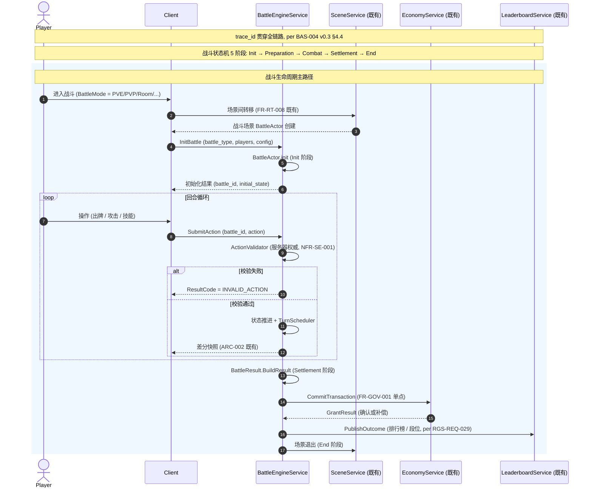
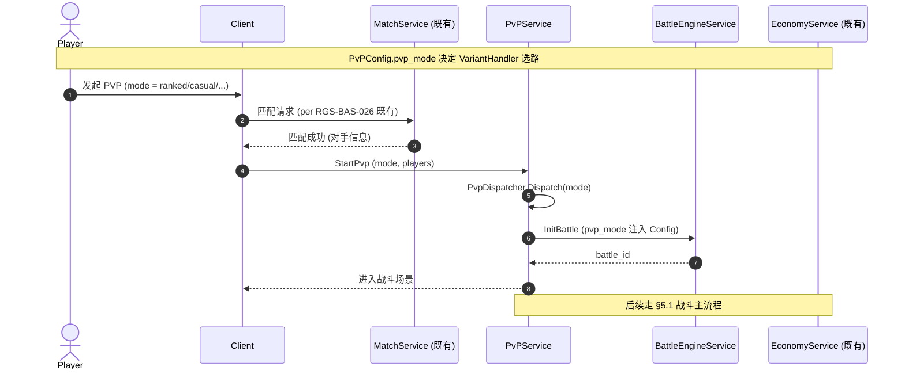
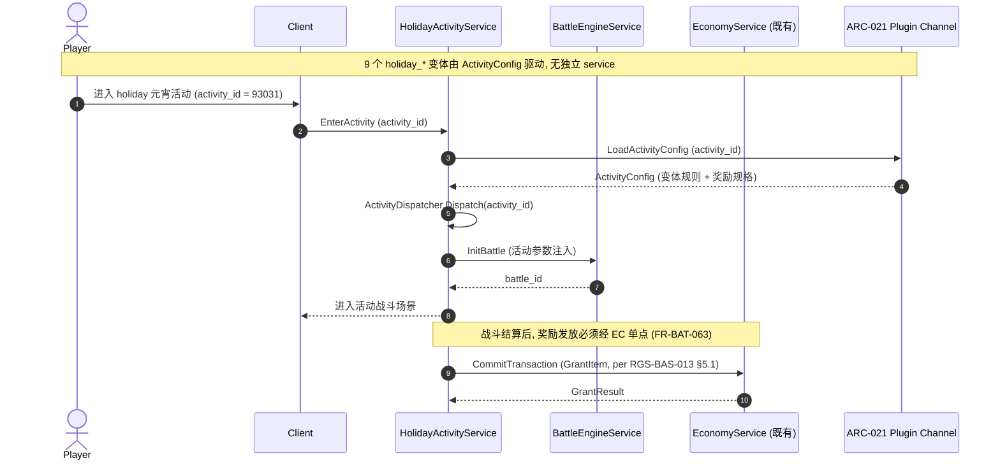

# 基本设计书（基本設計書 / Basic Design Document）

**战斗域（Battle Domain）基本设计 — 战斗引擎 + 数据驱动 PVP/PVE 框架 + 多变体形态**

| 项目 | 内容 |
|---|---|
| 文档编号 | RGS-BAS-040 |
| 版本 | 0.1 (草案) |
| 父文档 | RGS-REQ-040 v0.1 战斗域 需求定义书（本文档为其逻辑级细化，不改变任何既有决定，仅将业务需求落实为组件/接口设计） |
| 制定日 | 2026-09-11 |
| 制定者 | 架构师 (worktree wt-b, ULYS-1 子任务) |
| 关联下游 | RGS-DTL-047 / battle/v1/battle.proto (12 service, 250 RPC) |
| 状态 | 草案, 待评审 |
| 关联 crate | `crates/battle-service/` (battle_db, 2,875 LOC) |
| ARC | ARC-046（战斗域数据驱动 + 反"一活动一模块"原则） |

---

## 修订历史（改訂履歴 / Revision History）

| 版本 | 修订日 | 修订者 | 审批者 | 修订内容 | 影响范围 |
|---|---|---|---|---|---|
| 0.1 | 2026-09-11 | 架构师 (wt-b agent) | — | 初版制定（per ULYS-1 issue thread 9/4 MD §2 审计识别出 battle-service 为代码先行扩展域，crate 已实装 2,875 LOC、12 service、250 RPC（含 12 HealthCheck），但缺正式 BAS 设计文档）。本文档为 RGS-REQ-040 的基本设计展开 | 全部 |

## 审批栏（承認欄 / Approval）

| 角色 | 姓名 | 审批日 | 备注 |
|---|---|---|---|
| 制定（起草） | 架构师 (wt-b agent) | 2026-09-11 | — |
| 评审（技术） | | | 战斗状态机设计是否严格遵循 ARC-001 Actor = 场景单位原则；PVP/PVE 框架是否真正做到数据驱动而非一活动一模块 |
| 评审（DBA） | | | battle_db 物理划分是否与 ARC-008 5 独立 DB → 7 域扩展原则一致 |
| 审批（负责人） | | | 本文档的基准化 |

## 目录

1. 前言
2. 设计目标与约束
3. 架构总览
4. 组件设计
5. 数据流与时序
6. 接口契约
7. 配置驱动的多变体形态（ARC-046 落实）
8. 与既有基础设施的复用边界
9. 本文档的覆盖范围与后续计划

---

# 1. 前言

## 1.1 定位

RGS-REQ-040 给出了战斗域的 12 类 service × 250 RPC（含 12 HealthCheck）业务需求、本文是其逻辑级细化：将 12 个 gRPC service 的功能边界、组件划分、接口契约、调用时序抽象出来，但不进入物理 DDL / Rust trait / 数据流伪代码级别（那是 RGS-DTL-047 的职责）。

本文档不重新决定 RGS-REQ-040 已确定的任何结构性选择：

- 不新建独立子系统（全部复用 ARC-001 Actor + ARC-002 状态同步）
- 不为每个 PVP/holiday 变体新建 service（ARC-046 数据驱动原则）
- 不引入新的战斗客户端预测（属 ARC-002 既有职责）
- 不改变战斗结算后段位/积分的归属（属 RGS-REQ-029 匹配系统 / RGS-REQ-017 排行榜既定职责）

## 1.2 记述规则

沿用 RGS-BAS-024 / RGS-BAS-026 等既有 BAS 文档规则：组件以 UML 类图描述、接口以 Protobuf 风格描述、时序以 mermaid sequenceDiagram 描述。本文档不展开为 Rust 代码 / SQL DDL / Helm 模板。

---

# 2. 设计目标与约束

## 2.1 设计目标

| ID | 目标 | 备注 |
|---|---|---|
| OBJ-BAT-001 | 12 个 service 全部覆盖 RGS-REQ-040 §4〜§10 的功能需求 | per REQ §4〜§10 |
| OBJ-BAT-002 | 6 个 PVP 变体 + 9 个 holiday_* 活动由 PvPService / HolidayActivityService + Config 覆盖 | ARC-046 反例原则 |
| OBJ-BAT-003 | 战斗状态机遵循 ARC-001 Actor = 场景单位原则（一场战斗 = 一个 BattleActor） | per BAS-001 §2 |
| OBJ-BAT-004 | 战斗内同步走既有 ARC-002 差分快照 | 不新建同步算法 |
| OBJ-BAT-005 | 战斗结算的货币/道具发放走 EC 既有确定请求路径 | per RGS-REQ-013 FR-GOV-001 |
| OBJ-BAT-006 | 节日活动 / 远征等高度可变玩法作为 RGS-REQ-009 插件体系下的"特性开关 + 配置数据"承载 | ARC-021 |

## 2.2 约束

| ID | 类别 | 约束 | 来源 |
|---|---|---|---|
| CON-BAT-001 | 架构 | 一场战斗 = 一个 BattleActor，复用 ARC-001 状态机 | RGS-REQ-040 §1.3 |
| CON-BAT-002 | 反例 | 6 个 PVP 变体**不得**重复 6 套代码 | ARC-046（per 9/4 MD §4） |
| CON-BAT-003 | 反例 | 9 个 holiday_* 活动**不得**重复 9 套代码 | ARC-046 |
| CON-BAT-004 | 数据库 | 本域落位独立 `battle_db`，**不**与 player/social/economy 混库 | ARC-008（5 独立 DB → 7 域扩展） |
| CON-BAT-005 | 经济 | 战斗结算永久事实**必须**经 EC 单点 | RGS-REQ-013 FR-GOV-001 |
| CON-BAT-006 | 插件 | 节日活动**必须**经 ARC-021 既有插件通道上线，**不得**要求重新部署 battle-service | RGS-REQ-009 |
| CON-BAT-007 | 匹配 | PVP 玩家入队**必须**经 MT（match）既有匹配流程 | RGS-REQ-029 |
| CON-BAT-008 | 安全 | `SubmitAction` **必须**服务器权威校验 | NFR-SE-001 |
| CON-BAT-009 | 隐私 | 跨服 PVP **不得**泄露对方玩家精确位置 / 个人信息 | NFR-SE-005 |

---

# 3. 架构总览

## 3.1 系统组件图

```
                     ┌─────────────────────────┐
                     │  Client (Unity/UE/Bevy) │
                     └────────────┬────────────┘
                                  │ gRPC (mTLS)
                                  ▼
        ┌─────────────────────────────────────────────────┐
        │            battle-service (1 Atomic App)         │
        │                                                  │
        │  ┌──────────────┐    ┌──────────────────────┐    │
        │  │ BattleEngine │    │   PvPService         │    │
        │  │ Service      │    │ (6 变体数据驱动)     │    │
        │  │ (状态机)     │    │   - ranked           │    │
        │  └──────┬───────┘    │   - casual           │    │
        │         │            │   - cross-server     │    │
        │         │            │   - arena            │    │
        │         │            │   - tournament       │    │
        │         │            │   - custom           │    │
        │         │            └──────────────────────┘    │
        │  ┌──────┴────────┐   ┌──────────────────────┐    │
        │  │ BossService   │   │   RoomService         │    │
        │  │ (PVE BOSS)    │   │ (房间战 + 矿战)      │    │
        │  └───────────────┘   └──────────────────────┘    │
        │  ┌───────────────┐   ┌──────────────────────┐    │
        │  │ InstanceSvc   │   │   EndlessTower /     │    │
        │  │ (副本)        │   │   Escort / HolyEquip │    │
        │  └───────────────┘   │   / GuildWar         │    │
        │                       └──────────────────────┘    │
        │  ┌──────────────────────────────────────────┐    │
        │  │ CrossServer / Expedition / Holiday       │    │
        │  │ (复用 PvPService 数据驱动 + ARC-021 插件) │    │
        │  └──────────────────────────────────────────┘    │
        └────────────┬────────────────────────┬─────────────┘
                     │                        │
                     ▼                        ▼
              ┌─────────────┐         ┌──────────────┐
              │  battle_db  │         │ EC (其他域)  │
              │ (独立 DB)   │         │  Saga 解耦   │
              └─────────────┘         └──────────────┘
```

## 3.2 关键设计权衡

| 选项 | 选择 | 否决方案 | 否决理由 |
|---|---|---|---|
| Actor 粒度 | 场景单位（一战斗 = 一 BattleActor） | 玩家单位 / 战斗类型单位 | ARC-001 已定，违背 = ADR |
| 同步机制 | ARC-002 差分快照 | 自建帧同步 | 与既有同步层重复，浪费 |
| PVP 变体实现 | 1 PvPService + PvPConfig | 6 service × 6 套代码 | ARC-046 反例原则 |
| 节日活动实现 | 1 HolidayActivityService + ActivityConfig | 9 service × 9 套代码 | ARC-046 反例原则 |
| 数据库 | 独立 battle_db | 混用 player_db / social_db | ARC-008 5 独立 DB → 7 域扩展 |
| 结算路径 | EC 单点确定请求 | battle 内直接调用 | FR-GOV-001 |
| 插件载体 | ARC-021 特性开关 + 配置数据 | 沙箱脚本 | 战斗强实时性，沙箱性能不可接受 |

---

# 4. 组件设计

## 4.1 BattleEngineService（proto_200, 31 RPC）

**职责**：核心战斗状态机。一场战斗 = 一个 BattleActor 实例。

| 子组件 | 职责 | 关键接口 |
|---|---|---|
| BattleStateMachine | 5 阶段状态机（Init / Preparation / Combat / Settlement / End） | `InitBattle` / `SubmitAction` / `AdvanceTurn` / `Settle` |
| ActionValidator | 验证玩家提交的动作合法性（服务器权威） | `ValidateAction` |
| TurnScheduler | 回合调度（PVE 即时制 / PVP turn-based） | `ScheduleNextTurn` |
| ResultBuilder | 战斗结算（生成 BattleResult + 战斗日志） | `BuildResult` |
| SnapshotPublisher | 战斗状态差分快照（复用 ARC-002） | `PublishSnapshot` |

**状态机**（per RGS-REQ-040 §2 术语 `BattlePhase`）：
```
Init → Preparation → Combat → Settlement → End
                            ↑↓
                          (Pause/Resume)
```

## 4.2 PvPService（proto_202, 30 RPC + proto_243 共享，6 变体）

**职责**：覆盖 6 个 PVP 变体（ranked / casual / cross-server / arena / tournament / custom），由 PvPConfig 数据驱动，**不**为每个变体新建 service。

| 子组件 | 职责 | 关键接口 |
|---|---|---|
| PvpConfigLoader | 从 ARC-021 插件通道加载 PvPConfig | `LoadConfig` |
| PvpDispatcher | 根据 variant 字段分发到对应变体处理器 | `Dispatch` |
| VariantHandler[6] | 6 个变体的具体业务逻辑（ranked 段位匹配 / casual 快速匹配 / arena 房间制 / tournament 锦标赛 / custom 自定义规则） | per-variant |
| MatchOutcomePublisher | 战斗结果发布至 GSM（排行榜） | `PublishOutcome` |

**配置驱动关键点**（ARC-046）：
- `PvPConfig.pvp_mode` 字段决定 VariantHandler 选路
- 新增变体仅需：① 提交 PvPConfig 数据 ② 经 ARC-021 上线，**无**须代码改动

## 4.3 BossService（proto_205, 15 RPC）

**职责**：PVE BOSS（个人 + 世界）。

| 子组件 | 职责 | 关键接口 |
|---|---|---|
| PersonalBossHandler | 个人 BOSS 战 | `ChallengeBoss` |
| WorldBossHandler | 世界 BOSS 战（公会级） | `AttackWorldBoss` |
| BossRewardCalculator | BOSS 战奖励计算（按伤害贡献 / 排名） | `CalculateReward` |

**与既有 RGS-BAS-026 匹配系统关系**：世界 BOSS 入队走既有 MT 匹配池（per CON-BAT-007）。

## 4.4 RoomService（proto_206, 46 RPC）

**职责**：房间战 + 矿战。

| 子组件 | 职责 | 关键接口 |
|---|---|---|
| RoomManager | 房间生命周期（创建 / 加入 / 离开 / 解散） | `CreateRoom` / `JoinRoom` |
| MineManager | 矿战资源产出与采集 | `OccupyMine` / `CollectResource` |
| RoomBuffApplier | 房间 buff（所有玩家共享的属性加成） | `ApplyBuff` |

**RoomType 枚举**：Normal / Boss / Mine / Escort（per RGS-REQ-040 §2 术语）。

## 4.5 InstanceService（proto_207, 6 RPC）

**职责**：副本。

| 子组件 | 职责 | 关键接口 |
|---|---|---|
| InstanceManager | 副本生命周期 | `EnterInstance` / `ExitInstance` |
| InstanceLogger | 副本挑战日志 | `LogChallenge` |

**说明**：副本作为战斗模式的特殊形态（InstanceMode），BattleEngineService 复用同一状态机，**不**新建独立状态机（per RGS-REQ-040 §6）。

## 4.6 EndlessTowerService（proto_239, 12 RPC）

**职责**：无尽塔（派出 / 雇佣 / BUFF）。

**说明**：当前 12 RPC 全部为 stub，Phase 3 业务实装。本组件设计为"派出挑战 + 雇佣队友 + 累积 BUFF"三层，状态机复用 BattleEngineService。

## 4.7 EscortService（proto_240, 17 RPC）

**职责**：护送（发起 / 掠夺 / 反击）。

**说明**：17 RPC 全部 stub。护送品质枚举（Common / Rare / Epic / Legendary）由 Config 驱动，**不**为每个品质新建 service。

## 4.8 HolyEquipService（proto_241, 23 RPC）

**职责**：圣器养成（进阶 / 升级 / 任务 / 幻化）。

**说明**：23 RPC 全部 stub。圣器作为道具子集，养成路径走既有 EC 体系（per RGS-BAS-014 §2 道具模型），**不**为圣器新建独立经济通道。

## 4.9 GuildWarService（proto_242, 17 RPC）

**职责**：公会战（防守 / 进攻 / 排行）。

**说明**：17 RPC 全部 stub。公会战 NFR-BAT-005 上限 50 人由 GuildConfig.max_participants 配置，**不**硬编码。

## 4.10 CrossServerService（proto_243, 19 RPC）

**职责**：跨服 PVP（跨服挑战 / 录像）。

**关键设计**：复用 PvPService 数据驱动（cross-server 是 6 个 PVP 变体之一），**不**为跨服单独实现战斗逻辑。CrossServerService 仅承担"跨服消息转发 + 数据脱敏"职责（per NFR-BAT-006）。

## 4.11 ExpeditionService（proto_244, 15 RPC）

**职责**：远征（关卡 / 支援 / 雇佣）。

**说明**：15 RPC 全部 stub。复用 BattleEngineService 核心战斗逻辑（per FR-BAT-060），远征专属逻辑仅是"配置不同 + 入口不同"。

## 4.12 HolidayActivityService（proto_248, 18 RPC, 9 变体）

**职责**：1 个 service 覆盖 9 个 holiday_* 变体（bid:93031/...）。

**关键设计**：ARC-046 反例原则的"重灾区"——若放任，必重演[游戏A] 9 套代码反例。本组件全部由 ActivityConfig 驱动，新增 holiday_* 仅需数据上线。

| 子组件 | 职责 | 关键接口 |
|---|---|---|
| ActivityConfigLoader | 从 ARC-021 加载 ActivityConfig | `LoadActivity` |
| ActivityDispatcher | 根据 activity_id 分发 | `Dispatch` |
| VariantActivity[9] | 9 个变体的具体业务逻辑 | per-variant |
| RewardIssuer | 活动奖励发放（必须经 EC 单点，per FR-BAT-063） | `IssueReward` |

---

# 5. 数据流与时序

## 5.1 战斗主流程（BattleEngineService）



## 5.2 PVP 变体分发时序（PvPService）



## 5.3 节日活动时序（HolidayActivityService）



---

# 6. 接口契约

## 6.1 Protobuf 接口契约总览

RGS-REQ-040 §4〜§10 已给出全部业务需求的接口边界，本节仅给关键接口字段级设计示例。

### 6.1.1 InitBattleRequest

```protobuf
message InitBattleRequest {
  common.v1.PlayerId player = 1;          // 发起玩家
  BattleMode battle_mode = 2;             // PVE/PVP/Room/Mine/Guild/Expedition/Holiday/Boss/Instance/EndlessTower/Escort/CrossServer
  string battle_config_id = 3;            // 配置 ID (PVP/节日活动/远征 的 PvPConfig/ActivityConfig 主键)
  repeated common.v1.PlayerId participants = 4;  // 参战玩家 (PVP/Room 需要)
  common.v1.SessionEpoch session_epoch = 5;  // 会话 epoch (per BAS-001 §3 既有)
  string request_id = 6;                  // 幂等键 (per BAS-001 §3.2 OCC + 幂等)
}
```

### 6.1.2 SubmitActionRequest

```protobuf
message SubmitActionRequest {
  string battle_id = 1;                   // 战斗 ID
  common.v1.PlayerId actor = 2;           // 动作发起者
  string action_type = 3;                 // use_skill / attack / defend / flee / end_turn / ...
  uint32 skill_id = 4;                    // 技能 ID (若 action_type = use_skill)
  string target_id = 5;                   // 目标 ID (若需要)
  string payload_json = 6;                // 扩展参数 JSON
  string request_id = 7;                  // 幂等键 (断线重连去重, per NFR-BAT-004)
}
```

### 6.1.3 BattleState (差分快照字段)

```protobuf
message BattleState {
  string battle_id = 1;
  BattlePhase phase = 2;                  // Init/Preparation/Combat/Settlement/End
  uint32 turn_index = 3;
  repeated BattleParticipant participants = 4;
  bytes snapshot_delta = 5;               // ARC-002 差分快照既有格式
  int64 updated_at_ms = 6;
}
```

## 6.2 错误码

沿用 `RGS-SPEC-CROSS-001_错误码字典_v0.1.md` 既有约定，本域新增：

| ResultCode | 含义 | 触发条件 |
|---|---|---|
| `BATTLE_INVALID_ACTION` | 动作非法 | ActionValidator 拒绝 |
| `BATTLE_BATTLE_NOT_FOUND` | 战斗不存在 | battle_id 无效或已结束 |
| `BATTLE_PHASE_INVALID` | 阶段非法（如 Settlement 阶段仍提交动作） | 状态机校验 |
| `BATTLE_RECONNECT_VERSION_MISMATCH` | 重连版本不一致（per NFR-BAT-004） | session_epoch 不匹配 |
| `BATTLE_PARTICIPANT_LIMIT` | 参战人数超限（如公会战 > 50 人） | GuildConfig.max_participants |
| `BATTLE_CONFIG_NOT_FOUND` | 配置不存在（ActivityConfig / PvPConfig 缺失） | ARC-021 插件未上线 |

---

# 7. 配置驱动的多变体形态（ARC-046 落实）

## 7.1 ARC-046 核心原则

| 项目 | 内容 |
|---|---|
| 决定 | 6 个 PVP 变体不重复 6 套代码，9 个 holiday_* 不重复 9 套代码 |
| 理由 | per 9/4 MD §4 + 路线图 §0.3 [游戏A]"一活动一模块"反例明确识别 |
| 承载机制 | ①特性开关 + 配置数据（ARC-021 既有通道）；②不使用沙箱脚本（强实时性）；③不新建独立 service |
| 新增变体流程 | ①策划提交 Config 数据 → ②经 ARC-021 上线 → ③无须代码改动 |
| 否决方案 | "为每个变体新建独立 service / crate"——直接违反 ARC-018 + 9/4 MD §4 |

## 7.2 PvPConfig Schema（逻辑层）

```yaml
# PvPConfig (YAML 形态, 实际落位见 RGS-DTL-047 §2)
pvp_configs:
  - config_id: pvp_ranked_v1
    pvp_mode: RANKED
    match_pool: MATCH_POOL_RANKED
    rating_algorithm: GLICKO2        # per RGS-DTL-026 既有
    reward_table: REWARD_TABLE_RANKED
    snapshot_interval_ms: 50
    max_turn_count: 100
    tie_breaker: HIGHEST_RATING

  - config_id: pvp_casual_v1
    pvp_mode: CASUAL
    match_pool: MATCH_POOL_CASUAL
    rating_algorithm: NONE
    reward_table: REWARD_TABLE_CASUAL
    snapshot_interval_ms: 50
    max_turn_count: 200
    tie_breaker: RANDOM

  - config_id: pvp_cross_server_v1
    pvp_mode: CROSS_SERVER
    match_pool: MATCH_POOL_CROSS_SERVER
    rating_algorithm: GLICKO2
    reward_table: REWARD_TABLE_CROSS_SERVER
    privacy_filter: STRICT            # per NFR-BAT-006
    snapshot_interval_ms: 100         # 跨服延迟容忍

  # ... arena / tournament / custom 同款
```

## 7.3 ActivityConfig Schema（逻辑层）

```yaml
# ActivityConfig (YAML 形态, 实际落位见 RGS-DTL-047 §3)
activity_configs:
  - activity_id: 93031                # holiday 元宵
    name: 元宵灯会
    entry_level: 20
    battle_mode: ACTIVITY_PVE
    battle_config_id: activity_93031_battle_v1
    reward_table: REWARD_TABLE_93031
    duration_days: 7
    max_entries_per_player: 3
    cross_server: false

  # ... 其他 8 个 holiday_* 同款
```

## 7.4 新增变体的标准流程

```
1. 策划 / 数值 → 提交 PvPConfig / ActivityConfig YAML 数据
2. 架构评审（ARC-018 挂载脚手架） → 确认无代码改动需求
3. ARC-021 插件通道上线 → config_loader 热加载
4. 灰度发布（10% → 50% → 100%）
5. 数据监控（战斗时长 / 奖励发放 / 异常率）
```

---

# 8. 与既有基础设施的复用边界

| 既有机制 | 本域使用方式 | 不做什么 |
|---|---|---|
| ARC-001 Actor = 场景单位 | BattleActor 作为场景 Actor 的一种特殊形态 | 不新建独立 Actor 模型 |
| ARC-002 状态同步 + 客户端预测 | 战斗内同步走既有差分快照 | 不另建同步算法 |
| ARC-008 5 独立 DB → 7 域扩展 | 落位独立 `battle_db` | 不混用 player / social / economy |
| ARC-011 Saga 单调解者 | 战斗结算经 EC 既有路径 | 不在 battle 内发起 Saga |
| ARC-021 插件热插拔 | 节日活动 / 远征作为特性开关 + 配置数据 | 不使用沙箱脚本 |
| RGS-BAS-013 §2.2 大厅作为特殊场景 | 战斗场景从大厅转入走 FR-RT-008 | 不绕过场景间转移机制 |
| RGS-BAS-026 匹配系统 | PVP 玩家入队经 MT | 不在 battle 内另建匹配 |
| RGS-BAS-014 排行榜任务成就 | 战斗产生的段位/积分走既有 GSM | 不在 battle 内维护排行榜 |
| RGS-REQ-009 插件热插拔 | 节日活动 / 远征作为插件承载 | 不重新部署 battle-service |

---

# 9. 本文档的覆盖范围与后续计划

本文档覆盖：
- 战斗域 12 个 service 的组件划分、子组件职责与接口边界
- 战斗状态机、PVP 变体分发、节日活动分发的核心时序
- PvPConfig / ActivityConfig 数据驱动 Schema 的逻辑层
- 与既有 9 项基础设施的复用边界
- ARC-046 反例原则的落实机制

**审计发现（per ULYS-1 9/4 MD §2）**：战斗域为代码先行扩展域，crate `battle-service` 已实装 2,875 LOC、12 service、250 RPC（含 12 HealthCheck），30 RPC 为真实业务逻辑、220 RPC 为 Unimplemented stub，文档全部缺失。本文档作为补全的中间层（BAS），其上层 RGS-REQ-040 已先行制定，下层 RGS-DTL-047 同步制定。

本版本明确不覆盖、留待后续：
- Rust trait / SQL DDL / Helm 模板 — 属 RGS-DTL-047 详细设计职责
- 战斗客户端预测算法 — 属 ARC-002 既有同步层职责，本域不重复
- 战斗录像的回放与分享 — 属 replay-extra-service 范畴
- 战斗结算后的段位/积分公式细节 — 属 RGS-REQ-029 / RGS-DTL-026 既有范围
- TBD-BAT-001〜003（跨服 PVP 延迟目标值 / 断线重连时长 / 公会战最大人数） — 留待策划与运营确认
- 6 个 PVP 变体的 VariantHandler 内部算法 — 业务层实现，本文仅给出接口边界

---

## 追溯性

| 需求/设计来源 | 本文档章节 |
|---|---|
| RGS-REQ-040 §1.3 与既有基础设施关系 | §8 |
| RGS-REQ-040 §3 业务需求 (BR-001〜009) | §3, §4 |
| RGS-REQ-040 §4 战斗引擎功能需求 | §4.1 |
| RGS-REQ-040 §5 PVP 变体群 | §4.2, §7.2 |
| RGS-REQ-040 §6 PVE 与副本 | §4.3, §4.5 |
| RGS-REQ-040 §7 房间与矿战 | §4.4 |
| RGS-REQ-040 §8 无尽塔/护送/公会战 | §4.6, §4.7, §4.9 |
| RGS-REQ-040 §9 跨服 PVP | §4.10, §7.2 |
| RGS-REQ-040 §10 远征/节日活动 | §4.11, §4.12, §7.3 |
| RGS-REQ-040 §11 非功能需求 | §2.2 约束 |
| RGS-REQ-040 §12 ARC-046 | §7 全文 |
| ARC-001 Actor = 场景单位 | §3.1, §4.1 |
| ARC-002 状态同步 + 客户端预测 | §5.1, §6.1.3 |
| ARC-008 5 独立 DB → 7 域扩展 | §2.2 CON-BAT-004 |
| ARC-011 Saga 单调解者 | §2.2 CON-BAT-005, §5.1 |
| ARC-018 挂载脚手架 | §2.2, §7.4 |
| ARC-021 插件热插拔 | §4.12, §7.1 |
| ARC-046 数据驱动 + 反"一活动一模块" | §7 全文 |
| RGS-REQ-013 FR-GOV-001 | §2.2 CON-BAT-005, §4.12, §5.1 |
