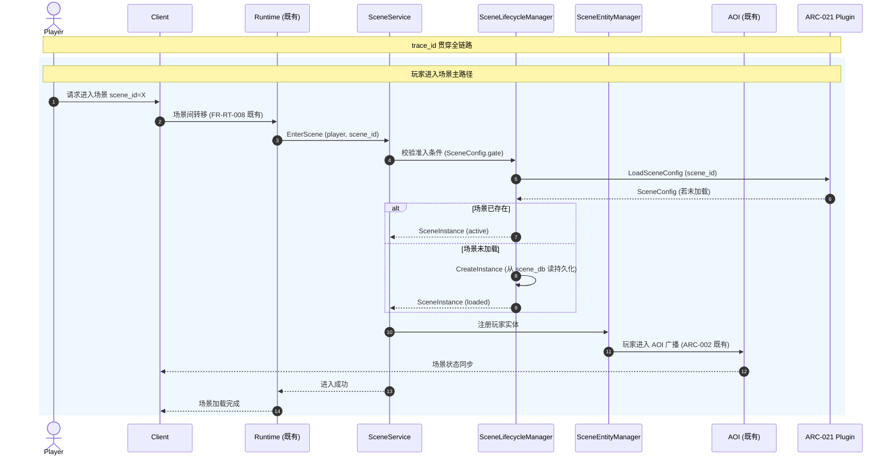
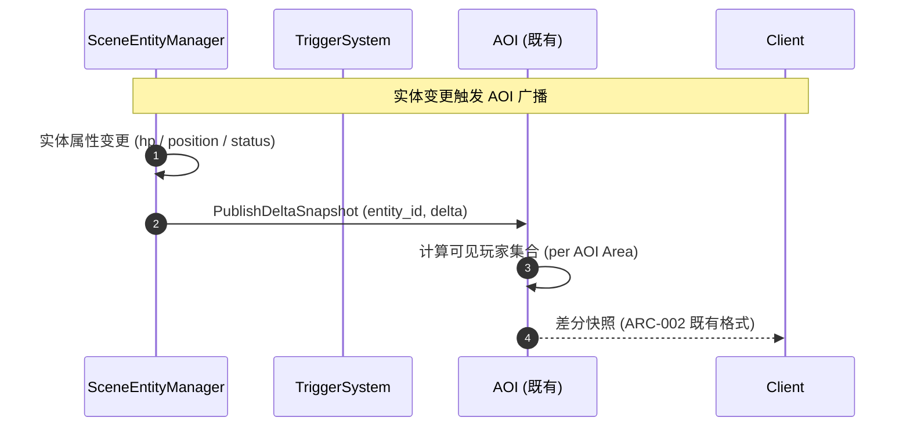
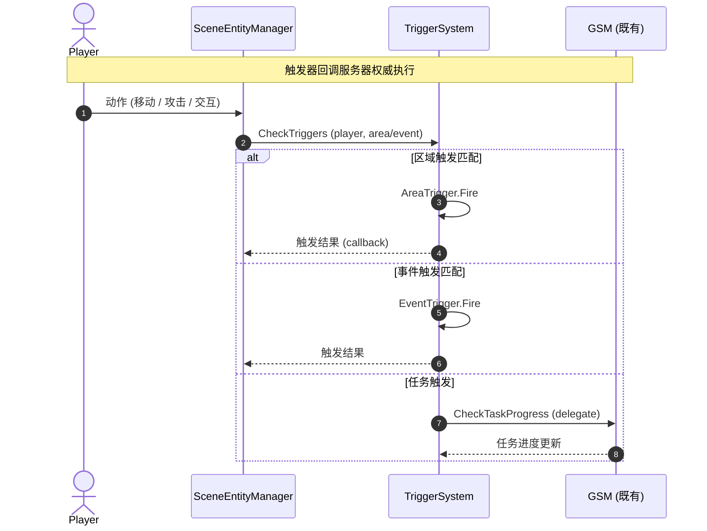

# 基本设计书（基本設計書 / Basic Design Document）

**场景域（Scene Domain）基本设计 — 场景生命周期 + 实体管理 + 触发器系统 + 数据驱动场景配置**

| 项目 | 内容 |
|---|---|
| 文档编号 | RGS-BAS-041 |
| 版本 | 0.1 (草案) |
| 父文档 | RGS-REQ-041 v0.1 场景域 需求定义书（本文档为其逻辑级细化） |
| 制定日 | 2026-09-11 |
| 制定者 | 架构师 (worktree wt-b, ULYS-1 子任务) |
| 关联下游 | RGS-DTL-048 / scene/v1/scene.proto (1 service, 148 RPC) |
| 状态 | 草案, 待评审 |
| 关联 crate | `crates/scene-service/` (scene_db, 3,823 LOC) |
| ARC | ARC-049 |

---

## 修订历史（改訂履歴 / Revision History）

| 版本 | 修订日 | 修订者 | 审批者 | 修订内容 | 影响范围 |
|---|---|---|---|---|---|
| 0.1 | 2026-09-11 | 架构师 (wt-b agent) | — | 初版制定（per ULYS-1 9/4 MD §2 审计）。本文档为 RGS-REQ-041 的基本设计展开 | 全部 |

## 审批栏（承認欄 / Approval）

| 角色 | 姓名 | 审批日 | 备注 |
|---|---|---|---|
| 制定（起草） | 架构师 (wt-b agent) | 2026-09-11 | — |
| 评审（技术） | | | 场景域设计是否严格遵循 ARC-001 Actor = 场景单位 + ARC-002 AOI 复用 |
| 评审（DBA） | | | scene_db 物理划分是否与 ARC-008 5 独立 DB → 7 域扩展一致 |
| 审批（负责人） | | | 本文档的基准化 |

## 目录

1. 前言
2. 设计目标与约束
3. 架构总览
4. 组件设计
5. 数据流与时序
6. 接口契约
7. 配置驱动的多变体形态（ARC-049 落实）
8. 与既有基础设施的复用边界
9. 本文档的覆盖范围与后续计划

---

# 1. 前言

## 1.1 定位

RGS-REQ-041 给出了场景域 1 service × 148 RPC 的业务需求，本文是其逻辑级细化：将 1 个 gRPC service 的功能边界、组件划分、接口契约、调用时序抽象出来，但不进入物理 DDL / Rust trait / 数据流伪代码级别（那是 RGS-DTL-048 的职责）。

本文档不重新决定 RGS-REQ-041 已确定的任何结构性选择：不新建独立子系统（全部复用 ARC-001 Actor + ARC-002 AOI）、不为每个新场景新建 service（ARC-049 数据驱动原则）、不绕过既有 RT 场景间转移（FR-RT-008）。

## 1.2 记述规则

沿用既有 BAS 文档规则：组件以 UML 类图描述、接口以 Protobuf 风格描述、时序以 mermaid sequenceDiagram 描述。

---

# 2. 设计目标与约束

## 2.1 设计目标

| ID | 目标 | 备注 |
|---|---|---|
| OBJ-SCN-001 | 1 个 service 全部覆盖 RGS-REQ-041 §4 的功能需求 | per REQ §4 |
| OBJ-SCN-002 | 新增场景由 SceneConfig 数据驱动，**无**须代码改动 | ARC-049 |
| OBJ-SCN-003 | 场景状态机遵循 ARC-001 Actor = 场景单位原则 | per BAS-001 §2 |
| OBJ-SCN-004 | 场景内同步严格走 ARC-002 AOI 既有机制 | 不另建同步层 |
| OBJ-SCN-005 | 玩家进出场景走既有 FR-RT-008 场景间转移 | 不绕过 |
| OBJ-SCN-006 | 场景配置作为 ARC-021 插件通道承载 | per RGS-REQ-009 |

## 2.2 约束

| ID | 类别 | 约束 | 来源 |
|---|---|---|---|
| CON-SCN-001 | 架构 | 一个 SceneService 实例 = 一个 SceneActor | ARC-001 |
| CON-SCN-002 | 反例 | 新增场景**不得**新建独立 service / crate | ARC-049（per 9/4 MD §4） |
| CON-SCN-003 | 数据库 | 本域落位独立 `scene_db`，**不**与 player/social/economy 混库 | ARC-008 |
| CON-SCN-004 | 复用 | 场景内同步**严格**走 ARC-002 AOI 既有 | ARC-002 |
| CON-SCN-005 | 复用 | 玩家进出场景**必须**经 FR-RT-008 既有机制 | RGS-BAS-013 §2.2 |
| CON-SCN-006 | 任务 | 任务触发**必须**经既有 GSM，**不**在 scene 内另建任务 | RGS-BAS-014 §3 |
| CON-SCN-007 | 安全 | 触发器回调**必须**服务器权威执行 | NFR-SE-001 |

---

# 3. 架构总览

## 3.1 系统组件图

```
                     ┌─────────────────────────┐
                     │  Client (Unity/UE/Bevy) │
                     └────────────┬────────────┘
                                  │ gRPC (mTLS)
                                  ▼
        ┌─────────────────────────────────────────────────┐
        │            scene-service (1 Atomic App)          │
        │                                                  │
        │  ┌────────────────┐  ┌─────────────────────────┐ │
        │  │ SceneLifecycle │  │ SceneEntityManager      │ │
        │  │ Manager        │  │ - NPCManager            │ │
        │  │ - LoadScene    │  │ - MonsterManager        │ │
        │  │ - UnloadScene  │  │ - ItemManager           │ │
        │  │ - PersistScene │  │ - DecorationManager     │ │
        │  └────────────────┘  └─────────────────────────┘ │
        │  ┌────────────────────────────────────────────┐ │
        │  │ TriggerSystem                              │ │
        │  │ - AreaTrigger (rect/circle/polygon)        │ │
        │  │ - EventTrigger (action_id + params)        │ │
        │  │ - TaskTrigger (delegated to GSM)           │ │
        │  └────────────────────────────────────────────┘ │
        │  ┌────────────────────────────────────────────┐ │
        │  │ SceneConfigLoader (ARC-021 plugin channel) │ │
        │  └────────────────────────────────────────────┘ │
        └────────────┬────────────────────────┬─────────────┘
                     │                        │
                     ▼                        ▼
              ┌─────────────┐         ┌──────────────┐
              │  scene_db   │         │ GSM / 其他域│
              │ (独立 DB)   │         │ (Saga 解耦)  │
              └─────────────┘         └──────────────┘
```

## 3.2 关键设计权衡

| 选项 | 选择 | 否决方案 | 否决理由 |
|---|---|---|---|
| Actor 粒度 | 场景单位 | 玩家单位 / 场景类型单位 | ARC-001 已定 |
| 同步机制 | ARC-002 AOI 差分 | 自建帧同步 | 与既有同步层重复 |
| 新增场景实现 | SceneConfig 数据驱动 | 新建 service | ARC-049 反例原则 |
| 数据库 | 独立 scene_db | 混用 player_db | ARC-008 |
| 任务触发 | 经 GSM 既有任务系统 | scene 内自建任务 | 任务领域归属 GSM |
| 插件载体 | ARC-021 特性开关 + 配置数据 | 沙箱脚本 | 强实时性 |

---

# 4. 组件设计

## 4.1 SceneLifecycleManager

**职责**：场景的加载 / 运行 / 持久化 / 卸载全生命周期。

| 子组件 | 职责 | 关键接口 |
|---|---|---|
| SceneInstanceFactory | 根据 SceneConfig 创建 SceneInstance | `CreateInstance` |
| SceneStatePersister | 场景状态持久化（per RGS-DTL-001 §3.2 OCC） | `Persist` |
| SceneUnloadPolicy | 卸载策略（无玩家 + 无持久任务时卸载） | `ShouldUnload` |

**状态机**（per ARC-001 复用）：
```
Init → Loading → Running → Persisting → Unloading → End
                          ↑↓
                        (Pause/Resume for maintenance)
```

## 4.2 SceneEntityManager

**职责**：4 类实体（NPC / 怪物 / 道具 / 装饰）的 CRUD + 属性维护 + AI。

| 子组件 | 职责 | 关键接口 |
|---|---|---|
| NPCManager | NPC 实体 CRUD + 对话触发 | `SpawnNPC` / `RemoveNPC` |
| MonsterManager | 怪物实体 CRUD + AI | `SpawnMonster` / `TickAI` |
| ItemManager | 道具实体 CRUD + 拾取 | `SpawnItem` / `PickupItem` |
| DecorationManager | 装饰实体 CRUD（静态） | `PlaceDecoration` |

**实体属性变更**：必须触发 AOI 广播（per FR-SCN-021）。

## 4.3 TriggerSystem

**职责**：3 类触发器（区域 / 事件 / 任务）。

| 子组件 | 职责 | 关键接口 |
|---|---|---|
| AreaTrigger | 区域触发（矩形 / 圆形 / 多边形） | `CheckArea` |
| EventTrigger | 事件触发（动作 ID + 参数匹配） | `CheckEvent` |
| TaskTrigger | 任务触发（委托给 GSM） | `CheckTask` |

**触发器时序**：进入 / 离开 / 停留 3 种（per FR-SCN-033）。

## 4.4 SceneConfigLoader

**职责**：从 ARC-021 插件通道加载 SceneConfig。

**关键设计**：SceneConfig 是新增场景的唯一入口。新增场景流程：①关卡设计提交 SceneConfig YAML → ②ARC-021 上线 → ③无须代码改动。

---

# 5. 数据流与时序

## 5.1 玩家进入场景主流程



## 5.2 实体变更 → AOI 广播



## 5.3 触发器触发流程



---

# 6. 接口契约

## 6.1 Protobuf 接口契约

### 6.1.1 EnterSceneRequest

```protobuf
message EnterSceneRequest {
  common.v1.PlayerId player = 1;
  string scene_id = 2;                     // 场景配置 ID
  string request_id = 3;                   // 幂等键 (per RGS-DTL-001 §3.2)
  common.v1.SessionEpoch session_epoch = 4;
}
```

### 6.1.2 SceneState

```protobuf
message SceneState {
  string scene_instance_id = 1;
  string scene_id = 2;                     // SceneConfig 主键
  repeated EntitySnapshot entities = 3;    // 实体快照列表
  bytes aoi_delta = 4;                     // ARC-002 差分快照既有格式
  int64 updated_at_ms = 5;
}
```

### 6.1.3 EntitySnapshot

```protobuf
message EntitySnapshot {
  string entity_id = 1;
  EntityType type = 2;                     // NPC / MONSTER / ITEM / DECORATION
  bytes position = 3;                       // 位置 (per ARC-002 既有)
  map<string, bytes> attrs = 4;            // 属性 (hp / mp / status ...)
}
```

## 6.2 错误码

沿用 `RGS-SPEC-CROSS-001` 既有约定，本域新增：

| ResultCode | 含义 | 触发条件 |
|---|---|---|
| `SCENE_NOT_FOUND` | 场景不存在 | scene_id 无效 |
| `SCENE_GATE_DENIED` | 准入条件不满足 | 等级 / 任务前置不达标 |
| `SCENE_FULL` | 场景已满 | max_players 超限 |
| `SCENE_TRIGGER_FORBIDDEN` | 触发器回调被拒 | 服务器权威校验失败（per NFR-SCN-005） |

---

# 7. 配置驱动的多变体形态（ARC-049 落实）

## 7.1 SceneConfig Schema（逻辑层）

```yaml
# SceneConfig (YAML 形态, 实际落位见 RGS-DTL-048 §2)
scene_configs:
  - scene_id: world_main_city_v1
    name: 主城
    scene_type: WORLD_CITY
    map_id: map_main_city
    max_players: 200
    entry_level: 1
    entry_task: null
    entities:
      - { type: NPC, id: npc_shop_001, position: {x: 100, y: 200} }
      - { type: NPC, id: npc_quest_001, position: {x: 150, y: 250} }
      - { type: DECORATION, id: deco_tree_001, position: {x: 50, y: 100} }
    triggers:
      - { type: AREA, shape: RECT, bounds: [100,200,200,300], callback: enter_safe_zone }
      - { type: EVENT, action_id: use_item_001, callback: trigger_quest_progress }

  - scene_id: dungeon_fire_v1
    name: 火焰副本
    scene_type: DUNGEON
    map_id: map_dungeon_fire
    max_players: 5
    entry_level: 20
    entry_task: quest_chain_fire_01
    entities:
      - { type: MONSTER, id: mob_fire_dragon, position: {x: 500, y: 500} }
    triggers:
      - { type: AREA, shape: CIRCLE, center: [500,500], radius: 100, callback: boss_fight_start }
```

## 7.2 新增场景的标准流程

```
1. 关卡设计 → 提交 SceneConfig YAML
2. 架构评审 (ARC-018 挂载脚手架) → 确认无代码改动需求
3. ARC-021 插件通道上线 → scene_config_loader 热加载
4. 灰度发布 (10% → 50% → 100%)
5. 监控 (场景加载 P99 / AOI 广播流量)
```

---

# 8. 与既有基础设施的复用边界

| 既有机制 | 本域使用方式 | 不做什么 |
|---|---|---|
| ARC-001 Actor = 场景单位 | SceneActor 作为场景 Actor | 不新建独立 Actor 模型 |
| ARC-002 状态同步 + AOI | 场景内同步走既有 AOI | 不另建同步算法 |
| ARC-008 5 独立 DB → 7 域扩展 | 落位独立 `scene_db` | 不混用 player/social/economy |
| ARC-021 插件热插拔 | SceneConfig 作为特性开关 + 配置数据 | 不使用沙箱脚本 |
| RGS-BAS-013 §2.2 大厅作为特殊场景 | 玩家进出场景走 FR-RT-008 | 不绕过 |
| RGS-BAS-014 排行榜任务成就 | 任务触发经既有 GSM | 不在 scene 内自建任务 |
| RGS-BAS-026 匹配系统 | PVP 场景进入经 MT 匹配 | 不在 scene 内自建匹配 |

---

# 9. 本文档的覆盖范围与后续计划

本文档覆盖：
- 场景域 1 service 的组件划分、子组件职责与接口边界
- 玩家进入场景、实体变更 → AOI 广播、触发器触发的核心时序
- SceneConfig 数据驱动 Schema 的逻辑层
- 与既有 7 项基础设施的复用边界
- ARC-049 反例原则的落实机制

本版本明确不覆盖、留待后续：
- Rust trait / SQL DDL / Helm 模板 — 属 RGS-DTL-048 详细设计职责
- 客户端地图渲染 / LOD — 属客户端范畴
- 场景编辑器（SceneConfig 编写工具）— 属独立工具，本域不重复
- TBD-SCN-001/002（断线重连时长 / 单场景最大玩家数）— 留待策划确认

---

## 追溯性

| 需求/设计来源 | 本文档章节 |
|---|---|
| RGS-REQ-041 §1.3 与既有基础设施关系 | §8 |
| RGS-REQ-041 §3 业务需求 (BR-SCN-001〜005) | §3, §4 |
| RGS-REQ-041 §4 功能需求 | §4 |
| RGS-REQ-041 §5 非功能需求 | §2.2 约束 |
| RGS-REQ-041 §6 ARC-049 | §7 全文 |
| ARC-001 Actor = 场景单位 | §3.1, §4.1 |
| ARC-002 状态同步 + AOI | §5.2, §6.1.2 |
| ARC-008 5 独立 DB → 7 域扩展 | §2.2 CON-SCN-003 |
| ARC-021 插件热插拔 | §4.4, §7.1 |
| ARC-049 数据驱动 | §7 全文 |
