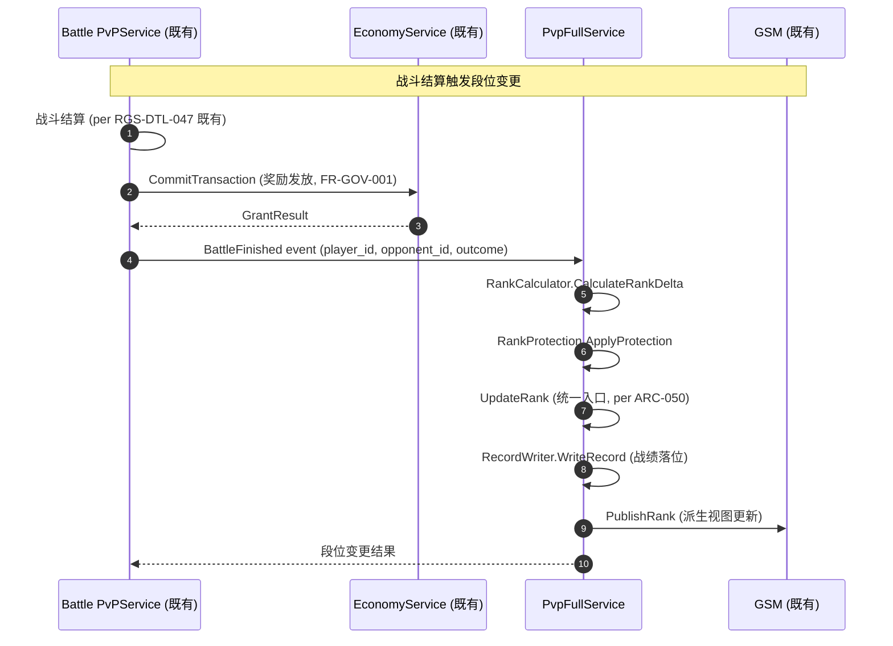
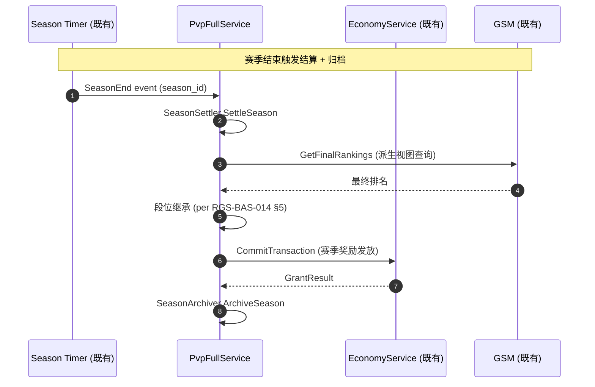
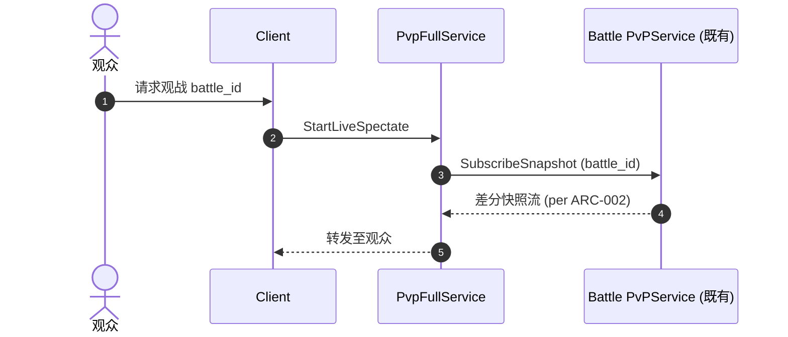

# 基本设计书（基本設計書 / Basic Design Document）

**竞技域（PvP-Full Domain）基本设计 — 赛季生命周期 + 段位系统 + 战绩 + 观战**

| 项目 | 内容 |
|---|---|
| 文档编号 | RGS-BAS-042 |
| 版本 | 0.1 (草案) |
| 父文档 | RGS-REQ-042 v0.1 竞技域 需求定义书（本文档为其逻辑级细化） |
| 制定日 | 2026-09-11 |
| 制定者 | 架构师 (worktree wt-b, ULYS-1 子任务) |
| 关联下游 | RGS-DTL-049 / pvp_full/v1/pvp_full.proto (1 service, 30 RPC) |
| 状态 | 草案, 待评审 |
| 关联 crate | `crates/pvp-full-service/` (pvp_full_db, 1,402 LOC) |
| ARC | ARC-050 |

---

## 修订历史（改訂履歴 / Revision History）

| 版本 | 修订日 | 修订者 | 审批者 | 修订内容 | 影响范围 |
|---|---|---|---|---|---|
| 0.1 | 2026-09-11 | 架构师 (wt-b agent) | — | 初版制定（per ULYS-1 9/4 MD §2 审计）。本文档为 RGS-REQ-042 的基本设计展开 | 全部 |

## 审批栏（承認欄 / Approval）

| 角色 | 姓名 | 审批日 | 备注 |
|---|---|---|---|
| 制定（起草） | 架构师 (wt-b agent) | 2026-09-11 | — |
| 评审（技术） | | | 战斗状态机是否严格复用 battle PvPService；排行榜是否走 GSM 派生视图 |
| 评审（DBA） | | | pvp_full_db 物理划分是否与 ARC-008 一致 |
| 审批（负责人） | | | 本文档的基准化 |

## 目录

1. 前言
2. 设计目标与约束
3. 架构总览
4. 组件设计
5. 数据流与时序
6. 接口契约
7. 配置驱动的多变体形态（ARC-050 落实）
8. 与既有基础设施的复用边界
9. 本文档的覆盖范围与后续计划

---

# 1. 前言

## 1.1 定位

RGS-REQ-042 给出了竞技域 1 service × 30 RPC 的业务需求，本文是其逻辑级细化：将 1 个 gRPC service 的功能边界、组件划分、接口契约、调用时序抽象出来。

本文档不重新决定 RGS-REQ-042 已确定的任何结构性选择：不重建战斗状态机、不绕过 EC、不绕过 GSM、不绕过 MT。

## 1.2 记述规则

沿用既有 BAS 文档规则：组件以 UML 类图描述、接口以 Protobuf 风格描述、时序以 mermaid sequenceDiagram 描述。

---

# 2. 设计目标与约束

## 2.1 设计目标

| ID | 目标 | 备注 |
|---|---|---|
| OBJ-PVP-001 | 1 个 service 全部覆盖 RGS-REQ-042 §4 的功能需求 | per REQ §4 |
| OBJ-PVP-002 | 战斗状态机严格复用 battle-service PvPService | per ARC-046 / ARC-050 |
| OBJ-PVP-003 | 排行榜严格走 GSM 派生视图 | per RGS-BAS-014 §4 |
| OBJ-PVP-004 | 战斗结算严格走 EC 单点 | per FR-GOV-001 |
| OBJ-PVP-005 | 赛季规则作为 ARC-021 既有插件通道承载 | per RGS-REQ-009 |

## 2.2 约束

| ID | 类别 | 约束 | 来源 |
|---|---|---|---|
| CON-PVP-001 | 复用 | 战斗状态机**严格**复用 battle-service PvPService | ARC-046 |
| CON-PVP-002 | 复用 | 排行榜**严格**走 GSM 派生视图 | RGS-BAS-014 §4 |
| CON-PVP-003 | 经济 | 战斗结算**必须**经 EC 单点 | FR-GOV-001 |
| CON-PVP-004 | 匹配 | 竞技匹配池边界**必须**经 MT 既有 | RGS-REQ-029 |
| CON-PVP-005 | 数据库 | 本域落位独立 `pvp_full_db` | ARC-008 |
| CON-PVP-006 | 反例 | 段位 / 赛季**不得**为每变体新建 service | ARC-050 |
| CON-PVP-007 | 插件 | 赛季规则**必须**经 ARC-021 既有通道上线 | RGS-REQ-009 |

---

# 3. 架构总览

## 3.1 系统组件图

```
                     ┌─────────────────────────┐
                     │  Client (Unity/UE/Bevy) │
                     └────────────┬────────────┘
                                  │ gRPC (mTLS)
                                  ▼
        ┌─────────────────────────────────────────────────┐
        │            pvp-full-service (1 Atomic App)       │
        │                                                  │
        │  ┌────────────────┐  ┌─────────────────────────┐ │
        │  │ SeasonManager  │  │ RankSystem              │ │
        │  │ - CreateSeason │  │ - UpdateRank (统一入口) │ │
        │  │ - SettleSeason │  │ - RankProtection        │ │
        │  │ - ArchiveSeason│  │   (per RGS-BAS-026 §4) │ │
        │  └────────────────┘  └─────────────────────────┘ │
        │  ┌────────────────┐  ┌─────────────────────────┐ │
        │  │ PvpRecordMgr   │  │ SpectateService         │ │
        │  │ - QueryHistory │  │ - LiveSpectate          │ │
        │  │ - PrivacyFilter│  │ - ReplaySpectate        │ │
        │  └────────────────┘  │   (per replay-extra)   │ │
        │                       └─────────────────────────┘ │
        │  ┌────────────────────────────────────────────┐ │
        │  │ SeasonConfigLoader (ARC-021 plugin channel) │ │
        │  └────────────────────────────────────────────┘ │
        └────────────┬────────────────────────┬─────────────┘
                     │                        │
                     ▼                        ▼
              ┌──────────────┐         ┌──────────────┐
              │ pvp_full_db  │         │  battle /    │
              │ (独立 DB)    │         │  EC / GSM    │
              │              │         │  (既有域)    │
              └──────────────┘         └──────────────┘
```

## 3.2 关键设计权衡

| 选项 | 选择 | 否决方案 | 否决理由 |
|---|---|---|---|
| 战斗状态机 | 复用 battle PvPService | 自建 | ARC-046 + ARC-050 |
| 排行榜 | GSM 派生视图 | 自建 | RGS-BAS-014 §4 既有 |
| 数据库 | 独立 pvp_full_db | 混用 battle_db | ARC-008 |
| 段位保护 | RGS-BAS-026 §4 既有 | 自建 | 段位保护属匹配系统职责 |
| 插件载体 | ARC-021 特性开关 + 配置数据 | 沙箱脚本 | 强实时性 |

---

# 4. 组件设计

## 4.1 SeasonManager

**职责**：赛季生命周期（创建 / 运行 / 结算 / 归档）。

| 子组件 | 职责 | 关键接口 |
|---|---|---|
| SeasonInstanceFactory | 根据 SeasonConfig 创建赛季实例 | `CreateSeason` |
| SeasonSettler | 赛季结算（段位继承 + 奖励发放经 EC） | `SettleSeason` |
| SeasonArchiver | 赛季归档（per RGS-BAS-014 §5 既有） | `ArchiveSeason` |

**状态机**：
```
Init → Running → Settling → Archiving → End
```

## 4.2 RankSystem

**职责**：段位系统（8 段位 + 段位保护）。

| 子组件 | 职责 | 关键接口 |
|---|---|---|
| RankCalculator | 根据战斗结算计算段位变化 | `CalculateRankDelta` |
| RankProtection | 连败保护（per RGS-BAS-026 §4 既有） | `ApplyProtection` |
| RankPublisher | 段位变更发布至 GSM 派生视图 | `PublishRank` |

**统一入口**：`UpdateRank`（per ARC-050 单一入口原则）。

## 4.3 PvpRecordMgr

**职责**：战绩记录（CRUD + 隐私过滤）。

| 子组件 | 职责 | 关键接口 |
|---|---|---|
| RecordWriter | 写入战绩（由 battle-service 事件触发） | `WriteRecord` |
| RecordQuery | 查询战绩（30 天内分页 + 过滤） | `QueryHistory` |
| PrivacyFilter | 隐私过滤（per NFR-SE-005 既有） | `Filter` |

## 4.4 SpectateService

**职责**：观战（实时 + 录像回放）。

| 子组件 | 职责 | 关键接口 |
|---|---|---|
| LiveSpectator | 实时观战（延迟 < 2 秒） | `StartLiveSpectate` |
| ReplaySpectator | 录像回放（per replay-extra 既有） | `StartReplaySpectate` |

## 4.5 SeasonConfigLoader

**职责**：从 ARC-021 插件通道加载 SeasonConfig。

---

# 5. 数据流与时序

## 5.1 战斗结算 → 段位变更主流程



## 5.2 赛季结算主流程



## 5.3 观战实时订阅



---

# 6. 接口契约

## 6.1 Protobuf 接口契约

### 6.1.1 UpdateRankRequest

```protobuf
message UpdateRankRequest {
  common.v1.PlayerId player = 1;
  string season_id = 2;
  int32 rank_delta = 3;                    // 段位变化量 (+1 升 / -1 降)
  int32 score_delta = 4;                   // 积分变化量
  common.v1.SessionEpoch session_epoch = 5;
  string request_id = 6;                   // 幂等键 (per RGS-DTL-001 §3.2)
}
```

### 6.1.2 PvpRecord

```protobuf
message PvpRecord {
  string record_id = 1;
  common.v1.PlayerId player = 2;
  common.v1.PlayerId opponent = 3;
  string season_id = 4;
  BattleOutcome outcome = 5;
  int32 rank_before = 6;
  int32 rank_after = 7;
  int32 score_delta = 8;
  int64 finished_at_ms = 9;
}
```

## 6.2 错误码

沿用 `RGS-SPEC-CROSS-001` 既有约定，本域新增：

| ResultCode | 含义 | 触发条件 |
|---|---|---|
| `PVP_SEASON_NOT_FOUND` | 赛季不存在 | season_id 无效 |
| `PVP_SEASON_ENDED` | 赛季已结束 | season status = Archived |
| `PVP_RANK_INVALID` | 段位非法 | rank 超出 8 段位范围 |
| `PVP_RECORD_FORBIDDEN` | 战绩查询被拒（隐私过滤） | per NFR-SE-005 |

---

# 7. 配置驱动的多变体形态（ARC-050 落实）

## 7.1 SeasonConfig Schema（逻辑层）

```yaml
season_configs:
  - season_id: season_2026_q4_v1
    name: 2026 Q4 赛季
    start_at: "2026-10-01T00:00:00Z"
    end_at: "2026-12-31T23:59:59Z"
    rank_rules:
      promotion_threshold: 100          # 升段位积分阈值
      demotion_threshold: 50            # 降段位积分阈值
      protection_streak: 3              # 连败保护阈值
    reward_table: REWARD_TABLE_SEASON_2026Q4
    archive_after_days: 90              # 归档后保留天数
    max_players: 50000

  - season_id: season_2027_q1_v1
    # ... 同款结构
```

## 7.2 新增赛季变体的标准流程

```
1. 策划 / 数值 → 提交 SeasonConfig YAML
2. 架构评审 (ARC-018 挂载脚手架)
3. ARC-021 插件通道上线 → season_config_loader 热加载
4. 赛季倒计时 / 开启 / 结算 / 归档
```

---

# 8. 与既有基础设施的复用边界

| 既有机制 | 本域使用方式 | 不做什么 |
|---|---|---|
| ARC-011 Saga 单调解者 | 战斗结算经 EC 既有 | 不在 pvp-full 内发起 Saga |
| ARC-021 插件热插拔 | SeasonConfig 作为特性开关 + 配置数据 | 不使用沙箱脚本 |
| RGS-BAS-014 排行榜任务成就 | 排行榜走派生视图 | 不在 pvp-full 内自建 |
| RGS-BAS-026 匹配系统 | 段位保护走既有 | 不在 pvp-full 内自建匹配 |
| battle PvPService | 战斗状态机复用 | 不重建战斗状态机 |
| replay-extra-service | 录像回放走既有 | 不重建录像存储 |
| RGS-REQ-013 FR-GOV-001 | 战斗结算经 EC 单点 | 不绕过 |

---

# 9. 本文档的覆盖范围与后续计划

本文档覆盖：
- 竞技域 1 service 的组件划分、子组件职责与接口边界
- 战斗结算 → 段位变更、赛季结算、观战的核心时序
- SeasonConfig 数据驱动 Schema 的逻辑层
- 与既有 7 项基础设施的复用边界
- ARC-050 反例原则的落实机制

本版本明确不覆盖、留待后续：
- Rust trait / SQL DDL / Helm 模板 — 属 RGS-DTL-049 详细设计职责
- 战斗状态机 — 属 battle PvPService 既有职责
- 段位保护算法 — 属 RGS-BAS-026 §4 既有
- TBD-PVP-001（单赛季最大参赛人数）— 留待策划确认

---

## 追溯性

| 需求/设计来源 | 本文档章节 |
|---|---|
| RGS-REQ-042 §1.3 与既有基础设施关系 | §8 |
| RGS-REQ-042 §3 业务需求 | §3, §4 |
| RGS-REQ-042 §4 功能需求 | §4 |
| RGS-REQ-042 §5 非功能需求 | §2.2 约束, §6 |
| RGS-REQ-042 §6 ARC-050 | §7 全文 |
| ARC-011 Saga | §2.2 CON-PVP-003 |
| ARC-021 插件 | §4.5, §7 |
| ARC-046 战斗数据驱动 | §2.2 CON-PVP-001 |
| ARC-050 数据驱动 + 反"一活动一模块" | §7 全文 |
| RGS-REQ-013 FR-GOV-001 | §2.2 CON-PVP-003 |
