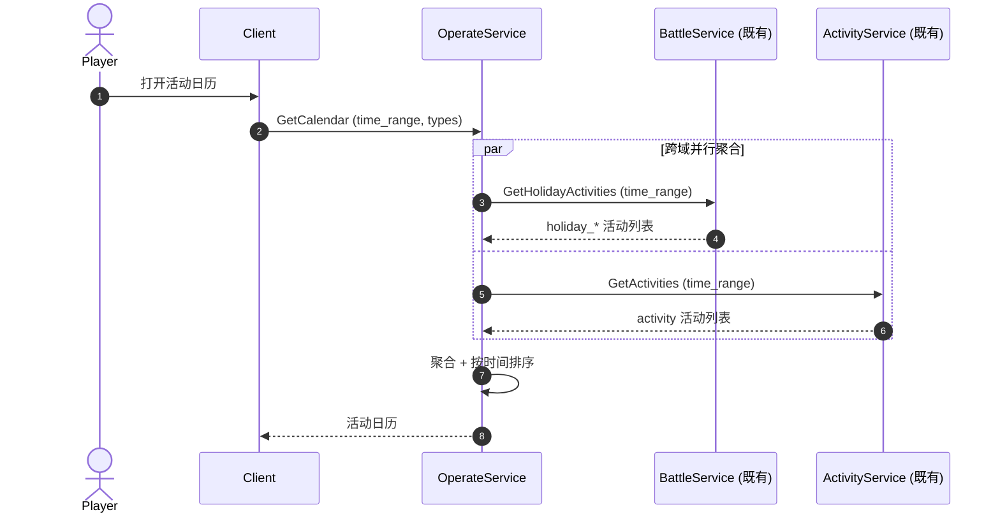
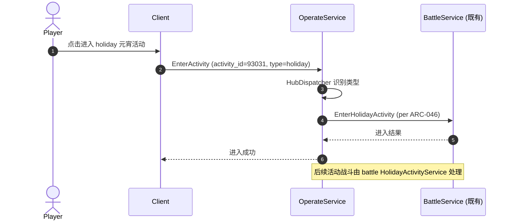
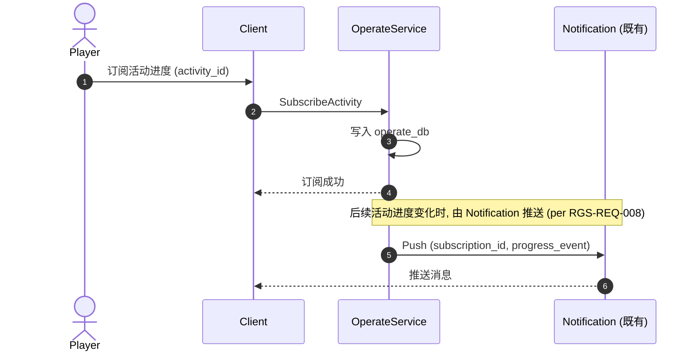

# 基本设计书（基本設計書 / Basic Design Document）

**运营活动域（Operate Domain）基本设计 — 活动日历 / 总入口 / 订阅 / 跨域协调**

| 项目 | 内容 |
|---|---|
| 文档编号 | RGS-BAS-046 |
| 版本 | 0.1 (草案) |
| 父文档 | RGS-REQ-046 v0.1 运营活动域 需求定义书 |
| 制定日 | 2026-09-11 |
| 制定者 | 架构师 (worktree wt-b, ULYS-1 子任务) |
| 关联下游 | RGS-DTL-053 / operate/v1/operate.proto (1 service, 7 RPC) |
| 状态 | 草案, 待评审 |
| 关联 crate | `crates/operate-service/` (operate_db, 384 LOC) |
| ARC | ARC-054 |

---

## 修订历史（改訂履歴 / Revision History）

| 版本 | 修订日 | 修订者 | 审批者 | 修订内容 | 影响范围 |
|---|---|---|---|---|---|
| 0.1 | 2026-09-11 | 架构师 (wt-b agent) | — | 初版制定（per ULYS-1 9/4 MD §2 审计）。本文档为 RGS-REQ-046 的基本设计展开 | 全部 |

## 审批栏（承認欄 / Approval）

| 角色 | 姓名 | 审批日 | 备注 |
|---|---|---|---|
| 制定（起草） | 架构师 (wt-b agent) | 2026-09-11 | — |
| 评审（技术） | | | 具体活动是否严格复用 battle HolidayActivityService + activity-service 既有 |
| 评审（DBA） | | | operate_db 物理划分 |
| 审批（负责人） | | | 本文档的基准化 |

## 目录

1. 前言
2. 设计目标与约束
3. 架构总览
4. 组件设计
5. 数据流与时序
6. 接口契约
7. 配置驱动的多变体形态（ARC-054 落实）
8. 与既有基础设施的复用边界
9. 本文档的覆盖范围与后续计划

---

# 1. 前言

RGS-REQ-046 给出了运营活动域 1 service × 7 RPC 的业务需求，本文是其逻辑级细化。本文档不重新决定 RGS-REQ-046 已确定的任何结构性选择：不重建具体活动逻辑、不绕过 ARC-021、不绕过 EC。

---

# 2. 设计目标与约束

## 2.1 设计目标

| ID | 目标 | 备注 |
|---|---|---|
| OBJ-OPR-001 | 1 个 service 全部覆盖 RGS-REQ-046 §4 的功能需求 | per REQ §4 |
| OBJ-OPR-002 | 具体活动严格复用 battle HolidayActivityService + activity-service 既有 | ARC-054 |
| OBJ-OPR-003 | 活动奖励严格走 EC 单点 | per FR-GOV-001 |
| OBJ-OPR-004 | 活动日历 / 订阅规则作为 ARC-021 既有插件承载 | per RGS-REQ-009 |

## 2.2 约束

| ID | 类别 | 约束 | 来源 |
|---|---|---|---|
| CON-OPR-001 | 复用 | 具体活动战斗**严格**复用 battle HolidayActivityService 既有 | ARC-054 |
| CON-OPR-002 | 复用 | 活动规则**严格**复用 activity-service 既有 | ARC-054 |
| CON-OPR-003 | 经济 | 活动奖励**必须**走 EC 单点 | FR-GOV-001 |
| CON-OPR-004 | 数据库 | 本域落位独立 `operate_db`（仅日历/订阅） | ARC-008 |
| CON-OPR-005 | 反例 | 跨域活动元数据**不得**在本域实现具体战斗/任务逻辑 | ARC-054 |

---

# 3. 架构总览

```
                     ┌─────────────────────────┐
                     │  Client (Unity/UE/Bevy) │
                     └────────────┬────────────┘
                                  │ gRPC (mTLS)
                                  ▼
        ┌─────────────────────────────────────────────────┐
        │            operate-service (1 Atomic App)        │
        │                                                  │
        │  ┌────────────────┐  ┌─────────────────────────┐ │
        │  │ CalendarSvc    │  │ ActivityHubSvc          │ │
        │  │ - GetCalendar  │  │ - GetActivityHub        │ │
        │  │ - NotifyStart  │  │ - EnterActivity (委托)  │ │
        │  │ - NotifyEnd    │  │                         │ │
        │  └────────────────┘  └─────────────────────────┘ │
        │  ┌────────────────┐  ┌─────────────────────────┐ │
        │  │ SubscriptionSvc│  │ CrossDomainCoord        │ │
        │  │ - Subscribe    │  │ - GetCrossDomainActivity│ │
        │  │ - Push (委托)  │  │                         │ │
        │  └────────────────┘  └─────────────────────────┘ │
        └────────────┬────────────────────────┬─────────────┘
                     │                        │
                     ▼                        ▼
              ┌──────────────┐         ┌──────────────┐
              │ operate_db   │         │ battle /     │
              │ (独立 DB)    │         │ activity /   │
              │              │         │ EC / 推送    │
              │              │         │ (既有)       │
              └──────────────┘         └──────────────┘
```

---

# 4. 组件设计

## 4.1 CalendarService

**职责**：活动日历聚合 + 自动通知。

| 子组件 | 职责 | 关键接口 |
|---|---|---|
| CalendarAggregator | 按时间聚合所有活动 | `GetCalendar` |
| NotifyScheduler | 活动开始/结束自动通知 | `NotifyStart` / `NotifyEnd` |

## 4.2 ActivityHubService

**职责**：活动总入口 + 委托。

| 子组件 | 职责 | 关键接口 |
|---|---|---|
| HubListBuilder | 当前可参与活动列表 | `GetActivityHub` |
| HubDispatcher | 进入活动（委托给对应域） | `EnterActivity` |

## 4.3 SubscriptionService

**职责**：活动订阅 + 推送。

| 子组件 | 职责 | 关键接口 |
|---|---|---|
| SubCRUD | 订阅 CRUD | `SubscribeActivity` |
| Pusher | 进度推送（走既有推送通道） | `Push` |

## 4.4 CrossDomainCoord

**职责**：跨域活动元数据。

| 子组件 | 职责 | 关键接口 |
|---|---|---|
| CrossDomainMetaBuilder | 跨域活动元数据查询 | `GetCrossDomainActivity` |

---

# 5. 数据流与时序

## 5.1 活动日历聚合



## 5.2 玩家进入活动（委托路径）



## 5.3 活动订阅推送



---

# 6. 接口契约

## 6.1 Protobuf 接口契约

### 6.1.1 GetCalendarRequest

```protobuf
message GetCalendarRequest {
  int64 start_ms = 1;
  int64 end_ms = 2;
  repeated ActivityType types = 3;   // HOLIDAY / OPENING / LIMITED / CROSS_DOMAIN
  string request_id = 4;
}
```

### 6.1.2 CalendarEntry

```protobuf
message CalendarEntry {
  string activity_id = 1;
  string name = 2;
  ActivityType type = 3;
  int64 start_at_ms = 4;
  int64 end_at_ms = 5;
  string dispatcher_target = 6;       // 委托目标域 (battle / activity)
  bool cross_domain = 7;
}
```

### 6.1.3 ActivitySubscription

```protobuf
message ActivitySubscription {
  common.v1.PlayerId player = 1;
  string activity_id = 2;
  bool notify_enabled = 3;
  int64 subscribed_at_ms = 4;
}
```

## 6.2 错误码

沿用 `RGS-SPEC-CROSS-001` 既有约定，本域新增：

| ResultCode | 含义 | 触发条件 |
|---|---|---|
| `OPR_CALENDAR_EMPTY` | 日历为空 | 时间范围无活动 |
| `OPR_ACTIVITY_NOT_FOUND` | 活动不存在 | activity_id 无效 |
| `OPR_DISPATCHER_NOT_REGISTERED` | 委托目标未注册 | dispatcher_target 未配置 |

---

# 7. 配置驱动的多变体形态（ARC-054 落实）

## 7.1 CalendarConfig Schema

```yaml
calendar_configs:
  - activity_id: holiday_93031
    name: 元宵灯会
    type: HOLIDAY
    start_at: "2026-02-15T00:00:00Z"
    end_at: "2026-02-21T23:59:59Z"
    dispatcher_target: battle_service    # 委托给 battle HolidayActivityService
    notify_on_start: true
    notify_on_end: false

  - activity_id: opening_2026_q4
    name: 2026 Q4 开服活动
    type: OPENING
    start_at: "2026-10-01T00:00:00Z"
    end_at: "2026-10-15T23:59:59Z"
    dispatcher_target: activity_service
    notify_on_start: true
    notify_on_end: true

  - activity_id: cross_domain_winter_2026
    name: 2026 跨域冬日活动
    type: CROSS_DOMAIN
    start_at: "2026-12-15T00:00:00Z"
    end_at: "2027-01-15T23:59:59Z"
    dispatcher_target: multi_domain     # 战斗 + 任务 + 收藏
    cross_domain: true
```

---

# 8. 与既有基础设施的复用边界

| 既有机制 | 本域使用方式 | 不做什么 |
|---|---|---|
| ARC-021 插件 | 活动日历 / 订阅规则承载 | 不使用沙箱脚本 |
| ARC-008 5 独立 DB → 7 域扩展 | 落位独立 `operate_db` | 不混用其他域 |
| battle HolidayActivityService | 活动战斗严格复用 | 不自建活动战斗 |
| activity-service 既有 | 活动规则严格复用 | 不自建活动规则 |
| RGS-REQ-013 FR-GOV-001 | 活动奖励经 EC | 不绕过 |
| RGS-REQ-008 埋点 + 推送 | 进度推送走既有 | 不自建推送通道 |

---

# 9. 本文档的覆盖范围与后续计划

本文档覆盖：

- 运营活动域 1 service 的组件划分、接口契约、核心时序
- ARC-054 复用原则的落实
- 与既有 6 项基础设施的复用边界

本版本明确不覆盖、留待后续：

- Rust trait / SQL DDL — 属 RGS-DTL-053 详细设计职责
- 具体活动战斗逻辑 — 属 battle 既有
- 推送通道实现 — 属 RGS-REQ-008 既有

---

## 追溯性

| 需求/设计来源 | 本文档章节 |
|---|---|
| RGS-REQ-046 §1.3 与既有基础设施关系 | §8 |
| RGS-REQ-046 §3 业务需求 | §3, §4 |
| RGS-REQ-046 §4 功能需求 | §4 |
| RGS-REQ-046 §5 NFR | §2.2 约束 |
| RGS-REQ-046 §6 ARC-054 | §7 全文 |
| ARC-054 复用原则 | §7 全文 |
