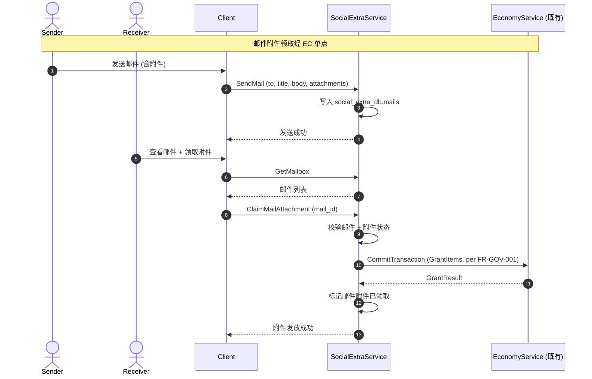
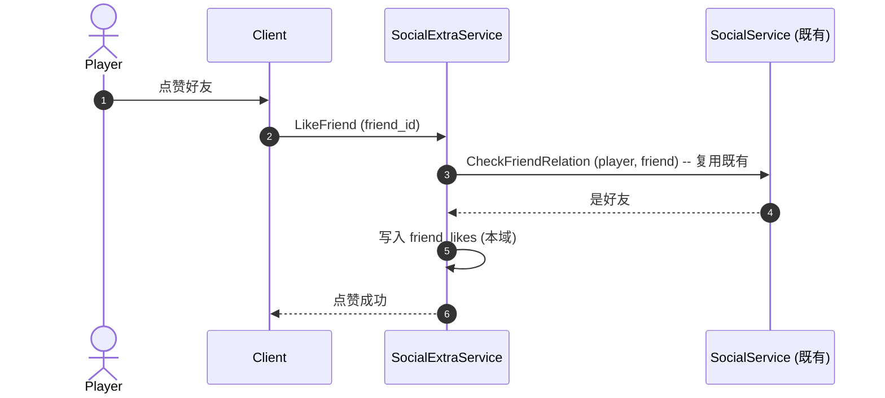
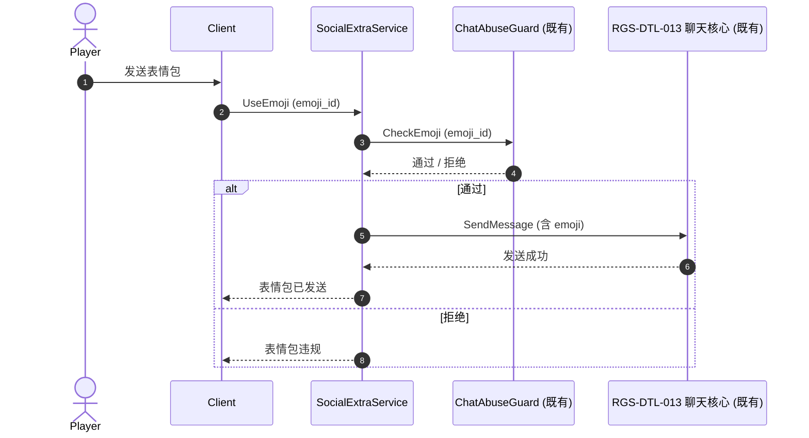

# 基本设计书（基本設計書 / Basic Design Document）

**社交扩展域（Social-Extra Domain）基本设计 — 邮件 / 好友扩展 / 家园 / 聊天扩展**

| 项目 | 内容 |
|---|---|
| 文档编号 | RGS-BAS-047 |
| 版本 | 0.1 (草案) |
| 父文档 | RGS-REQ-047 v0.1 社交扩展域 需求定义书 |
| 制定日 | 2026-09-11 |
| 制定者 | 架构师 (worktree wt-b, ULYS-1 子任务) |
| 关联下游 | RGS-DTL-054 / social_extra/v1/social_extra.proto (1 service, 15 RPC) |
| 状态 | 草案, 待评审 |
| 关联 crate | `crates/social-extra-service/` (social_extra_db, 540 LOC) |
| ARC | ARC-055 |

---

## 修订历史（改訂履歴 / Revision History）

| 版本 | 修订日 | 修订者 | 审批者 | 修订内容 | 影响范围 |
|---|---|---|---|---|---|
| 0.1 | 2026-09-11 | 架构师 (wt-b agent) | — | 初版制定（per ULYS-1 9/4 MD §2 审计）。本文档为 RGS-REQ-047 的基本设计展开 | 全部 |

## 审批栏（承認欄 / Approval）

| 角色 | 姓名 | 审批日 | 备注 |
|---|---|---|---|
| 制定（起草） | 架构师 (wt-b agent) | 2026-09-11 | — |
| 评审（技术） | | | 好友关系/频道聊天核心是否严格复用 social-service + DTL-013 既有 |
| 评审（DBA） | | | social_extra_db 物理划分 |
| 审批（负责人） | | | 本文档的基准化 |

## 目录

1. 前言
2. 设计目标与约束
3. 架构总览
4. 组件设计
5. 数据流与时序
6. 接口契约
7. 配置驱动的多变体形态（ARC-055 落实）
8. 与既有基础设施的复用边界
9. 本文档的覆盖范围与后续计划

---

# 1. 前言

RGS-REQ-047 给出了社交扩展域 1 service × 15 RPC 的业务需求，本文是其逻辑级细化。本文档不重新决定 RGS-REQ-047 已确定的任何结构性选择：不重建好友关系核心、不重建频道聊天核心、不绕过 EC、不绕过 ChatAbuseGuard。

---

# 2. 设计目标与约束

## 2.1 设计目标

| ID | 目标 | 备注 |
|---|---|---|
| OBJ-SOC-001 | 1 个 service 全部覆盖 RGS-REQ-047 §4 的功能需求 | per REQ §4 |
| OBJ-SOC-002 | 好友关系核心严格复用 social-service 既有 | ARC-055 |
| OBJ-SOC-003 | 频道聊天核心严格复用 RGS-DTL-013 既有 | ARC-055 |
| OBJ-SOC-004 | 邮件附件严格走 EC 单点 | per FR-GOV-001 |
| OBJ-SOC-005 | 表情包 / 邮件规则作为 ARC-021 既有插件承载 | per RGS-REQ-009 |

## 2.2 约束

| ID | 类别 | 约束 | 来源 |
|---|---|---|---|
| CON-SOC-001 | 复用 | 好友关系核心**严格**复用 social-service 既有 | ARC-055 |
| CON-SOC-002 | 复用 | 频道聊天核心**严格**复用 RGS-DTL-013 §3 既有 | ARC-055 |
| CON-SOC-003 | 经济 | 邮件附件**必须**走 EC 单点 | FR-GOV-001 |
| CON-SOC-004 | 安全 | 表情包**必须**经 ChatAbuseGuard 校验 | RGS-BAS-014 §3 |
| CON-SOC-005 | 数据库 | 本域落位独立 `social_extra_db` | ARC-008 |
| CON-SOC-006 | 反例 | 邮件 / 好友扩展 / 家园**不得**为每变体新建 service | ARC-055 |

---

# 3. 架构总览

```
                     ┌─────────────────────────┐
                     │  Client (Unity/UE/Bevy) │
                     └────────────┬────────────┘
                                  │ gRPC (mTLS)
                                  ▼
        ┌─────────────────────────────────────────────────┐
        │         social-extra-service (1 Atomic App)      │
        │                                                  │
        │  ┌────────────────┐  ┌─────────────────────────┐ │
        │  │ MailService    │  │ FriendExtraService      │ │
        │  │ - Send         │  │ - LikeFriend            │ │
        │  │ - GetMailbox   │  │ - CommentFriend         │ │
        │  │ - ClaimAttach  │  │ - SetRemark             │ │
        │  │ - Delete       │  │                         │ │
        │  └────────────────┘  └─────────────────────────┘ │
        │  ┌────────────────┐  ┌─────────────────────────┐ │
        │  │ HomeService    │  │ ChatExtraService        │ │
        │  │ - GetHome      │  │ - GetChatHistory        │ │
        │  │ - Decorate     │  │ - UseEmoji              │ │
        │  │ - Visit        │  │                         │ │
        │  └────────────────┘  └─────────────────────────┘ │
        └────────────┬────────────────────────┬─────────────┘
                     │                        │
                     ▼                        ▼
              ┌──────────────┐         ┌──────────────┐
              │ social_extra │         │ social /     │
              │     _db      │         │ RGS-DTL-013  │
              │  (独立 DB)   │         │  / EC (既有) │
              └──────────────┘         └──────────────┘
```

---

# 4. 组件设计

## 4.1 MailService

**职责**：站内邮件 CRUD + 附件领取（经 EC 单点）。

| 子组件 | 职责 | 关键接口 |
|---|---|---|
| MailSender | 邮件发送（系统 / 玩家 / GM 3 类） | `SendMail` |
| MailboxQuery | 邮箱查询 | `GetMailbox` |
| MailReader | 邮件读取 + 标记已读 | `ReadMail` |
| AttachmentClaimer | 附件领取（经 EC 单点） | `ClaimMailAttachment` |
| MailDeleter | 邮件删除 | `DeleteMail` |

## 4.2 FriendExtraService

**职责**：好友扩展（互动 + 备注）。

| 子组件 | 职责 | 关键接口 |
|---|---|---|
| FriendInteraction | 点赞 / 评论 | `LikeFriend` / `CommentFriend` |
| FriendRemark | 备注 | `SetRemark` |

**说明**：好友关系核心**严格**走 social-service 既有，本域仅扩展"互动 + 备注"。

## 4.3 HomeService

**职责**：家园 CRUD + 访问。

| 子组件 | 职责 | 关键接口 |
|---|---|---|
| HomeCRUD | 家园 CRUD（主题 / 装饰） | `GetHome` / `DecorateHome` |
| HomeVisitor | 访问 + 留言 | `VisitHome` |

## 4.4 ChatExtraService

**职责**：聊天扩展（历史查询 + 表情包）。

| 子组件 | 职责 | 关键接口 |
|---|---|---|
| ChatHistoryQuery | 聊天历史查询（per RGS-DTL-013 §3 既有） | `GetChatHistory` |
| EmojiHandler | 表情包使用（per ARC-021 插件配置） | `UseEmoji` |

---

# 5. 数据流与时序

## 5.1 邮件发送 + 附件领取



## 5.2 好友点赞（扩展走既有好友关系）



## 5.3 聊天表情包（经 ChatAbuseGuard 校验）



---

# 6. 接口契约

## 6.1 Protobuf 接口契约

### 6.1.1 SendMailRequest

```protobuf
message SendMailRequest {
  string from = 1;                       // 系统 / 玩家 ID / GM ID
  string to = 2;                         // 接收玩家 ID
  string title = 3;
  string body = 4;
  repeated Attachment attachments = 5;
  MailType mail_type = 6;                // SYSTEM / PLAYER / GM
  int64 expires_at_ms = 7;
  string request_id = 8;                 // 幂等键
}
```

### 6.1.2 HomeData

```protobuf
message HomeData {
  string player_id = 1;
  int32 theme_id = 2;
  repeated int32 slots = 3;              // 装饰 slot
  int32 visit_count = 4;
  int64 updated_at_ms = 5;
}
```

## 6.2 错误码

沿用 `RGS-SPEC-CROSS-001` 既有约定，本域新增：

| ResultCode | 含义 | 触发条件 |
|---|---|---|
| `SOC_MAIL_NOT_FOUND` | 邮件不存在 | mail_id 无效 |
| `SOC_MAIL_ALREADY_CLAIMED` | 附件已领取 | 重复领取 |
| `SOC_HOME_NOT_FOUND` | 家园不存在 | player_id 无家园 |
| `SOC_EMOJI_REJECTED` | 表情包被拒 | ChatAbuseGuard 拒绝 |

---

# 7. 配置驱动的多变体形态（ARC-055 落实）

## 7.1 MailConfig Schema

```yaml
mail_configs:
  - mail_type: SYSTEM
    retention_days: 30
    max_attachments_per_mail: 5
  - mail_type: PLAYER
    retention_days: 30
    max_attachments_per_mail: 3
  - mail_type: GM
    retention_days: 90
    max_attachments_per_mail: 10
```

## 7.2 HomeConfig Schema

```yaml
home_configs:
  - theme_id: theme_garden
    name: 花园主题
    available_slots: 12
    decoration_items: [item_pot_01, item_chair_02, ...]
```

## 7.3 ChatEmojiConfig Schema

```yaml
chat_emoji_configs:
  - emoji_id: emoji_smile
    name: 微笑
    enabled: true
    max_per_message: 5
```

---

# 8. 与既有基础设施的复用边界

| 既有机制 | 本域使用方式 | 不做什么 |
|---|---|---|
| social-service 既有 | 好友关系核心严格复用 | 不重建好友关系 |
| RGS-DTL-013 §3 既有 | 频道聊天核心严格复用 | 不重建频道聊天 |
| RGS-BAS-014 §3 ChatAbuseGuard | 表情包校验严格复用 | 不自建滥检测 |
| ARC-008 5 独立 DB → 7 域扩展 | 落位独立 `social_extra_db` | 不混用其他域 |
| ARC-021 插件 | 邮件规则 / 表情包承载 | 不使用沙箱脚本 |
| RGS-REQ-013 FR-GOV-001 | 邮件附件经 EC | 不绕过 |

---

# 9. 本文档的覆盖范围与后续计划

本文档覆盖：

- 社交扩展域 1 service 的组件划分、接口契约、核心时序
- ARC-055 复用原则的落实
- 与既有 6 项基础设施的复用边界

本版本明确不覆盖、留待后续：

- Rust trait / SQL DDL — 属 RGS-DTL-054 详细设计职责
- 好友关系核心 — 属 social-service 既有
- 频道聊天核心 — 属 RGS-DTL-013 §3 既有
- TBD-SOC-001（邮件保留期）— 留待 PH-2 评审

---

## 追溯性

| 需求/设计来源 | 本文档章节 |
|---|---|
| RGS-REQ-047 §1.3 与既有基础设施关系 | §8 |
| RGS-REQ-047 §3 业务需求 | §3, §4 |
| RGS-REQ-047 §4 功能需求 | §4 |
| RGS-REQ-047 §5 NFR | §2.2 约束 |
| RGS-REQ-047 §6 ARC-055 | §7 全文 |
| ARC-055 复用原则 | §7 全文 |
