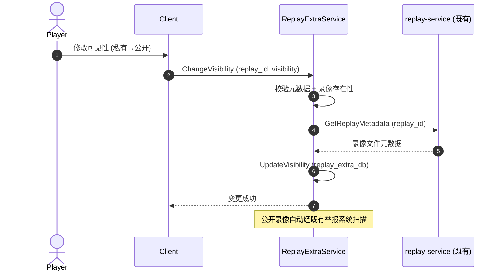
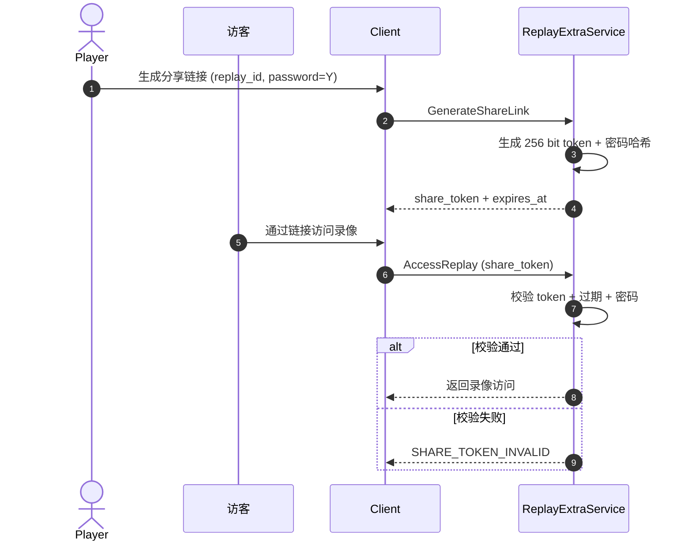
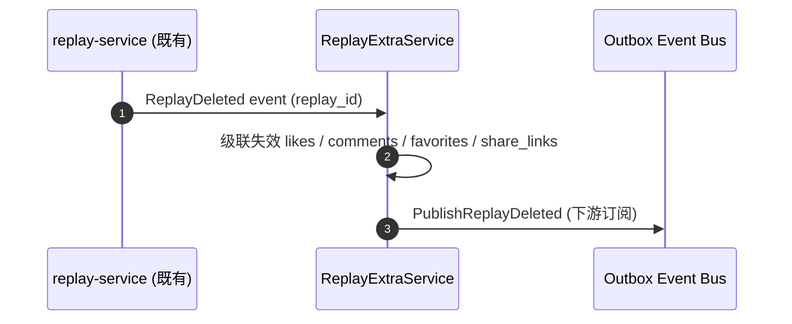

# 基本设计书（基本設計書 / Basic Design Document）

**录像扩展域（Replay-Extra Domain）基本设计 — 录像元数据 / 分享 / 互动 / 收藏**

| 项目 | 内容 |
|---|---|
| 文档编号 | RGS-BAS-043 |
| 版本 | 0.1 (草案) |
| 父文档 | RGS-REQ-043 v0.1 录像扩展域 需求定义书 |
| 制定日 | 2026-09-11 |
| 制定者 | 架构师 (worktree wt-b, ULYS-1 子任务) |
| 关联下游 | RGS-DTL-050 / replay_extra/v1/replay_extra.proto (1 service, 10 RPC) |
| 状态 | 草案, 待评审 |
| 关联 crate | `crates/replay-extra-service/` (replay_extra_db, 386 LOC) |
| ARC | ARC-051 |

---

## 修订历史（改訂履歴 / Revision History）

| 版本 | 修订日 | 修订者 | 审批者 | 修订内容 | 影响范围 |
|---|---|---|---|---|---|
| 0.1 | 2026-09-11 | 架构师 (wt-b agent) | — | 初版制定（per ULYS-1 9/4 MD §2 审计）。本文档为 RGS-REQ-043 的基本设计展开 | 全部 |

## 审批栏（承認欄 / Approval）

| 角色 | 姓名 | 审批日 | 备注 |
|---|---|---|---|
| 制定（起草） | 架构师 (wt-b agent) | 2026-09-11 | — |
| 评审（技术） | | | 录像文件存储是否严格复用 replay-service 既有 |
| 评审（DBA） | | | replay_extra_db 物理划分 |
| 审批（负责人） | | | 本文档的基准化 |

## 目录

1. 前言
2. 设计目标与约束
3. 架构总览
4. 组件设计
5. 数据流与时序
6. 接口契约
7. 配置驱动的多变体形态（ARC-051 落实）
8. 与既有基础设施的复用边界
9. 本文档的覆盖范围与后续计划

---

# 1. 前言

RGS-REQ-043 给出了录像扩展域 1 service × 10 RPC 的业务需求，本文是其逻辑级细化。本文档不重新决定 RGS-REQ-043 已确定的任何结构性选择：不重建录像文件存储、不绕过既有举报系统。

---

# 2. 设计目标与约束

## 2.1 设计目标

| ID | 目标 | 备注 |
|---|---|---|
| OBJ-RPL-001 | 1 个 service 全部覆盖 RGS-REQ-043 §4 的功能需求 | per REQ §4 |
| OBJ-RPL-002 | 录像文件存储严格复用 replay-service 既有 | ARC-051 |
| OBJ-RPL-003 | 举报经既有 RGS-BAS-025 体系 | per RGS-REQ-022 |
| OBJ-RPL-004 | 可见性 / 密码 / 收藏上限作为 ARC-021 既有插件承载 | per RGS-REQ-009 |

## 2.2 约束

| ID | 类别 | 约束 | 来源 |
|---|---|---|---|
| CON-RPL-001 | 复用 | 录像文件存储**严格**复用 replay-service 既有 | ARC-051 |
| CON-RPL-002 | 复用 | 录像举报**必须**经既有 RGS-BAS-025 反作弊体系 | per RGS-REQ-022 |
| CON-RPL-003 | 数据库 | 本域落位独立 `replay_extra_db`（仅元数据/互动） | ARC-008 |
| CON-RPL-004 | 反例 | 互动 / 收藏**不得**为每变体新建 service | ARC-051 |

---

# 3. 架构总览

```
                     ┌─────────────────────────┐
                     │  Client (Unity/UE/Bevy) │
                     └────────────┬────────────┘
                                  │ gRPC (mTLS)
                                  ▼
        ┌─────────────────────────────────────────────────┐
        │            replay-extra-service (1 Atomic App)   │
        │                                                  │
        │  ┌────────────────┐  ┌─────────────────────────┐ │
        │  │ MetadataMgr    │  │ ShareLinkService        │ │
        │  │ - UpdateMeta   │  │ - GenerateLink          │ │
        │  │ - Visibility   │  │ - VerifyPassword        │ │
        │  └────────────────┘  └─────────────────────────┘ │
        │  ┌────────────────┐  ┌─────────────────────────┐ │
        │  │ InteractionMgr │  │ FavoriteMgr             │ │
        │  │ - Like         │  │ - AddFavorite           │ │
        │  │ - Comment      │  │ - ListFavorites         │ │
        │  │ - Report       │  │                         │ │
        │  └────────────────┘  └─────────────────────────┘ │
        └────────────┬────────────────────────┬─────────────┘
                     │                        │
                     ▼                        ▼
              ┌──────────────┐         ┌──────────────┐
              │ replay_extra │         │ replay-svc   │
              │     _db      │         │ (既有, 录像  │
              │  (元数据)    │         │  文件存储)   │
              └──────────────┘         └──────────────┘
```

---

# 4. 组件设计

## 4.1 MetadataManager

**职责**：录像元数据 CRUD + 可见性管理。

| 子组件 | 职责 | 关键接口 |
|---|---|---|
| MetadataCRUD | 标题/描述/标签 CRUD | `UpdateMetadata` |
| VisibilityGate | 可见性切换 + 既有举报系统联动 | `ChangeVisibility` |

## 4.2 ShareLinkService

**职责**：分享链接生成 + 密码校验 + 过期回收。

| 子组件 | 职责 | 关键接口 |
|---|---|---|
| TokenGenerator | 高强度随机 token 生成（256 bit） | `GenerateToken` |
| PasswordGuard | 密码哈希 + 校验 | `HashPassword` / `VerifyPassword` |
| ExpiryManager | 链接过期管理 | `ExpireLink` |

## 4.3 InteractionManager

**职责**：点赞 / 评论 / 举报。

| 子组件 | 职责 | 关键接口 |
|---|---|---|
| LikeService | 点赞（UNIQUE 约束） | `Like` |
| CommentService | 评论（限频） | `Comment` |
| ReportService | 举报（委托既有 RGS-BAS-025 体系） | `Report` |

## 4.4 FavoriteManager

**职责**：收藏夹 CRUD + 分类。

| 子组件 | 职责 | 关键接口 |
|---|---|---|
| FavoriteCRUD | 收藏夹 CRUD | `AddFavorite` / `RemoveFavorite` |
| CategoryMgr | 收藏夹分类管理 | `CreateCategory` |

---

# 5. 数据流与时序

## 5.1 元数据更新 → 既有举报系统联动



## 5.2 分享链接生成 + 密码校验



## 5.3 录像删除 → 互动级联失效（NFR-RPL-002）



---

# 6. 接口契约

## 6.1 Protobuf 接口契约

### 6.1.1 UpdateMetadataRequest

```protobuf
message UpdateMetadataRequest {
  string replay_id = 1;
  common.v1.PlayerId owner = 2;
  string title = 3;
  string description = 4;
  repeated string tags = 5;
  Visibility visibility = 6;  // PRIVATE / FRIENDS / PUBLIC
  string request_id = 7;
}
```

### 6.1.2 ShareLink

```protobuf
message ShareLink {
  string share_token = 1;       // 256 bit random
  string replay_id = 2;
  int64 expires_at_ms = 3;
  bool password_required = 4;
}
```

---

# 7. 配置驱动的多变体形态（ARC-051 落实）

## 7.1 VisibilityConfig Schema

```yaml
visibility_configs:
  - replay_type: PVP_RANKED
    default_visibility: FRIENDS
    require_password_for_private: true
  - replay_type: PVE
    default_visibility: PRIVATE
```

## 7.2 FavoriteConfig Schema

```yaml
favorite_configs:
  - player_level: 1
    max_favorite_count: 50
    max_categories: 5
```

---

# 8. 与既有基础设施的复用边界

| 既有机制 | 本域使用方式 | 不做什么 |
|---|---|---|
| replay-service 既有 | 录像文件存储严格复用 | 不重建录像文件存储 |
| RGS-BAS-025 反作弊 | 录像举报经既有举报通道 | 不自建举报体系 |
| ARC-021 插件 | 可见性 / 密码 / 收藏上限承载 | 不使用沙箱脚本 |
| ARC-008 5 独立 DB → 7 域扩展 | 落位独立 `replay_extra_db` | 不混用其他域 |

---

# 9. 本文档的覆盖范围与后续计划

本文档覆盖：
- 录像扩展域 1 service 的组件划分、接口契约、核心时序
- ARC-051 复用原则的落实
- 与既有 4 项基础设施的复用边界

本版本明确不覆盖、留待后续：
- Rust trait / SQL DDL — 属 RGS-DTL-050 详细设计职责
- 录像文件存储后端选型 — 属 replay-service 既有 TBD 决定
- TBD-RPL-001 — 留待 PH-2 评审

---

## 追溯性

| 需求/设计来源 | 本文档章节 |
|---|---|
| RGS-REQ-043 §1.3 与既有基础设施关系 | §8 |
| RGS-REQ-043 §3 业务需求 | §3, §4 |
| RGS-REQ-043 §4 功能需求 | §4 |
| RGS-REQ-043 §5 NFR | §2.2 约束 |
| RGS-REQ-043 §6 ARC-051 | §7 全文 |
| ARC-051 数据驱动 + 复用 | §7 全文 |
