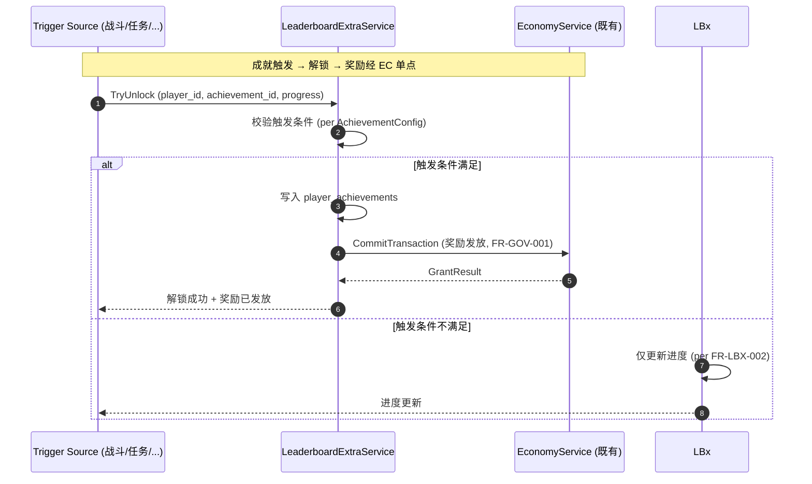
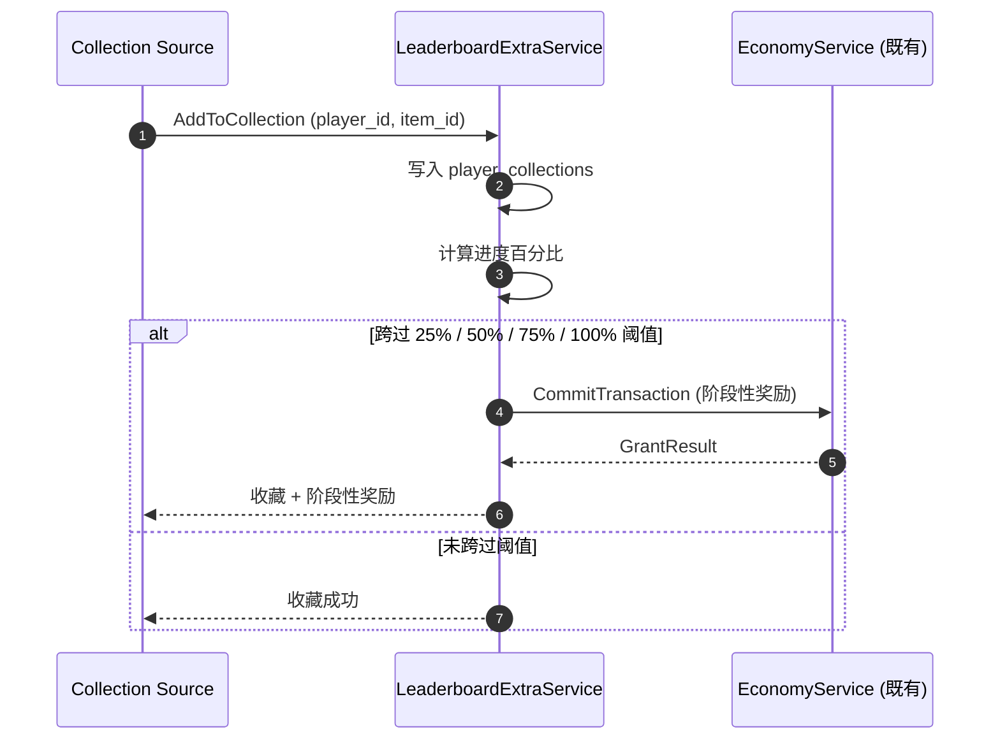
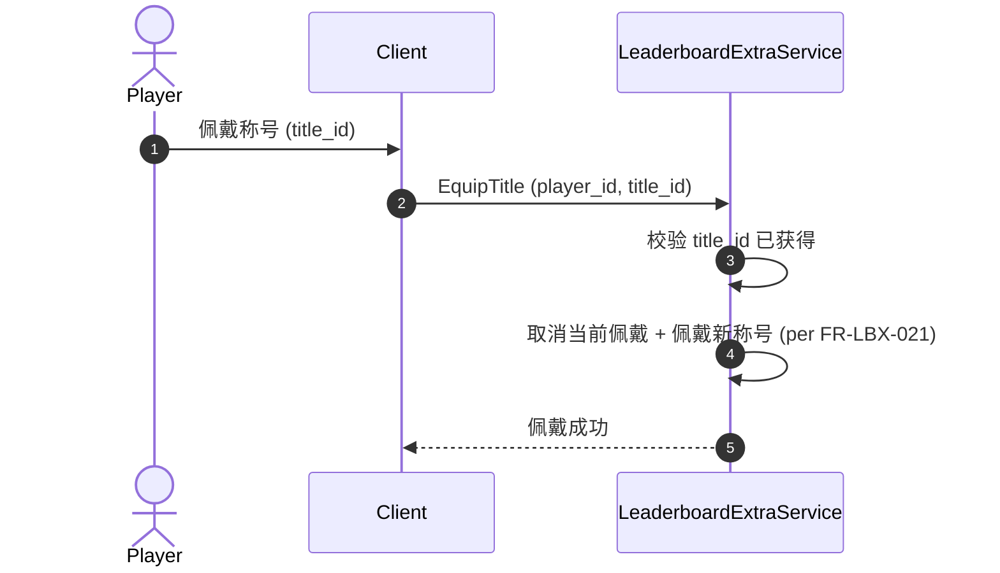

# 基本设计书（基本設計書 / Basic Design Document）

**图鉴扩展域（Leaderboard-Extra Domain）基本设计 — 成就 / 收藏册 / 称号 / 解锁进度**

| 项目 | 内容 |
|---|---|
| 文档编号 | RGS-BAS-045 |
| 版本 | 0.1 (草案) |
| 父文档 | RGS-REQ-045 v0.1 图鉴扩展域 需求定义书 |
| 制定日 | 2026-09-11 |
| 制定者 | 架构师 (worktree wt-b, ULYS-1 子任务) |
| 关联下游 | RGS-DTL-052 / leaderboard_extra/v1/leaderboard_extra.proto (1 service, 7 RPC) |
| 状态 | 草案, 待评审 |
| 关联 crate | `crates/leaderboard-extra-service/` (leaderboard_extra_db, 405 LOC) |
| ARC | ARC-053 |

---

## 修订历史（改訂履歴 / Revision History）

| 版本 | 修订日 | 修订者 | 审批者 | 修订内容 | 影响范围 |
|---|---|---|---|---|---|
| 0.1 | 2026-09-11 | 架构师 (wt-b agent) | — | 初版制定（per ULYS-1 9/4 MD §2 审计）。本文档为 RGS-REQ-045 的基本设计展开 | 全部 |

## 审批栏（承認欄 / Approval）

| 角色 | 姓名 | 审批日 | 备注 |
|---|---|---|---|
| 制定（起草） | 架构师 (wt-b agent) | 2026-09-11 | — |
| 评审（技术） | | | 排行榜核心是否严格复用 leaderboard-service 既有 |
| 评审（DBA） | | | leaderboard_extra_db 物理划分 |
| 审批（负责人） | | | 本文档的基准化 |

## 目录

1. 前言
2. 设计目标与约束
3. 架构总览
4. 组件设计
5. 数据流与时序
6. 接口契约
7. 配置驱动的多变体形态（ARC-053 落实）
8. 与既有基础设施的复用边界
9. 本文档的覆盖范围与后续计划

---

# 1. 前言

RGS-REQ-045 给出了图鉴扩展域 1 service × 7 RPC 的业务需求，本文是其逻辑级细化。本文档不重新决定 RGS-REQ-045 已确定的任何结构性选择：不重建排行榜核心、不绕过 EC、不绕过 leaderboard-service 既有。

---

# 2. 设计目标与约束

## 2.1 设计目标

| ID | 目标 | 备注 |
|---|---|---|
| OBJ-LBX-001 | 1 个 service 全部覆盖 RGS-REQ-045 §4 的功能需求 | per REQ §4 |
| OBJ-LBX-002 | 排行榜核心严格复用 leaderboard-service 既有 | ARC-053 |
| OBJ-LBX-003 | 成就 / 收藏奖励严格走 EC 单点 | per FR-GOV-001 |
| OBJ-LBX-004 | 成就 / 收藏 / 称号规则作为 ARC-021 既有插件承载 | per RGS-REQ-009 |

## 2.2 约束

| ID | 类别 | 约束 | 来源 |
|---|---|---|---|
| CON-LBX-001 | 复用 | 排行榜核心**严格**复用 leaderboard-service 既有 | ARC-053 |
| CON-LBX-002 | 经济 | 成就 / 收藏奖励**必须**走 EC 单点 | FR-GOV-001 |
| CON-LBX-003 | 数据库 | 本域落位独立 `leaderboard_extra_db` | ARC-008 |
| CON-LBX-004 | 反例 | 成就 / 收藏 / 称号**不得**为每变体新建 service | ARC-053 |

---

# 3. 架构总览

```
                     ┌─────────────────────────┐
                     │  Client (Unity/UE/Bevy) │
                     └────────────┬────────────┘
                                  │ gRPC (mTLS)
                                  ▼
        ┌─────────────────────────────────────────────────┐
        │      leaderboard-extra-service (1 Atomic App)    │
        │                                                  │
        │  ┌────────────────┐  ┌─────────────────────────┐ │
        │  │ AchievementSvc │  │ CollectionSvc           │ │
        │  │ - Unlock       │  │ - AddToCollection       │ │
        │  │ - Progress     │  │ - GetProgress           │ │
        │  │ - List         │  │ - MilestoneReward       │ │
        │  └────────────────┘  └─────────────────────────┘ │
        │  ┌────────────────┐  ┌─────────────────────────┐ │
        │  │ TitleSvc       │  │ UnlockProgressSvc       │ │
        │  │ - Award        │  │ - GetUnlockProgress     │ │
        │  │ - Equip        │  │                         │ │
        │  └────────────────┘  └─────────────────────────┘ │
        └────────────┬────────────────────────┬─────────────┘
                     │                        │
                     ▼                        ▼
              ┌──────────────┐         ┌──────────────┐
              │ leaderboard_ │         │ leaderboard  │
              │  extra_db    │         │   _service   │
              │ (独立 DB)    │         │ (既有) + EC  │
              └──────────────┘         └──────────────┘
```

---

# 4. 组件设计

## 4.1 AchievementService

**职责**：成就解锁 + 进度跟踪 + 奖励发放。

| 子组件 | 职责 | 关键接口 |
|---|---|---|
| AchievementUnlocker | 成就解锁 | `UnlockAchievement` |
| ProgressTracker | 进度跟踪（累计型 + 阈值型） | `TrackProgress` |
| RewardIssuer | 奖励发放（经 EC 单点） | `IssueReward` |

**5 类成就**：剧情 / 战斗 / 社交 / 收藏 / 活动。

## 4.2 CollectionService

**职责**：收藏册 CRUD + 阶段性奖励。

| 子组件 | 职责 | 关键接口 |
|---|---|---|
| CollectionAdder | 添加收藏 | `AddToCollection` |
| ProgressCalculator | 进度计算 | `GetProgress` |
| MilestoneRewarder | 阶段性奖励（25% / 50% / 75% / 100%） | `IssueMilestoneReward` |

**4 类收藏**：卡牌 / 道具 / NPC / 装备。

## 4.3 TitleService

**职责**：称号获得 + 佩戴 + 展示。

| 子组件 | 职责 | 关键接口 |
|---|---|---|
| TitleAwarder | 称号获得 | `AwardTitle` |
| TitleEquipper | 称号佩戴（同时至多 1 个） | `EquipTitle` |
| TitleDisplayer | 称号展示（客户端 UI，**非**RPC） | — |

## 4.4 UnlockProgressService

**职责**：解锁进度聚合。

| 子组件 | 职责 | 关键接口 |
|---|---|---|
| ProgressAggregator | 成就 + 收藏 2 维度聚合 | `GetUnlockProgress` |

---

# 5. 数据流与时序

## 5.1 成就解锁 + 奖励发放主流程



## 5.2 收藏阶段性奖励



## 5.3 称号佩戴



---

# 6. 接口契约

## 6.1 Protobuf 接口契约

### 6.1.1 UnlockAchievementRequest

```protobuf
message UnlockAchievementRequest {
  common.v1.PlayerId player = 1;
  string achievement_id = 2;            // AchievementConfig 主键
  bytes trigger_payload = 3;            // 触发参数 (per 触发条件类型)
  string request_id = 4;                // 幂等键
}
```

### 6.1.2 CollectionItem

```protobuf
message CollectionItem {
  string collection_id = 1;
  CollectionType type = 2;              // CARD / ITEM / NPC / EQUIPMENT
  string item_def_id = 3;
  int64 acquired_at_ms = 4;
}
```

### 6.1.3 UnlockProgress

```protobuf
message UnlockProgress {
  common.v1.PlayerId player = 1;
  AchievementProgress achievement = 2;  // 已解锁 N / 总 M
  CollectionProgress collection = 3;    // 已拥有 K / 总 L
  float overall_percent = 4;            // 综合解锁百分比
}
```

## 6.2 错误码

沿用 `RGS-SPEC-CROSS-001` 既有约定，本域新增：

| ResultCode | 含义 | 触发条件 |
|---|---:|---|
| `LBX_ACHIEVEMENT_NOT_FOUND` | 成就不存在 | achievement_id 无效 |
| `LBX_TRIGGER_NOT_MET` | 触发条件不满足 | 仅更新进度 |
| `LBX_TITLE_NOT_OWNED` | 称号未获得 | 玩家尝试佩戴未获得的称号 |
| `LBX_DUPLICATE_UNLOCK` | 重复解锁 | 幂等键重复 |

---

# 7. 配置驱动的多变体形态（ARC-053 落实）

## 7.1 AchievementConfig Schema

```yaml
achievement_configs:
  - achievement_id: ach_quest_chain_01
    category: QUEST                # QUEST/COMBAT/SOCIAL/COLLECTION/ACTIVITY
    name: 完成主线第一章
    trigger:
      type: THRESHOLD              # CUMULATIVE / THRESHOLD
      target: quest_progress_main_01
      threshold: 100
    reward: REWARD_TABLE_ACH_QUEST_01

  - achievement_id: ach_login_30days
    category: ACTIVITY
    name: 连续登录 30 天
    trigger:
      type: CUMULATIVE
      target: daily_login_count
      threshold: 30
    reward: REWARD_TABLE_ACH_LOGIN_30
```

## 7.2 CollectionConfig Schema

```yaml
collection_configs:
  - collection_id: coll_card_all
    type: CARD
    name: 卡牌图鉴
    total_items: 200
    milestone_rewards:
      "25": REWARD_TABLE_COLL_25
      "50": REWARD_TABLE_COLL_50
      "75": REWARD_TABLE_COLL_75
      "100": REWARD_TABLE_COLL_100
```

## 7.3 TitleConfig Schema

```yaml
title_configs:
  - title_id: title_pvp_champion
    name: PVP 冠军
    award_triggers:                  # 多触发来源
      - achievement: ach_pvp_champion
      - collection: coll_pvp_full
      - event: event_pvp_2026
```

---

# 8. 与既有基础设施的复用边界

| 既有机制 | 本域使用方式 | 不做什么 |
|---|---|---|
| leaderboard-service 既有 | 排行榜核心严格复用 | 不重建排行榜 |
| ARC-008 5 独立 DB → 7 域扩展 | 落位独立 `leaderboard_extra_db` | 不混用其他域 |
| ARC-021 插件 | 成就 / 收藏 / 称号规则承载 | 不使用沙箱脚本 |
| RGS-REQ-013 FR-GOV-001 | 成就 / 收藏奖励经 EC | 不绕过 |

---

# 9. 本文档的覆盖范围与后续计划

本文档覆盖：

- 图鉴扩展域 1 service 的组件划分、接口契约、核心时序
- ARC-053 复用原则的落实
- 与既有 4 项基础设施的复用边界

本版本明确不覆盖、留待后续：

- Rust trait / SQL DDL — 属 RGS-DTL-052 详细设计职责
- 客户端 UI 渲染 — 属客户端范畴

---

## 追溯性

| 需求/设计来源 | 本文档章节 |
|---|---|
| RGS-REQ-045 §1.3 与既有基础设施关系 | §8 |
| RGS-REQ-045 §3 业务需求 | §3, §4 |
| RGS-REQ-045 §4 功能需求 | §4 |
| RGS-REQ-045 §5 NFR | §2.2 约束 |
| RGS-REQ-045 §6 ARC-053 | §7 全文 |
| ARC-053 复用原则 | §7 全文 |
