# 00-总览与全表清单（全体表一覧 / Master Table Inventory）

> **本文件定位**：RGS 仓库全部 42 张表的全局清单（master inventory），按域 / 库聚合，附 ER 概览 + 跨域引用矩阵 + 修订追溯。

| 项目 | 内容 |
|---|---|
| 文档编号 | RGS-DTL-DB-INDEX |
| 版本 | 0.1（IPA 標準初版） |
| 作成日 | 2026-09-01 JST |
| 作成者 | Mavis（Ulysses 一人公司 12 角色 per DEC-008 代理） |
| 適用基準 | IPA SLCP-JCF2013 §6 詳細設計工程 + JIS X 0123 命名規約 + RGS-BAS-007 |
| 数据源 | 34 个 SQL migration 文件（覆盖 11 PG 库 + 1 SQLite 库） |

---

## 1. 全表清单（42 张表）

### 1.1 按域聚合

| 域 | 物理库 | 表数 | 表名 |
|---|---|---|---|
| **Player** | `player_db` | 5 | `players`, `player_sessions`, `player_characters`, `player_inventory`, `decks` |
| **Player (公共)** | `player_db` | 1 | `outbox` |
| **Economy** | `economy_db` | 6 | `accounts`, `transaction_ledger`, `sagas`, `reservations`, `inbox`, `auctions` |
| **Economy (trade)** | `economy_db` | 1 | `private_trades` |
| **Economy (公共)** | `economy_db` | 1 | `outbox` |
| **Match** | `match_db` | 5 | `matches`, `match_participants`, `game_sessions`, `moves`, `matchmaking_tickets` |
| **Match (订阅)** | `match_db` | 1 | `session_subscriptions` |
| **Match (公共)** | `match_db` | 1 | `outbox` |
| **Social** | `social_db` | 2 | `guilds`, `guild_members` |
| **Social (公共)** | `social_db` | 1 | `outbox` |
| **Admin** | `admin_db` | 2 | `admin_users`, `audit_log` |
| **Admin (LCM 6 表)** | `admin_db` | 6 | `realm_lifecycle_run`, `new_realm_plan`, `split_plan`, `merge_conflict_rule_set_v2`, `retire_plan`, `archive_policy` |
| **Admin (公共)** | `admin_db` | 1 | `outbox` |
| **ClusterOps** | `cluster_ops_db` | 2 | `cluster_nodes`, `feature_flags` |
| **ClusterOps (公共)** | `cluster_ops_db` | 1 | `outbox` |
| **Card** | `card_db` | 3 | `cards`, `card_series`, `card_instances` |
| **I18n** | `i18n_db` | 2 | `i18n_texts`, `i18n_languages` |
| **Leaderboard** | `leaderboard_db` | 1 | `leaderboard_entries` |
| **Replay** | `replay_db` | 1 | `replays` |
| **AssetDownload (SQLite)** | `downloads.sqlite` | 1 | `resume_tokens` |
| **合計** | — | **42** | — |

> **Outbox 表跨 6 域重複**（player / economy / match / social / admin / cluster_ops）：完整定义見 [13-Outbox跨域模板](13-Outbox跨域模板.md)。重複不冗余：每域各持一份以保证"库自治 + 故障隔离"（per RGS-DTL-100 §5.3）。

### 1.2 按 Migration 文件分布

| crate | migration 数 | 起始 / 末尾 | 来源 |
|---|---|---|---|
| `admin-service` | 4 | 0001_init / 0004_outbox_check_idempotent | `crates/admin-service/migrations/` |
| `card-service` | 1 | 0001_init | `crates/card-service/migrations/` |
| `cluster-ops` | 3 | 0001_init / 0020_lcm_tables（注：LCM 6 表归 admin_db） | `crates/cluster-ops/migrations/` |
| `economy-service` | 5 | 0001_init / 0005_auctions | `crates/economy-service/migrations/` |
| `i18n-service` | 1 | 0001_init | `crates/i18n-service/migrations/` |
| `leaderboard-service` | 1 | 0001_init | `crates/leaderboard-service/migrations/` |
| `match-service` | 4 | 0001_init / 0040_game_sessions | `crates/match-service/migrations/` |
| `player-service` | 5 | 0001_init / 0005_decks | `crates/player-service/migrations/` |
| `player-service (tests)` | 4 | 0001 / 0005（测试库複制品） | `crates/player-service/tests/migrations/` |
| `replay-service` | 1 | 0001_init | `crates/replay-service/migrations/` |
| `rgs-asset-download` | 1 | 0001_resume_token_index | `crates/rgs-asset-download/migrations/` |
| `social-service` | 3 | 0001_init / 0003_outbox_check_idempotent | `crates/social-service/migrations/` |
| **合計** | **33** (+ 1 异构 SQLite) | — | — |

> 测试库（`crates/player-service/tests/migrations/`）複制 4 个 migration 文件，结构与生产库 1:1，**不**在本文档重复展開——仅在 [12-Player 域](02-Player域_player_db.md) 的「既知偏差」段标注。

---

## 2. 域间 ER 概览（Domain-Level ER Overview）

```mermaid
erDiagram
    %% ===== Player 域 =====
    PLAYERS ||--o{ PLAYER_SESSIONS : "1:N"
    PLAYERS ||--o{ PLAYER_CHARACTERS : "1:N (CASCADE)"
    PLAYERS ||--o{ PLAYER_INVENTORY : "1:N (CASCADE)"
    PLAYERS ||--o{ DECKS : "1:N (app-layer CASCADE)"
    PLAYER_INVENTORY ||--o{ PLAYER_CHARACTERS : "weapon_id 弱引用 (SET NULL)"

    %% ===== Economy 域 =====
    PLAYERS ||--o{ ACCOUNTS : "1:N (player_id 跨域弱引用)"
    ACCOUNTS ||--o{ TRANSACTION_LEDGER : "1:N (CASCADE)"
    ACCOUNTS ||--o{ RESERVATIONS : "1:N"
    SAGAS ||--o{ RESERVATIONS : "1:N (CASCADE)"
    SAGAS ||--o{ INBOX : "1:N (logical)"

    %% ===== Match 域 =====
    MATCHES ||--o{ MATCH_PARTICIPANTS : "1:N (CASCADE)"
    GAME_SESSIONS ||--o{ MOVES : "1:N (CASCADE)"
    GAME_SESSIONS ||--o{ SESSION_SUBSCRIPTIONS : "1:N (CASCADE)"
    MATCHMAKING_TICKETS }o--|| GAME_SESSIONS : "matched 时填 match_id"

    %% ===== Social 域 =====
    GUILDS ||--o{ GUILD_MEMBERS : "1:N (CASCADE)"
    PLAYERS ||--o{ GUILD_MEMBERS : "1:N (player_id 跨域弱引用)"

    %% ===== Admin 域 =====
    ADMIN_USERS ||--o{ AUDIT_LOG : "1:N (actor_id 弱引用)"

    %% ===== Card 域 =====
    CARD_SERIES ||--o{ CARDS : "1:N (series_id 弱引用)"
    CARDS ||--o{ CARD_INSTANCES : "1:N (card_id 跨域弱引用)"
    PLAYERS ||--o{ CARD_INSTANCES : "1:N (owner_id 跨域弱引用)"

    %% ===== Replay 域 =====
    GAME_SESSIONS ||--o{ REPLAYS : "1:N (match_id 跨域弱引用)"

    %% ===== Trade 域（auctions / private_trades）=====
    AUCTIONS }o--|| CARD_INSTANCES : "card_instance_id 跨域弱引用"
    PRIVATE_TRADES }o--|| PLAYERS : "proposer_id / counterparty_id 跨域弱引用"
    PRIVATE_TRADES }o--|| CARD_INSTANCES : "card_instance_id 跨域弱引用"

    %% ===== LCM 6 表（归 admin_db）=====
    REALM_LIFECYCLE_RUN ||--o{ NEW_REALM_PLAN : "1:N (RESTRICT)"
    REALM_LIFECYCLE_RUN ||--o{ SPLIT_PLAN : "1:N (RESTRICT)"
    REALM_LIFECYCLE_RUN ||--o{ RETIRE_PLAN : "1:N (RESTRICT)"

    %% ===== 公共 outbox（每域 1 份）=====
    OUTBOX }o--|| SAGAS : "saga_id 弱引用 (跨域/同域)"

    PLAYERS {
        uuid id PK
        text name UK
        integer level
        integer vip_level
        text status
    }
    PLAYER_CHARACTERS {
        uuid id PK
        uuid player_id FK
        text char_class
        integer level
        integer hp
        integer atk
        integer def
        real crit_rate
        jsonb stats
        uuid primary_weapon_id FK
    }
    PLAYER_INVENTORY {
        uuid id PK
        uuid player_id FK
        uuid item_id "跨域弱引用"
        integer quantity
        integer slot
        jsonb metadata
    }
    DECKS {
        uuid deck_id PK
        uuid owner_id "跨域弱引用"
        smallint mode
        jsonb slots
        smallint status
        boolean is_public
        text share_code UK
        integer like_count
    }
    ACCOUNTS {
        uuid id PK
        uuid player_id "跨域弱引用"
        text currency
        bigint balance
        bigint version "OCC"
        text status
    }
    TRANSACTION_LEDGER {
        uuid id PK
        uuid account_id FK
        text idempotency_key UK
        uuid saga_id
        bigint amount
        text kind
        text status
    }
    SAGAS {
        uuid id PK
        text saga_type
        uuid command_id
        text idempotency_key
        integer current_step
        jsonb steps
        text status
    }
    AUCTIONS {
        uuid auction_id PK
        text seller_id "跨域弱引用"
        text card_id "跨域弱引用"
        text card_instance_id "跨域弱引用"
        bigint min_price
        smallint currency_type
        bigint highest_bid
        smallint status
        uuid saga_id
    }
    MATCHES {
        uuid id PK
        text room_id UK
        text mode
        text status
        text winner_team
    }
    GAME_SESSIONS {
        uuid match_id PK
        smallint mode
        smallint status
        jsonb players
        text host_id
        text room_code
        text room_password_hash
        integer turn_index
        jsonb board_snapshot
    }
    MOVES {
        uuid move_id PK
        uuid match_id FK
        text player_id "跨域弱引用"
        integer turn_index
        smallint move_type
        jsonb payload_json
        jsonb result_json
        boolean accepted
    }
    GUILDS {
        uuid id PK
        text name UK
        uuid leader_id "跨域弱引用"
        integer member_count
        bigint experience
    }
    GUILD_MEMBERS {
        uuid id PK
        uuid guild_id FK
        uuid player_id "跨域弱引用"
        text role
        bigint contribution
    }
    ADMIN_USERS {
        uuid id PK
        text username UK
        text password_hash
        text role
        text domain_scope
    }
    AUDIT_LOG {
        uuid id PK
        uuid actor_id "弱引用 admin_users.id"
        text action
        text target
        text payload
        text prev_hash
        text hash UK
        timestamptz created_at
    }
    REALM_LIFECYCLE_RUN {
        uuid id PK
        text feature_subtype
        uuid realm_id
        uuid operator_id
        uuid request_id
        text status
        text trace_id
    }
    MERGE_CONFLICT_RULE_SET_V2 {
        uuid id PK
        int rule_set_version UK
        jsonb rules
        timestamptz locked_at
        uuid locked_by
    }
    ARCHIVE_POLICY {
        uuid id PK
        uuid realm_id UK
        text hot_storage_tier
        text cold_storage_tier
        int hot_retention_years
        int cold_retention_years
        bool n_plus_2_redundancy
    }
    OUTBOX {
        uuid id PK
        varchar subject
        jsonb payload
        uuid command_id
        uuid saga_id
        varchar status
        int retry_count
        text last_error
        timestamptz lease_until
        timestamptz created_at
        timestamptz sent_at
    }
```

> **实線 = 物化 FK**（同库内）、**虚線关系未在 ER 中画 = 跨域弱引用**（per RGS-SPEC-CROSS-005 §2 跨 DB 禁用外键原则，详见 [15-跨域引用](15-跨域引用与一致性约束.md)）。

---

## 3. LCM 归属说明（重要背景）

per `crates/cluster-ops/migrations/0020_lcm_tables.sql` line 1-3：

> 服务器全生命周期管理（rgs-realm-lifecycle 子模块，归 rgs-cluster-ops crate，per ARC-051 扩展）
> 6 张新表 DDL，**全部在既有 admin_db**（per ARC-008 5 独立 DB 原则 + FR-LCM-001），**不**新建独立数据库

**这意味着**：

| 项 | 现状 | 文档基准 |
|---|---|---|
| 物理库 | LCM 6 表归 **admin_db** | `crates/cluster-ops/migrations/0020_lcm_tables.sql:2-4` |
| 项目原则文档 | ARC-008 "5 独立 DB 原则" | `docs/01-核心架构与设计模式/RGS-INC-002_*.md` |
| 既定冲突 | LCM 6 表用 admin_db 与"5 独立 DB"叙述相悖 | 实际 = **6+ 独立 DB 原则** |
| 修正建议 | ARC-008 应升版为"6 独立 DB + LCM 共置 admin_db" | 见 [17-不合理设计 P0-01](17-不合理设计识别与优化建议.md) |

> 文档遵循"引用必须 git 实证"（per 2026-08-26 DTL-036 hotfix 复盘），本文以 `0020_lcm_tables.sql` 实际 SQL 为准，不追溯改写 ARC-008 既有叙述。

---

## 4. 跨域引用矩阵（Cross-Domain Reference Matrix）

| 引用方 | 引用方表 | 引用列 | 被引用表 | 被引用列 | 物化 FK？ | 替代约束 |
|---|---|---|---|---|---|---|
| player-service | `player_characters` | `player_id` | `players` | `id` | ✅ 物化 (CASCADE) | — |
| player-service | `player_inventory` | `player_id` | `players` | `id` | ✅ 物化 (CASCADE) | — |
| player-service | `player_characters` | `primary_weapon_id` | `player_inventory` | `id` | ✅ 物化 (SET NULL) | — |
| player-service | `decks` | `owner_id` | `players` | `id` | ❌ 弱引用 | app-layer CASCADE |
| player-service | `decks` | `slots[].card_id` | `cards` | `card_id` | ❌ 弱引用 | app-layer 校验 |
| player-service | `player_inventory` | `item_id` | (物品 master 跨 DB) | — | ❌ 弱引用 | app-layer 缓存校验 |
| economy-service | `accounts` | `player_id` | `players` | `id` | ❌ 弱引用 | app-layer |
| economy-service | `transaction_ledger` | `saga_id` | `sagas` | `id` | ❌ 弱引用 | 同库内可物化（待 PH-2 评审） |
| match-service | `match_participants` | `player_id` | `players` | `id` | ❌ 弱引用 | app-layer |
| match-service | `moves` | `player_id` | `players` | `id` | ❌ 弱引用 | app-layer |
| match-service | `game_sessions` | `players[].player_id` | `players` | `id` | ❌ 弱引用（JSONB 嵌套） | app-layer |
| match-service | `matchmaking_tickets` | `player_id` | `players` | `id` | ❌ 弱引用 | app-layer |
| social-service | `guild_members` | `player_id` | `players` | `id` | ❌ 弱引用 | app-layer |
| social-service | `guilds` | `leader_id` | `players` | `id` | ❌ 弱引用 | app-layer |
| card-service | `card_instances` | `card_id` | `cards` | `card_id` | ❌ 弱引用（跨 DB） | app-layer |
| card-service | `card_instances` | `owner_id` | `players` | `id` | ❌ 弱引用 | app-layer |
| economy-service | `auctions` | `seller_id` | `players` | `id` | ❌ 弱引用 | app-layer |
| economy-service | `auctions` | `card_instance_id` | `card_instances` | `instance_id` | ❌ 弱引用 | app-layer |
| economy-service | `private_trades` | `proposer_id` / `counterparty_id` | `players` | `id` | ❌ 弱引用 | app-layer |
| replay-service | `replays` | `player_a` / `player_b` | `players` | `id` | ❌ 弱引用 | app-layer |
| replay-service | `replays` | `match_id` | `game_sessions` | `match_id` | ❌ 弱引用 | app-layer |
| admin-service | `audit_log` | `actor_id` | `admin_users` | `id` | ❌ 弱引用（同库内可物化，未物化） | app-layer |
| cluster-ops | `feature_flags` | `updated_by` | `admin_users` | `id` | ❌ 弱引用（跨 DB） | app-layer |
| 全部 6 域 | `outbox` | `saga_id` | `sagas` (economy_db) | `id` | ❌ 弱引用（跨 DB） | app-layer |

> **共 26 处跨域 / 跨表弱引用**——应用层需在写入前 + 删除时校验 + 处理，详见 [15-跨域引用与一致性约束](15-跨域引用与一致性约束.md)。

---

## 5. 公共表模板：Outbox（6 域重複）

| 字段 | 数据型 | 桁数 | PK | NOT NULL | DEFAULT | 説明 |
|---|---|---|---|---|---|---|
| `id` | UUID | 128-bit | ✅ | ✅ | — | 主键 |
| `subject` | VARCHAR | 256 | ❌ | ✅ | — | NATS subject（限 256 字符） |
| `payload` | JSONB | — | ❌ | ✅ | — | 事件 payload |
| `command_id` | UUID | 128-bit | ❌ | ✅ | — | 幂等键（对应 command） |
| `saga_id` | UUID | 128-bit | ❌ | ❌ | NULL | 关联 saga（可空） |
| `status` | VARCHAR | 16 | ❌ | ✅ | `'pending'` | 状态机（pending/in_flight/sent/failed） |
| `retry_count` | INT | 32-bit | ❌ | ✅ | 0 | 重试次数 |
| `last_error` | TEXT | — | ❌ | ❌ | NULL | 最近错误信息 |
| `lease_until` | TIMESTAMPTZ | — | ❌ | ❌ | NULL | worker lease 截止（in_flight 时填） |
| `created_at` | TIMESTAMPTZ | — | ❌ | ✅ | NOW() | 创建时间 |
| `sent_at` | TIMESTAMPTZ | — | ❌ | ❌ | NULL | 发送成功时间 |
| `CONSTRAINT chk_outbox_status` | — | — | — | — | — | CHECK (status IN ('pending', 'in_flight', 'sent', 'failed')) |

**3 索引 + 1 CHECK 制約**：

| 索引 | 列 | 種別 | 目的 |
|---|---|---|---|
| `idx_outbox_pending` | `(created_at) WHERE status = 'pending'` | partial B-tree | 调度器拉取 |
| `idx_outbox_in_flight` | `(lease_until) WHERE status = 'in_flight'` | partial B-tree | lease 过期扫描 |
| `idx_outbox_command_id` | `(command_id)` | B-tree | 幂等查重 |

完整模板 + 6 域分布 + 已知 CHECK 修复路径（per 0003_outbox_check_idempotent.sql 反 pattern 防御）見 [13-Outbox 跨域模板](13-Outbox跨域模板.md)。

---

## 6. 表间規模估算（粗略量级 / Rough Scale Estimate）

> PH-4 负载试验**前**的粗略估算（per 业务目标 + 同类游戏基线），实际值待 PH-2 实施后 / PH-4 试验后修正。

| 表 | 月增行数（中位场景） | 年增行数 | 保留期 | 分区策略 | 备注 |
|---|---|---|---|---|---|
| `audit_log` | ~5M（admin 操作） | ~60M | 3 年 | 应月分区（**未实施，见 P0-02**） | 高频写 |
| `outbox` × 6 域 | ~10M（合计） | ~120M | 短期（已发布清理） | 周/月分区（**未实施，见 P0-03**） | 高频写 |
| `transaction_ledger` | ~30M | ~360M | 永久 | 不分区（PG 表膨胀可接受） | 高频写 |
| `sagas` | ~5M | ~60M | 永久 | 不分区 | 中频写 |
| `reservations` | ~10M（短期） | — | 7 天（expired 即清） | 不分区 | 中频写 |
| `inbox` | ~10M | — | 短期 | 不分区 | 中频写 |
| `player_characters` | ~100K | ~1.2M | 永久 | 不分区 | 低频写 |
| `player_inventory` | ~5M | ~60M | 永久 | 不分区 | 中频写 |
| `decks` | ~50K | ~600K | 永久 | 不分区 | 低频写 |
| `matches` | ~500K | ~6M | 永久 | 不分区 | 中频写 |
| `match_participants` | ~2M | ~24M | 永久 | 不分区 | 中频写 |
| `game_sessions` | ~500K | ~6M | 永久 | 不分区 | 中频写 |
| `moves` | ~50M | ~600M | 永久（裁剪按需） | **未分区**（候选 P1） | 高频写 |
| `matchmaking_tickets` | ~5M | — | 短期（matched 即清） | 不分区 | 中频写 |
| `guilds` | ~5K | ~60K | 永久 | 不分区 | 低频写 |
| `guild_members` | ~50K | ~600K | 永久 | 不分区 | 低频写 |
| `cards` (catalog) | ~500 | ~5K | 永久 | 不分区 | 极低频写 |
| `card_series` | ~50 | ~500 | 永久 | 不分区 | 极低频写 |
| `card_instances` | ~10M | ~120M | 永久 | 不分区 | 高频写 |
| `i18n_texts` | ~5K | ~50K | 永久 | 不分区 | 低频写 |
| `i18n_languages` | <10 | — | 永久 | 不分区 | 极少 |
| `leaderboard_entries` | ~10M（季度重算） | — | 短期（period=weekly/monthly 重置） | 不分区 | 中频写 |
| `replays` | ~50K | ~600K | 7-90 天（per mode） | 不分区（可加 P1） | 中频写 |
| `resume_tokens` (SQLite) | ~100K | — | 短期（expires_at 即清） | 不分区（SQLite 不支持） | 中频写 |
| `admin_users` | <100 | — | 永久 | 不分区 | 极少 |
| `cluster_nodes` | <100 | — | 永久 | 不分区 | 极少 |
| `feature_flags` | ~100 | — | 永久 | 不分区 | 极少 |
| `realm_lifecycle_run` | ~50 | ~600 | 3 年 | **已按月分区** ✅ | 低频写 |
| `new_realm_plan` | ~20 | — | 永久 | 不分区 | 极少 |
| `split_plan` | ~10 | — | 永久 | 不分区 | 极少 |
| `merge_conflict_rule_set_v2` | ~20 | — | 永久 | 不分区 | 极少 |
| `retire_plan` | ~5 | — | 永久 | 不分区 | 极少 |
| `archive_policy` | ~50 | — | 永久 | 不分区 | 极少 |

---

## 7. 修订追溯

| 引用 | 路径 |
|---|---|
| 全部 SQL migration 源 | `crates/*/migrations/*.sql`（共 33 个 PG + 1 个 SQLite） |
| DB 設計標準父文档 | `docs/03-数据经济与交易/RGS-BAS-007_*.md`（v0.2） + `RGS-REQ-011_*.md`（v0.1） |
| 跨域 FK 禁則 | `docs/13-实施规范/RGS-SPEC-CROSS-005_数据库设计约束_v0.1.md` |
| LCM 归属决定 | `crates/cluster-ops/migrations/0020_lcm_tables.sql:1-3`（FR-LCM-001） |

> 本文档遵循"缺标比错标安全"原则（per 2026-08-26 RGS-DTL-036 v1.4 hotfix 复盘）。所有规模估值为粗略中位场景，**待 PH-4 负载试验后用实测值替换**。任何实际 schema 与本文档不一致之处，以 `crates/*/migrations/*.sql` 实际 SQL 为准。
