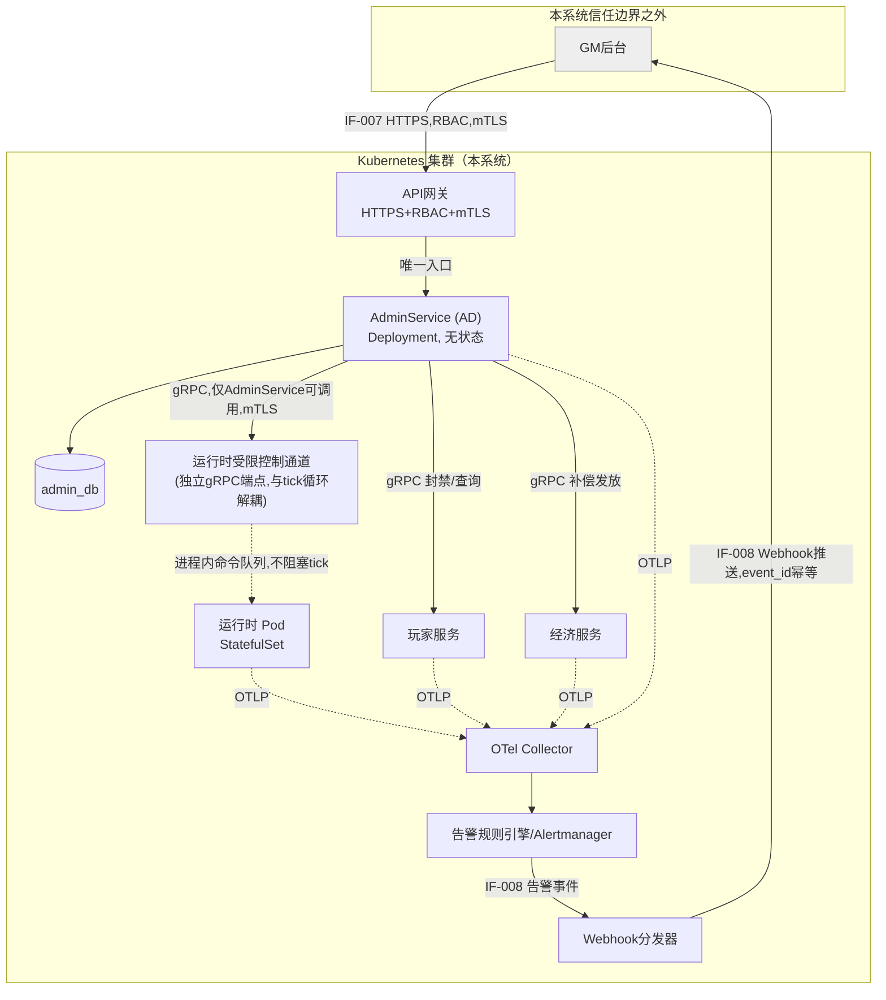
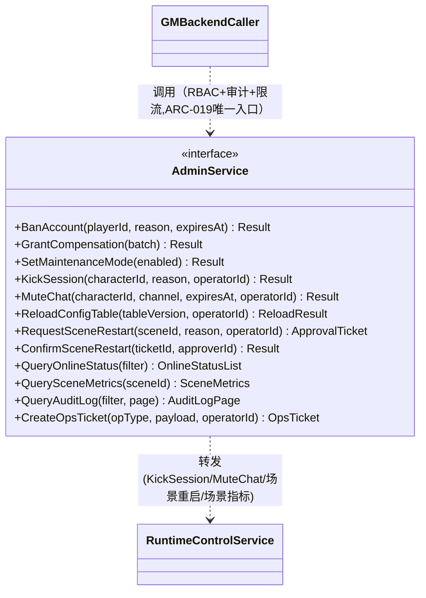
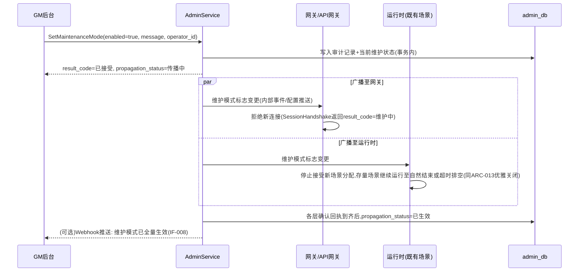
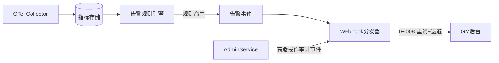
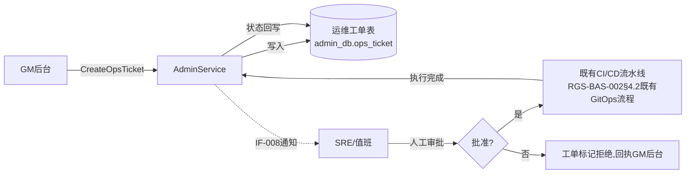

# 基本设计书（基本設計書 / Basic Design Document）

**运维功能与GM后台管控 Operations & GM Backend Control**

| 项目 | 内容 |
|---|---|
| 文档编号 | RGS-BAS-003 |
| 版本 | 0.1 |
| 父文档 | RGS-REQ-007 需求定义书 第7章（ARC-019） |
| 依据标准 | IPA『共通フレーム 2013（SLCP-JCF2013）』基本设计工程 |
| 制定日 | 2026-08-16 |
| 制定者 | 架构师 |
| 保密级别 | 内部限定（Internal Use Only） |

## 修订历史（改訂履歴 / Revision History）

| 版本 | 修订日 | 修订者 | 修订内容 | 影响章节 |
|---|---|---|---|---|
| 0.1 | 2026-08-16 | 架构师 | 初版制定。将RGS-REQ-007 ARC-019展开为控制平面组件图、`AdminService`字段级API扩展、运行时受限控制通道设计、维护模式传播时序、告警推送设计、RBAC角色矩阵扩展、运维工单设计 | 全部 |

## 审批栏（承認欄 / Approval）

| 角色 | 姓名 | 审批日 | 备注 |
|---|---|---|---|
| 制定（起草） | 架构师 | 2026-08-16 | — |
| 评审（技术） | | | 与RGS-BAS-001既有§5.7 admin_db／§6.3.4 AdminService／§7.3 RBAC的一致性 |
| 评审（安全） | | | 控制平面爆炸半径限制（ARC-019）是否落实到位 |
| 审批（负责人） | | | 本文档的基准化 |

---

## 目录

1. [前言](#1-前言)
2. [整体控制平面架构](#2-整体控制平面架构)
3. [AdminService 字段级API扩展设计](#3-adminservice-字段级api扩展设计)
4. [运行时受限控制通道设计](#4-运行时受限控制通道设计)
5. [维护模式传播设计](#5-维护模式传播设计)
6. [告警与事件推送设计](#6-告警与事件推送设计)
7. [审计与查询设计](#7-审计与查询设计)
8. [RBAC角色矩阵扩展与高危操作二次确认](#8-rbac角色矩阵扩展与高危操作二次确认)
9. [限流与故障隔离设计](#9-限流与故障隔离设计)
10. [K8s层运维工单设计](#10-k8s层运维工单设计)
11. [与RGS-OPS-001的分工](#11-与rgs-ops-001的分工)
12. [标准化检查清单](#12-标准化检查清单)
13. [追溯性（ARC-019 → 本设计书章节）](#13-追溯性arc-019--本设计书章节)

---

# 1. 前言

## 1.1 本文档的定位

本文档是RGS-REQ-007第7章ARC-019（GM后台控制平面的统一入口与爆炸半径限制）的系统级展开。本文档遵循RGS-BAS-001既有记述规则（§1.4强度用语、图示规则），不重复定义；本文档同时是RGS-BAS-001§5.7（`admin_db`）、§6.3.4（`AdminService`）、§7.3（RBAC角色）三处既有设计的**扩展**，而非替代——`AdminService`的既有方法（`BanAccount`／`GrantCompensation`／`SetMaintenanceMode`）保持不变，本文档仅新增方法与新增组件。

## 1.2 与RGS-BAS-002（功能挂载架构）的关系

GM后台是**本系统之外**的系统，不运行在本系统的Kubernetes集群内，因此GM后台本身**不适用**RGS-BAS-002的"挂载"流程。但本文档新增的**运行时受限控制通道**（§4）是本系统内部新增的组件，其K8s部署（Deployment形态判定、NetworkPolicy隔离）**仍需**遵循RGS-BAS-002§5的既有原则——它不是独立限界上下文（复用运行时既有的`admin_db`外部依赖关系与`AdminService`的信任边界），因此不触发RGS-REQ-006 ARC-018的完整挂载五要素，但其NetworkPolicy设计思路直接复用RGS-BAS-002§5.3。

---

# 2. 整体控制平面架构

## 2.1 组件图

> **ARC-019落地要点**：图中GM后台到本系统**只有一条入站路径**（经API网关到`AdminService`）与**一条出站路径**（Webhook推送）。GM后台节点上不存在指向`RTC`、`ADDB`、K8s API Server、`player_db`/`economy_db`的任何直接连线——这是运行时的强制拓扑，而非仅靠文档约定（NetworkPolicy落地见§4.4）。

## 2.2 新增外部接口编号

| 接口编号 | 名称 | 方向 | 补充说明 |
|---|---|---|---|
| IF-007（既有，本文档扩展字段） | GM后台 ⇔ 运营API | GM后台 → 本系统 | 见§3新增方法 |
| IF-008（新增） | 本系统 → GM后台 事件推送 | 本系统 → GM后台 | Webhook，见§6 |

---

# 3. AdminService 字段级API扩展设计

延续RGS-BAS-001§6.1 API设计通用原则（`request_id`幂等键、`trace_id`追踪、`result_code`错误表达）。以下方法**新增**至既有`AdminService`（RGS-BAS-001§6.3.4），不改变既有三个方法的签名。

## 3.1 账号/会话级方法

| Method | 请求字段 | 响应字段 | 对应功能 |
|---|---|---|---|
| `KickSession` | `request_id`／`character_id`／`reason`／`operator_id` | `result_code`／`session_terminated`（布尔） | FR-GM-011 |
| `MuteChat` | `request_id`／`character_id`／`channel`（枚举，同§6.2.2 `ChatMessage`的channel）／`expires_at`（可空＝永久）／`operator_id` | `result_code`／`mute_id` | FR-GM-012 |

## 3.2 场景/运行时级方法

| Method | 请求字段 | 响应字段 | 对应功能 |
|---|---|---|---|
| `QuerySceneMetrics` | `scene_id` | `entity_count`／`avg_tick_duration_ms`／`mailbox_depth`／`status`（正常／告警／严重） | FR-GM-020 |
| `RequestSceneRestart` | `request_id`／`scene_id`／`reason`／`operator_id` | `ticket_id`／`status`（待确认） | FR-GM-021（第一步：申请） |
| `ConfirmSceneRestart` | `ticket_id`／`approver_id`（须持有"高危操作"角色，见§8） | `result_code`／`executed_at` | FR-GM-021（第二步：二次确认后执行） |

## 3.3 配置/发布级方法

| Method | 请求字段 | 响应字段 | 对应功能 |
|---|---|---|---|
| `ReloadConfigTable` | `request_id`／`table_version`／`operator_id` | `result_code`（成功／一致性检查未通过，落地ARC-016，一致性检查设计见RGS-BAS-001§4.2.2）／`applied_at` | FR-GM-030 |
| `SetMaintenanceMode`（既有，行为补充） | 同既有字段 | 同既有字段＋新增`propagation_status`（各下游层的传播确认状态，见§5） | FR-GM-031 |
| `CreateOpsTicket` | `request_id`／`op_type`（枚举：扩容建议／缩容建议／滚动更新请求／Pod重启请求）／`payload`（JSON，具体参数）／`operator_id` | `ticket_id`／`status`（已提交，待SRE处理） | FR-GM-032（**不**触发任何K8s操作，仅落工单，见§10） |

## 3.4 查询/审计方法

| Method | 请求字段 | 响应字段 | 对应功能 |
|---|---|---|---|
| `QueryOnlineStatus` | `filter`（可选：`player_id`／`scene_id`／分页参数） | `players[]`（`character_id`／`scene_id`／`connected_at`／`session_epoch`） | FR-GM-003 |
| `QueryAuditLog` | `filter`（操作者／操作类型／时间范围）／`page` | `entries[]`（同`OPERATION_AUDIT`表字段，RGS-BAS-001§5.7）／`has_more` | FR-OPS-004 |

---

# 4. 运行时受限控制通道设计

## 4.1 设计目标

对应ARC-019"涉及运行时进程内部状态的操作，必须经运行时新增的受限控制通道二次转发"。目标：让GM指令能够触达单个场景Actor（如KickSession需要让特定运行时节点上的会话失效），同时**不破坏**ARC-001（场景Actor单线程顺序执行）与ARC-013（背压、死锁防止）的既有保证。

## 4.2 组件设计

| 项目 | 内容 |
|---|---|
| 部署形态 | 与运行时Pod**同进程**内的独立gRPC服务`RuntimeControlService`（不新建独立Pod/Deployment，理由：需要直接访问该Pod内存中的场景Actor句柄表，跨Pod会引入不必要的网络往返与一致性问题） |
| 调用方 | **仅**`AdminService`，通过mTLS+服务身份校验限制调用方，运行时集群内DNS不对外（无K8s Service的对外暴露），只在集群内网络可达，且受NetworkPolicy进一步限制来源为`AdminService`所在Pod（复用RGS-BAS-002§5.3网络隔离思路） |
| 与tick循环的关系 | 收到的命令写入该Pod内一个**有界命令队列**（同ARC-013"不得创建无界的queue"），在每个场景Actor的tick边界之间被消费，**不得**在tick执行中途插入命令处理，同ARC-016"数值表热更新的原子切换点"同等的边界纪律 |
| 背压 | 命令队列达到上限时拒绝新命令并返回明确的`result_code`（过载），**不得**无界排队，同ARC-013 |
| 幂等 | 命令携带`request_id`，重复下发（如`AdminService`重试）不产生重复副作用（如重复踢人只终止一次会话） |

## 4.3 支持的命令

| 命令 | 行为 | 对应`AdminService`方法 |
|---|---|---|
| `KickSession` | 定位该角色所在场景的会话对象，在下一tick边界将其标记为断开，触发既有断线流程（同网关心跳超时的既有ST-001状态迁移路径） | `AdminService.KickSession` |
| `MuteChat` | 若聊天判定发生在运行时（依赖PH-6具体实现，若聊天判定在社交服务GD侧完成则本命令改为转发至GD，非运行时），在会话级标记禁言状态 | `AdminService.MuteChat` |
| `QuerySceneMetrics` | 只读，从场景Actor的既有可观测性埋点（ARC-017）读取聚合指标，不修改任何状态 | `AdminService.QuerySceneMetrics` |
| `RestartScene`（仅在`ConfirmSceneRestart`确认后下发） | 触发该场景Actor的**优雅终止**（同ARC-013"优雅关闭"既有规律），随后按FR-RT-009既有检查点机制在新Actor中恢复 | `AdminService.ConfirmSceneRestart` |

## 4.4 网络隔离（NetworkPolicy）

| 规则 | 内容 |
|---|---|
| 入站 | 仅允许来自`AdminService`所在命名空间/Pod标签的连接，其余（含GM后台、客户端、网关）一律拒绝 |
| 出站 | 不适用（该通道不主动发起出站连接，仅被动接收命令） |

---

# 5. 维护模式传播设计

对应FR-GM-031，补齐RGS-BAS-001既有`SetMaintenanceMode`未定义的"下游各层如何响应"。

**设计要点**：维护模式的传播**不是**同步阻塞`SetMaintenanceMode`调用的完成——`AdminService`立即返回"已接受"，实际生效状态通过`propagation_status`字段异步收敛，避免维护模式切换本身因等待全部Pod确认而超时（同ARC-013不得产生同步阻塞的循环等待）。

---

# 6. 告警与事件推送设计

## 6.1 数据流

## 6.2 设计原则

| 原则 | 内容 |
|---|---|
| 幂等 | 每条推送事件携带`event_id`，GM后台侧须按`event_id`去重（同ARC-009 Effectively Once精神），本系统侧允许At-Least-Once重试 |
| 重试与退避 | Webhook分发失败按指数退避重试，超过上限后转入死信队列供人工排查，**不得**无界重试（同ARC-013） |
| 内容分级 | 告警事件须携带严重度（信息／告警／严重），GM后台可按级别路由通知渠道（本系统不负责GM后台内部的通知路由逻辑） |
| 告警规则定义 | 告警规则的具体阈值与定义**不属于**本系统职责范围，由运维配置于告警规则引擎（可能是既有可观测性基础设施的组成部分，选型判定依ARC-014），本文档只定义"规则命中后如何推送"的接口 |

---

# 7. 审计与查询设计

| 项目 | 内容 |
|---|---|
| 存储 | 复用既有`admin_db.OPERATION_AUDIT`表（RGS-BAS-001§5.7），仅追加，不提供删除/更新（NFR-SE-010） |
| 新增操作类型 | `action_type`枚举扩展：`KICK_SESSION`／`MUTE_CHAT`／`RELOAD_CONFIG`／`SCENE_RESTART_REQUEST`／`SCENE_RESTART_CONFIRM`／`OPS_TICKET_CREATED`，与既有`BAN_ACCOUNT`／`GRANT_COMPENSATION`／`SET_MAINTENANCE_MODE`并列 |
| 查询接口 | `AdminService.QueryAuditLog`（§3.4），响应经分页，**不**暴露批量导出（防止审计数据被整表拖走；如确需批量导出，走独立的、更高权限等级的合规流程，本版不设计） |
| 二次确认留痕 | `ConfirmSceneRestart`等二次确认动作各自产生独立的审计记录（申请一条、确认一条），可通过`ticket_id`关联查询 |

---

# 8. RBAC角色矩阵扩展与高危操作二次确认

## 8.1 角色矩阵（扩展RGS-BAS-001§7.3既有五类角色）

| 角色 | 权限范围 | 备注 |
|---|---|---|
| 只读查看（既有） | `QueryOnlineStatus`／`QuerySceneMetrics`／`QueryAuditLog` | 无写权限 |
| 封禁操作（既有） | `BanAccount`／`KickSession`／`MuteChat` | 账号/会话级写操作 |
| 补偿发放（既有） | `GrantCompensation` | — |
| 维护模式切换（既有） | `SetMaintenanceMode` | — |
| 数值热更新（既有） | `ReloadConfigTable` | — |
| **高危操作审批（新增）** | `ConfirmSceneRestart`、超过阈值的批量`GrantCompensation`/`BanAccount`的二次确认 | 须与申请者（`RequestSceneRestart`调用者）**不是同一操作者**（双人原则，防止单点绕过） |
| **运维工单发起（新增）** | `CreateOpsTicket` | 仅能创建工单，**不**具备执行K8s操作的权限（该权限根本不存在于本系统API中，见§10） |

## 8.2 高危操作判定与二次确认流程

| 操作 | 高危判定条件 | 确认要求 |
|---|---|---|
| `RequestSceneRestart` → `ConfirmSceneRestart` | 恒定视为高危（直接影响该场景内全部在线玩家） | 双人原则，见§8.1 |
| `BanAccount`（批量） | 单批次超过阈值【待定，与运营团队评审】 | 二次确认，阈值以下沿用既有单人操作 |
| `GrantCompensation`（批量） | 单批次影响人数或道具总值超过阈值【待定】 | 二次确认 |

> 阈值具体数值为TBD-OPS-003，待与运营团队评审后于详细设计阶段确定，不影响本设计书的流程结构本身。

---

# 9. 限流与故障隔离设计

| 设计点 | 方针 |
|---|---|
| GM后台侧限流 | `AdminService`对每个GM后台调用方身份设置速率限制桶，防止GM后台自身故障（死循环重试）冲击控制平面，同ARC-013 |
| 熔断 | `AdminService`对下游（`RuntimeControlService`／`PlayerService`／`EconomyService`）调用设置超时+熔断器，下游不可用时`AdminService`返回明确降级结果，**不得**将GM指令挂起等待 |
| 故障隔离（NFR-OPS-006落地） | `AdminService`与`admin_db`的可用性问题**不得**影响玩家侧实时路径——`AdminService`不参与移动/战斗的同步调用链（同ARC-007既有边界的自然推论：控制平面与实时业务路径物理上是不同的调用图） |

---

# 10. K8s层运维工单设计

对应ARC-019"K8s层操作的例外处理"。

| 设计要点 | 内容 |
|---|---|
| 工单表 | `admin_db`新增`ops_ticket`表：`ticket_id`／`op_type`／`payload`／`status`（待处理／已批准／已拒绝／执行中／已完成）／`created_by`／`approved_by`／`executed_at` |
| **权限边界（ARC-019核心）** | 本系统API中**不存在**任何"执行K8s操作"的方法。`CreateOpsTicket`只产生一条记录，实际执行动作发生在**本系统边界之外**——既有CI/CD流水线或SRE的人工操作，均不通过本系统的gRPC/HTTP接口触发 |
| 状态回写 | SRE/CI流水线执行完成后，通过既有运维手段（如CI流水线回调既有的工单状态更新接口，或人工在GM后台标记）更新`ops_ticket.status`，形成闭环可查询记录 |

---

# 11. 与RGS-OPS-001的分工

| 维度 | 本文档（RGS-BAS-003） | RGS-OPS-001（待制定，PH-4） |
|---|---|---|
| 性质 | 系统需求与设计（回答"系统必须提供什么能力"） | 运维手顺书（回答"SRE收到告警后按什么步骤操作"） |
| 内容 | API字段设计、控制平面组件、RBAC角色定义、审计设计 | 值班排班、故障响应SOP、告警规则的具体阈值配置、事后复盘模板 |
| 关系 | RGS-OPS-001**消费**本文档定义的API与观测数据，**不重复**定义系统能力 | 本文档**不涉及**人工操作步骤与组织流程 |

---

# 12. 标准化检查清单

## 12.1 GM后台管控功能上线检查清单

- [ ] `AdminService`新增方法（§3）均已实现`request_id`幂等与`trace_id`透传（RGS-BAS-001§6.1通用原则）
- [ ] 运行时受限控制通道的NetworkPolicy已验证：仅`AdminService`可达，GM后台/客户端/网关均不可达（§4.4）
- [ ] 高危操作（§8.2）的二次确认流程在测试环境验证通过，且申请者与确认者角色互斥
- [ ] 维护模式传播的三层确认（网关/API网关、运行时、业务服务）均有回执，`propagation_status`可正确收敛为"已生效"
- [ ] 告警推送（IF-008）的`event_id`幂等与重试退避已验证
- [ ] 审计日志新增操作类型（§7）均可通过`QueryAuditLog`检索
- [ ] 已确认本系统API中不存在任何K8s操作执行接口，`CreateOpsTicket`仅落表不触发实际操作（ARC-019核心验证项）

---

# 13. 追溯性（ARC-019 → 本设计书章节）

| ARC/FR编号 | 决定摘要 | 本文档展开章节 |
|---|---|---|
| ARC-019 | GM后台控制平面统一入口与爆炸半径限制 | §2、§4、§10 |
| FR-GM-001〜005 | GM后台互通（鉴权、只读查询、事件推送） | §2.2、§3.4、§6 |
| FR-GM-010〜013 | 账号/会话级控制 | §3.1、§4.3 |
| FR-GM-020〜021 | 场景/运行时级控制 | §3.2、§4 |
| FR-GM-030〜032 | 配置/发布级控制 | §3.3、§5、§10 |
| FR-GM-040〜041 | 异常检测与风控联动 | §7（复用既有FR-AD-004数据） |
| FR-OPS-001〜004 | 运维功能（健康视图、告警、审计） | §6、§7 |
| NFR-OPS-001〜008 | 性能/安全/可审计/可用/幂等/限流 | §3、§4.2、§6.2、§8、§9 |

---

> 本文档所定义的流程为**详细设计与实现阶段的输入基准**。具体的Webhook签名算法、告警规则引擎选型（依ARC-014判定基准）、`ops_ticket`表物理DDL等实现细节，留待详细设计阶段与RGS-DBS-001／RGS-IFS-001确定。
