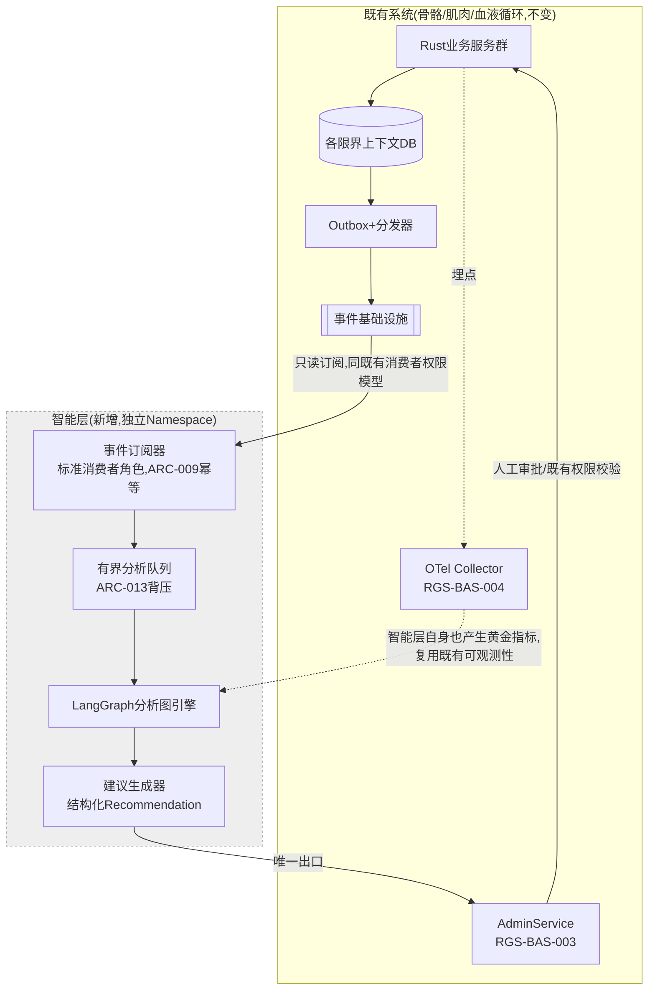
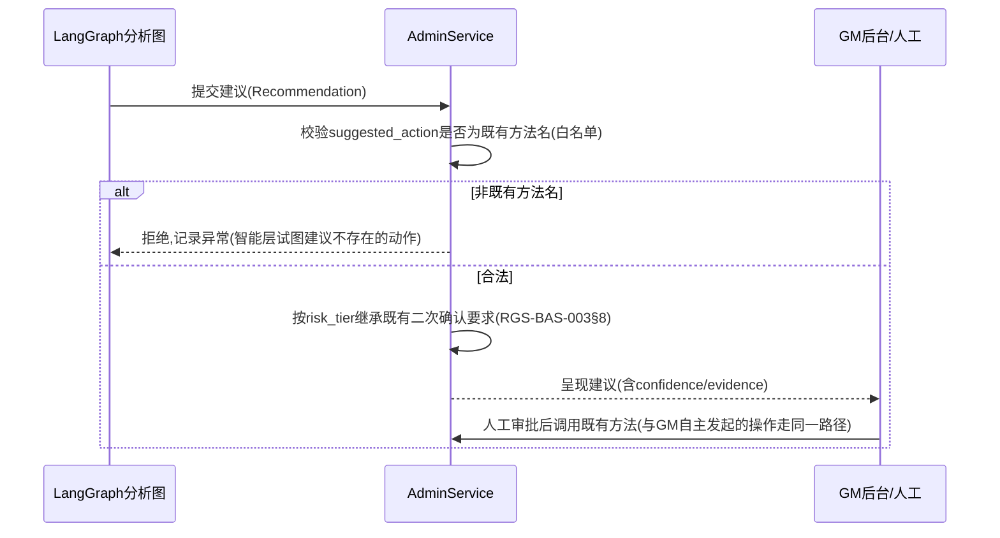

# 基本设计书（基本設計書 / Basic Design Document）

**仿生分层架构与智能决策层 Bionic Layered Architecture & Intelligence Layer**

| 项目 | 内容 |
|---|---|
| 文档编号 | RGS-BAS-011 |
| 版本 | 0.1 |
| 父文档 | RGS-REQ-014 需求定义书 第7章（ARC-027） |
| 依据标准 | IPA『共通フレーム 2013（SLCP-JCF2013）』基本设计工程 |
| 制定日 | 2026-08-16 |
| 制定者 | 架构师 |
| 保密级别 | 内部限定（Internal Use Only） |

## 修订历史（改訂履歴 / Revision History）

| 版本 | 修订日 | 修订者 | 修订内容 | 影响章节 |
|---|---|---|---|---|
| 0.1 | 2026-08-16 | 架构师 | 初版制定。将RGS-REQ-014 ARC-027展开为智能层组件图、LangGraph图结构设计范式、事件订阅与建议呈现接口、OLU预算核算 | 全部 |

## 审批栏（承認欄 / Approval）

| 角色 | 姓名 | 审批日 | 备注 |
|---|---|---|---|
| 制定（起草） | 架构师 | 2026-08-16 | — |
| 评审（安全） | | | 智能层的NetworkPolicy隔离与凭证边界是否可靠 |
| 审批（负责人） | | | 本文档的基准化。**智能层部分依赖RGS-REQ-014§9 CR-011的批准，未批准前仅可PoC** |

---

## 目录

1. [前言](#1-前言)
2. [智能层整体架构](#2-智能层整体架构)
3. [OLU运维负荷预算核算](#3-olu运维负荷预算核算)
4. [事件订阅设计（感觉输入）](#4-事件订阅设计感觉输入)
5. [LangGraph分析图设计范式](#5-langgraph分析图设计范式)
6. [建议呈现设计（运动输出）](#6-建议呈现设计运动输出)
7. [隔离与降级设计](#7-隔离与降级设计)
8. [ECS与实时行为图的边界落地](#8-ecs与实时行为图的边界落地)
9. [标准化检查清单](#9-标准化检查清单)
10. [追溯性（ARC-027 → 本设计书章节）](#10-追溯性arc-027--本设计书章节)

---

# 1. 前言

本文档是RGS-REQ-014第7章ARC-027的系统级展开。本文档遵循RGS-BAS-001既有记述规则，且**不改变**既有BAS-001〜010的任何组件结构——智能层是新增的、边界严格限定的**旁路观察者**，不修改既有数据流的方向。

**生效前提**：本文档§2〜§7描述的智能层设计，其技术栈（LangGraph/Python）依赖RGS-REQ-014§9 CR-011对CON-003的修订获负责人批准。批准前，本文档作为设计提案存在，PoC阶段**不得**接入生产事件流（§4.1"预发布/PoC限定"已明确）。

---

# 2. 智能层整体架构

## 2.1 组件图

## 2.2 部署形态

| 项目 | 内容 |
|---|---|
| K8s部署 | 独立Deployment，无状态（分析队列可持久化于智能层专属的轻量存储，但不承载权威数据，故复用RGS-BAS-002§5.1判定原则默认Deployment） |
| Namespace/NetworkPolicy | 独立Namespace，NetworkPolicy默认拒绝（复用RGS-BAS-006§4基线），出站**仅**允许：事件基础设施（订阅）、`AdminService`（呈现建议）、OTel Collector（可观测性）。**入站不接受任何连接**（纯拉取/订阅模型，无需暴露服务端口给内部其他组件；若需人工调试接口，走既有跳板机制而非常驻暴露端口） |
| 依赖库许可 | LangGraph及其Python依赖须逐一核对OSI许可（复用附件D§4 OSS许可盘点表流程，同CON-001约束），纳入RGS-BAS-006§6供应链安全流水线（依RSK-NEURO-002） |

---

# 3. OLU运维负荷预算核算

依ARC-026，新增运维面须先申领额度。以下为诚实核算，供负责人在RGS-REQ-014§9批准决策时参考。

## 3.1 智能层新增运维面估算

| 运维面 | OLU/月 | 说明 |
|---|---|---|
| Python/LangGraph依赖管理与漏洞响应（与既有Rust为主的CI流水线并行维护） | 6 | 与既有Cargo生态的漏洞扫描是两套工具链，无法直接复用RGS-BAS-006§6既有流水线的Rust专属部分 |
| 分析图的迭代维护（新增/调整分析规则） | 4 | 随异常模式演变持续调整，类比既有数值表调参的运维投入 |
| 建议质量监控与误报率跟踪 | 3 | 对应RSK-NEURO-003缓解措施的常态化 |
| 独立Namespace的部署与监控 | 3 | 复用既有K8s/可观测性基础设施，边际成本较低 |
| **合计** | **16** | |

## 3.2 核算结果（与附件D§5台账联动）

| 项目 | OLU/月 |
|---|---|
| 附件D§5既有台账余额（RGS-REQ-013处置后） | +2 |
| 智能层新增申领 | −16 |
| **核算后余额** | **−14（超支）** |

> **结论**：智能层**不得**在当前状态下上线（依ARC-026强制约束——余额不足时不得新增）。须先完成以下之一：①执行附件D§5.3尚未落实的回收项（R-2〜R-6，PH-2〜PH-6陆续到位后可释放20 OLU，届时余额转正）②将智能层的部分运维面自动化以降低估算（如依赖漏洞扫描若能并入既有CI的同一次运行触发，可回收2〜3 OLU）③延后上线至既有回收项到位后。本核算结果已如实登记，见§9检查清单与附件D更新（本次执行）。

---

# 4. 事件订阅设计（感觉输入）

## 4.1 订阅范围与权限

| 项目 | 内容 |
|---|---|
| 订阅方式 | 标准事件消费者角色，复用ARC-010既定的Topic与`partition_key`体系，**不新增专属Topic** |
| 权限边界 | 智能层的消费者身份**仅**具备订阅权限，**不具备**发布权限（防止智能层通过发布伪造事件间接影响下游，这是"只读感知"边界的消费者侧落地） |
| 幂等消费 | 复用ARC-009既定的消费者幂等义务，已处理记录与分析中间结果同事务/同批次持久化 |
| **预发布/PoC限定** | 在RGS-REQ-014§9 CR-011批准前，智能层**仅可**订阅预发布/隔离测试环境的事件流，**不得**订阅生产环境事件基础设施——技术上通过独立的、指向非生产环境的连接配置与NetworkPolicy出站白名单实现物理隔离，而非仅靠约定 |

## 4.2 数据脱敏

智能层接收的事件如含个人信息，**必须**遵循RGS-BAS-004§5既定的脱敏规则——智能层不因其"分析用途"而获得查看未脱敏个人信息的特权，脱敏在事件产生源头已完成（复用既有"脱敏优先于清洗"的ARC-020精神）。

---

# 5. LangGraph分析图设计范式

对应FR-NEURO-021。

| 设计点 | 内容 |
|---|---|
| 图的构成 | 节点＝分析步骤（如"提取特征"、"与历史基线比较"、"计算置信度"、"生成依据说明"），边＝条件转移（如"置信度>阈值时进入人工复核建议生成节点，否则记录不告警"） |
| 与ARC-016热更新思想的关系 | 图定义（节点参数、边的条件阈值）**应当**与推理引擎代码分离、可独立更新，复用ARC-016"数值表与可执行文件分离"的既定思想，避免每次调整分析规则都需要重新构建部署镜像 |
| 多智能体协作（若采用） | 若分析场景需要多个专精子图协作（如"异常检测子图"与"经济健康度子图"），**必须**通过LangGraph既定的图组合机制实现，**不得**用进程间自定义RPC实现子图间通信（避免在智能层内部重新发明一套通信机制，增加不必要的复杂度，同ARC-014"未证明不引入复杂性"精神） |
| 可解释性落地 | 每个节点的输出**必须**携带其依据的输入数据引用（对应FR-NEURO-022"依据"字段），图的最终输出天然是一条可回溯的"推理链"，满足NFR-NEURO-003 |

---

# 6. 建议呈现设计（运动输出）

## 6.1 建议的数据结构

| 字段 | 内容 |
|---|---|
| `recommendation_id` | 唯一标识，供GM侧引用 |
| `confidence` | 置信度（0〜1），供GM按阈值过滤（缓解RSK-NEURO-003） |
| `evidence[]` | 依据的原始事件/数据点引用列表 |
| `suggested_action` | 映射至既有`AdminService`方法名或`CreateOpsTicket`工单类型，**不得**是不存在于既有API目录的自定义动作 |
| `risk_tier` | 依`suggested_action`所属的RGS-BAS-003§8既定高危操作分类自动继承，**不得**由智能层自行降级 |

## 6.2 呈现时序

**设计要点**：`AdminService`对智能层建议的处理路径与GM后台人工发起的操作**复用同一套RBAC/审计/二次确认机制**（RGS-BAS-003§3、§8），智能层不产生任何专属的、绕过既有校验的快速通道——建议进入`AdminService`后即"脱去"其AI来源标签，被当作一条普通的待审批操作对待，这是"运动输出必须经既有神经-肌肉接头"这一隐喻的最终技术落地。

---

# 7. 隔离与降级设计

对应NFR-NEURO-001。

| 设计点 | 内容 |
|---|---|
| 队列上限 | 分析队列（§2.1）**必须**有界，超限时按优先级丢弃（复用ARC-013既定背压原则），**不得**无界积压导致内存增长影响所在节点的其他工作负载 |
| 熔断 | 智能层对`AdminService`的建议提交调用**必须**设超时+熔断，`AdminService`不可用时智能层**不得**阻塞其事件消费循环（继续消费并暂存分析结果，待恢复后补交） |
| 全局降级 | 智能层整体不可用（Pod崩溃、依赖故障）时，**不得**产生任何对既有实时/业务路径的影响——这是架构上的自然结果（智能层不在任何既有调用链路的关键路径上），本节仅要求以故障注入试验（AC-NEURO-001）验证该"自然结果"确实成立，而非想当然地假设 |

---

# 8. ECS与实时行为图的边界落地

对应FR-NEURO-001〜012，本节不引入新组件，仅明确既有RT子系统内的代码组织原则。

| 场景 | 归属 | 理由 |
|---|---|---|
| 场景实体模拟 | ECS System（既有） | ARC-001既定 |
| AOI网格与视野裁剪 | ECS System（既有，本次显式重申） | 高频、大量实体，同ARC-001理由 |
| NPC逐帧战斗决策（若引入，PH-7+） | ECS System内的实时行为图（Rust原生表达，如轻量决策树/状态图库） | 必须在tick预算内完成，不得跨进程调用智能层 |
| 异常行为模式识别（跨多个tick、多个事件的关联分析） | 智能层LangGraph分析图 | 非实时，需要跨限界上下文数据，ECS System无法承载（同ARC-007边界） |
| 经济健康度/活动效果评估 | 智能层LangGraph分析图 | 同上，天然非实时 |

---

# 9. 标准化检查清单

## 9.1 智能层上线检查清单

- [ ] RGS-REQ-014§9 CR-011已获负责人批准（前置条件，未批准不得进入本清单其余项）
- [ ] OLU预算台账余额已核实为非负（本次核算为−14，**当前不满足**，须先完成回收项）
- [ ] NetworkPolicy已验证：智能层无法连接任何业务数据库，无法直接调用`AdminService`高危方法
- [ ] 事件订阅权限已验证：智能层消费者身份仅具备订阅权限，无发布权限
- [ ] 建议呈现已验证：`suggested_action`白名单校验生效，非法动作被拒绝
- [ ] 故障注入试验（智能层全停止）已验证既有实时/业务路径无影响
- [ ] LangGraph及Python依赖已完成OSS许可盘点（附件D§4）与漏洞扫描接入

---

# 10. 追溯性（ARC-027 → 本设计书章节）

| ARC/FR编号 | 决定摘要 | 本文档展开章节 |
|---|---|---|
| ARC-027 | 仿生分层叙事＋智能层只读感知/建议边界 | §2、§4、§6 |
| FR-NEURO-001〜003 | ECS使用范围 | §8 |
| FR-NEURO-010〜012 | 图论构造原则 | §5、§8 |
| FR-NEURO-020〜025 | 智能层功能需求 | §4、§5、§6、§7 |
| NFR-NEURO-001〜005 | 隔离/安全/可解释/运维负荷/时延 | §7、§4、§6、§3 |

---

> 本文档所定义的规范为详细设计与实现阶段的输入基准，且**智能层部分的实施以RGS-REQ-014§9 CR-011获批与本文档§3 OLU核算转正为前提**。LangGraph具体版本、分析图的初始节点集合，留待详细设计阶段确定。
