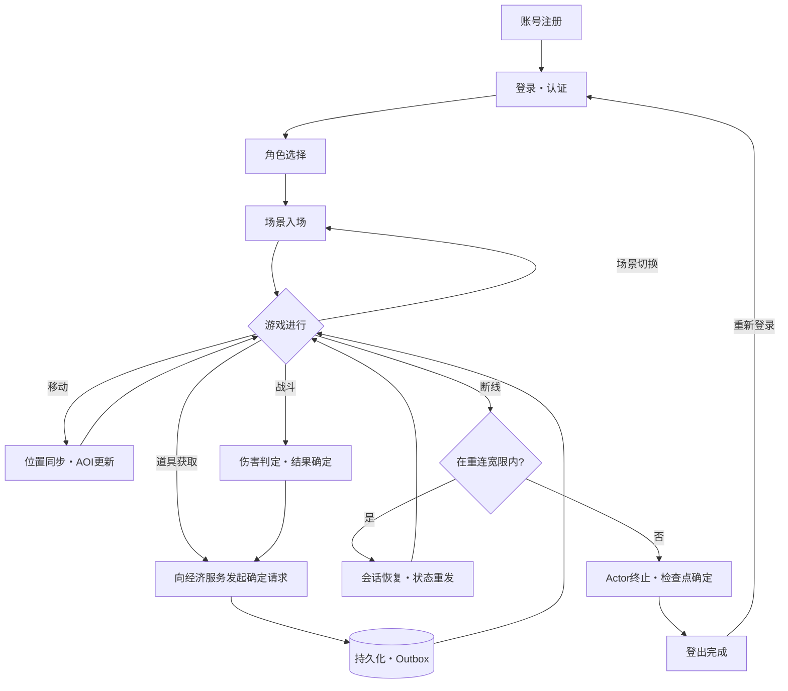
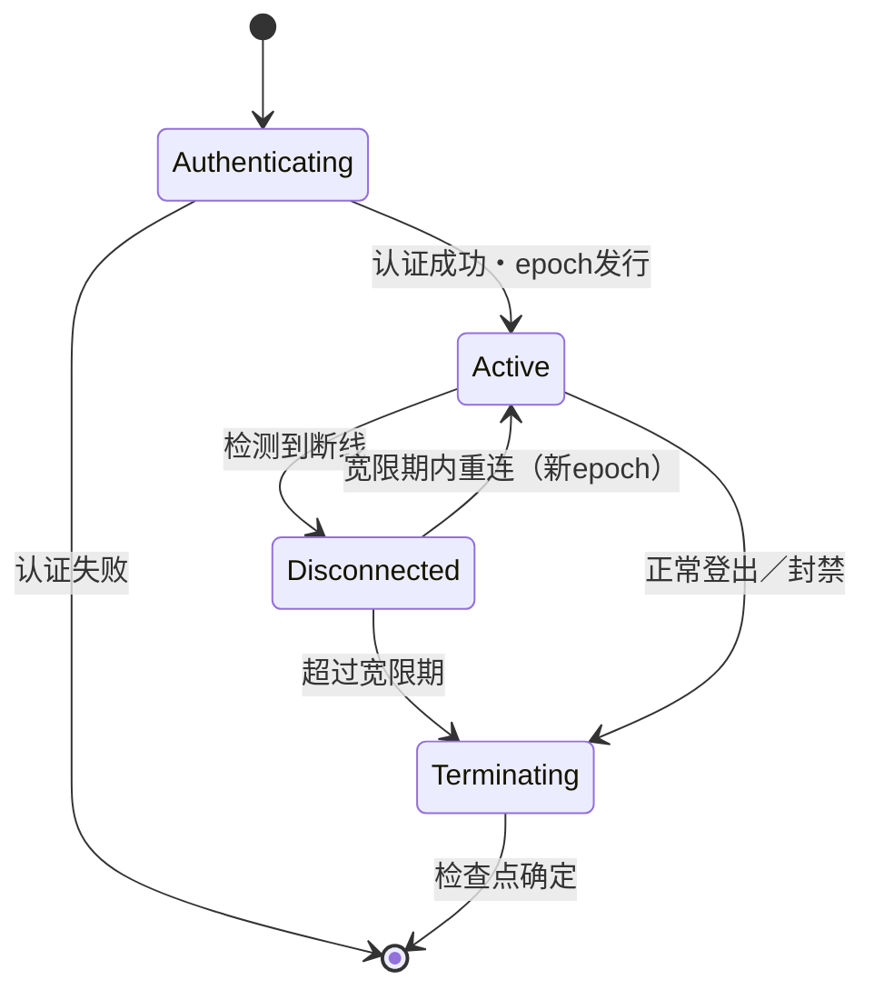
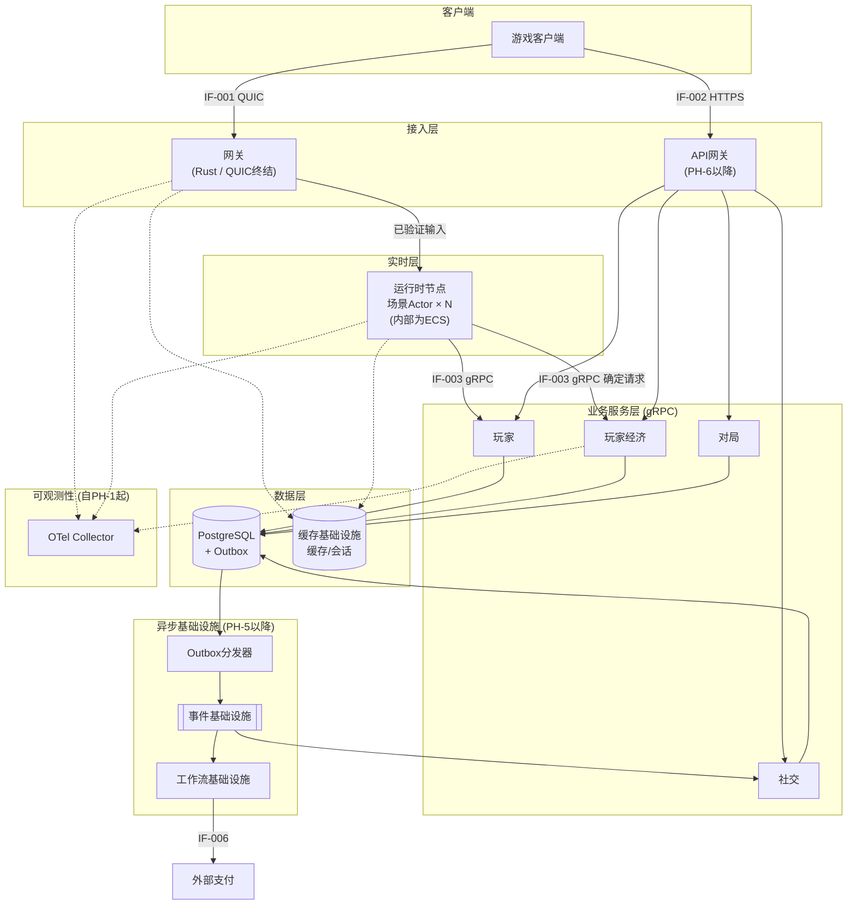

# 需求定义书（要件定義書 / Requirements Definition Document）

**分布式游戏服务器基础设施 RustGameServer**

| 项目 | 内容 |
|---|---|
| 文档编号 | RGS-REQ-001 |
| 版本 | 1.3 |
| 制定日 | 2026-08-15 |
| 最终更新日 | 2026-08-15 |
| 制定者 | 架构师 |
| 保密级别 | 内部限定（Internal Use Only） |
| 适用许可 | Apache-2.0（本仓库）／ISS-002 决议完毕 |

---

## 修订历史（改訂履歴 / Revision History）

> 下表「审批者」列记载的是**各版本内容变更的知悉人**，不构成文档整体的正式签署。文档整体的正式生效以下方「审批栏」的签署为准——两者是不同层级的概念：前者随每次修订滚动记录，后者仅在文档基准化时签署一次。

| 版本 | 修订日 | 修订者 | 审批者 | 修订内容 | 影响需求ID |
|---|---|---|---|---|---|
| 0.1 | 2026-08-15 | 架构师 | — | 初版制定（反映架构评审指摘 P0-1〜P0-4、P1-5〜P1-10） | 全部 |
| 1.0 | 2026-08-15 | 架构师 | 李典 | 评审提交版 | 全部 |
| 1.1 | 2026-08-15 | 架构师 | 李典 | 反映ISS-001（审批者确定：李典）及ISS-002（许可由AGPL-3.0变更为Apache-2.0）的决议 | CON-006、RSK-004、TBD-001 |
| 1.2 | 2026-08-15 | 架构师 | 李典 | 正文由日文改写为中文，保留IPA框架的结构体系与ID体系不变；同步修正自审中发现的等级不一致、许可判定过时等问题 | 全部（结构与ID不变，仅语言与部分内容修订） |
| 1.3 | 2026-08-15 | 架构师 | — | 订正§5.3.2 FR-EC-003输入字段措辞：`player_id`→`character_id`，与RGS-BAS-001§4.5.1/§6.3.2已确定的API字段对齐（RGS-DET-001§1.4已指出此差异） | FR-EC-003 |

## 审批栏（承認欄 / Approval）

| 角色 | 姓名 | 审批日 | 备注 |
|---|---|---|---|
| 制定（起草） | 架构师 | 2026-08-15 | — |
| 评审（技术） | | | 架构合理性 |
| 评审（业务） | | | 业务需求的完整性 |
| **审批（负责人）** | **李典** | | 本文档的基准化。经ISS-001确定（2026-08-15） |

> 本文档经审批后成为项目的**基准文档**。此后的设计・实现・试验必须确保对本文档的可追溯性。

---

## 目录

1. [前言](#1-前言)
2. [系统概述](#2-系统概述)
3. [前提条件・制约条件](#3-前提条件制约条件)
4. [业务需求](#4-业务需求)
5. [功能需求](#5-功能需求)
6. [数据需求](#6-数据需求)
7. [外部接口需求](#7-外部接口需求)
8. [状态迁移需求](#8-状态迁移需求)
9. [非功能需求](#9-非功能需求)
10. [架构设计方针](#10-架构设计方针)
11. [分阶段开发计划](#11-分阶段开发计划)
12. [质量保证・试验方针](#12-质量保证试验方针)
13. [开发体制・角色分工](#13-开发体制角色分工)
14. [风险管理・问题管理](#14-风险管理问题管理)
15. [验收标准](#15-验收标准)

---

# 1. 前言

## 1.1 本文档的目的

本文档定义 RustGameServer（以下称「本系统」）的业务需求、功能需求、非功能需求及架构设计方针，作为后续基本设计、详细设计、实现、试验的**唯一基准**。

本文档具体达成以下目的：

1. 明确本系统的**范围（Scope）**与**范围外**，防止范围蔓延（Scope Creep）。
2. 以可测定的形式定义非功能需求（依据IPA非功能需求等级框架），使「高并发」「可扩展」等定性表述转化为**可判定合格与否的数值**。
3. 明确各组件的**职责归属（WHO owns this responsibility）**，杜绝职责重复与职责真空。
4. 明确分布式中间件的**导入判定基准**，防止在无性能证据的情况下提前引入复杂性。

## 1.2 适用范围

本文档适用于本系统服务端基础设施的全体。客户端本体、美术资源、游戏策划内容不在本文档范围内（详见2.3节）。

## 1.3 目标读者

| 读者 | 阅读重点 |
|---|---|
| 项目负责人 | 第2章、第9章、第11章、第14章、第15章 |
| 架构师・技术负责人 | 全章（特别是第10章） |
| 开发人员 | 第5章〜第8章、第10章、第12章 |
| 运维人员 | 第9章、第10.18节、第12.4节 |
| 质量保证人员 | 第9章、第12章、第15章、附件C |

## 1.4 关联文档

| 文档编号 | 文档名 | 参照目的 |
|---|---|---|
| RGS-REQ-002 | 附件A 术语表・缩略语一览 | 术语统一 |
| RGS-REQ-003 | 附件B 非功能需求等级项目别一览 | 非功能需求的依据 |
| RGS-REQ-004 | 附件C 需求可追溯性矩阵 | 需求完整性确认 |
| RGS-REQ-005 | 附件D 问题管理表・风险管理表 | 未决事项的管理 |
| — | IPA『非機能要求グレード 2018』 | 非功能需求的分类・等级定义（日文原标准） |
| — | IPA『共通フレーム 2013（SLCP-JCF2013）』 | 需求定义流程的依据标准（日文原标准） |
| — | RFC 9000 / RFC 9221 | QUIC及QUIC Datagram扩展 |

## 1.5 本文档的记述规则

### 1.5.1 需求的强度

本文档遵循RFC 2119的强度表述：

| 表述 | 强度 | 含义 |
|---|---|---|
| **必须** | MUST | 必要条件。未满足则不予验收 |
| **应当** | SHOULD | 推荐条件。未满足时必须记录理由并取得批准 |
| **可以** | MAY | 任意条件。是否实现不影响验收 |
| **不得** | MUST NOT | 禁止事项。违反即为设计缺陷 |

### 1.5.2 优先级划分

| 符号 | 分类 | 含义 |
|---|---|---|
| ◎ | 必须（Must） | 商用上线前必须实现 |
| ○ | 推荐（Should） | 商用上线前应当实现，可视资源调整 |
| △ | 任意（Could） | 上线后追加实现 |
| × | 范围外（Won't） | 本次范围外，记录于2.3.2节 |

### 1.5.3 需求ID体系

| 前缀 | 对象 | 示例 |
|---|---|---|
| `ASM-nnn` | 前提条件 | ASM-001 |
| `CON-nnn` | 制约条件 | CON-001 |
| `BR-nnn` | 业务需求 | BR-001 |
| `FR-<SS>-nnn` | 功能需求 | FR-RT-001 |
| `DR-nnn` | 数据需求 | DR-001 |
| `IF-nnn` | 外部接口需求 | IF-001 |
| `ST-nnn` | 状态迁移需求 | ST-001 |
| `NFR-<区分>-nnn` | 非功能需求 | NFR-PE-001 |
| `ARC-nnn` | 架构设计方针 | ARC-001 |
| `PH-n` | 开发阶段 | PH-1 |
| `AC-nnn` | 验收标准 | AC-001 |
| `RSK-nnn` | 风险 | RSK-001 |
| `ISS-nnn` | 问题（未决事项） | ISS-001 |

子系统符号（`<SS>`）定义于5.1节。

### 1.5.4 未决事项的记法

未确定事项以 `【TBD-nnn】` 记载，并**必须**同时登记至附件D问题管理表。本文档中出现的TBD一览见14.2节。

---

# 2. 系统概述

## 2.1 背景与课题

现代MMO／大规模多人在线游戏的服务端同时承担两种性质完全不同的负载：

- **实时模拟负载**：移动、战斗、视野同步。要求20Hz以上的确定性周期、100ms以下的端到端延迟，且状态主要驻留于内存。
- **业务事务负载**：账号、道具、货币、购买、公会。要求持久化、事务一致性、可审计、可补偿。

将两者置于同一运行时与同一数据模型内，是既有实现产生以下问题的根本原因：

| 课题编号 | 课题 | 影响 |
|---|---|---|
| P-001 | 实时状态与永久状态权威边界不清 | 节点故障时道具丢失或复制（刷道具） |
| P-002 | 业务事务阻塞模拟周期 | 战斗卡顿、tick抖动 |
| P-003 | 双写（先提交DB再发消息队列）导致事件丢失 | 下游数据不一致，难以追查 |
| P-004 | 缺少背压机制 | 局部过载扩散为全集群雪崩 |
| P-005 | 无度量指标即进行优化 | 优化方向错误，投入无回报 |
| P-006 | 提前引入分布式中间件 | 运维成本超出团队承受能力，上线延期 |

## 2.2 系统化目的

本系统以解决上述课题为目的，构建满足以下条件的服务端基础设施：

| 目的编号 | 目的 | 达成指标（第9章・第15章量化） |
|---|---|---|
| G-001 | 实时模拟与业务事务的职责分离 | 业务服务故障时，实时战斗仍可继续（降级运行） |
| G-002 | 永久事实零丢失 | RPO=0（永久数据），节点崩溃试验中道具增减差分为0 |
| G-003 | 可测定的实时性能 | tick p99、输入→ACK p99 满足9.2节目标值 |
| G-004 | 水平扩展与滚动升级 | 无停机滚动升级，节点增减时在线玩家不掉线 |
| G-005 | 完全私有部署・完全开源 | 全核心组件为OSI认可开源许可，无付费SaaS依赖 |
| G-006 | 与团队规模相称的运维复杂度 | 中间件导入须通过ARC-014的判定基准 |

## 2.3 系统化范围（Scope）

### 2.3.1 对象范围（范围内）

| 编号 | 范围 | 备注 |
|---|---|---|
| S-001 | 实时接入网关（QUIC终结、鉴权、会话管理） | |
| S-002 | 实时游戏运行时（场景模拟、AOI、战斗、同步） | |
| S-003 | 业务微服务（账号、玩家经济、对局、社交） | |
| S-004 | 数据持久化基盘（PostgreSQL、Outbox） | |
| S-005 | 事件传播基盘（CDC、消息中间件） | 导入时机受ARC-014制约 |
| S-006 | 跨服务工作流基盘（Saga） | 同上 |
| S-007 | 可观测性基盘（Trace／Metrics／Log） | PH-1起必须具备 |
| S-008 | 负载试验用模拟客户端 | 性能需求的验证手段 |
| S-009 | 运营API（封禁、补偿、公告、数值热更） | UI不含 |
| S-010 | 部署・运维基盘（容器、编排、CI/CD） | |

### 2.3.2 对象外范围（范围外）

| 编号 | 范围外项目 | 理由・替代方案 |
|---|---|---|
| X-001 | 游戏客户端本体的实现 | 外部团队负责。本系统提供协议规范与参考SDK（IF-001） |
| X-002 | 美术资源・关卡・数值策划内容 | 本系统提供数值表的加载与热更机制（ARC-016），内容本体不含 |
| X-003 | 支付渠道（结算代行）本体 | 仅定义外部接口（IF-006）与工作流 |
| X-004 | 客户端侧反作弊（内存篡改检测等） | 本系统以服务器权威（ARC-005）与行为检测（FR-AD-004）应对 |
| X-005 | CDN・资源分发 | 属于通用CDN服务的适用范围 |
| X-006 | 运营后台的界面（UI） | 仅提供API（FR-AD-001〜005） |
| X-007 | 游戏内语音（VoIP） | 【TBD-002】上线后判断 |

## 2.4 利益相关方一览

| 编号 | 利益相关方 | 关注点 | 本文档主要关联章节 |
|---|---|---|---|
| SH-001 | 项目负责人 | 上线时期、成本、风险 | 第11章、第14章 |
| SH-002 | 游戏策划 | 战斗手感、数值调整的迅捷性 | 第10.3节（ARC-002）、第10.17节（ARC-016） |
| SH-003 | 客户端开发团队 | 协议规范、延迟、预测与和解 | 第7章、ARC-002〜004 |
| SH-004 | 服务端开发团队 | 方案设计、开发顺序 | 第10章、第11章 |
| SH-005 | 运维（SRE）团队 | 可观测性、故障应对、运维负荷 | 第9.3节、ARC-014 |
| SH-006 | 安全负责人 | 服务器权威性、审计、机密管理 | 第9.5节 |
| SH-007 | 终端用户（玩家） | 延迟、公平性、数据不丢失 | 第9.1节、第9.2节 |

---

# 3. 前提条件・制约条件

## 3.1 前提条件（前提条件 / Assumptions）

前提条件一旦崩溃，本文档的需求需要重新评估。

| 编号 | 前提条件 | 崩溃时的影响 |
|---|---|---|
| ASM-001 | 开发团队规模为6〜20人，其中服务端Rust开发4〜8人，SRE 1〜2人 | 运维重量与阶段计划（第11章）需重新评估 |
| ASM-002 | 目标游戏类型为MMO／大规模多人在线，战斗为实时制（非回合制） | 同步方式（ARC-002）需全面重新设计 |
| ASM-003 | 客户端由外部团队开发，遵循本系统定义的协议规范 | 协议交涉成本增加 |
| ASM-004 | 商用上线时的目标同时在线数（CCU）为100,000 | 性能需求（9.2节）需重新计算 |
| ASM-005 | 部署环境为自建数据中心或私有云上的Kubernetes | 迁移性需求（9.4节）需重新评估 |
| ASM-006 | 主要玩家所在区域与服务器区域的RTT在50ms以内 | 延迟预算（9.2节）需重新分配 |
| ASM-007 | 商用上线前可确保3个月以上的负载试验・故障试验期间 | 品质目标（第12章）无法达成 |

## 3.2 制约条件（制約条件 / Constraints）

| 编号 | 制约条件 | 依据 | 验证方法 |
|---|---|---|---|
| CON-001 | 全部核心组件**必须**采用OSI认可的开源许可。BSL、SSPL、Confluent Community License等source-available许可**不得**用于核心路径 | G-005 | 附件D的OSS许可一览定期审查 |
| CON-002 | 核心组件**不得**依赖付费SaaS或闭源组件 | G-005 | 同上 |
| CON-003 | 服务端主语言为Rust。JVM／Go组件仅限于成熟中间件本体（消息中间件、CDC、工作流引擎等），**不得**用其编写自研业务服务 | 技术统一・运维简化 | 代码评审 |
| CON-004 | **不得**采用跨数据库的两阶段提交（2PC／XA） | 可用性・运维性 | 方案评审 |
| CON-005 | 新的分布式中间件**不得**在无ARC-014判定基准达成证据的情况下引入 | G-006、P-006 | ADR批准 |
| CON-006 | 本仓库的许可为**Apache-2.0**（ISS-002决议完毕，2026-08-15）。GPL／AGPL／LGPL等copyleft系许可的代码**不得**并入本仓库源码 | 许可决议 | LICENSE文件、附件D LC-005 |
| CON-007 | 实时路径（模拟周期内）**不得**同步调用数据库、消息中间件、工作流引擎 | P-002 | 静态分析・评审 |
| CON-008 | 全部消息队列（mailbox／channel）**必须**为有界（bounded）。无界队列**不得**存在 | P-004 | 静态分析（禁用`unbounded`的lint） |

---

# 4. 业务需求

## 4.1 业务流程（玩家生命周期）

**业务上的重要点**：
- 步骤H（永久事实的确定）**必须**在向客户端ACK之前完成持久化（ARC-006）。
- 步骤J〜K的重连恢复**必须**保证single-writer（ARC-005），不得出现新旧会话双写。

## 4.2 业务需求一览

| 编号 | 业务需求 | 概要 | 优先级 | 对应阶段 |
|---|---|---|---|---|
| BR-001 | 账号生命周期管理 | 注册、登录、封禁、注销、多设备控制 | ◎ | PH-1 |
| BR-002 | 会话管理与断线重连 | 会话建立、心跳、断线宽限、状态恢复 | ◎ | PH-1 |
| BR-003 | 场景内实时移动与视野 | 移动输入、服务器权威位置、AOI视野管理 | ◎ | PH-2 |
| BR-004 | 实时战斗与结算 | 技能释放、伤害判定、死亡与复活、掉落 | ◎ | PH-3 |
| BR-005 | 玩家经济（道具・货币） | 背包、装备、货币增减、上限、过期 | ◎ | PH-3 |
| BR-006 | 匹配与对局 | 队列、组队、对局生命周期、结算 | ○ | PH-5 |
| BR-007 | 社交・公会 | 好友、聊天、公会创建・加入・权限 | ○ | PH-6 |
| BR-008 | 商店购买（外部支付连携） | 商品陈列、下单、支付回调、发货 | ◎ | PH-6 |
| BR-009 | 玩家间交易 | 挂单、撮合、双方确认、手续费 | ○ | PH-7 |
| BR-010 | 邮件・奖励发放 | 系统邮件、附件领取、批量补偿 | ○ | PH-6 |
| BR-011 | 运营业务 | 封禁、补偿、公告、数值热更、维护模式 | ◎ | PH-4 |
| BR-012 | 数据分析・埋点 | 行为日志、留存・付费分析用数据输出 | ○ | PH-6 |
| BR-013 | 反作弊・审计 | 服务器权威校验、异常检测、操作审计日志 | ◎ | PH-3 |

## 4.3 业务规则

| 编号 | 业务规则 | 适用对象 |
|---|---|---|
| BZ-001 | 货币余额**不得**为负值 | BR-005、BR-008、BR-009 |
| BZ-002 | 同一支付订单**不得**重复发货（幂等） | BR-008 |
| BZ-003 | 道具的总量增减**必须**可通过流水（台账）完全复原 | BR-005、BR-013 |
| BZ-004 | 客户端申告的伤害值、位置、奖励**不得**被直接采用 | BR-003、BR-004、BR-013 |
| BZ-005 | 已归档（Archived）的对局**不得**再次变更 | BR-006 |
| BZ-006 | 封禁中的账号**不得**建立新会话 | BR-001、BR-002 |
| BZ-007 | 交易成立后的道具移转**必须**为原子操作（双方同时成立或同时不成立） | BR-009 |

---

# 5. 功能需求

## 5.1 子系统构成

| 符号 | 子系统 | 职责（WHO owns this） | 主要状态 |
|---|---|---|---|
| GW | 接入网关 | 客户端连接的终结、鉴权、路由 | 会话（临时） |
| RT | 实时运行时 | 场景模拟的唯一权威 | 实时状态（内存） |
| SY | 同步・AOI | 状态复制与视野裁剪 | 复制状态（派生） |
| PL | 玩家・账号 | 账号与角色的永久事实 | 永久（PostgreSQL） |
| EC | 玩家经济 | 道具・货币的永久事实（**统合边界**） | 永久（PostgreSQL） |
| MT | 对局・匹配 | 对局的永久事实 | 永久（PostgreSQL） |
| GD | 社交・公会 | 社交关系的永久事实 | 永久（PostgreSQL） |
| EV | 事件基础设施 | 已发生事实的异步传播 | 事件流 |
| WF | 工作流基础设施 | 跨服务长事务的编排 | 工作流状态 |
| OB | 可观测性基础设施 | Trace／Metrics／Log的收集与可视化 | 时序数据 |
| AD | 运营・管理 | 运营操作与审计 | 永久（PostgreSQL） |

> **重要**：`EC`（玩家经济）将道具与货币**统合于同一限界上下文**。此为架构设计方针ARC-008的决定事项，目的是消除商店购买・交易中本不必要的跨库Saga。

## 5.2 功能需求一览

### 5.2.1 GW：接入网关

| 编号 | 功能名 | 概要 | 优先级 | 阶段 |
|---|---|---|---|---|
| FR-GW-001 | QUIC连接终结 | 基于QUIC的连接建立、TLS 1.3终结 | ◎ | PH-1 |
| FR-GW-002 | 鉴权・令牌验证 | 登录令牌的验证与会话建立 | ◎ | PH-1 |
| FR-GW-003 | 会话管理 | 会话ID发行、心跳监视、超时切断 | ◎ | PH-1 |
| FR-GW-004 | 向运行时的路由 | 依据场景归属，将输入路由至对应运行时节点 | ◎ | PH-2 |
| FR-GW-005 | 重连・重绑定 | 宽限期内的重连与会话重新绑定 | ◎ | PH-2 |
| FR-GW-006 | 输入速率限制 | 每连接的输入频度上限与超过时的处置 | ◎ | PH-3 |
| FR-GW-007 | 连接数上限・负载卸除 | 超过上限时的拒绝与降级 | ◎ | PH-4 |
| FR-GW-008 | 传输回退 | UDP不通环境下的TCP/443或WebTransport回退 | ○ | PH-5 |
| FR-GW-009 | 优雅排空 | 节点退出时停止接受新连接并迁移既有连接 | ◎ | PH-4 |

### 5.2.2 RT：实时运行时

| 编号 | 功能名 | 概要 | 优先级 | 阶段 |
|---|---|---|---|---|
| FR-RT-001 | 场景Actor | 场景状态的唯一写入者。固定周期模拟 | ◎ | PH-2 |
| FR-RT-002 | ECS实体管理 | 场景内实体（玩家・NPC・投射物）的生成・销毁 | ◎ | PH-2 |
| FR-RT-003 | 固定tick循环 | 20Hz的确定性模拟周期 | ◎ | PH-2 |
| FR-RT-004 | 输入缓冲・验证 | 输入的接收、合法性校验、乱序・重复排除 | ◎ | PH-2 |
| FR-RT-005 | 移动模拟 | 服务器权威的位置更新与速度・碰撞校验 | ◎ | PH-2 |
| FR-RT-006 | 战斗模拟 | 技能・伤害・状态异常・死亡判定 | ◎ | PH-3 |
| FR-RT-007 | 延迟补偿（判定回溯） | 依据客户端时刻的历史状态回溯判定 | ○ | PH-3 |
| FR-RT-008 | 场景间转移 | 玩家在场景・节点间的移交 | ◎ | PH-3 |
| FR-RT-009 | 检查点 | 实时状态的周期性快照保存 | ◎ | PH-3 |
| FR-RT-010 | Actor监督・重启 | 场景Actor崩溃时的隔离与恢复 | ◎ | PH-4 |
| FR-RT-011 | 场景分片 | 场景的分片与热点场景的分割 | ○ | PH-7 |
| FR-RT-012 | Actor排空 | 节点退出时的状态确定与玩家转移 | ◎ | PH-4 |
| FR-RT-013 | 场景容量限制 | 单场景实体数的软・硬上限与超过时处置 | ◎ | PH-4 |
| FR-RT-014 | 数值表加载・热更新 | 道具・技能等策划数值的版本化加载 | ◎ | PH-4 |

### 5.2.3 SY：同步・AOI

| 编号 | 功能名 | 概要 | 优先级 | 阶段 |
|---|---|---|---|---|
| FR-SY-001 | AOI（兴趣区域）管理 | 基于网格的邻接检索与视野内实体集合的维护 | ◎ | PH-2 |
| FR-SY-002 | 视野事件通知 | 实体进入・离开视野的通知 | ◎ | PH-2 |
| FR-SY-003 | 状态差分生成 | 相对于基线（baseline）的差分快照生成 | ◎ | PH-2 |
| FR-SY-004 | ACK・基线管理 | 每客户端的确认状态管理与基线更新 | ◎ | PH-2 |
| FR-SY-005 | 优先级控制・带宽预算 | 依据距离・重要度的更新优先级与每玩家带宽上限 | ◎ | PH-4 |
| FR-SY-006 | 量化・位打包 | 位置・旋转等的量化与位打包编码 | ◎ | PH-2 |
| FR-SY-007 | 时钟同步 | 客户端・服务器间的时刻偏差与RTT推定 | ◎ | PH-2 |
| FR-SY-008 | 预测・和解支持 | 输入序号的回送与和解所需信息的发送 | ◎ | PH-2 |
| FR-SY-009 | 可靠性通道分离 | 不可靠（状态）与可靠（事件）通道的分离运用 | ◎ | PH-2 |

### 5.2.4 PL：玩家・账号

| 编号 | 功能名 | 概要 | 优先级 | 阶段 |
|---|---|---|---|---|
| FR-PL-001 | 账号注册・认证 | 账号创建与凭证验证 | ◎ | PH-1 |
| FR-PL-002 | 角色管理 | 角色创建・删除・一览 | ◎ | PH-1 |
| FR-PL-003 | 会话世代发行 | Single-writer保证用的单调递增epoch发行 | ◎ | PH-2 |
| FR-PL-004 | 玩家永久状态的读写 | 等级・经验・位置等的持久化 | ◎ | PH-1 |
| FR-PL-005 | 封禁・制裁管理 | 封禁状态的登记与登录时判定 | ◎ | PH-4 |
| FR-PL-006 | 在线状态管理 | 在线状态的共享与失效 | ○ | PH-5 |

### 5.2.5 EC：玩家经济

| 编号 | 功能名 | 概要 | 优先级 | 阶段 |
|---|---|---|---|---|
| FR-EC-001 | 背包管理 | 道具的获取・消耗・移动・容量管理 | ◎ | PH-3 |
| FR-EC-002 | 货币管理 | 货币的增减・上限・下限（BZ-001） | ◎ | PH-3 |
| FR-EC-003 | 幂等的确定请求API | 依据`request_id`的幂等道具・货币确定 | ◎ | PH-3 |
| FR-EC-004 | 乐观并发控制 | 依据`version`的冲突检测与重试 | ◎ | PH-3 |
| FR-EC-005 | 交易台账（流水） | 全部增减的流水记录（BZ-003） | ◎ | PH-3 |
| FR-EC-006 | Outbox事件发行 | 与业务事务同一事务内的事件登记 | ◎ | PH-5 |
| FR-EC-007 | 购买处理 | 商店购买的受理・发货 | ◎ | PH-6 |
| FR-EC-008 | 玩家间交易 | 交易的原子成立（BZ-007） | ○ | PH-7 |

### 5.2.6 MT／GD：对局・社交

| 编号 | 功能名 | 概要 | 优先级 | 阶段 |
|---|---|---|---|---|
| FR-MT-001 | 对局生命周期管理 | 对局的状态机（ST-002）管理 | ○ | PH-5 |
| FR-MT-002 | 匹配队列 | 队列投入・撮合・成立通知 | ○ | PH-5 |
| FR-MT-003 | 对局结果确定 | 结算与奖励确定 | ○ | PH-5 |
| FR-GD-001 | 好友管理 | 好友申请・确认・删除 | ○ | PH-6 |
| FR-GD-002 | 聊天 | 频道・私聊・禁言 | ○ | PH-6 |
| FR-GD-003 | 公会管理 | 创建・加入・退出・权限 | ○ | PH-6 |

### 5.2.7 EV／WF：事件・工作流基础设施

| 编号 | 功能名 | 概要 | 优先级 | 阶段 |
|---|---|---|---|---|
| FR-EV-001 | Outbox分发器 | Outbox表的读取与事件发布 | ◎ | PH-5 |
| FR-EV-002 | CDC连携 | 基于WAL的变更捕获与事件流投入 | ○ | PH-6 |
| FR-EV-003 | 事件模式管理 | Schema的登记・兼容性检查・版本管理 | ◎ | PH-5 |
| FR-EV-004 | 消费者幂等控制 | 依据`event_id`的重复排除 | ◎ | PH-5 |
| FR-EV-005 | DLQ・隔离 | 永久性失败事件的隔离与再处理 | ◎ | PH-5 |
| FR-EV-006 | Outbox保留期管理 | 已处理记录的归档・删除 | ◎ | PH-5 |
| FR-WF-001 | 购买工作流 | 外部支付连携的Saga（含补偿） | ◎ | PH-6 |
| FR-WF-002 | 交易工作流 | 玩家间交易的Saga | ○ | PH-7 |
| FR-WF-003 | 补偿处理 | 各Activity的补偿实现 | ◎ | PH-6 |

### 5.2.8 OB／AD：可观测性・运营

| 编号 | 功能名 | 概要 | 优先级 | 阶段 |
|---|---|---|---|---|
| FR-OB-001 | 分布式追踪 | 跨组件的trace传播 | ◎ | **PH-1** |
| FR-OB-002 | 指标收集 | 9.2节所定指标的收集与公开 | ◎ | **PH-1** |
| FR-OB-003 | 结构化日志 | 带关联ID的结构化日志输出 | ◎ | **PH-1** |
| FR-OB-004 | 仪表盘 | 运维用可视化 | ◎ | PH-4 |
| FR-OB-005 | 告警 | 阈值超出时的通知 | ◎ | PH-4 |
| FR-AD-001 | 封禁・制裁API | 运营用封禁操作 | ◎ | PH-4 |
| FR-AD-002 | 补偿发放API | 批量补偿发放 | ○ | PH-6 |
| FR-AD-003 | 维护模式 | 维护模式的切换与告知 | ◎ | PH-4 |
| FR-AD-004 | 异常行为检测 | 移动速度・输入频度等的异常检出 | ◎ | PH-3 |
| FR-AD-005 | 审计日志 | 运营操作的不可否认记录 | ◎ | PH-4 |

## 5.3 主要功能详述

### 5.3.1 FR-RT-001／FR-RT-002：场景Actor与ECS

| 项目 | 内容 |
|---|---|
| 职责归属 | 场景Actor是该场景全部实体状态的**唯一写入者** |
| 输入 | 网关转发的已验证玩家输入、相邻场景的消息、定时器 |
| 处理 | 固定tick依次执行ECS的system群（输入应用 → 移动 → 战斗 → AOI更新 → 复制生成） |
| 输出 | 向各客户端的差分快照、向业务服务的确定请求、检查点 |
| 约束 | 场景Actor**必须**为单一Tokio task。场景状态**不得**跨task共享可变引用 |
| 约束 | 玩家**不得**作为独立Actor存在。玩家在场景内是ECS实体（ARC-001） |
| 异常时 | Actor panic时由监督者隔离该场景，从最新checkpoint恢复，使该场景玩家重连 |

### 5.3.2 FR-EC-003：幂等的确定请求API

| 项目 | 内容 |
|---|---|
| 职责归属 | 经济服务是道具・货币永久事实的唯一权威 |
| 输入 | `request_id`（UUIDv7）、`character_id`、`session_epoch`、操作内容、`expected_version` |
| 处理 | ①`request_id`的已处理判定 → ②`session_epoch`的合法性判定（ARC-005）→ ③OCC更新 → ④流水记录 → ⑤Outbox登记。①〜⑤**必须**在同一事务中执行 |
| 输出 | 确定结果与新`version`。已处理情形返回**相同结果**（幂等） |
| 约束 | 同一`request_id`无论重发多少次，副作用必须只发生一次 |
| 异常时 | OCC冲突时重新读取，最多重试3次。超过后作为业务错误返回调用方 |
| 性能 | p99 < 20ms（NFR-PE-008） |

### 5.3.3 FR-GW-005：重连・重绑定

| 项目 | 内容 |
|---|---|
| 职责归属 | 网关负责会话同一性，玩家服务负责`session_epoch`的发行 |
| 处理 | ①受理重连请求 → ②令牌验证 → ③**发行新`session_epoch`**（FR-PL-003）→ ④旧会话失效请求 → ⑤重新绑定至运行时 → ⑥全状态重发（重置baseline） |
| 约束 | ③完成前**不得**执行⑤。旧会话的写入必须被旧epoch拒绝 |
| 宽限期 | 断线后60秒（【TBD-003】依游戏性调整）。宽限期内保留Actor |
| 异常时 | 超过宽限期后确定检查点并终止Actor |

---

# 6. 数据需求

## 6.1 数据分类

全部数据**必须**归类为以下三种之一，**不得**同时属于两类以上。

| 编号 | 分类 | 权威 | 消失时的影响 | 代表示例 |
|---|---|---|---|---|
| DR-001 | 实时状态 | 场景Actor（内存） | 可容忍（可重建或舍弃） | 当前HP、位置、速度、临时buff、仇恨表、投射物 |
| DR-002 | 永久事实 | PostgreSQL | **不可容忍（RPO=0）** | 账号、角色等级、道具、货币、购买记录、公会成员、成就 |
| DR-003 | 临时共享状态・缓存 | 缓存基础设施 | 可容忍（可重建） | 会话缓存、在线状态、排行榜、限流计数、租约 |

**规则**：
- DR-002对应的数据，**不得**仅保存于内存（与CON-007相关）。
- DR-003对应的存储，**不得**作为DR-002的唯一保存位置。
- 缓存基础设施全损时，系统必须能通过缓存重建恢复。

## 6.2 数据所有权（Database Ownership）

| 所有子系统 | 数据库／模式 | 主要表 |
|---|---|---|
| PL | `player_db` | `account`、`character`、`session_epoch`、`ban` |
| EC | `economy_db` | `inventory`、`inventory_item`、`wallet`、`ledger`、`outbox` |
| MT | `match_db` | `match`、`match_participant`、`match_result`、`outbox` |
| GD | `social_db` | `friend`、`guild`、`guild_member`、`outbox` |
| AD | `admin_db` | `operation_audit`、`compensation_batch` |

**规则**：
| 编号 | 规则 |
|---|---|
| DR-004 | **不得**通过直接SQL访问其他子系统的表。跨域引用必须通过API・事件・工作流实现 |
| DR-005 | 可以是物理上同一PostgreSQL集群上的不同数据库／不同模式。物理分离在性能需求要求时实施 |
| DR-006 | 各所有者拥有自身的`outbox`表 |

## 6.3 并发控制需求

| 编号 | 需求 |
|---|---|
| DR-007 | 所有可能发生更新冲突的表必须拥有`version`（BIGINT，单调递增）列 |
| DR-008 | 更新必须通过`WHERE id = ? AND version = ?`形式的乐观并发控制进行。受影响行数为0视为冲突 |
| DR-009 | 涉及货币・道具・交易的更新**不得**以Last Write Wins为默认策略 |
| DR-010 | 需要幂等性保障的操作必须拥有对`request_id`带唯一约束的已处理记录表 |

## 6.4 Outbox需求

| 编号 | 需求 |
|---|---|
| DR-011 | 产生领域事件的业务事务必须在同一事务内向`outbox`执行INSERT |
| DR-012 | **不得**在DB提交后直接向消息基础设施发布的双写方式 |
| DR-013 | `outbox`的列最低限度必须包含`event_id`／`event_type`／`aggregate_type`／`aggregate_id`／`aggregate_version`／`occurred_at`／`trace_id`／`schema_version`／`partition_key`／`payload`／`published_at` |
| DR-014 | `outbox`必须定义保留期・归档・删除的运维方式。**不得**无限增长 |
| DR-015 | **不得**删除尚未处理（`published_at IS NULL`）的记录 |

## 6.5 数据保留期限

| 数据种类 | 保留期限 | 删除方式 | 备注 |
|---|---|---|---|
| 账号・角色 | 永久（退会后180天匿名化） | 逻辑删除→匿名化 | 【TBD-004】需确认适用法规 |
| 流水（ledger） | 5年 | 按分区归档 | 审计需求（BZ-003） |
| Outbox（已处理） | 7天 | 按分区DROP | DR-014 |
| 检查点 | 最新3代 | 世代管理 | FR-RT-009 |
| 行为日志・分析数据 | 400天 | 按分区DROP | BR-012 |
| 审计日志 | 3年 | 仅追加・禁止删除 | FR-AD-005 |
| 指标数据 | 15天（原始）／400天（聚合） | 自动 | 第9.3节 |

---

# 7. 外部接口需求

| 编号 | 接口 | 方式 | 同步／异步 | 主要内容 | 优先级 |
|---|---|---|---|---|---|
| IF-001 | 客户端 ⇔ 网关（实时） | QUIC（RFC 9000）＋Datagram扩展（RFC 9221） | 同步／单向配送 | 输入、状态差分、事件 | ◎ |
| IF-002 | 客户端 ⇔ 业务API | HTTPS／gRPC（经API网关） | 同步 | 登录、商店、公会、邮件 | ◎ |
| IF-003 | 运行时 ⇔ 业务服务 | gRPC（tonic）、mTLS | 同步 | 永久事实的确定请求 | ◎ |
| IF-004 | 各服务 ⇔ PostgreSQL | PostgreSQL Wire Protocol | 同步 | 业务数据的读写 | ◎ |
| IF-005 | PostgreSQL ⇔ 事件基础设施 | Outbox分发器（PH-5）／CDC（PH-6） | 异步 | 领域事件的传播 | ◎ |
| IF-006 | 工作流 ⇔ 外部支付 | HTTPS（含Webhook接收） | 异步 | 支付请求・回调 | ◎ |
| IF-007 | 运营工具 ⇔ 运营API | HTTPS／gRPC、RBAC | 同步 | 运营操作 | ◎ |
| IF-008 | 全组件 ⇔ 可观测性基础设施 | OTLP（OpenTelemetry Protocol） | 异步 | Trace／Metrics／Log | ◎ |

## 7.1 IF-001详细需求

| 编号 | 需求 |
|---|---|
| IF-001-1 | 高频状态同步（位置・速度・动画状态）**必须**通过**QUIC Datagram（不可靠）**发送。目的是避免因重传导致数据陈旧 |
| IF-001-2 | 需要确实到达的事件（道具获取确定、聊天、场景切换）**必须**通过**QUIC Stream（可靠）**发送 |
| IF-001-3 | 单个Datagram必须收纳于路径MTU内。**不得**产生IP分片 |
| IF-001-4 | 全部消息必须携带协议版本号（NFR-OP-006） |
| IF-001-5 | 应当为UDP不通环境提供回退路径（FR-GW-008） |
| IF-001-6 | 线路格式以量化与位打包为前提。**不得**在高频路径使用常规schema语言的逐字段编码【TBD-005】 |

---

# 8. 状态迁移需求

## 8.1 通用规则

| 编号 | 需求 |
|---|---|
| ST-000-1 | 长生命周期且业务上重要的实体必须定义显式状态机 |
| ST-000-2 | 变更状态的命令必须验证：①当前状态 ②期望版本 ③允许的迁移，这三点 |
| ST-000-3 | **不得**用散在的`if status == ...`代替状态机 |
| ST-000-4 | 非法迁移请求作为业务错误拒绝，并记录审计日志 |

## 8.2 ST-001：玩家会话

禁止迁移：`Terminating → Active`、`[*] → Active`（未经认证的激活）

## 8.3 ST-002：对局（Match）

| 当前状态 | 允许迁移至 | 触发条件 |
|---|---|---|
| Created | Waiting、Cancelled | 初始化完成／创建取消 |
| Waiting | Running、Cancelled | 参与者满足／超时 |
| Running | Finished | 结束条件成立 |
| Finished | Archived | 结果确定・奖励发放完成 |
| Archived | （无） | — |
| Cancelled | （无） | — |

禁止迁移：`Finished → Running`、`Archived → Waiting`、`Archived → *`（BZ-005）

## 8.4 ST-003：购买（Purchase）

| 当前状态 | 允许迁移至 | 补偿 |
|---|---|---|
| Initiated | PaymentPending、Rejected | — |
| PaymentPending | PaymentCompleted、PaymentFailed、Expired | — |
| PaymentCompleted | Delivered、DeliveryFailed | — |
| DeliveryFailed | Delivered（重试）、Refunding | 补偿对象 |
| Refunding | Refunded | — |
| Delivered | Completed | — |

禁止迁移：`Refunded → Delivered`、`Completed → *`

## 8.5 ST-004／ST-005

| 编号 | 对象 | 状态 |
|---|---|---|
| ST-004 | 交易（Trade） | Draft → Offered → Accepted → Settled ／ Cancelled、Expired |
| ST-005 | 账号 | Registered → Active → Suspended → Active ／ Banned → Deleted |

---

# 9. 非功能需求

本章依据IPA『非機能要求グレード 2018』（非功能需求等级）的六大项目分类。基准等级为**Lv.3（社会影响有限的社会基础系统）**。项目别的等级设定与依据详见**附件B（RGS-REQ-003）**。

## 9.1 可用性（可用性 / Availability）

| 编号 | 项目 | 等级 | 目标值 | 确认方法 |
|---|---|---|---|---|
| NFR-AV-001 | 运行时段 | Lv.3 | 24小时365天连续运行 | 运维设计评审 |
| NFR-AV-002 | 稼动率 | Lv.3 | 月度99.9%以上（计划停止除外／月度停止容许43分钟） | 监控数据统计 |
| NFR-AV-003 | 目标恢复时间（RTO）：游戏节点 | Lv.3 | 5分钟以内（该节点玩家可通过重连恢复） | 故障注入试验 |
| NFR-AV-004 | 目标恢复时间（RTO）：数据库 | Lv.3 | 30分钟以内 | 故障转移试验 |
| NFR-AV-005 | 目标恢复点（RPO）：永久事实 | Lv.4 | **0**（同步复制） | 故障注入试验・流水核对 |
| NFR-AV-006 | 目标恢复点（RPO）：实时状态 | Lv.2 | 30秒以内（检查点周期） | 故障注入试验 |
| NFR-AV-007 | 计划停止 | Lv.3 | 业务服务无停机滚动更新。游戏节点以排空方式实现无停机 | 滚动更新试验 |
| NFR-AV-008 | 冗余化 | Lv.3 | 全部无状态服务N+1以上。PostgreSQL同步备用1台以上 | 架构评审 |
| NFR-AV-009 | 降级运行 | Lv.3 | 业务服务停止时实时战斗仍可继续（仅确定请求降级） | 故障注入试验 |
| NFR-AV-010 | 备份 | Lv.3 | 每日全量备份＋WAL连续归档。每季度实施恢复试验 | 恢复试验记录 |

## 9.2 性能・扩展性（性能・拡張性 / Performance & Scalability）

> **等级设定**：性能・扩展性全19项，除NFR-PE-011（Lv.2）外均为**Lv.3**。本节以目标值本身为需求实体，等级栏汇总于附件B。各项依据详见附件B第3章。

### 9.2.1 实时性能

| 编号 | 项目 | 目标值 | 测定条件 | 确认方法 |
|---|---|---|---|---|
| NFR-PE-001 | 模拟周期（tick rate） | 20Hz（周期50ms） | 全场景通用 | 运行时指标 |
| NFR-PE-002 | tick处理时间 | p99 < 25ms（周期预算的50%） | 场景内实体数300时 | 运行时指标 |
| NFR-PE-003 | tick延迟（调度误差） | p99 < 10ms | 同上 | 运行时指标 |
| NFR-PE-004 | 输入→ACK响应时间 | p99 < 100ms | 以ASM-006（RTT 50ms）为前提 | 负载试验 |
| NFR-PE-005 | 状态配送速率 | 10〜20Hz（按优先级可变） | — | 负载试验 |
| NFR-PE-006 | 下行带宽／每玩家 | 平均8KB/s，峰值20KB/s | 满视野时 | 负载试验 |
| NFR-PE-007 | 重连恢复时间 | p99 < 3秒 | 宽限期内 | 故障注入试验 |

### 9.2.2 业务性能

| 编号 | 项目 | 目标值 | 确认方法 |
|---|---|---|---|
| NFR-PE-008 | 经济服务确定API响应时间 | p99 < 20ms | 负载试验 |
| NFR-PE-009 | 一般业务gRPC API响应时间 | p99 < 200ms | 负载试验 |
| NFR-PE-010 | 数据库更新响应时间 | p99 < 20ms | 数据库指标 |
| NFR-PE-011 | Outbox→消费者到达延迟 | p95 < 5秒 | 事件基础设施指标 |
| NFR-PE-012 | 登录处理（认证〜场景入场） | p99 < 3秒 | 负载试验 |

### 9.2.3 容量・扩展性

| 编号 | 项目 | 目标值 | 确认方法 |
|---|---|---|---|
| NFR-PE-013 | 同时连接数（系统整体） | 100,000 | 负载试验（PH-4、PH-8） |
| NFR-PE-014 | 同时连接数（网关单节点） | 20,000 | 负载试验 |
| NFR-PE-015 | 同时连接数（运行时单节点） | 5,000 | 负载试验 |
| NFR-PE-016 | 场景内实体数 | 软上限300／硬上限500 | 运行时指标 |
| NFR-PE-017 | 水平扩展效率 | 80%以上 | 扩展试验 |
| NFR-PE-018 | 过载时的行为 | 非整体性能劣化，而是通过拒绝・限流・降级维持响应性 | 过载试验 |
| NFR-PE-019 | 峰值／平均比 | 峰值时=平均的3倍，可在15分钟内自动或手动扩容 | 运维流程试验 |

> **重要**：NFR-PE-013的「100,000 CCU」单独不具意义。本需求判定必须**同时满足NFR-PE-016（场景内实体数）与NFR-PE-006（带宽）**为前提。

## 9.3 运维・维护性（運用・保守性 / Operability & Maintainability）

| 编号 | 项目 | 等级 | 目标值 |
|---|---|---|---|
| NFR-OP-001 | 分布式追踪 | Lv.4 | 网关→运行时→服务→DB→Outbox→事件基础设施→消费者→工作流全路径可单一trace追踪 |
| NFR-OP-002 | 关联ID的传播 | Lv.4 | `trace_id`／`span_id`／`request_id`／`player_id`／`event_id`／`workflow_id`全路径传播 |
| NFR-OP-003 | 指标 | Lv.3 | 覆盖9.2节全部目标值的对应指标。另加mailbox深度、Actor数、DB连接池饱和度、事件延迟 |
| NFR-OP-004 | 日志 | Lv.3 | 结构化日志。个人信息必须脱敏 |
| NFR-OP-005 | 监控・通知 | Lv.3 | SLO违反的预兆阶段即通知。值班体制为24×365 |
| NFR-OP-006 | API・Schema版本管理 | Lv.4 | 可实现保持后向兼容的滚动更新。允许混合版本运行 |
| NFR-OP-007 | 配置・数值表的变更 | Lv.3 | 无需重启即可反映。可版本管理・可回滚 |
| NFR-OP-008 | 故障时的排查时间 | Lv.3 | 一次排查15分钟以内（可从仪表盘定位故障子系统） |
| NFR-OP-009 | 运维自动化 | Lv.3 | 部署・扩容・回滚以自动化实现，而非依赖操作手册 |
| NFR-OP-010 | **运维负荷上限** | Lv.3 | **常态运维需在SRE 2人以内成立**（ASM-001）。**本项目对其他全部方案选择起制约作用** |

> **NFR-OP-010的特殊性**：本项不是「应达成的目标」，而是「**不得超越的上限**」。某方案即使满足其他非功能需求，若违反NFR-OP-010也**不得**采纳。ARC-014（中间件导入判定基准）是实现本需求的机制。

## 9.4 迁移性（移行性 / Migratability）

| 编号 | 项目 | 等级 | 目标值 |
|---|---|---|---|
| NFR-MI-001 | 新建构建 | Lv.2 | 不存在从既有系统的迁移（新建项目） |
| NFR-MI-002 | Schema迁移 | Lv.3 | 以保持前向・后向兼容的两阶段迁移（Expand-Contract）为标准 |
| NFR-MI-003 | 数据迁移时的停止 | Lv.3 | Schema迁移**不得**导致服务停止 |
| NFR-MI-004 | 环境间迁移 | Lv.3 | 开发・验证・生产环境的构成差异仅限于配置值 |
| NFR-MI-005 | **组件可替换性** | Lv.3 | 事件基础设施・工作流基础设施・缓存须通过抽象边界实现可替换 |

## 9.5 安全性（Security）

| 编号 | 项目 | 等级 | 目标值 |
|---|---|---|---|
| NFR-SE-001 | 服务器权威 | Lv.4 | **不得**采纳客户端申告值（HP・伤害・货币・道具・奖励・位置合法性・冷却时间）（BZ-004） |
| NFR-SE-002 | 通信加密（外部） | Lv.4 | 必须TLS 1.3。**不得**允许明文通信 |
| NFR-SE-003 | 通信加密（内部） | Lv.3 | 服务间采用mTLS |
| NFR-SE-004 | 认证 | Lv.3 | 基于令牌，具备有效期与失效机制 |
| NFR-SE-005 | 授权 | Lv.3 | 运营API采用RBAC，最小权限原则 |
| NFR-SE-006 | 输入校验 | Lv.4 | 对全部外部输入进行类型・范围・频度校验 |
| NFR-SE-007 | 重放攻击防护 | Lv.3 | 序号・nonce・会话世代实现重发检测 |
| NFR-SE-008 | 速率限制 | Lv.3 | 连接单位・账号单位・IP单位的多层限制 |
| NFR-SE-009 | 机密信息管理 | Lv.3 | **不得**将机密信息包含于源码・镜像・日志 |
| NFR-SE-010 | 审计日志 | Lv.4 | 运营操作・货币增减・封禁以仅追加方式记录，**不得**删除 |
| NFR-SE-011 | 漏洞管理 | Lv.3 | 依赖库漏洞由CI持续检查，High以上须于14天内应对 |
| NFR-SE-012 | 个人信息保护 | Lv.3 | 存储时加密与日志脱敏。【TBD-004】依适用法规再评估等级 |

## 9.6 系统环境・生态（System Environment & Ecology）

| 编号 | 项目 | 等级 | 目标值 |
|---|---|---|---|
| NFR-EN-001 | 构建环境 | Lv.3 | Kubernetes（自建或私有云），**不得**依赖特定云的私有功能 |
| NFR-EN-002 | 资源限制 | Lv.3 | 全部工作负载设置CPU・内存的requests／limits |
| NFR-EN-003 | 许可约束 | Lv.4 | 须满足CON-001／CON-002，每季度进行依赖许可盘点 |
| NFR-EN-004 | 支持语言・地区 | Lv.2 | 服务端与地区无关，文案由客户端侧解决 |
| NFR-EN-005 | 时刻 | Lv.3 | 全节点NTP同步，保存时刻以UTC加时区表示 |

> 【TBD-007】NFR-EN-001所定的部署环境尚未确定具体的目标区域与数据所在地方针（单区域或多区域、是否需要跨境同步），将影响集群拓扑与NFR-EN-005的时刻同步设计。

---

# 10. 架构设计方针

本章记载对第2章课题的架构层面解决方针。各方针为**决定事项**，变更时须经ADR与审批。

## 10.1 整体架构

> 针对评审指摘（P0-4），已明示**运行时 → 业务服务**的路径。该路径的设计定义于ARC-007。

## 10.2 ARC-001：Actor粒度（重要决定）

| 项目 | 内容 |
|---|---|
| **决定** | Actor的粒度定为**场景（Scene／Shard）**。玩家**不作为**独立Actor存在。玩家表现为场景内的**ECS实体**及轻量的会话对象 |
| **理由** | 若以玩家为单位设置Actor，AOI更新将在每tick产生O(N×M)次**跨task消息传递**，channel操作与缓存未命中会导致无法满足NFR-PE-002。若以场景为单位，模拟将成为单线程顺序执行，数据连续排布，无需加锁 |
| **实现方式** | 1场景 = 1个Tokio task。场景内部采用ECS库（如`bevy_ecs`，MIT／Apache-2.0）。实体状态由ECS存储持有 |
| **否决方案1** | `Arc<Mutex<GlobalGameState>>` — 因锁竞争，水平与垂直扩展均无法成立 |
| **否决方案2** | 玩家单位Actor — 理由同上，已否决 |
| **适用范围** | 仅跨场景通信采用消息传递。场景内不使用消息 |
| **须维持的规律** | 有界mailbox、监督（supervision）、超时、取消、优雅关闭、背压、mailbox指标——这些规律**应用于场景Actor这一层级** |

## 10.3 ARC-002：实时同步方式

| 项目 | 内容 |
|---|---|
| **决定** | 采用**状态同步（快照差分）＋客户端预测＋服务器和解**。不采用锁步（帧同步） |
| **理由** | MMO的参与者数量可变且规模较大，需全量分发全部输入的锁步方式在带宽与延迟两方面均无法成立 |
| **AOI方式** | 以均等网格（格子分割）的邻域检索为默认。格子大小以视野距离为基准确定。仅当实体密度失衡成为问题时，才考虑迁移至层级结构（依ARC-014的判定基准） |
| **差分方式** | 为每个客户端维护已确认基线，仅发送与基线的差分。通过ACK依次推进基线 |
| **预测・和解** | 客户端为输入附加序号并立即在本地应用。服务器回送已处理输入序号，客户端仅在检测到差异时重新应用 |
| **延迟补偿** | 判定时服务器保留目标实体的历史位置（默认500ms），回溯至发射者的客户端时刻进行判定（FR-RT-007） |
| **优先级控制** | 根据距离・重要度・最后更新时刻计算更新优先级，在NFR-PE-006的带宽预算内选择发送对象 |

## 10.4 ARC-003：网络传输方式

| 项目 | 内容 |
|---|---|
| **决定** | 采用QUIC，**明确区分使用两种可靠性不同的路径**（IF-001-1、IF-001-2） |
| 不可靠路径 | QUIC Datagram（RFC 9221）。用于位置・速度・动画状态等会被下一次更新覆盖的高频状态 |
| 可靠路径 | QUIC Stream。用于道具确定、聊天、场景切换等不可丢失的事件 |
| **理由** | 若高频状态经可靠路径发送，重传会导致陈旧数据延迟后续内容，恶化NFR-PE-004 |
| **拥塞控制** | QUIC默认拥塞控制面向批量传输。游戏流量的发送节奏调整依PH-4负载试验结果调整【TBD-006】 |
| **回退方案** | 应为UDP屏蔽环境（企业网络等，估计5〜10%）提供TCP/443或WebTransport路径（FR-GW-008） |

## 10.5 ARC-004：序列化方式

| 项目 | 内容 |
|---|---|
| **决定** | 高频路径（IF-001 Datagram）采用**量化＋位打包的自定义格式**。业务路径（IF-002、IF-003）采用常规schema语言（Protocol Buffers） |
| **理由** | 逐字段带标签编码在高频路径上冗余，无法满足NFR-PE-006。位置量化为定点数，旋转量化为压缩四元数等 |
| **约束** | 高频路径的格式也必须携带版本号，允许混合版本运行（NFR-OP-006） |
| **未决** | 具体格式定义于基本设计中确定【TBD-005】 |

## 10.6 ARC-005：权威边界与Single-Writer保证（重要决定）

| 项目 | 内容 |
|---|---|
| **决定** | 玩家单位的写入权通过**`session_epoch`（防护令牌）**保证 |
| **方式** | ①登录・重连时在`player_db`执行`UPDATE ... SET epoch = epoch + 1 RETURNING epoch`，获取单调递增的epoch。②此后该玩家的全部确定请求必须携带epoch。③接收方以`WHERE current_epoch <= :epoch`为条件更新，必须拒绝来自旧epoch的写入 |
| **理由** | 网络分区时，旧节点持有的Actor与新节点的Actor若同时写入，会导致道具复制或消失（课题P-001）。防止此现象需要**仲裁者持有的单调令牌** |
| **缓存基础设施的定位** | 缓存基础设施仅作为会话所在位置的高速查询缓存使用。**不得将缓存基础设施作为仲裁者**（DR-003） |
| **否决方案** | 单独依赖缓存基础设施的分布式锁——过期与GC停顿组合可能导致重复获取，单独使用不充分 |
| **验证** | 故障注入试验（12.4节FT-004）中确认分区・恢复前后道具总量差分为0 |

## 10.7 ARC-006：ACK与持久化的边界（重要决定）

| 项目 | 内容 |
|---|---|
| **决定** | **产生永久事实（DR-002）的操作，必须在完成对PostgreSQL的写入（含Outbox登记）之后，方可向客户端通知成功** |
| 对象 | 道具获取・消耗、货币增减、购买、交易、升级、成就解锁 |
| 非对象 | HP、位置、速度、临时buff、仇恨值——这些以检查点尽力保存（NFR-AV-006） |
| **理由** | 「掉落显示后服务器崩溃导致道具消失」现象，根源在于允许持久化前确定UI显示 |
| **与性能的兼顾** | 确定请求**不得**阻塞tick循环（CON-007）。应异步发起，在收到应答后的tick反映结果。客户端侧以「获取中」状态维持一致性 |

## 10.8 ARC-007：运行时 ⇔ 业务服务边界

| 项目 | 内容 |
|---|---|
| **决定** | 运行时不直接访问业务数据库（DR-004）。永久事实的确定通过**向经济服务的gRPC调用**（IF-003、FR-EC-003）实现 |
| 调用方式 | 异步・幂等（携带`request_id`）・带超时。在tick循环外的任务中执行 |
| 延迟预算 | 确定请求p99为20ms（NFR-PE-008）。运行时侧超时设为500ms |
| 背压 | 对来自运行时的未确定请求数设上限。达到上限时抑制新增掉落发生（是奖励延迟，而非消失） |
| 降级（NFR-AV-009） | 经济服务停止时，战斗・移动继续。确定请求退避至持久化队列，恢复后重发。**不得向客户端展示未确定的奖励为已确定** |
| **理由** | 若以运行时作为经济权威，节点故障时通货・道具的真值会丢失。明确边界后职责归属唯一 |

## 10.9 ARC-008：限界上下文的划分（重要决定）

| 项目 | 内容 |
|---|---|
| **决定** | **将道具与货币统合为「玩家经济（EC）」单一限界上下文** |
| **理由** | 若两者分置于不同数据库，每次商店购买・交易都需要「货币预留 → 道具授予 → 确定」的跨库Saga。统合后可通过同一本地事务＋Outbox完成，Saga本身随之消失。**最好的分布式事务，是不存在的分布式事务** |
| **需要Saga的范围** | 仅限跨越外部系统（支付代行）的场景，以及涉及长时间人工介入的场景。目标是将Saga总数控制在5件以下 |
| **否决方案** | player／inventory／wallet／commerce四分方案——产生大量不必要的Saga，运维与试验成本与需求不相称 |

## 10.10 ARC-009：数据一致性方式

| 项目 | 内容 |
|---|---|
| 禁止双写 | 由事务性Outbox（DR-011〜DR-015）实现 |
| 并发控制 | 由乐观并发控制（DR-007〜DR-009）实现 |
| 幂等性 | 全部命令・事件・Activity・外部回调都必须幂等。标识符统一使用`request_id`／`event_id`／`workflow_id`／`operation_id` |
| 投递保证 | 系统默认为**At-Least-Once**。**不得**以End-to-End Exactly Once为前提 |
| 实效唯一性 | 通过幂等性・唯一约束・版本号・状态机的组合实现**Effectively Once** |
| 消费者义务 | 全部消费者必须容许重复消息与顺序颠倒。已处理记录须与业务结果在同一事务中持久化 |

## 10.11 ARC-010：事件传播与顺序保证

| 项目 | 内容 |
|---|---|
| 用途限定 | 事件基础设施**仅用于已发生事实的异步传播**。**不得**用于同步RPC、实时tick、事务调解、缓存、分布式锁 |
| 命名规范 | 事件名采用过去式（`PlayerCreated`、`ItemGranted`、`PurchaseCompleted`）。**不得**以命令式（`CreatePlayer`、`GiveItem`）作为事件名 |
| 顺序保证 | **不得**假设全局顺序。需要顺序保证的事件必须显式定义顺序边界（Ordering Boundary）与`partition_key` |
| partition_key | 玩家系＝`player_id`／经济系＝`player_id`／公会系＝`guild_id`／购买系＝`purchase_id`／对局系＝`match_id` |
| Topic设计 | 按领域・事件族为单位。既不采用1事件1topic，也不采用单一巨型topic |
| Schema | 全部事件必须携带`schema_version`，并保持后向兼容。Schema Registry须采用**OSI认可许可的实现**（如Apicurio Registry）。Confluent Community License的实现依CON-001**不得**采用 |

## 10.12 ARC-011：工作流（Saga）适用边界

| 项目 | 内容 |
|---|---|
| 可适用 | 低频・跨多服务／外部系统・有状态・需要恢复的业务流程（购买、交易、邮件配送、公会运营、账号运营、支付相关） |
| 不可适用 | 移动、战斗tick、AOI、物理、帧同步、实时状态复制、高频游戏玩法。**实时路径不得依赖工作流基础设施** |
| 单一调解者原则 | 一个业务动作的主调解者**必须唯一**。实时＝场景Actor，跨服务业务＝工作流，事实传播＝事件基础设施 |
| 禁止事项 | **不得**让事件基础设施的编排（choreography）与工作流基础设施同时调解同一Saga |
| Activity的要求 | 幂等・可重试・超时有限・可观测・支持版本管理・可补偿 |

## 10.13 ARC-012：缓存・临时状态的适用边界

| 项目 | 内容 |
|---|---|
| 可适用 | 缓存、会话、在线状态、排行榜、速率限制、临时租约、临时共享状态 |
| 不可适用 | 永久的唯一事实、核心交易一致性、跨库事务调解、永久性分布式锁、唯一的道具／货币数据 |
| 故障时需求 | 全损时，系统必须能通过降级运行・缓存重建・重连实现恢复。**不得**导致永久性数据丢失 |

## 10.14 ARC-013：背压与死锁防止

| 项目 | 内容 |
|---|---|
| 背压设置位置 | 客户端连接、网关、场景mailbox、gRPC、事件消费者、数据库连接池、工作流Activity、日志路径 |
| 必须设置 | 全部边界须设置同时执行数上限・队列上限・超时・速率限制・熔断器・负载卸除 |
| 禁止无界 | **不得**创建无界的spawn／queue／retry／buffer／connection（CON-008） |
| 过载时方针 | 优先采用拒绝（Reject）・限流（Throttle）・降级（Degrade），而非牵连整体的劣化 |
| **死锁防止** | **不得**在Actor间构成同步请求应答的循环。跨Actor调用应采用非阻塞发送＋超时＋显式降级。若确需请求应答，须使用优先级不同的独立通道，并在设计时证明不会形成循环 |
| **理由** | 有界mailbox是背压的必要条件，但A→B与B→A同时满载会产生相互锁定。这是Actor系统的典型故障，须以规律排除 |

## 10.15 ARC-014：中间件导入判定基准（重要决定）

新的分布式中间件**不得**在未达成以下判定基准的情况下引入（CON-005）。判定结果**必须**记录为ADR。

| 对象 | 默认替代方案（优先采用） | 导入判定基准（须以实测数据证明满足其一） |
|---|---|---|
| 消息基础设施（Kafka等） | **PostgreSQL Outbox的轮询型分发器**（自制，小规模） | ①独立消费者需要3个系统以上 ②事件流量超过5,000件/秒 ③业务需求要求7天以上的事件重放（replay） |
| CDC（Debezium等） | 上述轮询型分发器 | ①轮询延迟无法满足NFR-PE-011 ②分发器的DB负荷超过整体的10% |
| 工作流基础设施（Temporal等） | 服务内的状态机＋重试 | ①需要跨3个以上服务的补偿 ②等待外部系统超过1小时 ③需要伴随人工介入的中断・恢复 |
| API网关（Envoy等） | 各服务直接gRPC连接 | ①存在外部公开API ②混合多语言服务 ③需要高级流量控制（金丝雀发布等） |
| Schema Registry | 仓库内Schema＋CI兼容性检查 | ①独立部署的消费者达3个系统以上 |
| 层级式AOI（quadtree等） | 均等网格 | ①因实体密度失衡导致NFR-PE-002未达标 |
| Actor的透明迁移 | 固定配置＋排空＋重连 | ①排空方式无法满足NFR-AV-007 ②因负载失衡导致NFR-PE-017未达标 |

> **原则**：不导入的理由不是「不需要」，而是「**尚未证明**」。一旦证明，即予导入。**不得**在无证明的情况下导入。

## 10.16 ARC-015：版本管理与兼容性

| 项目 | 内容 |
|---|---|
| **决定** | gRPC API、事件Schema、工作流定义、永久数据、客户端协议**全部**必须支持版本演进（NFR-OP-006） |
| 兼容性方针 | 默认**保持后向兼容**。**不得**对既有字段进行含义变更・删除・类型变更。变更必须通过新增字段实现 |
| Schema迁移 | 采用Expand-Contract两阶段。①以新旧兼容状态部署（Expand）②确认全部消费者迁移完成 ③删除旧版本（Contract）。**不得**在未完成②确认前进入③ |
| 混合版本运行 | 滚动更新期间新旧版本同时运行。全部组件的设计必须以此为前提 |
| 事件 | 全部事件携带`schema_version`。消费者必须能忽略未知字段 |
| 客户端协议 | 携带版本号，服务器应在一定期间内接受N-1版本。接受期限【TBD-008】 |
| 禁止事项 | **不得**对运行中的协议・Schema直接施加破坏性变更 |

## 10.17 ARC-016：数值表・配置的热更新

| 项目 | 内容 |
|---|---|
| **决定** | 道具・技能・掉落等策划数值以独立于可执行文件、经版本管理的产物形式分发，无需重启即可反映（FR-RT-014、NFR-OP-007） |
| 方式 | 一次性加载带版本号的表集合，在tick边界原子切换。**不得**在tick过程中新旧混杂 |
| 回滚 | 必须能立即回退至上一版本 |
| 验证 | 反映前进行一致性检查（引用断裂、值域），不合格版本不得反映 |

## 10.18 ARC-017：可观测性

| 项目 | 内容 |
|---|---|
| **决定** | 可观测性**自PH-1起必须具备**。不采用于PH-4负载试验开始时才导入的方案 |
| **理由** | 缺乏测定手段的优化会导致方向错误（课题P-005）。本文档「以负载试验证明瓶颈」的原则（ARC-014）以测定基盘先行为前提 |
| 构成 | 基于OpenTelemetry的埋点、OTLP收集、时序数据库存储指标、可视化基盘、日志聚合基盘（均为OSI认可许可） |
| trace贯通 | NFR-OP-001所定的全路径。Outbox须携带`trace_id`列，并在事件传播时通过header延续 |

---

# 11. 分阶段开发计划

## 11.1 基本方针

| 编号 | 方针 |
|---|---|
| PP-001 | **首先完成可运行的垂直切片**。**不得**在初版一次性构建完整Actor集群、自动迁移、全套中间件 |
| PP-002 | 各阶段依 设计 → 最小范围实现 → 试验 → 测量 → 评审 → ADR／回归试验更新 → 提交 的顺序推进 |
| PP-003 | **不得**一次性构建跨多阶段的中间件 |
| PP-004 | 各阶段须定义**完成判定基准**，未达标**不得**进入下一阶段 |

## 11.2 阶段计划

| 阶段 | 名称 | 主要成果物 | 完成判定基准 |
|---|---|---|---|
| **PH-1** | 基础整备・垂直切片准备 | ADR群、基本设计书、CI/CD、**可观测性基盘**、认证、单节点启动 | 单进程内完成登录→认证→会话建立，全路径可单一trace追踪 |
| **PH-2** | 网关・场景・同步 | QUIC连接、场景Actor＋ECS、20Hz tick、移动、AOI、差分同步、预测・和解、`session_epoch` | 实客户端（模拟）下移动同步无破绽，满足NFR-PE-001〜003。重连后状态恢复 |
| **PH-3** | 战斗・经济・持久化 | 战斗、延迟补偿、经济服务、幂等确定API、OCC、流水、检查点、异常行为检测 | 登录→移动→战斗→掉落→背包→登出→重新登录恢复的**垂直闭环实际运行**，ARC-006边界得到遵守 |
| **PH-4** | 负载试验・运维性 | 模拟客户端、仪表盘、告警、排空、滚动更新、数值热更新、运营API | 完成1,000→10,000 CCU负载试验，获取NFR-PE-002／004／006／013〜016实测值。排空实现无停机更新 |
| **PH-5** | 异步基础设施（第一段） | 缓存基础设施应用扩大、Outbox、**轮询型分发器**、消费者幂等、DLQ、对局・匹配 | 通过Outbox配送事件，重复・顺序颠倒试验通过。满足NFR-PE-011 |
| **PH-6** | 业务扩展・外部连携 | 商店购买、外部支付连携、邮件、社交・公会、分析数据输出、API网关 | 购买Saga含补偿成立，支付失败时不残留不一致 |
| **PH-7** | 扩展・分布式强化 | 场景分片、交易、Actor所在注册中心、经证明必要的中间件导入 | 仅在满足ARC-014判定基准时导入，各项均存在对应ADR |
| **PH-8** | 大规模验证・混沌试验 | 100,000 CCU负载试验、全套故障注入试验、容量规划 | 第15章全部验收标准达成 |

> **关于PH-4与PH-5的顺序**：本计划将负载试验（PH-4）置于异步基础设施（PH-5）之前。理由是ARC-014的导入判定基准需要负载试验的实测数据。但缓存基础设施的会话・在线状态共享是多网关节点构成的必需项，故**于PH-2阶段先导入最小规模**。

## 11.3 各阶段的中间件导入状况

| 中间件 | PH-1 | PH-2 | PH-3 | PH-4 | PH-5 | PH-6 | PH-7 |
|---|---|---|---|---|---|---|---|
| PostgreSQL | ● | ● | ● | ● | ● | ● | ● |
| 可观测性基础设施 | ● | ● | ● | ● | ● | ● | ● |
| 缓存基础设施 | — | ●（最小） | ● | ● | ● | ● | ● |
| Outbox＋分发器 | — | — | — | — | ● | ● | ● |
| Kubernetes | — | — | — | ●（验证环境） | ● | ● | ● |
| API网关 | — | — | — | — | — | ● | ● |
| 工作流基础设施 | — | — | — | — | — | ●※ | ● |
| 消息基础设施・CDC | — | — | — | — | — | ※ | ※ |

`●`＝导入，`—`＝未导入，`※`＝以达成ARC-014判定基准为前提导入

---

# 12. 质量保证・试验方针

## 12.1 试验级别

| 编号 | 试验级别 | 目的 | 主体 | 实施时期 |
|---|---|---|---|---|
| TL-1 | 单元试验（Unit Test） | 函数・类型的正确性 | 开发者 | 持续 |
| TL-2 | 集成试验（Integration Test） | 服务间・与DB的集成 | 开发者 | 持续 |
| TL-3 | 契约试验（Contract Test） | API・事件Schema的兼容性 | 开发者 | 持续 |
| TL-4 | 属性试验（Property Test） | 不变条件的全面验证 | 开发者 | 持续 |
| TL-5 | 状态机试验 | 非法迁移的拒绝 | 开发者 | 持续 |
| TL-6 | 负载试验（Load Test） | 性能需求达成确认 | 性能负责人 | PH-4、PH-8 |
| TL-7 | 故障注入试验（Chaos Test） | 可用性需求达成确认 | SRE | PH-8 |
| TL-8 | 回归试验（Regression Test） | 已知故障的复发防止 | 全员 | 持续 |

## 12.2 质量目标值

| 编号 | 项目 | 目标值 |
|---|---|---|
| QA-001 | 单元试验覆盖率（核心区域） | 语句覆盖80%以上 |
| QA-002 | 重要不变条件的属性试验 | 覆盖4.3节全部业务规则，各1件以上 |
| QA-003 | 状态迁移试验 | 覆盖第8章全部禁止迁移的拒绝试验 |
| QA-004 | 检出缺陷密度（集成试验时） | 1.0件／KLOC以下 |
| QA-005 | 生产故障的回归测试化率 | 100%（无例外） |
| QA-006 | CI执行时间 | 15分钟以内 |

## 12.3 重点验证项目

以下场景**必须**存在明确的试验用例：

| 编号 | 验证项目 | 对应需求 |
|---|---|---|
| VF-001 | 并发更新（OCC冲突） | DR-007〜009 |
| VF-002 | 重复消息 | ARC-009、ARC-010 |
| VF-003 | 顺序颠倒事件 | ARC-010 |
| VF-004 | 网络断线・重连 | FR-GW-005、ARC-005 |
| VF-005 | 数据库故障 | NFR-AV-004、NFR-AV-009 |
| VF-006 | Saga部分失败与补偿 | FR-WF-003 |
| VF-007 | Actor异常终止与恢复 | FR-RT-010 |
| VF-008 | 背压的动作 | ARC-013 |
| VF-009 | 滚动更新（混合版本） | NFR-OP-006 |
| VF-010 | 事件基础设施・CDC的重启 | ARC-009 |

## 12.4 故障注入试验一览（PH-8）

| 编号 | 故障场景 | 预期行为 | 合格判定 |
|---|---|---|---|
| FT-001 | 运行时节点进程强制终止 | 该场景玩家通过重连恢复 | 满足NFR-AV-003，道具总量差分为0 |
| FT-002 | PostgreSQL主节点停止 | 升级为备用并继续业务 | 满足NFR-AV-004／005 |
| FT-003 | 缓存基础设施全损 | 降级运行并重建缓存 | 无永久数据丢失（ARC-012） |
| FT-004 | 网络分区（节点隔离）→恢复 | 旧会话的写入因epoch被拒绝 | **道具总量差分为0**（ARC-005） |
| FT-005 | 业务服务（经济）全停止 | 战斗・移动继续，确定请求退避 | 满足NFR-AV-009，无未确定奖励的误显示 |
| FT-006 | 事件基础设施停止→重启 | 未处理Outbox在恢复后配送 | 事件丢失为0（DR-015） |
| FT-007 | 消费者延迟（慢消费者） | 背压动作，保护上游 | 无整体雪崩（ARC-013） |
| FT-008 | Pod强制驱逐（Eviction） | 排空后重新调度 | 连接中断为零或在NFR-PE-007内恢复 |
| FT-009 | 过载（投入预期3倍） | 拒绝・限流・降级 | 满足NFR-PE-018 |
| FT-010 | 大量重复事件注入 | 幂等保证副作用仅1次 | 流水核对一致 |

> **规则**：生产环境检出新的故障模式时，须按 故障→追加回归试验→修复→永久保留试验 的顺序处理（QA-005）。

---

# 13. 开发体制・角色分工

## 13.1 体制

| 角色 | 人数（预估） | 主要职责 | 成果物 |
|---|---|---|---|
| 项目负责人 | 1 | 决策、优先级调整、风险承担 | 审批记录 |
| 架构师 | 1 | 架构设计、ADR、需求的一致性 | 本文档、ADR、基本设计书 |
| 实时负责人 | 2〜3 | GW／RT／SY子系统 | 实现、性能试验 |
| 业务服务负责人 | 2〜3 | PL／EC／MT／GD子系统 | 实现、集成试验 |
| 基础设施・异步负责人 | 1〜2 | EV／WF子系统 | 实现、契约试验 |
| SRE | 1〜2 | OB／部署／监控／故障应对 | 运维设计书、故障注入试验 |
| 质量保证 | 1 | 试验计划、验收判定 | 试验计划书、试验报告书 |

## 13.2 角色分工（RACI）

| 工作 | 负责决策 | 执行 | 咨询 | 报告 |
|---|---|---|---|---|
| 需求变更 | 负责人 | 架构师 | 全体负责人 | 全员 |
| 架构决定（ADR） | 架构师 | 对应负责人 | 全体负责人 | 负责人 |
| 中间件导入判定（ARC-014） | 架构师 | SRE | 负责人 | 全员 |
| 性能目标变更 | 负责人 | 性能负责人 | 架构师 | 全员 |
| 生产发布 | 负责人 | SRE | 质量保证 | 全员 |

## 13.3 会议体系

| 会议 | 频率 | 目的 | 出席者 |
|---|---|---|---|
| 设计评审 | 每阶段 | 架构・ADR的批准 | 架构师、全体负责人、负责人 |
| 进度・问题确认 | 每周 | 更新附件D | 全员 |
| 性能评审 | PH-4起每月 | 实测值与目标值的核对 | 性能负责人、架构师、SRE |
| 故障复盘 | 每次发生时 | 决定是否追加回归试验 | 相关人员＋质量保证 |

## 13.4 AI代理使用规律

本项目允许使用AI编码代理。使用时**必须**遵守以下规律。

| 编号 | 规律 |
|---|---|
| AI-001 | 着手前须查阅架构、既有代码、数据库Schema、API、事件Schema、试验、依赖关系、ADR |
| AI-002 | 优先级为 复用 > 新建、修改 > 重写、简单 > 抽象、显式 > 隐式、垂直切片 > 基础设施、组合 > 耦合 |
| AI-003 | 全部变更必须 小型・原子・可逆・可试验・可观测 |
| AI-004 | 变更前必须回答5W1H（做什么／为何／影响哪些组件／谁的职责／在哪个生命周期执行／如何实现与验证） |
| AI-005 | **若无法明确回答「谁拥有该职责（WHO owns this responsibility）」，不得开始编码** |
| AI-006 | **不得**主动引入以下内容：未经证明的抽象层、自制分布式数据库／消息队列／服务网格、透明的全局Actor迁移、复杂的事件溯源、全局强一致的分布式2PC、无限制的通用工作流引擎 |
| AI-007 | 复杂组件的追加仅限于满足ARC-014判定基准并记录ADR的情形 |

---

# 14. 风险管理・问题管理

详情管理于**附件D（RGS-REQ-005）**。本章为摘要。

## 14.1 主要风险

| 编号 | 风险 | 发生概率 | 影响度 | 应对方针 |
|---|---|---|---|---|
| RSK-001 | Actor粒度设计错误导致PH-4性能未达标，引发大规模返工 | 中 | **大** | PH-2开始前确定ARC-001并ADR化。PH-2完成时以小规模负载试验早期验证 |
| RSK-002 | 中间件运维负荷超出SRE体制（ASM-001） | **高** | 大 | 通过ARC-014严格抑制导入。以NFR-OP-010为上限约束 |
| RSK-003 | 实时同步方式细节未定导致客户端开发停滞 | 中 | 大 | PH-1内确定ARC-002〜004至基本设计层级，并与客户端团队达成合意 |
| RSK-004 | ~~AGPL-3.0成为商用采用障碍~~ → **已关闭**（已变更为Apache-2.0） | — | — | ISS-002决议完毕（2026-08-15）。此后以LC-005（防止copyleft混入）管理 |
| RSK-005 | UDP屏蔽环境的玩家无法连接 | 中 | 中 | PH-5前实现FR-GW-008的回退方案 |
| RSK-006 | 100,000 CCU目标在容量规划上不现实 | 中 | 大 | 基于PH-4实测数据重新评估ASM-004（需求变更流程） |
| RSK-007 | 有界mailbox引发的死锁在生产环境显现 | 中 | 大 | ARC-013规律（禁止同步请求应答循环）＋静态检查。FT-007验证 |
| RSK-008 | 依赖OSS许可变更（转为source-available） | 低 | 大 | NFR-EN-003每季度盘点。NFR-MI-005保障可替换性 |
| RSK-011 | copyleft系许可代码混入本仓库，导致无法以Apache-2.0分发 | 中 | **大** | 附件D LC-005。CI自动检查依赖许可，检出即中止构建 |

## 14.2 未决事项（TBD）一览

| 编号 | 未决事项 | 期限 | 负责人 |
|---|---|---|---|
| ~~TBD-001~~ | ~~本文档审批者的确定~~ → **已解决（审批者：李典）** | — | ISS-001决议完毕 |
| TBD-002 | 游戏内语音（VoIP）的必要性 | 商用上线后 | 负责人 |
| TBD-003 | 重连宽限期的值（暂定60秒） | PH-2 | 策划＋架构师 |
| TBD-004 | 适用个人信息保护法规的确定 | PH-3 | 负责人 |
| TBD-005 | 高频路径的线路格式详细定义 | PH-1（基本设计） | 实时负责人 |
| TBD-006 | QUIC发送节奏・拥塞控制的调整方针 | PH-4 | 实时负责人＋SRE |
| TBD-007 | 目标区域与数据所在地方针 | PH-6 | 负责人 |
| TBD-008 | 客户端协议旧版本的接受期限 | PH-4 | 实时负责人 |

---

# 15. 验收标准

以下全部条件成立时，本系统达到商用上线水准。判定为**全项必须**。

## 15.1 功能面

| 编号 | 验收标准 | 对应需求 |
|---|---|---|
| AC-001 | 登录→场景入场→移动→战斗→掉落获取→登出→重新登录恢复的垂直闭环，在真实客户端上稳定运行 | BR-001〜005 |
| AC-002 | 商店购买含外部支付连携成立，失败时正确补偿 | BR-008、FR-WF-001 |
| AC-003 | 运营操作（封禁・补偿・维护・数值热更新）在生产同等环境可实施 | BR-011 |
| AC-004 | 第8章全部禁止迁移均被拒绝 | ST-000-1〜4 |

## 15.2 性能面

| 编号 | 验收标准 | 对应需求 |
|---|---|---|
| AC-005 | 100,000 CCU负载试验中，全部满足NFR-PE-001〜006目标值 | NFR-PE-001〜006、013 |
| AC-006 | 节点增加带来80%以上效率的线性CCU增长 | NFR-PE-017 |
| AC-007 | 预期3倍负载下，非整体劣化而是拒绝・限流・降级正常动作 | NFR-PE-018 |

## 15.3 可靠性面

| 编号 | 验收标准 | 对应需求 |
|---|---|---|
| AC-008 | 12.4节故障注入试验FT-001〜FT-010全部通过 | NFR-AV-003〜009 |
| AC-009 | **FT-004（分区・恢复）中，道具与货币的总量差分为0** | ARC-005、BZ-003 |
| AC-010 | 对重复事件・顺序颠倒事件的注入，业务结果仅发生1次 | ARC-009 |
| AC-011 | 滚动更新中，连接中断为零或在NFR-PE-007内恢复 | NFR-AV-007 |

## 15.4 运维面

| 编号 | 验收标准 | 对应需求 |
|---|---|---|
| AC-012 | 从网关到消费者・工作流的全路径可通过单一trace贯通追踪 | NFR-OP-001 |
| AC-013 | 故障一次排查可在15分钟内通过仪表盘完成 | NFR-OP-008 |
| AC-014 | 常态运维可在SRE 2人以内成立 | NFR-OP-010、ASM-001 |
| AC-015 | 全部依赖组件均为OSI认可许可，不存在付费SaaS依赖 | CON-001、CON-002、NFR-EN-003 |

## 15.5 文档面

| 编号 | 验收标准 |
|---|---|
| AC-016 | 全部TBD已解决，或已正式决议为「范围外」 |
| AC-017 | 不存在未经ARC-014判定基准而导入的中间件（全部具备对应ADR） |
| AC-018 | 附件C可追溯性矩阵中，不存在未挂接试验的◎需求 |

---

**以上**
