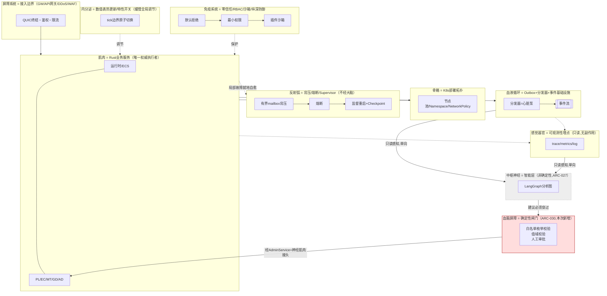

# 需求定义书（要件定義書 / Requirements Definition Document）

**仿生分层架构与智能决策层 Bionic Layered Architecture & Intelligence Layer**

| 项目 | 内容 |
|---|---|
| 文档编号 | RGS-REQ-014 |
| 版本 | 0.2 |
| 父文档 | RGS-REQ-001 需求定义书 第3章CON-003／第10章ARC-001／009／010／014（本文档为其延展与补充，新增ARC-027与ARC-030；**含对CON-003的正式修订提案，须负责人批准后生效**） |
| 制定日 | 2026-08-16 |
| 最终更新日 | 2026-08-16 |
| 制定者 | 架构师 |
| 保密级别 | 内部限定（Internal Use Only） |
| 适用许可 | Apache-2.0（本仓库） |

---

## 修订历史（改訂履歴 / Revision History）

| 版本 | 修订日 | 修订者 | 审批者 | 修订内容 | 影响需求ID |
|---|---|---|---|---|---|
| 0.1 | 2026-08-16 | 架构师 | — | 初版制定。以仿生学隐喻整理既有架构的分层关系（数据＝血液循环、K8s＝骨骼、Rust服务＝肌肉、Pod自愈＝细胞），并新增"智能层"（仿生学"神经系统"）处理跨领域分析与决策支持，新增ARC-027；同时提出ECS使用范围的强制性重申与图论构造在"智能"部分的应用原则 | 全部 |
| 0.2 | 2026-08-16 | 架构师 | — | ①§4仿生映射由5项扩展为**26项完整映射**，覆盖全部12个子系统与ARC-001〜029，并引入**载荷性/说明性**区分纪律，防止装饰性类比被误用为设计依据②新增§4.3**确定性分级（L0〜L4）与单向闸门原则**，回应"LangGraph非确定性不得泄漏至需要100%确定性的层"这一关键风险，生物学依据为"中枢神经不直接支配血液循环"与"血脑屏障"③新增**ARC-030**（确定性分级与幻觉遏制的单向闸门）作为独立方针，适用全系统而非仅智能层④新增FR-NEURO-030〜038、NFR-NEURO-006〜008、AC-NEURO-005〜009、RSK-NEURO-004〜005 | §4、§6.4、§7.2、§8、§10、§11 |

## 审批栏（承認欄 / Approval）

| 角色 | 姓名 | 审批日 | 备注 |
|---|---|---|---|
| 制定（起草） | 架构师 | 2026-08-16 | — |
| 评审（技术） | | | 智能层的边界（§7.1 ARC-027）是否切实不侵犯ARC-005／006／007／009的权威保证；确定性闸门（§7.2 ARC-030）是否存在绕过路径 |
| 评审（安全） | | | Python/LangGraph技术栈例外是否被严格限制在非权威路径内 |
| **审批（负责人）** | | | **§9 CON-003修订提案的批准**。本文档批准前，智能层不得进入实现阶段（仅可做技术预研，PoC不得接入生产事件流） |

> **本文档的特殊性**：本文档不仅新增功能需求，还包含对RGS-REQ-001既有制约条件CON-003的**正式修订提案**。依README§3规则6（三层文档位阶）与ARC-025 GOV-DOC-001，领域文档**不得**擅自变更基准文档的既有决定；本文档§9将该提案完整记载，**在负责人批准前，本文档全部依赖该提案的条款（智能层的技术栈例外）视为未生效**。

---

## 目录

1. [前言](#1-前言)
2. [术语约定](#2-术语约定)
3. [背景与课题](#3-背景与课题)
4. [仿生学映射总览](#4-仿生学映射总览)
5. [业务需求](#5-业务需求)
6. [功能需求](#6-功能需求)
7. [架构设计方针 ARC-027・ARC-030](#7-架构设计方针-arc-027arc-030)
8. [非功能需求](#8-非功能需求)
9. [对CON-003的正式修订提案](#9-对con-003的正式修订提案)
10. [验收标准](#10-验收标准)
11. [风险与未决事项](#11-风险与未决事项)

---

# 1. 前言

## 1.1 目的

本系统既有架构（RGS-REQ-001第10章ARC-001〜026）已经隐含了一套分层结构：实时模拟（ECS驱动的场景Actor）、业务事务（Rust微服务＋PostgreSQL）、事件传播（Outbox＋分发器）、部署编排（Kubernetes）、可观测性与治理（RGS-BAS-004、RGS-BAS-009）。这套分层此前以纯工程语言描述（子系统、组件图、时序图）。

本文档的目的有二：

1. **以仿生学隐喻重新组织既有架构的整体叙事**：数据流动＝血液循环、Kubernetes部署拓扑＝骨骼、Rust业务服务＝肌肉、Pod的探针与Supervisor机制＝细胞自愈能力。这一重组**不改变**任何既有组件的结构或行为，纯粹是表达层面的归纳，目的是让新成员与跨领域协作者能用一套连贯的心智模型理解"数据如何流动、系统如何自愈"。
2. **新增"神经系统"层**——一个此前不存在、专门处理跨领域分析与决策支持的**智能层**，以回应两类此前被架构有意搁置的诉求：①"涉及智能的部分"（如更复杂的异常行为模式识别、经济健康度分析、匹配质量的多因子评估、GM决策辅助）目前只能表达为FR-AD-004一类的简单阈值规则，缺少可组合、可解释、可迭代的分析能力②这类分析天然是**图结构**的（多步骤、条件分支、可能需要多轮"观察→假设→验证"），比命令式代码更适合用图来表达与编排。

## 1.2 核心设计约束（贯穿全文档，先声明以免读者产生误解）

**智能层不是本系统的新权威**。本系统的全部一致性、权威性保证（ARC-005 Single-Writer、ARC-006 ACK边界、ARC-007运行时不直接访问业务数据库、ARC-009 Effectively Once）**完全不变**，智能层**不得**以任何形式绕开或削弱它们。智能层的产出是**建议**，不是**指令**——这一点是本文档全部设计的前提，贯穿§7 ARC-027的每一条约束。

## 1.3 适用范围

| 范畴 | 说明 |
|---|---|
| 仿生学叙事重组 | 对既有架构（血液循环＝数据流、骨骼＝K8s、肌肉＝Rust服务、细胞自愈＝Pod自愈）的归纳说明，不引入新组件 |
| ECS使用范围的强制重申 | 明确"性能敏感的高频/大量实体模拟"必须使用ECS，并列出当前与未来的适用范围 |
| 图论构造原则 | "涉及智能/决策的部分"优先以图结构（行为图/决策图）表达，区分实时执行位置（Rust内，tick预算约束）与非实时执行位置（智能层，异步） |
| **智能层（神经系统）** | 新增的跨领域分析与决策支持子系统，基于LangGraph（Python，技术栈例外，需CR批准），只读消费既有事件基础设施，产出经既有GM控制平面呈现的建议 |
| **不适用范围** | 智能层**不得**直接控制游戏权威状态（道具/货币/位置/战斗判定），此类权威路径永远由Rust服务承载，不因本文档而改变 |

## 1.4 关联文档

| 文档编号 | 文档名 | 与本文档的关系 |
|---|---|---|
| RGS-REQ-001 | 需求定义书 | 本文档延展ARC-001（ECS/Actor粒度）、ARC-009／010（事件基础设施）、ARC-014（中间件判定）；§9正式提出对CON-003的修订提案 |
| RGS-REQ-007／BAS-003 | 运维与GM后台管控 | 智能层的建议**必须**经由既有`AdminService`（ARC-019统一入口）呈现，不新增执行通道 |
| RGS-REQ-013／BAS-009 | 体系治理与横切关注点 | 智能层作为新增常态运维面，须在ARC-026运维负荷预算台账申领额度；本文档遵循ARC-025两级ID体系（新增域`NEURO`） |
| RGS-BAS-010 | 设计模式与核心算法总纲 | 图结构相关的算法族选型（如行为图的执行策略）复用其§3归纳的模式目录 |
| RGS-BAS-011 | 仿生分层架构与智能决策层 基本设计书 | 本文档的基本设计展开（本次同步制定） |

---

# 2. 术语约定

沿用RGS-REQ-002术语表。本文档新增：

| 术语 | 定义 |
|---|---|
| 仿生学隐喻（Bionic Metaphor） | 本文档用以组织架构叙事的类比框架，完整映射见§4.2（26项，覆盖全部子系统与ARC-001〜029） |
| 载荷性映射（Load-Bearing Mapping） | 生物学原型的性质**直接推导出**本系统一条可被试验验证的设计约束的映射。**仅此类映射可被援引为设计依据** |
| 说明性映射（Illustrative Mapping） | 仅用于组织叙事、帮助理解的映射，**不产生**任何新约束，**不得**被援引为设计依据 |
| 确定性分级（Determinism Tier） | 按「同一输入是否必产生同一输出」对系统各层的分级，L0（绝对确定性）〜L4（非确定性），定义见§4.3.1 |
| 确定性闸门（Determinism Gate） | 数据/控制从低确定性层流向高确定性层时**必须**穿过的校验结构，由枚举白名单校验＋值域校验＋人工审批三重构成，生物学原型为血脑屏障 |
| 幻觉（Hallucination） | 基于大模型的组件产出的、格式合法但语义错误的输出。本系统将其视为L4层的**固有属性**而非可修复缺陷，据此设计结构性隔离而非依赖其准确率 |
| 神经系统／智能层（Intelligence Layer） | 本文档新增的子系统，职责为跨领域分析与决策支持，产出建议而非指令，技术栈为LangGraph（Python，需CON-003例外） |
| 行为图（Behavior Graph） | 以图结构（节点＝决策点/动作，边＝转移条件）表达的智能逻辑，可存在于Rust进程内（实时，tick预算约束）或智能层内（非实时） |
| 建议（Recommendation） | 智能层的唯一产出形式：不具备执行力的结构化结果，须经既有GM控制平面的人工审批（默认）或既定API的既有权限校验后才可能转化为动作 |
| 感觉输入（Afferent Signal，仿生学借用） | 智能层从事件基础设施单向接收的数据（本系统语境下即既有的Outbox事件流），对应神经系统的传入神经信号 |
| 运动输出（Efferent Signal，仿生学借用） | 智能层经GM控制平面呈现的建议，对应神经系统的传出神经信号——**本系统中运动输出永远需要既有权威路径的许可，神经系统不能"直接支配肌肉"**，这是本文档与生物学原型的关键差异，也是§7 ARC-027边界设计的核心 |

---

# 3. 背景与课题

| 编号 | 课题 |
|---|---|
| P-NEURO-001 | FR-AD-004（异常行为检测）目前只能表达简单阈值规则（移动速度/输入频度），无法表达"多个弱信号组合后置信度上升"一类需要多步推理的分析，反作弊与经济风控能力的上限受限于此 |
| P-NEURO-002 | 匹配质量（FR-MT-002）、经济健康度、活动效果评估等跨领域分析目前缺少统一的承载位置，散落于各限界上下文各自的简单统计，无法做跨限界上下文的关联分析 |
| P-NEURO-003 | 若智能/分析类逻辑不加约束地直接嵌入Rust业务服务，会违反ARC-014"未证明不引入复杂性"与NFR-OP-010运维负荷上限——多步骤、多分支的分析逻辑用命令式代码表达，可维护性与可解释性会随规则数量增长而急剧下降 |
| P-NEURO-004 | 若为追求分析能力的迭代速度而放松CON-003（允许自由技术栈编写业务服务），会重演该约束原本要防止的"技术统一・运维简化"问题（RGS-REQ-001既有理由）——本课题要求在**不放松**该约束对权威路径的适用性的前提下，为**非权威**的分析场景开辟一条经过严格边界限定的例外 |
| P-NEURO-005 | **基于大模型/复杂推理图的组件其输出本质上不确定（幻觉、同输入不同输出），而本系统的核心价值建立在L0层的绝对确定性之上**（道具/货币不容出错）。既有的ARC-005〜009一致性保证防的是并发、分区、重复投递，**对"上游给出了一个格式合法但语义错误的指令"毫无防御能力**。若不建立结构性隔离，一次幻觉可经自动化路径转化为对经济数据的实际破坏；且此类风险**无法**通过提高模型准确率消除——准确率再高也是概率性保证，与L0要求的确定性保证不是同一量级的东西 |

---

# 4. 仿生学映射总览

> 本章覆盖**全部**子系统（GW／RT／SY／PL／EC／MT／GD／EV／WF／OB／AD／CS）与**全部**架构方针（ARC-001〜029）。
>
> **本章的纪律**：仿生学隐喻的价值在于产生**可验证的约束**，而非装饰性类比。因此§4.2的映射表显式区分两类：**载荷性映射（Load-Bearing）**——生物学原型的性质直接推导出本系统的一条设计约束，该约束可被试验验证；**说明性映射（Illustrative）**——仅用于组织叙事、帮助理解，不产生任何新约束。**说明性映射不得被援引为设计依据**——这条纪律本身是为了防止"因为生物学是这样所以系统也该这样"式的错误推理。

## 4.1 整体结构图

## 4.2 完整映射表（覆盖全部子系统与ARC-001〜029）

| # | 生物学原型 | 系统对应 | 对应ARC/FR | 载荷性 | 由生物学原型推导出的约束（仅载荷性映射有） |
|---|---|---|---|---|---|
| 1 | 骨骼 | K8s部署拓扑（节点池／Namespace） | ARC-018、NFR-EN-001 | 说明性 | — |
| 2 | 肌肉 | Rust业务服务（PL/EC/MT/GD/AD＋新挂载App） | ARC-008、ARC-018、CON-003 | 说明性 | — |
| 3 | 皮肤／黏膜屏障 | 接入边界：网关QUIC终结、API网关、DDoS/WAF | FR-GW-001〜009、ARC-022、ARC-003 | **载荷性** | 屏障是**第一道**而非**唯一**防线——边界防护**不得**替代应用层输入校验（已落地为FR-SEC-003） |
| 4 | 感觉神经末梢（传入） | 客户端输入上行（IF-001） | ARC-002、FR-RT-004 | 说明性 | — |
| 5 | 运动神经（传出） | 差分快照下行 | FR-SY-003、ARC-002 | 说明性 | — |
| 6 | 血液循环 | Outbox＋分发器＋事件基础设施 | ARC-009、ARC-010 | **载荷性** | 循环**单向**携带养分（已发生事实），**不**逆向携带指令；且血流**不受中枢神经直接支配**（自律）——直接推导出智能层对事件流只读、且**不得**调控事件流本身（§4.3、ARC-030） |
| 7 | 心脏（泵） | Outbox分发器 | FR-EV-001 | 说明性 | — |
| 8 | 反射弧（不经大脑） | 背压／熔断／Supervisor重启／Checkpoint恢复 | ARC-013、FR-RT-010、FR-RT-009 | **载荷性** | 局部损伤的应急响应**必须**在局部完成，**不得**依赖中枢——直接推导出NFR-NEURO-001（智能层不可用时全部自愈机制仍须生效） |
| 9 | 细胞 | Pod | ARC-018、ARC-022 | 说明性 | — |
| 10 | 细胞凋亡（受控自毁） | 插件异常熔断自禁用、Pod驱逐、场景Actor重启退避 | RGS-BAS-005§9、FT-008、G-013 | **载荷性** | 凋亡是**受控**且**有阈值**的，而非无限次自毁——直接推导出重启须指数退避、超阈值转人工介入（已落地为RGS-BAS-010 G-013） |
| 11 | 免疫系统（分层） | 零信任默认拒绝→RBAC最小权限→插件沙箱→审计 | ARC-019、ARC-021、ARC-022 | **载荷性** | 免疫是**多层独立**的（屏障／先天／适应性），任一层失效不致全面失陷——直接推导出纵深防御原则（已落地为ARC-022） |
| 12 | 内分泌（缓慢全局调节） | 数值表热更新、插件特性开关 | ARC-016、ARC-021 | **载荷性** | 激素调节**缓慢、全局、有生效延迟**，与神经调节**快速、局部**分工不同——直接推导出配置在tick边界**原子**切换（全局一致），而非逐实体渐进生效（已落地为ARC-016） |
| 13 | 记忆（长期） | PostgreSQL永久事实 | DR-002、ARC-006 | 说明性 | — |
| 14 | 记忆（短期／工作记忆） | 场景Actor内存状态＋缓存基础设施 | DR-001、DR-003、ARC-012 | 说明性 | — |
| 15 | 遗传物质（DNA） | 脚手架模板＋Schema版本＋协议版本 | ARC-018、ARC-015 | 说明性 | — |
| 16 | 稳态（Homeostasis） | 运维负荷预算＋HPA自动扩缩 | ARC-026、NFR-OP-010 | **载荷性** | 生物体的代谢率有**硬上限**，超出即衰竭而非线性变慢——直接推导出NFR-OP-010是"不得超越的上限"而非"努力目标"，及ARC-026预算机制 |
| 17 | 疼痛（伤害感受） | 告警（阈值触发→推送） | FR-OB-005、RGS-BAS-003§6 | 说明性 | — |
| 18 | 感觉器官（视听触） | 可观测性埋点（trace／metrics／log） | ARC-017、ARC-020 | **载荷性** | 感知**不改变**被感知对象——直接推导出埋点**不得**产生业务副作用（§6.4新增FR-NEURO-030） |
| 19 | 增殖／分裂 | 新限界上下文挂载、场景分片、水平扩容 | ARC-018、FR-RT-011 | 说明性 | — |
| 20 | 代谢／排泄 | 分区归档清理、保留期管理、Outbox已发布记录清理 | RGS-BAS-007§4、DR保留期表 | 说明性 | — |
| 21 | 创伤愈合／瘢痕 | Saga补偿、回滚、退场流程 | ARC-011、FR-WF-003、RGS-BAS-002§11 | 说明性 | — |
| 22 | 昼夜节律 | 维护窗口、定时归档作业 | FR-AD-003 | 说明性 | — |
| 23 | 体外义肢 | 客户端SDK（CS子系统） | ARC-024 | 说明性 | — |
| 24 | 神经－肌肉接头 | `AdminService`统一入口 | ARC-019 | **载荷性** | 神经信号**必须**经接头的化学传递才能引发肌肉收缩，接头是**唯一**通路且可被阻断——直接推导出ARC-019"GM/智能层的一切操作只能经统一入口"，及可被RBAC阻断 |
| 25 | 中枢神经系统 | 智能层（LangGraph） | ARC-027 | **载荷性** | 见§4.3、ARC-027 |
| 26 | **血脑屏障（BBB）** | **确定性闸门（本次新增）** | **ARC-030（本次新增）** | **载荷性** | BBB**选择性**放行少数物质、阻断绝大多数——直接推导出智能层输出**必须**穿过枚举白名单／值域校验／人工审批三重闸门方可进入确定性层（§4.3、§6.4、ARC-030） |

**覆盖性确认**：上表#1〜#26覆盖RGS-REQ-001§5.1全部12个子系统（GW→#3、RT→#2/#8/#14、SY→#4/#5、PL/EC/MT/GD/AD→#2/#13、EV→#6/#7、WF→#21、OB→#17/#18、CS→#23）与ARC-001〜030全部方针。**说明性映射占15项、载荷性映射占11项**——载荷性映射是本章的实质产出，说明性映射仅供组织叙事。

## 4.3 确定性分级与"神经不干扰血流"原则（本次新增的核心约束）

> 本节回应一项关键的架构风险：**智能层基于大模型／复杂推理图，其输出本质上是非确定性的（存在幻觉、不稳定、同输入不同输出）。若该非确定性泄漏至要求100%确定性的层（经济事务、权威判定），后果不是"偶尔不准"，而是数据一致性保证的整体失效。**
>
> 生物学原型精确对应：**中枢神经不直接支配血液循环**——血流由自律神经与局部代谢自我调节，大脑的"想法"不会让血液改道；同时**血脑屏障**阻断绝大多数血液中的物质进入脑组织，反向亦然。本系统据此建立**确定性分级**与**单向闸门**。

### 4.3.1 确定性分级（Determinism Tier）

| 级别 | 名称 | 涵盖内容 | 确定性要求 |
|---|---|---|---|
| **L0** | 绝对确定性 | 道具／货币事务、`session_epoch`仲裁、审计日志、支付与权益发放 | 同一输入**必**产生同一输出。**不允许**任何概率性、启发式或近似 |
| **L1** | 强确定性 | tick模拟、战斗判定、AOI裁剪、输入校验、禁言/购买限制校验 | 确定性算法，允许既定误差预算（浮点、时序抖动）内的偏差 |
| **L2** | 最终一致 | 事件传播、缓存、在线状态、插件状态跨节点同步 | 允许暂时不一致，但**必须**在既定时限内收敛 |
| **L3** | 尽力而为 | 可观测性数据、日志采样、非关键通知 | 允许丢失/采样，不保证完整 |
| **L4** | **非确定性** | **智能层推理输出** | **本质上无法保证确定性**——这是该层的固有属性，不是待修复的缺陷 |

### 4.3.2 单向闸门原则

| 规则 | 内容 |
|---|---|
| 流向自由 | 数据从**高确定性**流向**低确定性**（L0→L4，如业务事实→事件→智能层感知）**无须**闸门——降级传播不会污染确定性 |
| **流向受限** | 数据/控制从**低确定性**流向**高确定性**（L4→L0/L1）**必须**穿过**确定性闸门**，且**不存在**任何绕过路径 |
| 闸门的三重形式 | ①**枚举白名单闸门**——输出的动作类型必须是既有API方法名枚举内的值②**值域校验闸门**——输出的全部数值参数必须落在既定值域内③**人工审批闸门**——高风险动作必须经人工确认。三者**并用**，非三选一 |
| **禁止的泄漏路径** | ①智能层输出的**自由文本**被下游解析为指令执行②智能层生成**代码/SQL/配置**被直接执行③智能层输出成为**另一自动化流程的输入**（级联放大：一次幻觉经多级自动化被放大为大规模误操作）④智能层参与任何L0/L1路径的**同步调用链**（即便只是"查询"，也会使L0路径的可用性依赖于L4组件） |

---

# 5. 业务需求

| ID | 需求 | 优先级 |
|---|---|---|
| BR-NEURO-001 | 运营与安全团队须能获得比FR-AD-004现有阈值规则更强的异常行为/经济风险识别能力，且新增规则的迭代不应要求重新部署Rust服务 | 高 |
| BR-NEURO-002 | GM决策（如是否封禁、是否调整某活动奖励）须能获得基于多信号交叉分析的辅助建议，而非仅凭单一指标 | 中 |
| BR-NEURO-003 | 智能层的引入**不得**以任何方式降低本系统既有的数据一致性、安全性保证或运维可持续性（NFR-OP-010） | 高 |

# 6. 功能需求

## 6.1 ECS使用范围的强制重申（不新增决定，重申既有ARC-001并明确扩展边界）

| ID | 需求 |
|---|---|
| FR-NEURO-001 | 凡满足"高频（≥tick频率）＋大量同构实体（同一场景内同类实体数可能达到数百至数千）＋性能敏感"三条件的模拟逻辑，**必须**使用ECS（`bevy_ecs`，复用ARC-001既有选型）实现，**不得**使用面向对象的实体类继承体系 |
| FR-NEURO-002 | ECS强制适用范围明确列举：①场景实体模拟（既有，ARC-001）②AOI网格中的实体位置索引与视野裁剪计算（既有隐含，本条显式重申）③未来若引入NPC群体行为（PH-7+，须先经ARC-014判定必要性），其批量决策计算**必须**在ECS的System中执行，**不得**为每个NPC实体启动独立的重量级控制流程（如每NPC一个异步任务），避免重演ARC-001已否决的"玩家单位Actor"式的O(N×M)开销 |
| FR-NEURO-003 | ECS的适用边界：**单次决策/推理耗时可能超出tick预算，或需要访问跨场景/跨限界上下文数据**的智能逻辑，**不得**塞入ECS的System（会阻塞tick循环，违反CON-007），此类逻辑属于§6.2图论构造原则中"非实时执行位置"的范畴 |

## 6.2 图论构造原则（涉及智能/决策的部分）

| ID | 需求 |
|---|---|
| FR-NEURO-010 | 涉及"智能"或"决策"的逻辑（NPC行为选择、异常模式识别、多因子评分/排序），**应当**优先以**图结构**（节点＝决策点或动作，边＝转移条件/权重）表达，而非深层嵌套的`if/else`或大型`match`语句。理由：图结构可视化、可增量修改单个节点而不影响其余部分、天然支持"数据驱动"（图定义可与代码分离，复用ARC-016热更新思想） |
| FR-NEURO-011 | 图结构的**执行位置**须依时延要求二选一：①**tick预算内**（如NPC战斗AI的每帧决策）——图以Rust原生数据结构表达并在ECS System中执行，**不得**跨进程调用智能层（跨进程调用的往返时延不可能满足tick预算，同ARC-007否决"运行时直接调用业务数据库"的同类理由）②**非实时**（如异常模式识别、跨玩家关联分析）——图在智能层以LangGraph表达，允许秒级至分钟级的处理时延 |
| FR-NEURO-012 | 两类图**不得**混淆用途：实时行为图**不得**承载需要跨限界上下文聚合数据的分析（超出场景Actor既有ARC-007边界）；智能层的非实时分析图**不得**承载任何tick级实时决策（技术上不可行，且违反§7 ARC-027的权威边界约束） |

## 6.3 智能层（神经系统）功能需求

| ID | 需求 |
|---|---|
| FR-NEURO-020 | 智能层**必须**以只读方式订阅既有事件基础设施（复用ARC-010既定的Topic与`partition_key`体系），**不得**要求任何限界上下文为其新增数据写入路径或新的事件族仅为智能层服务（若确需新事件，走既有RGS-REQ-006新增事件的挂载流程，不构成智能层的特权） |
| FR-NEURO-021 | 智能层的分析逻辑**必须**以LangGraph的图（节点＝分析步骤，边＝条件转移/多智能体协作路径）表达，**不得**是无结构的单体脚本——这是FR-NEURO-010图论构造原则在智能层内部的自我一致应用 |
| FR-NEURO-022 | 智能层的产出**必须**是结构化的**建议（Recommendation）**，包含：置信度、依据（引用的原始事件/数据点，供人工复核）、建议动作类型（须映射至既有`AdminService`方法或`CreateOpsTicket`工单，**不得**发明新的执行接口） |
| FR-NEURO-023 | 建议**必须**经由既有GM控制平面（`AdminService`，ARC-019统一入口）呈现，默认**必须**要求人工审批方可转化为动作；**仅**当建议映射的动作本身已属于既有低风险只读查询类（如"建议GM关注某账号"）时，可以直接以通知形式呈现而不经审批门槛，**但仍不得直接执行任何写操作** |
| FR-NEURO-024 | 智能层**不得**被授予`AdminService`高危操作（RGS-BAS-003§8）的直接调用权限；智能层产出的高危类建议（如"建议封禁"）**必须**经过与现有GM人工操作同等的二次确认流程，**不存在**"智能层建议自动执行"的路径 |
| FR-NEURO-025 | 智能层**必须**具备背压与降级设计（复用ARC-013既定原则）：分析队列须有上限，超限时丢弃低优先级分析任务而非无界积压；智能层整体不可用时，**不得**影响任何既有实时/业务路径（同ARC-007降级精神的复用——这是"神经系统"与"肌肉"的解耦在故障场景下的体现：截瘫不致命，心脏骤停致命，本系统的"肌肉"必须能在"神经系统"失效时依既有反射弧继续基本生存） |

## 6.4 确定性隔离与幻觉遏制（ARC-030落地，本次新增）

| ID | 需求 |
|---|---|
| FR-NEURO-030 | 可观测性埋点（感觉器官，§4.2#18）**不得**产生任何业务副作用——埋点代码**不得**修改业务状态、**不得**参与事务、**不得**因埋点失败而使业务操作失败（感知不改变被感知对象） |
| FR-NEURO-031 | 智能层的全部输出**必须**为**结构化枚举值＋受约束数值**，**不得**包含被下游解析执行的自由文本。`suggested_action`**必须**是既有API方法名枚举内的值，非枚举内的值一律拒绝并记录异常（枚举白名单闸门） |
| FR-NEURO-032 | 智能层输出的全部**数值参数**（如封禁时长、补偿数量、阈值）**必须**经值域校验，越界即拒绝而非截断（截断会把"明显错误的建议"静默变成"看似合理的建议"，比拒绝更危险）（值域校验闸门） |
| FR-NEURO-033 | 智能层**不得**生成任何形式的可执行产物（代码、SQL、Shell、K8s manifest、配置文件）被系统直接执行。若分析结论需要变更配置，**必须**表达为"建议将配置项X调整为枚举值Y"，由人工或既有配置管道执行 |
| FR-NEURO-034 | 智能层的输出**不得**作为另一个自动化流程的输入形成级联——**必须**在智能层与任何自动化执行之间存在至少一个人工审批点或确定性校验点，防止单次幻觉经多级自动化放大为大规模误操作 |
| FR-NEURO-035 | 智能层**不得**出现在任何L0/L1（§4.3.1）路径的**同步调用链**中，包括只读查询——L0/L1路径的可用性**不得**依赖L4组件（血流不受神经支配：即便大脑停止工作，循环系统仍须自主运转） |
| FR-NEURO-036 | 智能层**不得**调控事件基础设施本身（如动态调整Topic分区、消费者组配置、事件保留期）——智能层是循环系统的**观察者**而非**调节者**（对应§4.2#6载荷性约束） |
| FR-NEURO-037 | 置信度低于既定阈值的建议**不得**呈现给GM（避免低质量建议淹没高质量建议，导致RSK-NEURO-003的"狼来了"效应）；阈值**必须**可配置且其调整**必须**留有审计记录 |
| FR-NEURO-038 | 智能层的每一次推理**必须**记录其输入快照与输出，使任何一条建议均可被**离线重放复核**——这是应对非确定性的必要手段：既然无法保证同输入同输出，就必须保证**事后可查证当时的输入究竟是什么** |

---

# 7. 架构设计方针 ARC-027・ARC-030

本节为需求定义书RGS-REQ-001第10章架构方针体系的延续，编号紧接RGS-REQ-013新增的ARC-026。**决定事项**，变更须经ADR与审批。

## 7.1 ARC-027：仿生分层架构与智能层的只读感知/建议边界（重要决定）

| 项目 | 内容 |
|---|---|
| **决定** | ①采用§4仿生学映射作为架构的组织性叙事，不改变既有组件结构②新增**智能层**，职责严格限定为"只读感知既有事件基础设施＋图结构化分析＋产出建议"，**不得**在任何路径下直接写入权威数据或绕过既有GM控制平面③智能层的技术栈（LangGraph／Python）构成对CON-003的**显式收窄例外**，例外范围**仅**限于满足本条"只读感知＋建议输出"边界的智能层组件，**不得**扩展至任何其他自研业务服务 |
| **理由** | 血液循环（事件基础设施）在生物学与本系统中都是**单向**的养分传输，神经系统读取信号做出判断，但最终"动作"仍须经运动神经元传导至肌肉、经既有的神经-肌肉接头（本系统中即GM控制平面的既有权限校验）——生物学上神经系统确实可以直接支配肌肉，但本系统**刻意偏离**这一生物学准确性：完全的直接支配意味着智能层的推理错误可以无中介地转化为对权威状态的破坏，这与ARC-005〜009建立的整套权威边界体系直接冲突。保留"必须经既有控制平面"这一中介层，是用可用性换取安全性的刻意设计，而非疏漏 |
| **与CON-003的关系** | CON-003"服务端主语言为Rust……不得用其编写自研业务服务"的核心理由是"技术统一・运维简化"。智能层**不是**业务服务——业务服务的定义性特征是拥有/写入权威数据（同RGS-BAS-009§5.1对"业务逻辑"的界定精神），智能层不具备该特征。但技术栈多样化确实会增加运维负荷（新的部署形态、新的依赖管理、新的故障模式），因此**不能**简单援引"非业务服务故不受CON-003约束"而回避评估，须走§9的正式CON-003修订提案，由负责人在权衡运维负荷（ARC-026 OLU预算）后决定是否批准该窄口径例外 |
| **只读感知的技术落地** | 智能层订阅事件基础设施的方式**必须**是标准的消费者角色（同既有事件消费者，遵循ARC-009幂等消费要求），**不得**被授予对`player_db`/`economy_db`等业务数据库的任何直接连接权限（同ARC-007"运行时不直接访问业务数据库"、RGS-BAS-002§5.3 NetworkPolicy零信任隔离的同类要求在智能层的应用） |
| **建议而非指令的技术落地** | 智能层的全部输出**必须**经由既有`AdminService`（RGS-BAS-003）呈现，**不得**被授予任何`AdminService`高危方法的直接调用权限，也**不得**被授予任何绕过`AdminService`直连下游服务/数据库/K8s API的权限——与RGS-REQ-007 ARC-019"GM后台不得绕过统一入口"是**同一约束在智能层的镜像应用**：智能层可被视为"另一个需要接入统一控制平面的外部建议来源"，与GM后台享有相同的边界纪律 |
| **否决方案1** | "智能层直接调用EC/PL等服务的gRPC接口执行建议动作，跳过AdminService以降低延迟"——直接违反ARC-019统一入口原则与本条"建议而非指令"的核心边界，一旦智能层的推理产生误判（大模型/复杂图分析的误判率不可能为零），将无中介地损害权威数据，已否决 |
| **否决方案2** | "全面放开CON-003，允许任意子系统使用任意技术栈以加快迭代"——直接违反CON-003原有理由（技术统一・运维简化）与NFR-OP-010运维负荷上限，本文档的例外是**窄口径**（仅限满足边界约束的智能层），不构成对CON-003的全面放开，已否决 |
| **适用范围** | 智能层全部组件。本系统其余部分（含全部业务服务、全部既有子系统）不受本条影响，CON-003对它们的约束力不变 |

## 7.2 ARC-030：确定性分级与幻觉遏制的单向闸门（重要决定）

| 项目 | 内容 |
|---|---|
| **决定** | 全系统按§4.3.1划分**确定性分级L0〜L4**。数据/控制流从**低确定性层流向高确定性层**（L4→L0/L1）时，**必须**穿过**确定性闸门**（枚举白名单校验＋值域校验＋人工审批，三者并用），且**不存在**任何绕过路径；反向（高→低）无须闸门。智能层（L4）**不得**出现在任何L0/L1路径的同步调用链中，**不得**产出被直接执行的可执行产物，**不得**形成"智能层输出→另一自动化流程输入"的级联 |
| **理由** | 基于大模型与复杂推理图的组件，其非确定性（幻觉、同输入不同输出、置信度不可靠）是**固有属性而非可修复的缺陷**——工程上无法通过测试或调优使其达到L0所要求的确定性。因此正确的架构应对不是"努力让智能层更准"，而是**承认其不可靠并在结构上限制其影响半径**。若不设此边界，一次幻觉可以经由自动化路径转化为对经济数据的实际破坏，而ARC-005〜009建立的整套一致性保证对此**毫无防御能力**——它们防的是并发、分区、重复投递，不是"上游给了一个语义上错误但格式合法的指令" |
| **生物学依据（载荷性映射）** | ①**中枢神经不直接支配血液循环**——血流由自律神经与局部代谢自我调节，思维活动不会使血液改道，这保证了即便大脑产生错误认知，循环系统仍按自身规律运转②**血脑屏障**选择性放行极少数物质、阻断绝大多数，是解剖学上真实存在的**物理隔离结构**而非"约定"。二者共同说明：高等生物对"最容易出错的器官"采取的策略正是**结构性隔离**而非"让它别出错" |
| **与ARC-027的分工** | ARC-027回答"智能层**能做什么**"（只读感知、产出建议、经统一入口），ARC-030回答"智能层的输出**如何被约束**才不至于污染确定性层"。ARC-027是**权限边界**，ARC-030是**数据流边界**，二者正交且**均须**满足 |
| **适用范围的重要澄清** | ARC-030的分级体系适用**全系统**，不限于智能层。任何未来引入的非确定性组件（如启发式推荐、概率性匹配算法、外部AI服务）**自动**受本条约束，无须逐个新增方针——这是把ARC-030定为独立方针而非ARC-027一个条款的原因 |
| **否决方案1** | "通过提高模型质量/增加校验提示词使智能层达到足够可靠，从而允许其直接执行低风险操作"——把结构性保证降级为概率性保证。"足够可靠"无法被定义为可验收的判定基准（多少个9？如何测量幻觉率？），且一旦允许直接执行，"低风险"的边界会随时间推移被逐步扩大，已否决 |
| **否决方案2** | "以事后审计与回滚替代事前闸门"——审计发现问题时损害已经发生；且L0层的部分操作（如货币发放后被玩家消耗）在业务上不可完全回滚，与ARC-006"永久事实"的定义直接冲突，已否决 |
| **否决方案3** | "对数值参数越界做截断（clamp）而非拒绝"——截断会把"明显错误的建议"（如封禁999999天）静默转换为"看似合理的建议"（截断为最大值90天），**消除了错误的可见性**，比直接拒绝更危险，已否决（落地为FR-NEURO-032） |

---

# 8. 非功能需求

| ID | 类别 | 内容 | 目标值/判定基准 |
|---|---|---|---|
| NFR-NEURO-001 | 隔离性 | 智能层故障/不可用**不得**影响任何既有实时/业务路径的可用性 | 故障注入试验：模拟智能层全停止，验证AC-001既定垂直闭环不受影响 |
| NFR-NEURO-002 | 安全性 | 智能层**不得**在任何已知路径下获得业务数据库直连权限或`AdminService`高危方法的直接调用权限 | 架构评审＋NetworkPolicy验证，同RGS-BAS-006§4.2覆盖率审计的同类方法 |
| NFR-NEURO-003 | 可解释性 | 智能层产出的每条建议**必须**可追溯至其依据的原始事件/数据点 | 建议记录的`依据`字段人工抽查 |
| NFR-NEURO-004 | 运维负荷 | 智能层作为新增运维面，**必须**在ARC-026运维负荷预算台账申领额度，余额不足**不得**上线 | 见RGS-BAS-011§3 OLU核算 |
| NFR-NEURO-005 | 时延（非实时性质的确认） | 智能层的分析结论产出时延**不受**tick预算约束，但**须**满足其服务场景的实际时效诉求（如反作弊分析应在可疑行为发生后的合理时间窗口内产出，具体值详细设计确定） | 详细设计阶段给出目标值 |
| NFR-NEURO-006 | **确定性隔离** | 智能层的非确定性**不得**以任何路径泄漏至L0/L1层 | 闸门绕过路径的穷举审查（见AC-NEURO-005）＋渗透测试：构造恶意/畸形的智能层输出，验证均被闸门拒绝而非进入执行 |
| NFR-NEURO-007 | **可复核性** | 每条建议均可离线重放复核其推理输入 | 抽查任意历史建议，可还原当时的输入快照（FR-NEURO-038） |
| NFR-NEURO-008 | **埋点无副作用** | 可观测性埋点**不得**改变业务行为 | 对比试验：关闭埋点前后，同一业务用例的执行结果逐字段一致（落实FR-NEURO-030） |

---

# 9. 对CON-003的正式修订提案

依README§3规则6与ARC-025 GOV-DOC-001，变更基准文档既有制约条件须先提出正式提案并经负责人批准。本节记载该提案，**在批准前不生效**——即智能层的LangGraph/Python技术栈**当前不具备实施依据**，本文档批准前智能层仅可做技术预研（PoC），且PoC**不得**接入生产事件流或产出面向真实运营的建议。

## 9.1 提案内容

| 提案编号 | 修订对象 | 现行条文 | 修订后条文（追加，不删除现行条文） |
|---|---|---|---|
| CR-011 | RGS-REQ-001§3.2 CON-003 | "服务端主语言为Rust。JVM／Go组件仅限于成熟中间件本体（消息中间件、CDC、工作流引擎等），**不得**用其编写自研业务服务" | 追加但书："**唯一例外**：满足RGS-REQ-014 ARC-027所定义边界（只读感知既有事件基础设施、不持有业务数据库直连权限、不持有`AdminService`高危方法直接调用权限、产出物仅为经既有GM控制平面呈现的建议而非指令）的**智能层**组件，可采用Python（LangGraph）实现。该例外**不得**被解释为对CON-003其余适用范围的放松，任何新增业务服务仍**必须**为Rust" |

## 9.2 批准条件

| 条件 | 说明 |
|---|---|
| 技术评审通过 | 确认智能层的组件设计（RGS-BAS-011）确实落在ARC-027边界内，无绕过既有权威路径的实现方式 |
| OLU预算核算通过 | 依ARC-026，智能层作为新增运维面须在预算台账申领额度并核实余额非负（见RGS-BAS-011§3，当前核算结果为**负**，须先完成回收或延后上线，见§11风险） |
| 安全评审通过 | 确认智能层的NetworkPolicy隔离与凭证边界符合NFR-NEURO-002 |

---

# 10. 验收标准

| ID | 验收标准 |
|---|---|
| AC-NEURO-001 | 故障注入试验：智能层全停止，既有AC-001（登录→场景入场→移动→战斗→掉落→登出→重新登录）垂直闭环不受影响 |
| AC-NEURO-002 | 权限审查：智能层的服务账号/凭证在K8s NetworkPolicy层面物理无法连接`player_db`/`economy_db`等业务数据库，也无法直接调用`AdminService`高危方法 |
| AC-NEURO-003 | 抽查10条智能层产出的建议，均可追溯至具体的原始事件依据，且均通过`AdminService`既有方法呈现（无独立执行通道） |
| AC-NEURO-004 | ECS适用范围审查：抽查场景模拟与AOI计算代码，确认高频/大量实体逻辑均在ECS System中实现，无面向对象继承体系的替代实现 |
| AC-NEURO-005 | **确定性闸门的绕过路径穷举审查**：对智能层的全部出口逐一核查，确认不存在任何绕过枚举白名单/值域校验/人工审批的路径（ARC-030核心验证项） |
| AC-NEURO-006 | **幻觉遏制的对抗性验证**：向闸门注入构造的恶意/畸形智能层输出（非枚举动作名、越界数值、嵌入指令的自由文本、可执行产物），验证**全部**被拒绝且记录异常，无一被执行 |
| AC-NEURO-007 | **L0/L1路径无L4依赖**：静态分析确认L0/L1路径的同步调用链中不含智能层组件；故障注入验证智能层全停止时L0/L1路径的p99延迟无变化（落实FR-NEURO-035） |
| AC-NEURO-008 | **埋点无副作用**：关闭全部埋点前后，同一组业务用例的执行结果逐字段一致（落实FR-NEURO-030、NFR-NEURO-008） |
| AC-NEURO-009 | **建议可离线重放**：抽查任意历史建议，可还原其推理时的输入快照并复核（落实FR-NEURO-038） |

---

# 11. 风险与未决事项

| ID | 内容 | 处理阶段 |
|---|---|---|
| TBD-NEURO-001 | 智能层的具体部署形态（是否为独立Pod、是否需要GPU/大模型推理资源）与LangGraph版本选型，依ARC-014判定基准评审 | 详细设计阶段前 |
| TBD-NEURO-002 | 智能层分析结论的时效目标值（NFR-NEURO-005）需与安全/运营团队共同评审确定 | 需求确定阶段 |
| RSK-NEURO-001 | **OLU预算核算显示智能层上线将使运维负荷预算由既有的+2余量转为负值**（详见RGS-BAS-011§3），若不先完成额外的负荷回收，本功能**不得**上线（依ARC-026强制约束）。这不是本文档的疏漏，而是ARC-026设计初衷所要捕捉的情况：新功能的吸引力不能替代对运维总量的诚实核算 | PH-1即须决议，见ISS登记 |
| RSK-NEURO-002 | LangGraph（Python生态）的依赖漏洞管理与许可盘点须纳入RGS-BAS-006§6供应链安全流水线与附件D§4 OSS许可盘点表，Python生态的漏洞响应节奏可能与既有Rust为主的CI流水线不同步，需专项评估 | PH-1前 |
| RSK-NEURO-003 | 若智能层的分析结论质量不佳（误报率高），GM可能对建议产生"狼来了"式的不信任，反而不查看，使功能名存实亡。缓解：NFR-NEURO-003可解释性要求＋建议须附置信度，允许GM按置信度过滤 | 持续跟踪 |
| RSK-NEURO-004 | **确定性闸门被逐步放宽的长期风险**：随着智能层建议的准确率在实践中被观察到"还不错"，团队可能倾向于对"低风险动作"开放自动执行以提升效率，从而侵蚀ARC-030的结构性保证。这类侵蚀通常是渐进的、每一步都看似合理的，因而难以在单次评审中被察觉。缓解：①ARC-030已将该论证明确登记为**否决方案1**，任何此类提案须先推翻已记录的否决理由②AC-NEURO-005（绕过路径穷举审查）纳入常态化回归而非一次性验收 | 持续跟踪 |
| RSK-NEURO-005 | **闸门自身的实现缺陷**：确定性闸门是L4→L0的唯一防线，其自身若存在校验逻辑漏洞（如枚举匹配用了前缀而非全等、数值校验漏掉边界值），则整套隔离失效。缓解：闸门实现须作为**安全关键代码**对待，覆盖率要求高于QA-001既定的80%，且AC-NEURO-006对抗性验证须纳入常态化回归 | PH-1起持续 |

---

> 本文档与RGS-BAS-011（仿生分层架构与智能决策层 基本设计书）配套使用。RGS-BAS-011将本文档§7 ARC-027展开为智能层的组件图、LangGraph图结构设计范式、事件订阅与建议呈现的具体接口、以及OLU预算核算结果。**RGS-BAS-011的智能层相关设计在本文档§9 CR-011批准前均为提案性质。**
