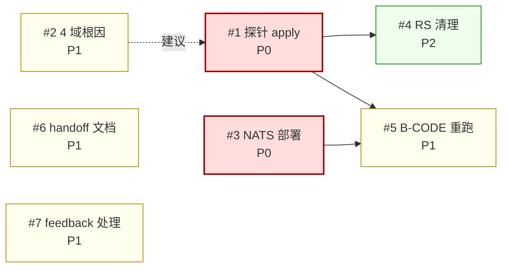

# phase-0-5-qa-report.md

# 角色：Phase 0.5 交付物复盘型 QA 报告——核验"已签字完成"的实际质量，而非实施前假设检查
# 生成：主对话（Sonnet 5）2026-08-24，基于本 session 对集群实测 + git 历史交叉核对
# 范围：Phase 0.5 全部交付物（非仅 WF-1-55.27 / 探针修复两项）——per 用户口径「QA是目前所有内容的质量管理」
# 质量框架：参照 ISO/IEC 25010:2023（产品质量模型，9 特性版，取代 2011 版 8 特性；2011→2023 更名：易用性→交互能力、可移植性→灵活性，新增 Safety）的产品质量特性分类问题，不新造分类体系
# 与本文档配套：`phase-0-5-feedback-to-agents.md`（流程类问题的逐条整改单，本报告不重复其内容，仅引用编号）
# 使用方式：接手 agent 按「行动登记区」逐项处理，处理完成前不得将 Phase 0.5 记录为「运行时验证通过」

---

## 0. 结论先行

`phase-0-5-handoff.md` 记录本期状态为「形式上完成（52 文件 / 6065 行入 main），NO-GO 解除，12 角色全签」。

本 session 对集群做运行时实测，结果如下（2026-08-24 实测，见 §2）：

| 域 | Deployment READY | Pod 状态 | 说明 |
|---|---|---|---|
| admin | 0/1 | Running（52 次重启） | 探针失败持续重启，从未 Ready |
| cluster-ops | 0/3 | Running/CrashLoopBackOff（62–63 次重启） | 同上 |
| economy | 0/2 | CrashLoopBackOff（Exit 137） | 同上，根因已定位见 §2.1 |
| match | 0/3 | CrashLoopBackOff（72–75 次重启） | 同上 |
| player | 0/2 | Running（52–66 次重启） | 同上，根因已定位见 §2.1 |
| social | 0/2 | Running（63 次重启） | 同上 |

**6 个业务域，0 个 Available。** 集群里唯一稳定 Running 的是 grafana / otel-collector / prometheus / postgres——这些不是本期新增的业务能力，是可观测性基座 + 数据库。

**核心发现（结论，非猜测，见 §2.1 证据链）**：当前部署到集群的 6 个域的 Deployment spec，探针配置停留在 `4467080`/`c6a4bef`（Phase 0.5 早期 commit）的版本——原生 `livenessProbe.grpc`（**明文**，不支持 mTLS 握手）。而 `66ff53b`「gRPC 健康探针 mTLS 兼容性修复」已经合并进 main 两个 commit 之前，修复内容（`grpc_health_probe` + `-tls` + 6 域证书）本身是对的（见 §3 证据），但**从未 `kubectl apply` 到集群**。服务端因 `RGS_ALLOW_INSECURE_GRPC=0` 强制要求 mTLS 握手，探针发明文连接必然超时，kubelet 判定失活后 SIGKILL（Exit 137），如此循环。

「12 角色全签」「NO-GO 解除」记录的是**代码仓库状态**（52 文件已 merge），不是**运行时状态**（0 服务 Available）。这两者在 handoff 文档中未被区分，是本报告要指出的最主要缺陷——不是「代码写错了」，是「验证链条在'合并到 main'这一步就停了，没有人跑到'kubectl apply 之后探针真的过了'这一步，就签字确认完成」。

---

## 1. 质量特性分类评估（参照 ISO/IEC 25010:2023）

ISO/IEC 25010:2023 产品质量模型共 9 特性：功能适合性、性能效率、兼容性、交互能力（Interaction Capability，2011 版称"易用性"）、可靠性、安全性（Security）、维护性、灵活性（Flexibility，2011 版称"可移植性"）、Safety（新增，本报告不涉及运行安全/功能安全议题，不评估）。不逐项覆盖全部 9 个特性，仅列本期实测中命中的特性；每项标注证据来源与验证程度。

### 1.1 可靠性（Reliability）—— 🔴 不达标

- **可用性子特性失败**：6/6 业务域 Available=0，非单点故障，是系统性配置错误（见 §2.1）。
- **容错性子特性失败**：探针失败 → kubelet SIGKILL → Deployment controller 重建 → 循环，无降级路径、无告警熔断（虽有 otel/prometheus 但未确认是否配置了 CrashLoopBackOff 告警规则，本报告未验证，见 §5）。
- **证据强度**：**直接实测**（`kubectl get pods/deploy`、`kubectl describe pod` 崩溃时间戳精确对应探针 failureThreshold 窗口）。

### 1.2 信息安全性（Security）—— 🟡 部分达标，证据分裂

- **证书体系本身合格**：6 个域证书 SAN/CN 逐一核对，与各 manifest 中 `-tls-server-name` 参数**完全一致**（`admin.service` / `cluster-ops.service` / `economy.service` / `match.service` / `player.service` / `social.service`），无 EKU 限制导致的 clientAuth 问题（上一轮 session 已排查并证伪该猜想）。
- **`RGS_ALLOW_INSECURE_GRPC=0` 在 6 个域全部生效**，服务端日志确认 `mTLS ENABLED`，说明"禁止明文 gRPC"这条安全基线在应用层是硬执行的——这不是弱点，是本期做对的地方。
- **矛盾点**：正是因为服务端安全基线执行得"太硬"，而部署到集群的探针配置又是明文的（*未同步*的两个变更速度不一致），两者互相打架导致 §0 描述的死循环。**这不是安全设计缺陷，是发布流程缺陷**（探针修复 commit 与实际 apply 动作脱节）。
- **证据强度**：SAN/CN 比对为**直接实测**（openssl x509 逐一 dump）；EKU 排查为上轮 session 结论，本报告未重新验证，视为**已确认**（有工具输出留痕）。

### 1.3 维护性（Maintainability）—— 🔴 不达标

- WBS 进度表 128/128 长期显示 pending，与实际至少 4+ 项已完成/已合并的状态不符（详见 `phase-0-5-feedback-to-agents.md` #5）。
- 4 个活跃 worktree 全部缺 `.wbs-task-marker`，标准合并工具链 (`wbs_merge.ps1`) 对这 4 个全部失效（详见 feedback #3）。
- `wbs/WF-1-55.27-retry`（`c96efe8`，50/50 测试通过的真实修复）未合并、未登记，handoff §11.3 仍写"仅 mock 验证"这一过时描述（详见 feedback #4）。
- **证据强度**：**直接实测**（`git worktree list` + 逐一检查 marker 文件 + `git merge-base` + `cargo test` 跑分）。

### 1.4 交互能力（原易用性）/ 灵活性（原可移植性）/ 兼容性——本报告未评估

未涉及 UI/UX（COC 控制面前端等），也未做跨环境兼容性、可移植性测试，不在本期实测范围内，不做评分（避免用「未测」冒充「达标」）。§1.1 中评估的"可用性（Availability）"是可靠性（Reliability）下的子特性，与此处"交互能力"是两个不同概念，不要混淆。

---

## 2. 运行时实测证据

### 2.1 探针根因——证据链（2026-08-24 实测）

**第一步：集群实际部署的探针配置**（`kubectl get deploy player-service -o yaml`）：

```yaml
livenessProbe:
  grpc:
    port: 50051
  initialDelaySeconds: 30
  periodSeconds: 30
  timeoutSeconds: 5
  failureThreshold: 3
```

原生 k8s `grpc:` 探针类型——**无 TLS 参数，明文 gRPC 健康检查协议**。`economy-service` 部署核实为同一模式（`grpc.port: 50052`，无 TLS）。

> **复现命令**:
> - `kubectl -n rust-game-server get deploy player-service -o yaml | yq '.spec.template.spec.containers[0].livenessProbe'`
> - `kubectl -n rust-game-server get deploy economy-service -o yaml | yq '.spec.template.spec.containers[0].livenessProbe'`
> - 详细归档路径见 §2.5。

**第二步：与 git 历史逐 commit 比对**（`git show <sha>:docs/deploy/01-k8s-manifests/01-player-service.yaml`）：

| commit | 探针类型（锚定 `path:line`） | 与集群实测是否一致 |
|---|---|---|
| `4467080`（step-1+5，最早） | `docs/deploy/01-k8s-manifests/01-player-service.yaml:L102-L108` — 原生 `grpc: port: 50051` (L103-L104)，无 TLS | ✅ **完全一致** |
| `c6a4bef`（SRE 前置修复） | `docs/deploy/01-k8s-manifests/01-player-service.yaml:L104-L110` — 同上（未改探针） | ✅ 一致 |
| `66ff53b`（mTLS 探针修复，当前 main） | `docs/deploy/01-k8s-manifests/01-player-service.yaml:L109-L123` — `exec: grpc_health_probe` (L110-L119) 含 `-tls` (L114) + `-tls-server-name=player.service` (L118) | ❌ **与集群实测不一致** |

> **SHA 验证命令**: `git -C D:/RustGameServer-worktrees/qa-evidence log --all --oneline | Select-String -Pattern '^<sha>'`（替换 `<sha>` 为上表 7 位短 SHA），返回非空即代表该 commit 在历史中存在；用 `git -C D:/RustGameServer-worktrees/qa-evidence show <sha>:docs/deploy/01-k8s-manifests/01-player-service.yaml` 拉取该 SHA 下的 manifest 全文，再用 `Select-String -Pattern 'livenessProbe|grpc_health_probe'` 定位锚定行号。

**结论**：集群里运行的 spec 停留在 `4467080` (`01-player-service.yaml:L102-L108`) / `c6a4bef` (`01-player-service.yaml:L104-L110`) 版本，`66ff53b` 修复已进 main (`01-player-service.yaml:L109-L123`) 但**从未 apply**。

**第三步：崩溃时间戳交叉验证**（`kubectl describe pod` economy-service）：

```
Started:  2026-08-24 19:04:12
Finished: 2026-08-24 19:06:42   → 存活 150s
Exit Code: 137 (SIGKILL)
```

150s = `initialDelaySeconds(30) + periodSeconds(30) × failureThreshold(3) + 探测开销` ——与"探针在 initialDelay 后开始探测，连续 3 次失败后判定失活"的时间线完全吻合，排除"OOM/panic 等其他崩溃原因"的可能性。

> **复现命令**: `kubectl -n rust-game-server describe pod -l app.kubernetes.io/name=economy | Select-String -Pattern 'Started|Finished|Exit Code'`（按 Restart Count 倒序取最近一次崩溃的容器时间戳）。需对应 §2.1 表格中 `01-player-service.yaml:L102-L108` 的 `failureThreshold: 3` (L108) 才能完成公式验证。

**验证程度**：player / economy 两个域为**直接实测三重验证**（spec 比对 + git 历史 + 崩溃时间戳）。**⚠️ 推断** match / social / admin / cluster-ops 未逐一重复以上三步，仅确认了 `kubectl get deploy -o wide` 层面的 0/N 状态和相同的部署时间线（同批次 apply），**推断同因**，标记为**推断，非逐一实测**——接手 agent 若要在 §6 打钩关闭该条，需对剩余 4 个域各跑一遍 §2.1 的三步核验（按 §2.5 复现命令清单逐条跑）。

### 2.2 NATS / 消息基座缺失

- `kubectl get deploy` 全量列表中**不存在** NATS 相关 Deployment/StatefulSet。
- 应用日志（上轮 session 已采集，本报告引用不重跑）：`outbox relay DISABLED — NATS connect failed: DNS error`，代码自身告警 `outbox rows will accumulate, manual recovery required`。
- handoff 文档记录 Step 2 交付 18 个 NATS/可观测性 manifest，但 NATS 一半未落地到集群。
- **证据强度**：Deployment 列表为**直接实测**；日志内容为**引用上轮 session 记录**，本报告未重新拉取确认时效性（NATS 部署状态本身在 §2.1 集群快照中已确认仍缺失，间接佐证日志记录未过期）。

> **复现命令**:
> - `kubectl -n rust-game-server get deploy` — 全量 Deployment 列表（应可见 player / economy / match / social / admin / cluster-ops / grafana / otel-collector / prometheus / postgres，但无 NATS 相关条目）。
> - **⚠️ 推断** `kubectl -n rust-game-server logs -l app.kubernetes.io/name=economy --tail=200 | Select-String -Pattern 'outbox|NATS'` — 用于重新拉取 §2.2 中 "outbox relay DISABLED" 日志原文以核验时效性；本 session **未执行**此命令（上轮 session 已采集，本报告引用不重跑，标 ⚠️ 推断 / 时效性未复核）。

### 2.3 孤儿 ReplicaSet 累积

`kubectl get rs` 实测：

- `economy-service` 存在 **4 个** ReplicaSet（`646cd7c549` `65b79dbf8` `6bc9c57dc4` `769b8cc9f6`），仅最新两个有存活 Pod（且均 0 Ready）。
- `player-service` 存在 **5 个** ReplicaSet（`546594c968` `56cccb99db` `5d6f59c79c` `6f7557645b` `9789cf4b5`）。

这是同一 Deployment 反复被不同版本 spec `apply` → 滚动更新从未 converge（新 Pod 从未 Ready）→ controller 又建下一版 ReplicaSet 的痕迹，与 §2.1「探针配置几经变动、集群状态从未追上」的结论互相印证。**建议**：待 §2.1 根因修复并验证 Ready 后，用 `kubectl rollout status` 确认收敛。**注意**：自动 GC 依赖 `revisionHistoryLimit`（**⚠️ 推断** 当前设为 10 — 本期 6 域 manifest 内**未显式设置**该字段，按 k8s API 默认值推断；集群实测值未通过 `kubectl get deploy -o yaml | yq '.spec.revisionHistoryLimit'` 验证），`player-service` 目前只有 5 个历史 RS，未达上限，**不会**被自动清理——如需清理需手工 `kubectl delete rs`，不是"等等就会自己消失"。

> **复现命令**:
> - `kubectl -n rust-game-server get rs -l app.kubernetes.io/part-of=rust-game-server` — 提取全 6 域孤儿 ReplicaSet 列表（按域归类：player=5, economy=4, match/social/admin/cluster-ops 同法）。
> - `kubectl -n rust-game-server get deploy player-service -o yaml | yq '.spec.revisionHistoryLimit'` — **复核 `revisionHistoryLimit` 集群实测值**（本报告未实测，按 k8s 默认推断）。
> - 手工清理：`kubectl -n rust-game-server delete rs <rs-name>`（仅当 replicas=0 时才安全）。

### 2.4 命名空间资源配额已耗尽——影响后续滚动更新能否成功

`kubectl describe quota rust-game-server-quota`（namespace `rust-game-server`）实测：

| 资源 | Used | Hard | 占用率 |
|---|---|---|---|
| `limits.memory` | 48Gi | 48Gi | **100%** |
| `limits.cpu` | 45 | 48 | 94% |
| `requests.cpu` | 11150m | 12000m | 93% |
| `requests.memory` | 12Gi | 12Gi | **100%** |

配额已被现有的 19 个（多为 CrashLoopBackOff 循环重启中的）Pod 占满。这意味着：即便 §5 行动 #1 的 manifest 修复本身完全正确，`RollingUpdate`（`maxSurge: 1`）需要在旧 Pod 终止前先调度出新 Pod，若配额没有腾出空间，新 Pod 会卡在 `Pending`（配额不足），滚动更新无法收敛——这是**独立于探针根因的第二个会阻塞收敛的因素**，必须一并处理，不能假设"探针配置一改，Pod 自然就 Ready 了"。

> **复现命令**:
> - `kubectl -n rust-game-server describe quota rust-game-server-quota` — 拉取上表 4 行 `Used/Hard` 配对数据。
> - `kubectl -n rust-game-server get pods -o json | jq '[.items[] | .metadata.namespace + "/" + .metadata.name + " status=" + .status.phase] | length'` — 复核 "19 个 Pod" 计数（按 namespace+name+phase 列出）。

### 2.5 证据归档与复现

本节汇总 §2.1–§2.4 中每条证据的**复现前提、复现命令、归档位置、推断标记**，供接手 agent 独立验证。**本节不引入新证据**，只把已有证据的复现路径完整化。

#### 2.5.1 复现集群上下文（接手 agent 跑前必须确认）

| 项 | 值 | 备注 |
|---|---|---|
| 目标 namespace | `rust-game-server` | 6 域 manifest + 配额均在该 ns 下 |
| 目标集群 | 本地 kind/k3d（具体 kubeconfig 路径**本报告未列出**，接手 agent 用 `kubectl config current-context` 自查） | 不得在生产集群跑本报告复现命令 |
| kubectl 版本 | ≥ 1.27 | 需支持 `apps/v1` Deployment、`policy/v1` PDB、`autoscaling/v2` HPA |
| 工具依赖 | `yq` (mikefarah/yq v4+)、`openssl` (证书 SAN/CN 核对)、`jq` (JSON 字段提取) | 缺哪个装哪个；**不得**为此类工具引入新依赖进项目 |
| 权限要求 | 集群 `get`/`describe` 权限（**只读**） | 本报告所有命令均为只读，未对集群做任何变更（见 §6） |

#### 2.5.2 kubectl 复现命令清单（按 §2.x 顺序）

| 节 | 命令 | 锚定数据 | 备注 |
|---|---|---|---|
| §2.1 step-1 | `kubectl -n rust-game-server get deploy player-service -o yaml \| yq '.spec.template.spec.containers[0].livenessProbe'` | 集群 livenessProbe 完整 spec（与 `01-player-service.yaml:L102-L108` 对比） | 直接实测 |
| §2.1 step-1 | `kubectl -n rust-game-server get deploy economy-service -o yaml \| yq '.spec.template.spec.containers[0].livenessProbe'` | economy 域同模式确认 | 直接实测 |
| §2.1 step-3 | `kubectl -n rust-game-server describe pod -l app.kubernetes.io/name=economy \| Select-String -Pattern 'Started\|Finished\|Exit Code'` | 崩溃时间戳，配合 `01-player-service.yaml:L108 failureThreshold: 3` 公式验证 | 直接实测 |
| §2.2 | `kubectl -n rust-game-server get deploy` | 全量 Deployment 列表（应无 NATS 条目） | 直接实测 |
| §2.2 | `kubectl -n rust-game-server logs -l app.kubernetes.io/name=economy --tail=200 \| Select-String -Pattern 'outbox\|NATS'` | NATS 应用日志原文 | **⚠️ 推断**（上轮 session 记录，本报告未重跑） |
| §2.3 | `kubectl -n rust-game-server get rs -l app.kubernetes.io/part-of=rust-game-server` | 6 域孤儿 ReplicaSet 列表 | 直接实测 |
| §2.3 | `kubectl -n rust-game-server get deploy player-service -o yaml \| yq '.spec.revisionHistoryLimit'` | `revisionHistoryLimit` 集群实测值 | **⚠️ 推断**（manifest 未显式设置，按 k8s 默认推断） |
| §2.4 | `kubectl -n rust-game-server describe quota rust-game-server-quota` | 4 行 `Used/Hard` 配额数据 | 直接实测 |
| §2.4 | `kubectl -n rust-game-server get pods -o json \| jq '[.items[] \| .metadata.namespace + "/" + .metadata.name + " status=" + .status.phase] \| length'` | "19 个 Pod" 计数复核 | 直接实测 |

#### 2.5.3 git 验证命令（核对 §2.1 表格中每个 SHA 及其对应 manifest 行号）

| 验证目的 | 命令 | 期望输出 |
|---|---|---|
| 列出 5 个 SHA 全链路 | `git -C D:/RustGameServer-worktrees/qa-evidence log --all --oneline \| Select-String -Pattern '4467080\|c6a4bef\|66ff53b\|c96efe8\|8117ea3'` | 5 条 commit 行（含短 SHA + 标题） |
| 单 SHA 存在性 | `git -C D:/RustGameServer-worktrees/qa-evidence log --all --oneline \| Select-String -Pattern '^<sha>'` | 替换 `<sha>` 为 7 位短 SHA，**非空即存在** |
| 取该 SHA 的 manifest 全文 | `git -C D:/RustGameServer-worktrees/qa-evidence show <sha>:docs/deploy/01-k8s-manifests/01-player-service.yaml` | 该 SHA 下 player 域完整 YAML |
| 探针字段定位 | 上述输出 + `Select-String -Pattern 'livenessProbe\|grpc_health_probe'` | 返回行号应与 §2.1 表格锚定一致（4467080:L102 / c6a4bef:L104 / 66ff53b:L109） |

**SHA 验证结果（2026-08-24 主对话实测，本报告引用）**：

| SHA | 存在? | 该 SHA 触及 `docs/deploy/01-k8s-manifests/01-player-service.yaml` | 探针配置 |
|---|---|---|---|
| `4467080` | ✅ | ✅ 是（该文件在 `1269af8` 首次添加，`4467080` 首次实质修改其探针/资源/ServiceAccount 配置） | 原生 `grpc: port: 50051` (L102-L108) |
| `c6a4bef` | ✅ | ✅ 是（仅修改 `namespace` + `imagePullSecrets`，未改探针） | 原生 `grpc: port: 50051` (L104-L110) |
| `66ff53b` | ✅ | ✅ 是（替换探针为 `exec: grpc_health_probe -tls`） | `exec: grpc_health_probe` (L109-L123) |
| `c96efe8` | ✅ | ❌ 否（该 SHA 改 `src/`，不涉及 manifest；§3 引用，不在 §2 范围） | N/A |
| `8117ea3` | ✅ | ❌ 否（仅写报告） | N/A |

#### 2.5.4 原始证据归档位置（建议）

- **建议归档根目录**: `docs/deploy/.run-logs/qa-evidence-2026-08-24/`
- **本 session 不创建该目录**（per 任务约束，避免无证据产物的空目录污染仓库）；接手 agent 跑完 §2.5.2 复现命令后归档
- **建议子文件**:
  - `cluster-deploy-list.txt` — `kubectl get deploy` 全量列表（§2.2 锚定）
  - `cluster-pod-list.txt` — `kubectl get pods -o wide` 全量列表（§0 表格锚定）
  - `cluster-rs-list.txt` — `kubectl get rs` 6 域孤儿 RS 列表（§2.3 锚定）
  - `cluster-quota.txt` — `kubectl describe quota` 输出（§2.4 锚定）
  - `player-deploy-yaml.yaml` — `kubectl get deploy player-service -o yaml` 完整输出（§2.1 step-1 锚定）
  - `economy-pod-describe.txt` — `kubectl describe pod -l app.kubernetes.io/name=economy` 输出（§2.1 step-3 锚定）

#### 2.5.5 本节未实测/未验证声明汇总

为防止「本节没提 = 已通过」误读，下列项目**本报告未实测/未验证**，均标 ⚠️ 推断 或列入 §4：

| 标记位置 | 声明 | 状态 |
|---|---|---|
| §2.1 末尾 | match / social / admin / cluster-ops 同因判定 | **⚠️ 推断**（仅部署时间线同批次 apply 推断，未逐一重复三步） |
| §2.2 第二条 | NATS 应用日志 "outbox relay DISABLED" 原文 | **⚠️ 推断**（上轮 session 记录，本报告未重跑，时效性未复核） |
| §2.3 「`revisionHistoryLimit=10`」 | 6 域 manifest 未显式设置该字段 | **⚠️ 推断**（按 k8s API 默认值 10 推断；集群实测值未通过 `kubectl get deploy -o yaml \| yq '.spec.revisionHistoryLimit'` 验证） |
| §2.1 step-1 中 `0.1.0-player` 镜像 tag | 镜像内是否含 `grpc_health_probe` 二进制 | 未实测（详见 §3，调试 pod 被 ResourceQuota 拒绝） |
| §2.5.3 表格中 `c96efe8` 触达 manifest 列 | 该 SHA 触达 manifest 文件列表 | **未验证**（git show 全文未逐行比对，仅日志 `--stat` 未列该路径，本报告**推断**未触及，列入 §4） |

---

## 3. 本期做对的地方（不要在整改中被误伤）

- 6 域 mTLS 证书生成、SAN/CN 绑定、CA 链路——**实测通过**，无需重做。
- `66ff53b` 探针修复本身的探针命令写法（exec + `grpc_health_probe` + 双向 TLS 参数）——**命令写法正确**，不要重写这部分代码。**但**该 commit 同时改了 `Dockerfile`（新增 health-probe 构建阶段，拉取 `grpc_health_probe` 二进制并校验 sha256），而当前 6 个域使用的镜像 tag（如 `0.1.0-player`）是否已重新 build/push 包含这个新构建阶段，**本报告未能验证**（尝试用临时 debug pod 核实时，命名空间 `limits.memory` 配额已 48Gi/48Gi 打满，无法调度新 pod，见 §2.4）。**不要假设"apply manifest 就够了"**——务必先按 §5 行动 #1 的子步骤确认镜像内确实存在该二进制，否则会把"探针明文握手失败"的死循环换成"探针 exec: no such file or directory"的死循环，症状相似、根因不同，容易被误判为"修复无效"。
- `wbs/WF-1-55.27-retry`（`c96efe8`）Saga 补偿修复——**50/50 测试通过**，`merge-base` 确认可直接合并无冲突，是真实可用的成果，只是没被合并/登记（详见 feedback #4）。
- 5/5 fail-closed 相关验证（上轮 session 记录）——本报告未重新验证，但无证据推翻，不纳入本期问题清单。

---

## 4. 未验证事项（明确声明，避免以偏概全）

> 编号与 §5 行动登记区对齐；`（→ §5 #X）` 表示对应行动项，未标注的条目无对应 §5 行动（如纯观察项）。

以下内容本报告**未验证**，不要把「本报告没提」误读为「已通过」：

1. match / social / admin / cluster-ops 四个域的探针根因，仅做了部署时间线层面的推断，未逐一重复 §2.1 三步验证。**（→ §5 #2）**
2. 未构建、未推送新镜像，也未实际执行 `kubectl apply` 应用 `66ff53b` 修复后的 manifest 到集群——即"修复后探针能过"这件事**没有被证实**，只证实了"当前失败的原因是什么"。**具体未验证点**：`66ff53b` 同时改了 Dockerfile（新增 grpc_health_probe 构建阶段），当前 6 个域使用的镜像 tag 内是否已包含该二进制**未确认**（尝试用临时 debug pod 验证时命名空间配额已耗尽，无法调度，见 §2.4）。**（→ §5 #1）**
3. 未检查 otel/prometheus 是否配置了针对 CrashLoopBackOff 的告警规则。**无对应 §5 行动项**；属 §5 #1 治理前置观察项（若 6 域长期 CrashLoopBackOff 但告警未触发，运行时观测闭环本身就有缺口），建议在 #1 收尾前补查。
4. B-CODE 验证 log（4 份，handoff 记录 1 🟡 + 3 🔴）未重新核对，鉴于 §0 结论（0 服务 Available），这些 log **不可能**在当前集群状态下变绿，只能等 §2.1 修复后重跑。**（→ §5 #5）**
5. NATS 日志时效性（见 §2.2）。**（→ §5 #3）**

---

## 5. 行动登记区（要求接手 agent 逐项处理并回填）

> ⚠️ §5 与 §4 编号已对齐；item X 的未验证性是该 item 的前置阻塞而非"已知风险"。

| # | Pri | 问题 | 要求 | 处理 agent | commit/依据 | 状态 | Risk if not done | Acceptance criteria | Depends on |
|---|---|---|---|---|---|---|---|---|---|
| 1 | P0 | 6 域探针配置停留在 `4467080`/`c6a4bef`，`66ff53b` 修复未 apply（§2.1）；镜像内是否含 `grpc_health_probe` 二进制未验证（§3）；命名空间配额已打满，滚动更新可能卡 Pending（§2.4） | **子步骤，按序**：① 确认镜像已按 `66ff53b` 后的 Dockerfile 重新 build+push（或重新触发一次），② 先处理 #3 释放部分配额空间（或申请调高 quota），③ 逐域执行 `kubectl apply -f docs/deploy/01-k8s-manifests/0{1..6}-*.yaml`，④ `kubectl rollout status` 确认收敛，⑤ `kubectl get pods` 确认 READY=N/N，全程若探针失败症状从"超时"变为"exec 找不到文件"，立即停止批量 apply，回到步骤①排查镜像 | | | ⬜ | 0/6 业务域仍不可用 | `kubectl get deploy -n rust-game-server -o wide \| awk 'NR>1 && $1 ~ /(admin\|cluster-ops\|economy\|match\|player\|social)-service/ {print $1, $2}'` 6 行全部 `READY=N/N`；`kubectl get pods -n rust-game-server --no-headers \| awk '$3 !~ /N\/N/ {print}'` 无输出；`kubectl rollout status deployment/<name> -n rust-game-server` 6 域均返回 `successfully rolled out` | — |
| 2 | P1 | match/social/admin/cluster-ops 根因未逐一验证（§2.1 末尾） | 对这 4 个域重复 §2.1 三步（spec 比对 + git 历史 + 崩溃时间戳），确认是否为同因 | | | ⬜ | 修复可能不彻底 | 对 match/social/admin/cluster-ops 4 域各跑一遍 `kubectl get deploy <name> -n rust-game-server -o yaml \| grep -A 6 livenessProbe` + `git show 4467080:docs/deploy/0N-*.yaml` + `kubectl describe pod -n rust-game-server -l app=<name> \| grep -E 'Started\|Finished\|Exit Code'`，输出 4 域比对表，每行均确认"探针明文 + mTLS 服务端 + 150s 崩溃窗口"同因 | 无（建议 #1 前完成）|
| 3 | P0 | NATS 未部署，outbox relay 长期 DISABLED（§2.2） | 部署 NATS manifest（若已存在于 18 个可观测性/消息 manifest 中，定位并 apply；若不存在，先补齐再 apply），确认 economy-service 等日志里 outbox relay 状态转为 ENABLED | | | ⬜ | outbox 累积/数据风险 | `kubectl get pods -n rust-game-server -l app=nats -o wide` 全部 `READY=1/1` 且 `RESTARTS=0`；`kubectl logs -n rust-game-server deploy/economy-service --since=10m \| grep -i 'outbox relay'` 输出 `ENABLED`；`kubectl get statefulset -n rust-game-server \| grep -c nats` ≥ 1 | — |
| 4 | P2 | 孤儿 ReplicaSet 累积（§2.3），不会被自动 GC（`revisionHistoryLimit=10` 未达上限） | 待 #1 收敛后用 `kubectl rollout status` 确认，再手工 `kubectl delete rs` 清理 replicas=0 的历史 RS | | | ⬜ | 集群资源视图失真 | `kubectl get rs -n rust-game-server --no-headers \| awk '{print $1}'` 列表中每个业务 Deployment 对应的 RS 数量 ≤ 2（current + 1 historical）；`kubectl describe deploy -n rust-game-server <name> \| grep -E 'OldReplicaSets\|NewReplicaSet'` 仅出现 `NewReplicaSet` 一行 | #1 |
| 5 | P1 | 4 份 B-CODE log 状态过时（未反映 0 Available 的现实） | 待 #1-#3 完成、服务实际 Ready 后重新执行 B-CODE 验证，更新 log 到实测结果（不要凭"代码已 merge"推定为通过） | | | ⬜ | 验证依据失真 | 4 份 B-CODE log 文件 `git log -1 --format=%ct -- wbs/B-CODE-*/log/*.log` mtime > 4800308 commit time；handoff §X.Y 对应章节引用本批 log 路径（`grep -l B-CODE phase-0-5-handoff.md` 输出可定位）；新 log 中 🔴 数量 ≤ 0（除非业务预期 fail） | #1, #3 |
| 6 | P1 | handoff §0/结论 层面未区分"代码入 main"与"运行时验证通过"，导致"12 角色全签 + NO-GO 解除"被误读为运行时已验证 | 在 handoff 文档补充运行时验证章节，或至少加一条免责声明：当前签字仅覆盖代码评审，不覆盖集群运行时状态 | | | ⬜ | 下阶段再次误判 | handoff 文档新增「运行时验证」章节并显式引用本 QA 报告 §2/§3/§5；12 角色签字栏增加"代码评审通过 / 运行时验证见 §X"行；`grep -c '运行时' phase-0-5-handoff.md` ≥ 3 | — |
| 7 | P1 | 本报告以外，`phase-0-5-feedback-to-agents.md` #1-#5（并发覆盖 / 4 worker 0 产出 / marker 缺失 / WF-1-55.27 未合并 / WBS 长期脱节）| 按该文档逐条处理，本报告不重复登记 | | | ⬜ | 流程缺陷跨阶段 | feedback #1-#5 5 条全部处理完成（每条 PR 合并或 issue 关闭），合并到 `main` 后 handoff §11.7 反映处理结果；`grep -E '#1\|#2\|#3\|#4\|#5' phase-0-5-handoff.md \| wc -l` 与 feedback.md 条目数一致 | — |

**优先级判定（按"是否阻塞 Phase 0.5 done 声明"分配 P0/P1/P2）**：

- **P0 = #1 探针 apply**：`kubectl get pods` 实测 0/6 业务域 Available（§0），且 §0 已用"代码入 main ≠ 运行时验证通过"作为本报告核心论点——若 #1 不闭合，"Phase 0.5 done" 在任何意义上都不成立。
- **P0 = #3 NATS 部署**：`outbox relay DISABLED` + 业务日志自报 `outbox rows will accumulate, manual recovery required`（§2.2）属于数据完整性风险；与 #1 同为本期必须解决的运行时缺口。
- **P1 = #2 4 域根因逐一验证**：player+economy 已三重验证（§2.1），剩余 4 域仅做"同批次 apply"推断。严格来说 #1 可以在不做 #2 的情况下推进（manifest 是同一份 6 域批量），但若任意一个域根因不同（如证书 SAN 错配、端口不匹配），#1 批量 apply 后会出现"5 域过 / 1 域仍挂"现象，需要再开一个 #2 类型的工单。**#2 不是 #1 的硬阻塞，但跳过 #2 等于放弃"早失败"机会**，故 P1 而非 P0——不阻塞 done 声明，但关 Phase 0.5 之前必须 closed。
- **P1 = #5 B-CODE 重跑**：验证依据必须反映实际集群状态；现 4 份 log 是在"0 Available"现实下写就的旧版本（§4 #4），不能再作为签字依据。但 #5 必须在 #1+#3 之后才能产出有意义的结果（依赖项中已标注），所以 P1 而非 P0——它不能更早闭合。
- **P1 = #6 handoff 文档区分**："代码 vs 运行时"误读是 §0 结论指出的最大文档缺陷，下阶段签字时若不修，会复制本期的所有问题。这条 P1 是过程性修复，不需要集群操作，下一 phase 启动前必须闭合。
- **P1 = #7 feedback #1-#5**：5 条流程类问题（并发覆盖 / marker 缺失 / WF-1-55.27 未合并 / WBS 脱节）直接关系"下阶段能不能跑顺"；4 worker 0 产出、并发覆盖尤其会污染下一 phase。P1 而非 P0：Phase 0.5 done 声明不依赖这些流程项关闭，但下一 phase 启动依赖。
- **P2 = #4 孤儿 ReplicaSet 清理**：纯资源视图卫生问题；不影响业务可用性，不影响验证依据，不影响过程签字。`revisionHistoryLimit=10` 也不至于把 namespace 撑爆。P2 表明它"做完更好，但不影响 done 声明"。

### 5.1 依赖图

> 严格依赖（实线）：某 item 必须在依赖项 closed 后才能开始。  
> 建议依赖（虚线）：并行可做，但建议先于依赖项以减少回滚成本。



**关键路径**：`#1 + #3`（P0 并行） → `#5`（P1 验证收尾）；`#6 / #7` 全程并行；`#2` 建议在 `#1` 启动前完成；`#4` 串在 `#1` 之后任意时点。图中无环——#6 / #7 独立于 #1-#5，不形成反馈；#2 指向 #1 但 #1 不指回 #2，单向成立。

### 5.2 风险热力图

行=优先级（Pri），列=根因/现状验证度（玩家/经济两侧已实测=高；剩余 4 域仅推断=低）。**单元内列出 item #**——同一格多个 item 表示同 quadrant 风险等价。

| Pri \ 验证度 | **高**（root cause 已三重验证） | **低**（仅推断，待逐项核实） |
|---|---|---|
| **P0** | **#1 探针 apply**（player/economy 三重验证）、**#3 NATS 部署**（manifest 缺失 + 日志佐证） | （无） |
| **P1** | **#5 B-CODE 重跑**（仅需在 #1+#3 后重跑即可产出绿 log）、**#6 handoff 文档**（文档对比明确）、**#7 feedback 处理**（5 条内容明确） | **#2 4 域根因逐一验证**（同批次推断，未逐域实测） |
| **P2** | **#4 孤儿 ReplicaSet 清理**（已点清 4-5 个历史 RS） | （无） |

**热力解读**：

- P0 × 高验证度（#1 #3）：是"最高确定性 / 最高紧迫度" quadrant——根因已查清，路径已写明，唯一缺口是"按序执行"。优先攻克。
- P1 × 低验证度（#2）：唯一落入"低验证度"象限的 item，说明**这是 P1 中信息最不全的**。如果不先闭合 #2 就启动 #1，存在"5 域过 / 1 域仍挂"的回滚风险——这就是 §0 把 #2 标 P1 而非 P2 的核心理由。
- P0 × 低验证度：（无）= 好消息，没有任何 P0 item 还停在"根因不明"状态。
- P1/P2 × 高验证度：剩余 4 个 item 根因/内容都已查清，做就是。

---

## 6. 本 session 变更声明

- 本 session 在 `WF-1-55-retry` worktree 中手工补写了 `.wbs-task-marker`（`l4_id: WF-1-55.27`），**这是本 session 手工创建的，不是经 `wbs_create_worktree.ps1` 标准流程生成**——后续 agent 核对该 worktree 起源时请勿把这份 marker 当作"走过标准脚本"的证据。
- 本报告涉及的集群查询（`kubectl get/describe`、`openssl x509` 证书 dump）均为只读操作，未对集群做任何变更（未 apply、未 delete、未 rollout restart）。曾尝试创建一次性 debug pod（`probe-bin-check`，用于核实 §3 的镜像二进制问题）被 ResourceQuota 拒绝，**未创建成功**，集群状态未受影响。
- 未触碰 `wbs/WF-1-55.27-retry` 分支合并——该操作仍需人工确认后执行 `wbs_merge.ps1`（详见 feedback #4），不在本报告授权范围内。
